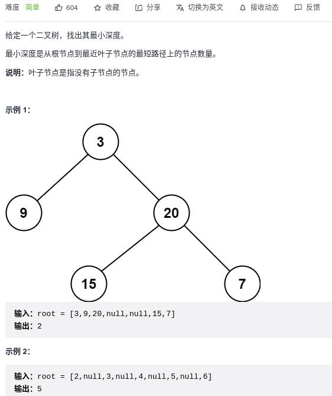
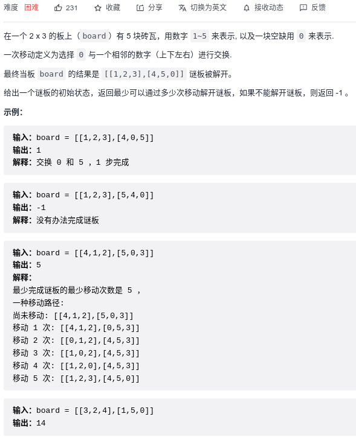
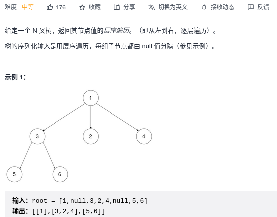
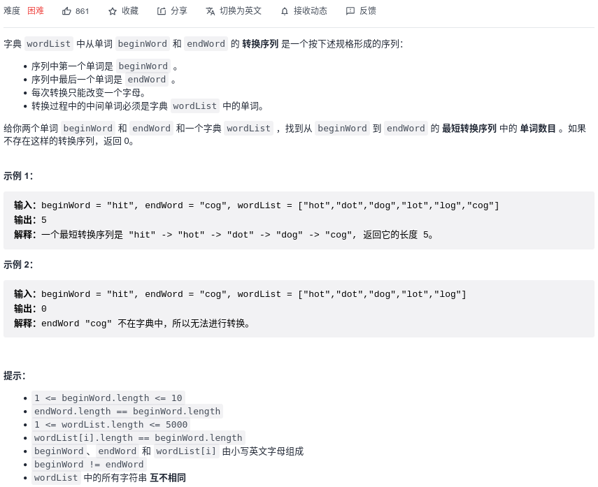
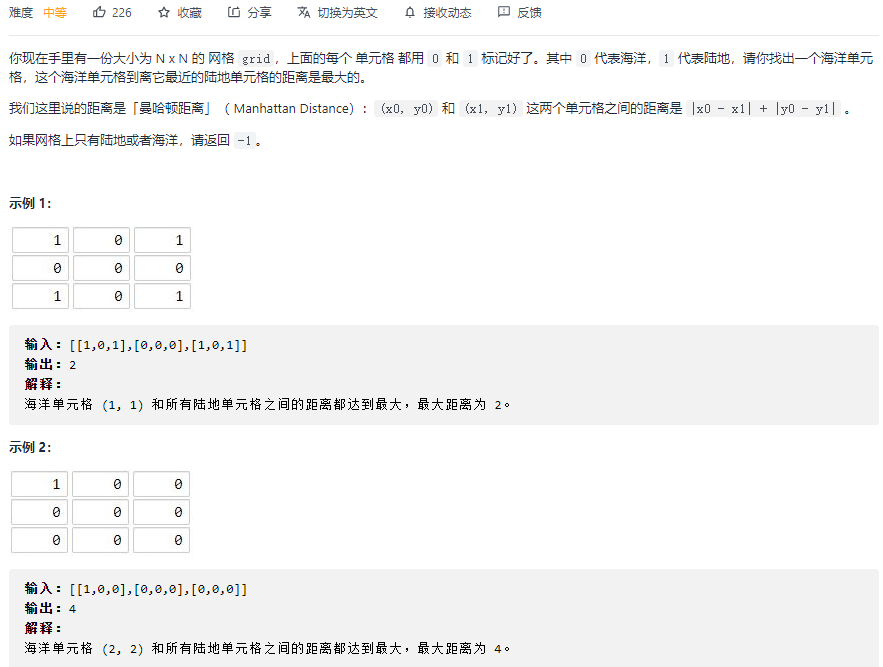
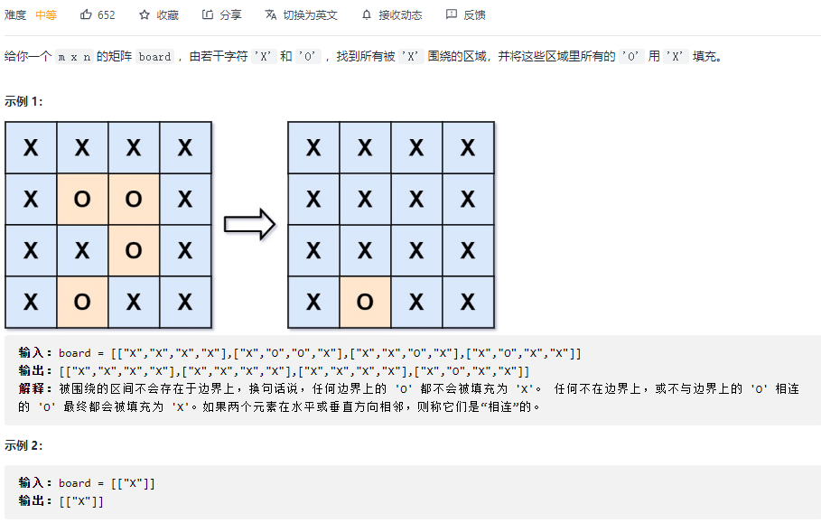

#### [111. 二叉树的最小深度](https://leetcode-cn.com/problems/minimum-depth-of-binary-tree/)



```python
# Definition for a binary tree node.
# class TreeNode:
#     def __init__(self, val=0, left=None, right=None):
#         self.val = val
#         self.left = left
#         self.right = right
class Solution:
    def minDepth(self, root: TreeNode) -> int:
        # BFS
        if root is None: return 0
        queue = [root]
        depth = 1

        while queue:
            # 向四周扩散            
            for _ in range(len(queue)):
                node = queue.pop(0)

                # 判断是否到达终点
                if not node.left and not node.right:
                    return depth
                
                # 将node周围节点加入队列
                if node.left:
                    queue.append(node.left)
                if node.right:
                    queue.append(node.right)
            # 扩散完一次，说明深入了一层，depth应加1
            depth += 1
        return depth
```

#### [752. 打开转盘锁:star::star:](https://leetcode-cn.com/problems/open-the-lock/)


```python
class Solution:
    def openLock(self, deadends: List[str], target: str) -> int:
        # 锁向上转
        def lock_up(s, i):
            chars = list(s)
            chars[i] = "0" if chars[i] == "9" else str(int(chars[i]) + 1)
            return ''.join(chars)
        # 锁向下转
        def lock_down(s, i):
            chars = list(s)
            chars[i] = "9" if chars[i] == "0" else str(int(chars[i]) - 1)
            return ''.join(chars)

        queue = ['0000']
        deads = set(deadends)
        visited = set()
        visited.add('0000')
        step = 0

        while queue:
            # 遍历当前层的所有节点
            for _ in range(len(queue)):
                node = queue.pop(0)
                # 处理当前节点，并向四周扩散
                # 判断是否合法，是否达到终点
                if node in deads: continue
                if node == target: return step

                for i in range(4):
                    up = lock_up(node, i)
                    # 避免走回头路
                    if up not in visited:
                        queue.append(up)
                        visited.add(up)
                    down = lock_down(node, i)
                    # 避免走回头路
                    if down not in visited:
                        queue.append(down)
                        visited.add(down)
            step += 1
        return -1
```

#### [773. 滑动谜题:star::star:](https://leetcode-cn.com/problems/sliding-puzzle/)



```python
class Solution:
    def slidingPuzzle(self, board: List[List[int]]) -> int:
        def swap(node: str, i: int, j: int):
            tmp = list(node)
            tmp[i], tmp[j] = tmp[j], tmp[i]
            return ''.join(tmp)
        
        # 2x3的数组转换成字符串
        s = ""
        m, n = len(board), len(board[0])
        for i in range(m):
            for j in range(n):
                s += str(board[i][j])
        
        # 设定好每个位置所对应的邻居索引
        # [0 1 2]
        # [3 4 5]
        neighbor = [(1, 3), (0, 2, 4), (1, 5),
                    (0, 4), (1, 3, 5), (2, 4)]
        
        target = "123450"
        q = [s]
        step = 0
        visited = set()
        visited.add(s)
        while q:
            # 向四周扩散
            for _ in range(len(q)):
                node = q.pop(0)

                if node == target:
                    return step
                
                # 查找0的位置
                pos = node.index('0')
                # 和邻居交换
                for neighbor_idx in neighbor[pos]:
                    tmp = swap(node, pos, neighbor_idx)
                    if tmp not in visited:
                        visited.add(tmp)
                        q.append(tmp)
            step += 1
        return -1
```

#### [429. N 叉树的层序遍历](https://leetcode-cn.com/problems/n-ary-tree-level-order-traversal/)



```python
"""
# Definition for a Node.
class Node:
    def __init__(self, val=None, children=None):
        self.val = val
        self.children = children
"""

class Solution:
    def levelOrder(self, root: 'Node') -> List[List[int]]:
        if root is None: return []
        queue = [root]
        res = []
        while queue:
            tmp = []
            for _ in range(len(queue)):
                node = queue.pop(0)
                # 处理当前节点
                if node:
                    tmp.append(node.val)
                
                    for child in node.children:
                        queue.append(child)
            res.append(tmp)
        return res
```

#### [127. 单词接龙:star::star::star:](https://leetcode-cn.com/problems/word-ladder/)



```python
class Solution:
    def ladderLength(self, beginWord: str, endWord: str, wordList: List[str]) -> int:
        def diff(s: str, t: str):
            res = 0
            for i in range(len(s)):
                if s[i] != t[i]:
                    res += 1
            return res
        
        def get_available_nodes(begin: str, words: List[str], visited: set):
            availables = []
            for word in words:
                if word not in visited and diff(begin, word) == 1:
                    availables.append(word)
            return availables

        queue = [beginWord]
        visited = set()
        step = 1

        while queue:
            # 遍历当前层的所有节点
            for _ in range(len(queue)):
                # 处理当前节点，如果已经是末尾了，就返回
                begin_node = queue.pop(0)
                if begin_node == endWord:
                    return step
				# 获取当前节点的所有可以访问的子节点
                nodes = get_available_nodes(begin_node, wordList, visited)
                for node in nodes:
                    queue.append(node)
                    visited.add(node)
            step += 1
        return 0
```

#### [1162. 地图分析:star::star:](https://leetcode-cn.com/problems/as-far-from-land-as-possible/)



```python
class Solution:
    def maxDistance(self, grid: List[List[int]]) -> int:
        # 要求找离海洋单元格到离他最近的陆地单元格距离最大的
        # 反过来，我们将陆地单元格入队，每次扩展一步找到最近的海洋，
        # 当我们把所有的都扩展到了，最后扩展的次数就是最大距离
        step = -1
        n = len(grid)
        q = []
        for i in range(n):
            for j in range(n):
                if grid[i][j] == 1:
                    q.append((i, j))
        # 如果网格只有陆地或者海洋，返回
        if len(q) == 0 or len(q) == n * n:
            return step
        
        while q:
            for _ in range(len(q)):
                x, y = q.pop(0)
                for xi, yj in [(x + 1, y), (x - 1, y), (x, y + 1), (x, y - 1)]:
                    if 0 <= xi < n and 0 <= yj < n and grid[xi][yj] == 0:
                        q.append((xi, yj))
                        grid[xi][yj] = -1
            step += 1
        
        return step
```

#### [130. 被围绕的区域:star::star:](https://leetcode-cn.com/problems/surrounded-regions/)



```python
# BFS
class Solution:
    def solve(self, board: List[List[str]]) -> None:
        """
        Do not return anything, modify board in-place instead.
        """
        # 先从边缘BFS，连通的部分O变成B
        m = len(board)
        n = len(board[0])

        def bfs(q):
            while q:
                for _ in range(len(q)):
                    i, j = q.pop(0)
                    # 处理当前节点
                    board[i][j] = 'B'
                    for x, y in [(i-1,j), (i, j-1), (i+1, j), (i, j+1)]:
                        if 0<=x<m and 0<=y<n and board[x][y] == 'O':
                            q.append((x, y))
                        
        q = []
        for i in range(m):
            if board[i][0] == 'O': q.append((i, 0))
            if board[i][-1] == 'O': q.append((i, n-1))
        bfs(q)

        q = []
        for i in range(n):
            if board[0][i] == 'O': q.append((0, i))
            if board[m-1][i] == 'O': q.append((m-1, i))
        bfs(q)

        for i in range(m):
            for j in range(n):
                # 将内部的O改成X填充
                if board[i][j] == 'O':
                    board[i][j] = 'X'
                # 内部的B是与边界上的O相连，因此要还原为O
                if board[i][j] == 'B':
                    board[i][j] = 'O'
```

```python
# DFS
class Solution:
    def solve(self, board: List[List[str]]) -> None:
        """
        Do not return anything, modify board in-place instead.
        """
        row = len(board)
        col = len(board[0])

        if row <= 2 or col <= 2: return

        for i in range(0, len(board)):
            self.dfs_edge(board, i, 0)
            self.dfs_edge(board, i, len(board[0])-1)

        for j in range(0, len(board[0])):
            self.dfs_edge(board, 0, j)
            self.dfs_edge(board, len(board)-1, j)
            
        for i in range(1, row-1):
            for j in range(1, col-1):
                if board[i][j] == 'O':
                    self.dfs(board, i, j)
        for i in range(row):
            for j in range(col):
                if board[i][j] == 'B':
                    board[i][j] = 'O'

    def dfs_edge(self, board, i, j):
        if not 0 <= i < len(board) or not 0 <= j < len(board[0]) or board[i][j] in ('X', 'B'):
            return
        
        board[i][j] = 'B'
        self.dfs_edge(board, i + 1, j)
        self.dfs_edge(board, i - 1, j)
        self.dfs_edge(board, i, j + 1)
        self.dfs_edge(board, i, j - 1)

    def dfs(self, board, i, j):
        if not 0 < i < len(board)-1 or not 0 < j < len(board[0]) -1 or board[i][j] in ('X', 'B'):
            return
        board[i][j] = 'X'
        
        self.dfs(board, i + 1, j)
        self.dfs(board, i - 1, j)
        self.dfs(board, i, j + 1)
        self.dfs(board, i, j - 1)
```

