#### [2. 两数相加](https://leetcode-cn.com/problems/add-two-numbers/)

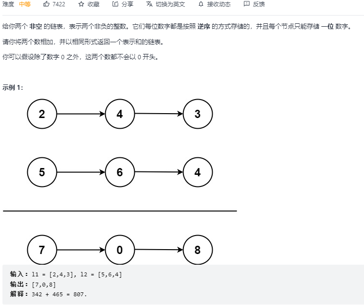

```python
# Definition for singly-linked list.
# class ListNode:
#     def __init__(self, val=0, next=None):
#         self.val = val
#         self.next = next
class Solution:
    def addTwoNumbers(self, l1: ListNode, l2: ListNode) -> ListNode:
        def list2int(head):
            res = 0
            i = 1
            while head:
                res += head.val * i
                i *= 10
                head = head.next
            return res
        
        def int2list(n):
            if n == 0: return ListNode(0)
            dummy = ListNode()
            p = dummy
            while n:
                v = n % 10
                n //= 10
                node = ListNode(v)
                p.next = node
                p = p.next
            return dummy.next

        a = list2int(l1)
        b = list2int(l2)
        res = a + b
        return int2list(res)
```

#### [3. 无重复字符的最长子串](https://leetcode-cn.com/problems/longest-substring-without-repeating-characters/)

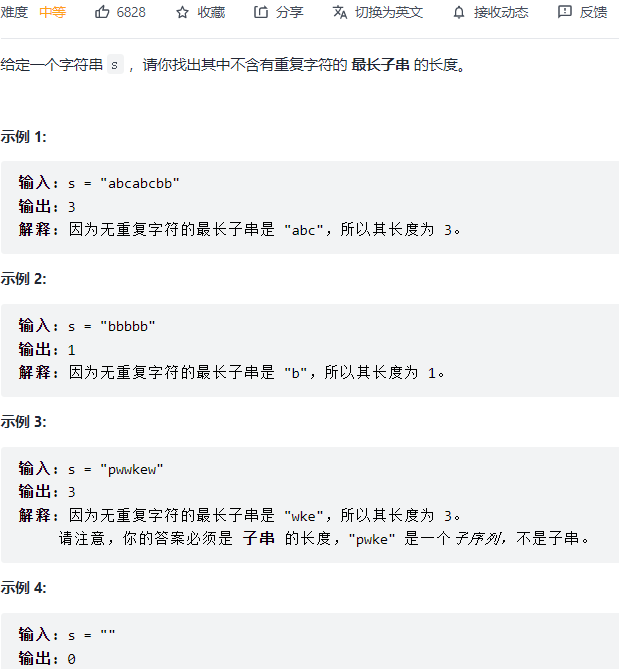

```python
class Solution:
    def lengthOfLongestSubstring(self, s: str) -> int:
        res = 0
        left = 0
        window = {}
        for right in range(len(s)):
            if s[right] not in window:
                window[s[right]] = 1
            else:
                window[s[right]] += 1
                while window[s[right]] > 1:
                    window[s[left]] -= 1
                    if window[s[left]] == 0:
                        window.pop(s[left])
                    left += 1
            res = max(res, right - left + 1)
        return res
```

#### [4. 寻找两个正序数组的中位数:star::star::star::star:](https://leetcode-cn.com/problems/median-of-two-sorted-arrays/)

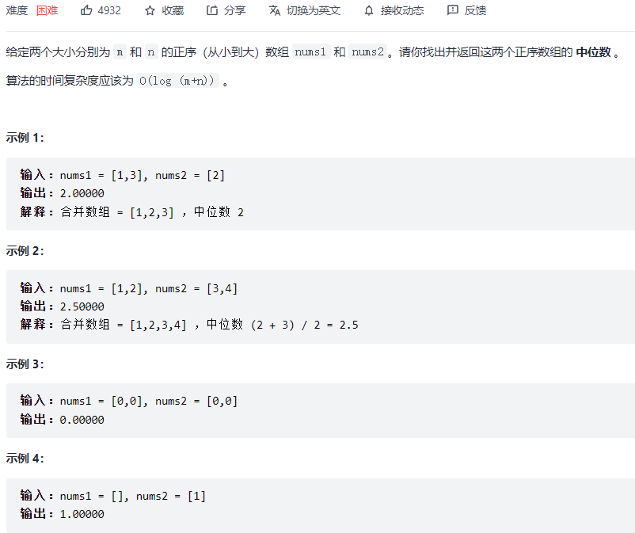

[从一般到特殊的方法，代码精简，边界清晰。 - 寻找两个正序数组的中位数 - 力扣（LeetCode） (leetcode-cn.com)](https://leetcode-cn.com/problems/median-of-two-sorted-arrays/solution/cong-yi-ban-dao-te-shu-de-fang-fa-dai-ma-jing-jian/)

```python
class Solution:
    def findMedianSortedArrays(self, nums1: List[int], nums2: List[int]) -> float:
        # 本质是找第k小的数，k从1开始
        k1 = (len(nums1) + len(nums2) + 1) // 2
        k2 = (len(nums1) + len(nums2) + 2) // 2
        # 如果和是偶数，k1指向中间左侧的数，k2指向中间右侧的数
        # 如果和是奇数，k1 k2都指向中间
        def helper(nums1, nums2, k):
            # k是两个数组合并后的第k小的数
            # t是一刀切，找到两个数组分别的第k//2小的位置
            if len(nums1) < len(nums2):
                nums1, nums2 = nums2, nums1
            if len(nums2) == 0:
                return nums1[k-1]
            if k == 1:
                return min(nums1[0], nums2[0])
            t = min(len(nums2), k // 2)
            if nums1[t-1] >= nums2[t-1]:
                return helper(nums1, nums2[t:], k-t)
            else:
                return helper(nums1[t:], nums2, k-t)
        if k1 == k2:
            return helper(nums1, nums2, k1)
        else:
            return (helper(nums1, nums2, k1) + helper(nums1, nums2, k2)) / 2
```

#### [5. 最长回文子串](https://leetcode-cn.com/problems/longest-palindromic-substring/)

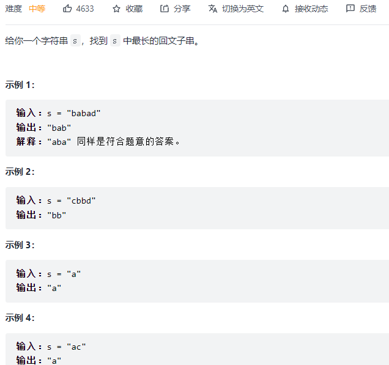

```python
class Solution:
    def longestPalindrome(self, s: str) -> str:
        if len(s) == 1: return s
        begin = 0
        max_len = 1
        dp = [[False] * len(s) for _ in range(len(s))]
        for i in range(len(s)):
            dp[i][i] = True
        for i in range(len(s) - 1, -1, -1):
            for j in range(i + 1, len(s)):
                if s[i] == s[j]:
                    if j - i == 1:
                        dp[i][j] = True
                    else:
                        dp[i][j] = dp[i+1][j-1]
                else:
                    dp[i][j] = False
                if dp[i][j] == True and (j - i + 1 > max_len):
                    max_len = j - i + 1
                    begin = i
        return s[begin: begin + max_len]
```

#### [20. 有效的括号](https://leetcode-cn.com/problems/valid-parentheses/)

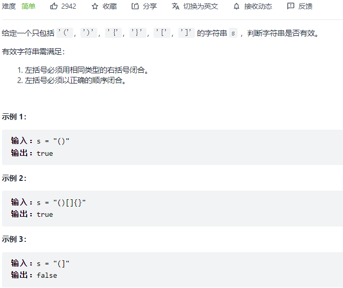

```python
class Solution:
    def isValid(self, s: str) -> bool:
        dic = {
            ')': '(',
            ']': '[', 
            '}': '{'
        }
        stack = []
        for c in s:
            if c in dic:
                if stack and dic[c] == stack[-1]:
                    stack.pop()
                else:
                    return False
            else:
                stack.append(c)
        return len(stack) == 0
```

#### [21. 合并两个有序链表](https://leetcode-cn.com/problems/merge-two-sorted-lists/)

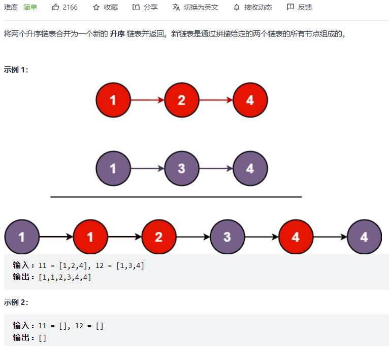

```python
class Solution:
    def mergeTwoLists(self, list1: Optional[ListNode], list2: Optional[ListNode]) -> Optional[ListNode]:
        dummy = ListNode()
        p = dummy
        while list1 and list2:
            if list1.val < list2.val:
                p.next = list1
                list1 = list1.next
            else:
                p.next = list2
                list2 = list2.next
            p = p.next
        if list1:
            p.next = list1
        if list2:
            p.next = list2
        return dummy.next
```

#### [53. 最大子数组和](https://leetcode-cn.com/problems/maximum-subarray/)

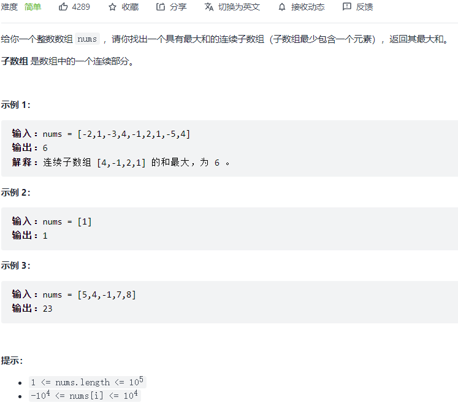

```python
class Solution:
    def maxSubArray(self, nums: List[int]) -> int:
        res = nums[0]
        dp = [0] * len(nums)
        dp[0] = nums[0]
        for i in range(1, len(nums)):
            dp[i] = max(dp[i-1] + nums[i], nums[i])
            res = max(res, dp[i])
        return res
```

#### [70. 爬楼梯](https://leetcode-cn.com/problems/climbing-stairs/)

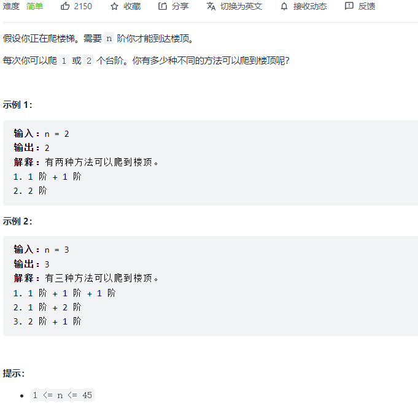

```python
class Solution:
    def climbStairs(self, n: int) -> int:
        if n == 1: return 1
        dp = [0] * (n + 1)
        dp[1] = 1
        dp[2] = 2
        for i in range(3, n + 1):
            dp[i] = dp[i-1] + dp[i-2]
        return dp[-1]
```

#### [94. 二叉树的中序遍历](https://leetcode-cn.com/problems/binary-tree-inorder-traversal/)

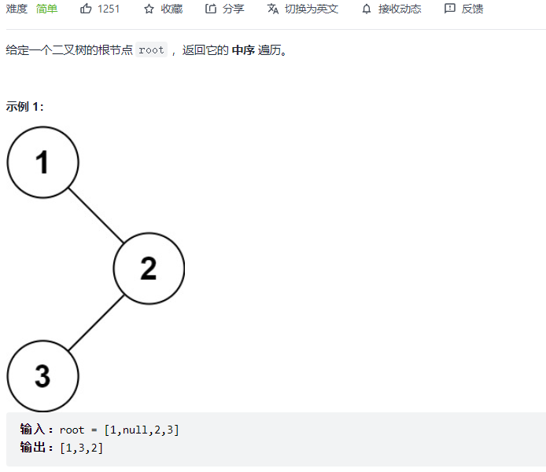

```python
# class TreeNode:
#     def __init__(self, val=0, left=None, right=None):
#         self.val = val
#         self.left = left
#         self.right = right
class Solution:
    def inorderTraversal(self, root: Optional[TreeNode]) -> List[int]:
        self.res = []
        def helper(root):
            if not root:
                return None
            helper(root.left)
            self.res.append(root.val)
            helper(root.right)
        helper(root)
        return self.res
```

```python
class Solution:
    def inorderTraversal(self, root: Optional[TreeNode]) -> List[int]:
        if not root: return []
        res = []
        stack = [root]
        while stack:
            node = stack.pop()
            if node:
                if node.right: stack.append(node.right)
                stack.append(node)
                stack.append(None)
                if node.left: stack.append(node.left)
            else:
                node = stack.pop()
                res.append(node.val)
        return res
```

#### [101. 对称二叉树](https://leetcode-cn.com/problems/symmetric-tree/)

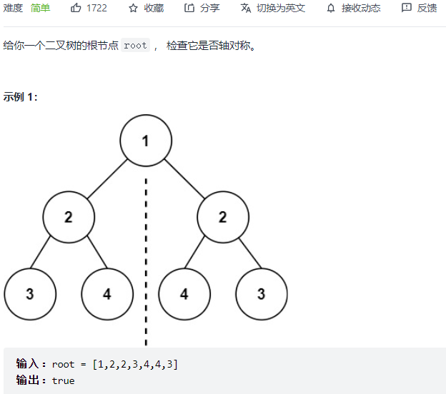

```python
class Solution:
    def isSymmetric(self, root: TreeNode) -> bool:
        def helper(p, q):
            if not p and not q: return True
            if not p and q: return False
            if p and not q: return False
            if p.val != q.val: return False
            return helper(p.left, q.right) and helper(p.right, q.left)
        
        if not root: return True
        return helper(root.left, root.right)
```

#### [104. 二叉树的最大深度](https://leetcode-cn.com/problems/maximum-depth-of-binary-tree/)

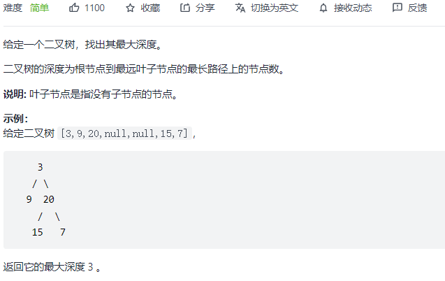

```python
class Solution:
    def maxDepth(self, root: TreeNode) -> int:
        def helper(root):
            if not root: return 0
            left = helper(root.left)
            right = helper(root.right)
            return max(left, right) + 1
        return helper(root)
```

#### [121. 买卖股票的最佳时机](https://leetcode-cn.com/problems/best-time-to-buy-and-sell-stock/)

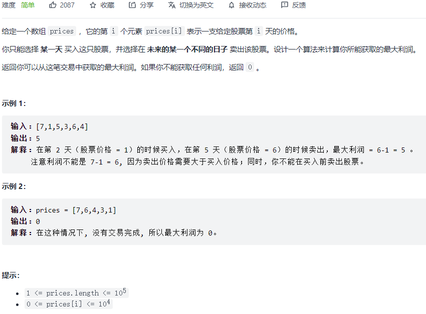

```python
class Solution:
    def maxProfit(self, prices: List[int]) -> int:
        dp = [[0] * 2 for _ in range(len(prices))]
        dp[0][0] = -prices[0]
        for i in range(1, len(prices)):
            dp[i][0] = max(dp[i-1][0], -prices[i])
            dp[i][1] = max(dp[i-1][1], dp[i-1][0] + prices[i])
        return dp[-1][-1]
```

#### [136. 只出现一次的数字](https://leetcode-cn.com/problems/single-number/)

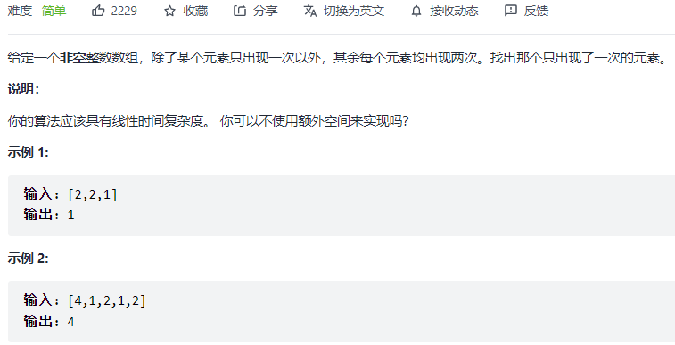

```python
class Solution:
    def singleNumber(self, nums: List[int]) -> int:
        res = 0
        for i in nums:
            res ^= i
        return res
```

#### [141. 环形链表](https://leetcode-cn.com/problems/linked-list-cycle/)

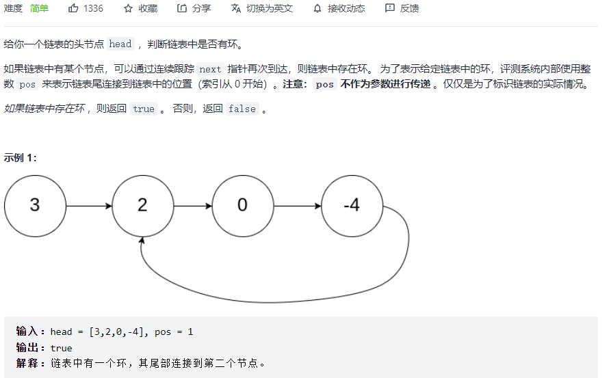

```python
class Solution:
    def hasCycle(self, head: Optional[ListNode]) -> bool:
        fast, slow = head, head
        while fast and fast.next:
            fast = fast.next.next
            slow = slow.next
            if fast == slow: return True
        return False
```

#### [155. 最小栈](https://leetcode-cn.com/problems/min-stack/)

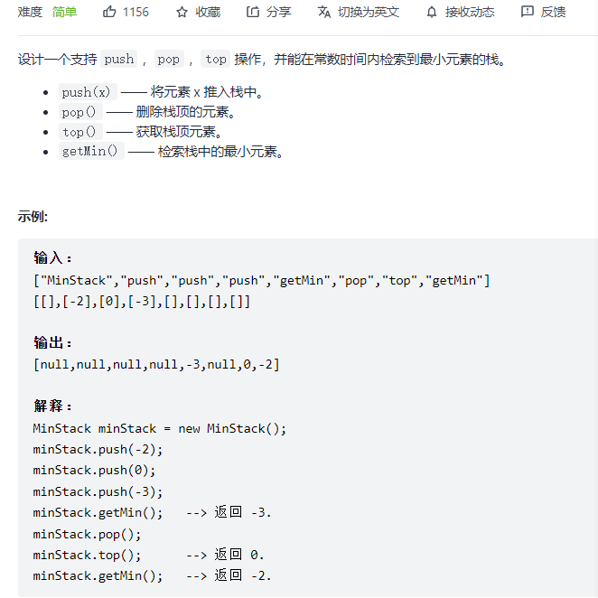

```python
class MinStack:
    def __init__(self):
        self.a = []
        self.b = []

    def push(self, val: int) -> None:
        self.a.append(val)
        if not self.b or self.b[-1] >= val:
            self.b.append(val)

    def pop(self) -> None:
        val = self.a.pop()
        if self.b[-1] == val:
            self.b.pop()

    def top(self) -> int:
        return self.a[-1]

    def getMin(self) -> int:
        return self.b[-1]
```

#### [160. 相交链表](https://leetcode-cn.com/problems/intersection-of-two-linked-lists/)

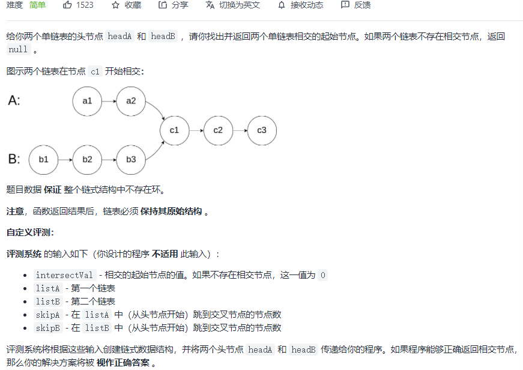

```python
class Solution:
    def getIntersectionNode(self, headA: ListNode, headB: ListNode) -> ListNode:
        a, b = headA, headB
        while a != b:
            a = a.next if a else headB
            b = b.next if b else headA
        return a
```

#### [169. 多数元素](https://leetcode-cn.com/problems/majority-element/)

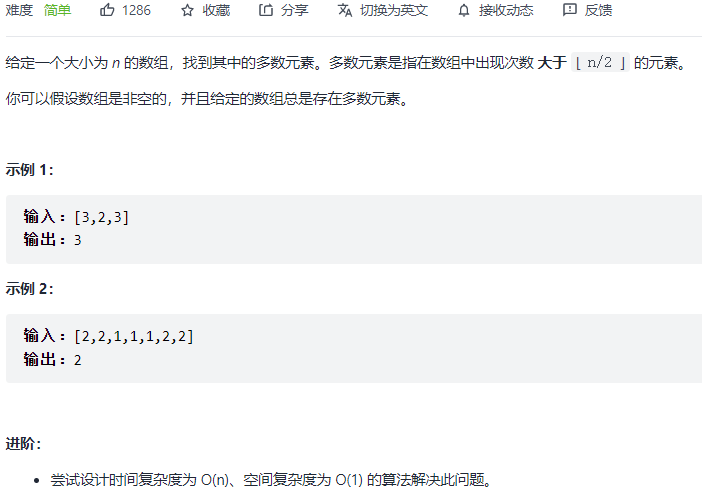

```python
class Solution:
    def majorityElement(self, nums: List[int]) -> int:
        cnt = 1
        candidate = nums[0]
        for i in range(1, len(nums)):
            if nums[i] == candidate:
                cnt += 1
            else:
                cnt -= 1
                if cnt == 0:
                    cnt = 1
                    candidate = nums[i]
        return candidate
```

#### [206. 反转链表](https://leetcode-cn.com/problems/reverse-linked-list/)

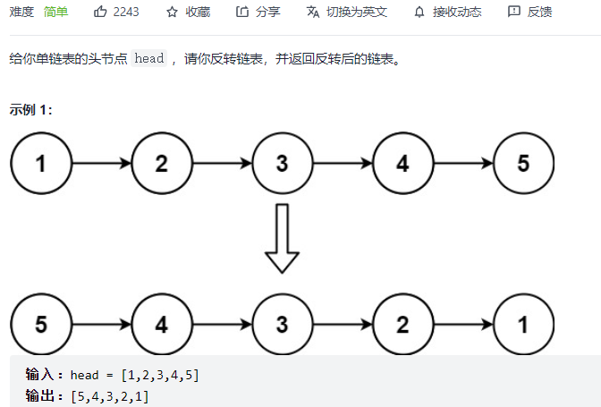

```python
class Solution:
    def reverseList(self, head: ListNode) -> ListNode:
        pre, cur = None, head
        while cur is not None:
            nxt = cur.next
            cur.next = pre
            pre = cur
            cur = nxt
        return pre
```

```python
class Solution:
    def reverseList(self, head: ListNode) -> ListNode:
        def helper(head):
            if not head: return None
            if not head.next: return head
            node = helper(head.next)
            head.next.next = head
            head.next = None
            return node
        return helper(head)
```

#### [226. 翻转二叉树](https://leetcode-cn.com/problems/invert-binary-tree/)

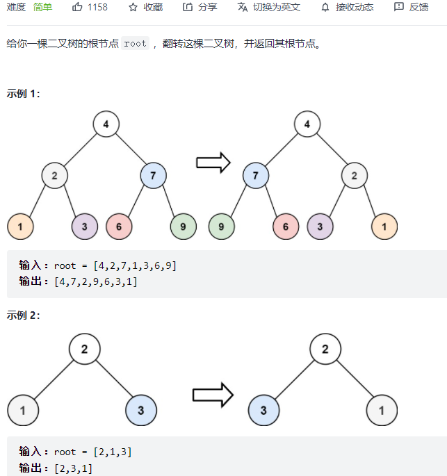

```python
class Solution:
    def invertTree(self, root: TreeNode) -> TreeNode:
        def helper(root):
            if not root: return None
            left = helper(root.left)
            right = helper(root.right)
            root.left, root.right = right, left
            return root
        return helper(root)
```

#### [234. 回文链表](https://leetcode-cn.com/problems/palindrome-linked-list/)


```python
class Solution:
    def isPalindrome(self, head: ListNode) -> bool:
        def reverse(head):
            pre, cur = None, head
            while cur:
                nxt = cur.next
                cur.next = pre
                pre = cur
                cur = nxt
            return pre
        
        dummy = ListNode()
        dummy.next = head
        fast, slow = dummy, dummy
        while fast and fast.next:
            fast = fast.next.next
            slow = slow.next
        left_tail = slow
        right_head = slow.next
        slow.next = None

        l2 = reverse(right_head)
        l1 = head
        while l1 and l2:
            if l1.val == l2.val:
                l1 = l1.next
                l2 = l2.next
            else:
                return False
        return True
```

