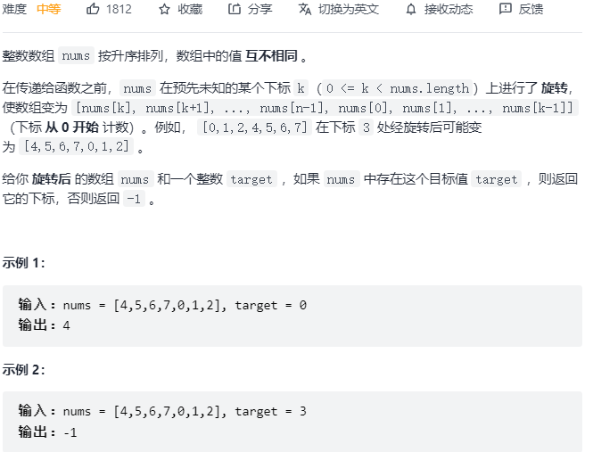
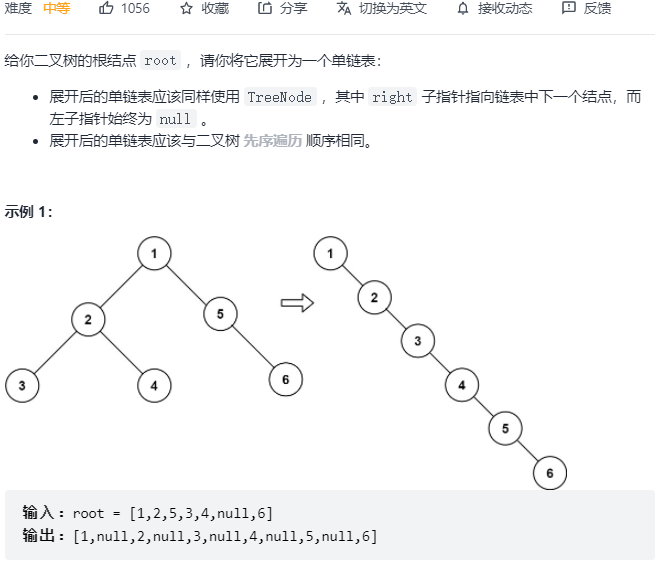
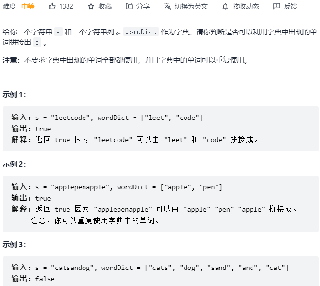

[TOC]


#### [20. 有效的括号](https://leetcode-cn.com/problems/valid-parentheses/)


```python
class Solution:
    def isValid(self, s: str) -> bool:
        dic = {
            ')': '(',
            ']': '[', 
            '}': '{'
        }
        stack = []
        for c in s:
            if c in dic:
                if stack and dic[c] == stack[-1]:
                    stack.pop()
                else:
                    return False
            else:
                stack.append(c)
        return len(stack) == 0
```

#### [21. 合并两个有序链表](https://leetcode-cn.com/problems/merge-two-sorted-lists/)


```python
class Solution:
    def mergeTwoLists(self, list1: Optional[ListNode], list2: Optional[ListNode]) -> Optional[ListNode]:
        dummy = ListNode()
        p = dummy
        while list1 and list2:
            if list1.val < list2.val:
                p.next = list1
                list1 = list1.next
            else:
                p.next = list2
                list2 = list2.next
            p = p.next
        if list1:
            p.next = list1
        if list2:
            p.next = list2
        return dummy.next
```

#### [53. 最大子数组和](https://leetcode-cn.com/problems/maximum-subarray/)


```python
class Solution:
    def maxSubArray(self, nums: List[int]) -> int:
        res = nums[0]
        dp = [0] * len(nums)
        dp[0] = nums[0]
        for i in range(1, len(nums)):
            dp[i] = max(dp[i-1] + nums[i], nums[i])
            res = max(res, dp[i])
        return res
```

#### [70. 爬楼梯](https://leetcode-cn.com/problems/climbing-stairs/)


```python
class Solution:
    def climbStairs(self, n: int) -> int:
        if n == 1: return 1
        dp = [0] * (n + 1)
        dp[1] = 1
        dp[2] = 2
        for i in range(3, n + 1):
            dp[i] = dp[i-1] + dp[i-2]
        return dp[-1]
```

#### [94. 二叉树的中序遍历](https://leetcode-cn.com/problems/binary-tree-inorder-traversal/)


```python
# class TreeNode:
#     def __init__(self, val=0, left=None, right=None):
#         self.val = val
#         self.left = left
#         self.right = right
class Solution:
    def inorderTraversal(self, root: Optional[TreeNode]) -> List[int]:
        self.res = []
        def helper(root):
            if not root:
                return None
            helper(root.left)
            self.res.append(root.val)
            helper(root.right)
        helper(root)
        return self.res
```

```python
class Solution:
    def inorderTraversal(self, root: Optional[TreeNode]) -> List[int]:
        if not root: return []
        res = []
        stack = [root]
        while stack:
            node = stack.pop()
            if node:
                if node.right: stack.append(node.right)
                stack.append(node)
                stack.append(None)
                if node.left: stack.append(node.left)
            else:
                node = stack.pop()
                res.append(node.val)
        return res
```

#### [101. 对称二叉树](https://leetcode-cn.com/problems/symmetric-tree/)


```python
class Solution:
    def isSymmetric(self, root: TreeNode) -> bool:
        def helper(p, q):
            if not p and not q: return True
            if not p and q: return False
            if p and not q: return False
            if p.val != q.val: return False
            return helper(p.left, q.right) and helper(p.right, q.left)
        
        if not root: return True
        return helper(root.left, root.right)
```

#### [104. 二叉树的最大深度](https://leetcode-cn.com/problems/maximum-depth-of-binary-tree/)


```python
class Solution:
    def maxDepth(self, root: TreeNode) -> int:
        def helper(root):
            if not root: return 0
            left = helper(root.left)
            right = helper(root.right)
            return max(left, right) + 1
        return helper(root)
```

#### [121. 买卖股票的最佳时机](https://leetcode-cn.com/problems/best-time-to-buy-and-sell-stock/)


```python
class Solution:
    def maxProfit(self, prices: List[int]) -> int:
        dp = [[0] * 2 for _ in range(len(prices))]
        dp[0][0] = -prices[0]
        for i in range(1, len(prices)):
            dp[i][0] = max(dp[i-1][0], -prices[i])
            dp[i][1] = max(dp[i-1][1], dp[i-1][0] + prices[i])
        return dp[-1][-1]
```

#### [136. 只出现一次的数字](https://leetcode-cn.com/problems/single-number/)


```python
class Solution:
    def singleNumber(self, nums: List[int]) -> int:
        res = 0
        for i in nums:
            res ^= i
        return res
```

#### [141. 环形链表](https://leetcode-cn.com/problems/linked-list-cycle/)


```python
class Solution:
    def hasCycle(self, head: Optional[ListNode]) -> bool:
        fast, slow = head, head
        while fast and fast.next:
            fast = fast.next.next
            slow = slow.next
            if fast == slow: return True
        return False
```

#### [155. 最小栈](https://leetcode-cn.com/problems/min-stack/)


```python
class MinStack:
    def __init__(self):
        self.a = []
        self.b = []

    def push(self, val: int) -> None:
        self.a.append(val)
        if not self.b or self.b[-1] >= val:
            self.b.append(val)

    def pop(self) -> None:
        val = self.a.pop()
        if self.b[-1] == val:
            self.b.pop()

    def top(self) -> int:
        return self.a[-1]

    def getMin(self) -> int:
        return self.b[-1]
```

#### [160. 相交链表](https://leetcode-cn.com/problems/intersection-of-two-linked-lists/)


```python
class Solution:
    def getIntersectionNode(self, headA: ListNode, headB: ListNode) -> ListNode:
        a, b = headA, headB
        while a != b:
            a = a.next if a else headB
            b = b.next if b else headA
        return a
```

#### [169. 多数元素](https://leetcode-cn.com/problems/majority-element/)


```python
class Solution:
    def majorityElement(self, nums: List[int]) -> int:
        cnt = 1
        candidate = nums[0]
        for i in range(1, len(nums)):
            if nums[i] == candidate:
                cnt += 1
            else:
                cnt -= 1
                if cnt == 0:
                    cnt = 1
                    candidate = nums[i]
        return candidate
```

#### [206. 反转链表](https://leetcode-cn.com/problems/reverse-linked-list/)


```python
class Solution:
    def reverseList(self, head: ListNode) -> ListNode:
        pre, cur = None, head
        while cur is not None:
            nxt = cur.next
            cur.next = pre
            pre = cur
            cur = nxt
        return pre
```

```python
class Solution:
    def reverseList(self, head: ListNode) -> ListNode:
        def helper(head):
            if not head: return None
            if not head.next: return head
            node = helper(head.next)
            head.next.next = head
            head.next = None
            return node
        return helper(head)
```

#### [226. 翻转二叉树](https://leetcode-cn.com/problems/invert-binary-tree/)


```python
class Solution:
    def invertTree(self, root: TreeNode) -> TreeNode:
        def helper(root):
            if not root: return None
            left = helper(root.left)
            right = helper(root.right)
            root.left, root.right = right, left
            return root
        return helper(root)
```

#### [234. 回文链表](https://leetcode-cn.com/problems/palindrome-linked-list/)


```python
class Solution:
    def isPalindrome(self, head: ListNode) -> bool:
        def reverse(head):
            pre, cur = None, head
            while cur:
                nxt = cur.next
                cur.next = pre
                pre = cur
                cur = nxt
            return pre
        
        dummy = ListNode()
        dummy.next = head
        fast, slow = dummy, dummy
        while fast and fast.next:
            fast = fast.next.next
            slow = slow.next
        left_tail = slow
        right_head = slow.next
        slow.next = None

        l2 = reverse(right_head)
        l1 = head
        while l1 and l2:
            if l1.val == l2.val:
                l1 = l1.next
                l2 = l2.next
            else:
                return False
        return True
```

#### [283. 移动零](https://leetcode-cn.com/problems/move-zeroes/)


```python
class Solution:
    def moveZeroes(self, nums: List[int]) -> None:
        """
        Do not return anything, modify nums in-place instead.
        """
        cur = 0
        for i in range(len(nums)):
            if nums[i] != 0:
                nums[cur] = nums[i]
                cur += 1
        for i in range(cur, len(nums)):
            nums[i] = 0
```

#### [338. 比特位计数](https://leetcode-cn.com/problems/counting-bits/)


```python
class Solution:
    def countBits(self, n: int) -> List[int]:
        def bit(i):
            cnt = 0
            while i > 0:
                cnt += i & 1
                i >>= 1
            return cnt
        ans = []
        for i in range(n + 1):
            ans.append(bit(i))
        return ans
```

#### [448. 找到所有数组中消失的数字:star::star::star:](https://leetcode-cn.com/problems/find-all-numbers-disappeared-in-an-array/)


```python
class Solution:
    def findDisappearedNumbers(self, nums: List[int]) -> List[int]:
        # 原地哈希
        n = len(nums)
        idx = 0
        while idx < n:
            if nums[idx] == idx + 1:
                idx += 1
                continue
            # 如果nums[idx]不在正确的位置上，先看目标位上的数字，
            # 如果目标位的数字和idx的数字一样，说明idx的数字已经存在，idx右移，
            # 否则把idx和目标位的数字交换
            target_idx = nums[idx] - 1
            if nums[target_idx] == nums[idx]:
                idx += 1
                continue
            nums[idx], nums[target_idx] = nums[target_idx], nums[idx]
            
        res = []
        for i in range(n):
            if nums[i] != i + 1:
                res.append(i + 1)
        return res
```

#### [461. 汉明距离](https://leetcode-cn.com/problems/hamming-distance/)


```python
class Solution:
    def hammingDistance(self, x: int, y: int) -> int:
        z = x ^ y
        cnt = 0
        while z > 0:
            cnt += z & 1
            z >>= 1
        return cnt
```

#### [543. 二叉树的直径](https://leetcode-cn.com/problems/diameter-of-binary-tree/)


```python
class Solution:
    def diameterOfBinaryTree(self, root: TreeNode) -> int:
        self.d = 0
        def helper(root):
            if not root: return 0
            left = helper(root.left)
            right = helper(root.right)
            self.d = max(self.d, left + right + 1)
            return max(left, right) + 1
        helper(root)
        return self.d - 1 # 边的数目 = 点的数目 -1
```

#### [617. 合并二叉树](https://leetcode-cn.com/problems/merge-two-binary-trees/)


```python
class Solution:
    def mergeTrees(self, root1: TreeNode, root2: TreeNode) -> TreeNode:
        def helper(p, q):
            if not p and not q: return None
            if not p and q: return q
            if p and not q: return p
            node = TreeNode(p.val + q.val)
            node.left = helper(p.left, q.left)
            node.right = helper(p.right, q.right)
            return node
        return helper(root1, root2)
```

#### [2. 两数相加](https://leetcode-cn.com/problems/add-two-numbers/)


```python
# Definition for singly-linked list.
# class ListNode:
#     def __init__(self, val=0, next=None):
#         self.val = val
#         self.next = next
class Solution:
    def addTwoNumbers(self, l1: ListNode, l2: ListNode) -> ListNode:
        def list2int(head):
            res = 0
            i = 1
            while head:
                res += head.val * i
                i *= 10
                head = head.next
            return res
        
        def int2list(n):
            if n == 0: return ListNode(0)
            dummy = ListNode()
            p = dummy
            while n:
                v = n % 10
                n //= 10
                node = ListNode(v)
                p.next = node
                p = p.next
            return dummy.next

        a = list2int(l1)
        b = list2int(l2)
        res = a + b
        return int2list(res)
```

#### [3. 无重复字符的最长子串:star:](https://leetcode-cn.com/problems/longest-substring-without-repeating-characters/)


```python
# 76题 438题 3题
class Solution:
    def lengthOfLongestSubstring(self, s: str) -> int:
        res = 0
        left = 0
        window = {}
        for right in range(len(s)):
            if s[right] not in window:
                window[s[right]] = 1
            else:
                window[s[right]] += 1
                while window[s[right]] > 1:
                    window[s[left]] -= 1
                    if window[s[left]] == 0:
                        window.pop(s[left])
                    left += 1
            res = max(res, right - left + 1)
        return res
```

#### [4. 寻找两个正序数组的中位数:star::star::star::star:](https://leetcode-cn.com/problems/median-of-two-sorted-arrays/)


[从一般到特殊的方法，代码精简，边界清晰。 - 寻找两个正序数组的中位数 - 力扣（LeetCode） (leetcode-cn.com)](https://leetcode-cn.com/problems/median-of-two-sorted-arrays/solution/cong-yi-ban-dao-te-shu-de-fang-fa-dai-ma-jing-jian/)

```python
class Solution:
    def findMedianSortedArrays(self, nums1: List[int], nums2: List[int]) -> float:
        # 本质是找第k小的数，k从1开始
        k1 = (len(nums1) + len(nums2) + 1) // 2
        k2 = (len(nums1) + len(nums2) + 2) // 2
        # 如果和是偶数，k1指向中间左侧的数，k2指向中间右侧的数
        # 如果和是奇数，k1 k2都指向中间
        def helper(nums1, nums2, k):
            # k是两个数组合并后的第k小的数
            # t是一刀切，找到两个数组分别的第k//2小的位置
            if len(nums1) < len(nums2):
                nums1, nums2 = nums2, nums1
            if len(nums2) == 0:
                return nums1[k-1]
            if k == 1:
                return min(nums1[0], nums2[0])
            t = min(len(nums2), k // 2)
            if nums1[t-1] >= nums2[t-1]:
                return helper(nums1, nums2[t:], k-t)
            else:
                return helper(nums1[t:], nums2, k-t)
        if k1 == k2:
            return helper(nums1, nums2, k1)
        else:
            return (helper(nums1, nums2, k1) + helper(nums1, nums2, k2)) / 2
```

#### [5. 最长回文子串](https://leetcode-cn.com/problems/longest-palindromic-substring/)


```python
class Solution:
    def longestPalindrome(self, s: str) -> str:
        if len(s) == 1: return s
        begin = 0
        max_len = 1
        dp = [[False] * len(s) for _ in range(len(s))]
        for i in range(len(s)):
            dp[i][i] = True
        for i in range(len(s) - 1, -1, -1):
            for j in range(i + 1, len(s)):
                if s[i] == s[j]:
                    if j - i == 1:
                        dp[i][j] = True
                    else:
                        dp[i][j] = dp[i+1][j-1]
                else:
                    dp[i][j] = False
                if dp[i][j] == True and (j - i + 1 > max_len):
                    max_len = j - i + 1
                    begin = i
        return s[begin: begin + max_len]
```

#### [11. 盛最多水的容器:star::star::star:](https://leetcode-cn.com/problems/container-with-most-water/)


```python
class Solution:
    def maxArea(self, height: List[int]) -> int:
        res = 0
        left, right = 0, len(height) - 1
        while left < right:
            res = max(res, min(height[left], height[right]) * (right - left))
            if height[left] < height[right]:
                left += 1
            else:
                right -= 1
        return res

```

#### [15. 三数之和](https://leetcode-cn.com/problems/3sum/)


```python
class Solution:
    def threeSum(self, nums: List[int]) -> List[List[int]]:
        if len(nums) < 3: return []
        res = []
        nums.sort()

        # [-1, -1, 0, 1, 1]
        for i in range(len(nums)):
            if i > 0 and nums[i] == nums[i-1]: continue
            if nums[i] > 0: break

            j, k = i + 1, len(nums) - 1
            
            while j < k:
                
                s = nums[i] + nums[j] + nums[k]
                if s == 0:
                    res.append([nums[i], nums[j], nums[k]])
                    while j < k and nums[j] == nums[j + 1]: j += 1
                    while j < k and nums[k] == nums[k - 1]: k -= 1
                    j += 1
                    k -= 1
                elif s < 0:
                    j += 1
                else:
                    k -= 1
        return res
```

#### [17. 电话号码的字母组合](https://leetcode-cn.com/problems/letter-combinations-of-a-phone-number/)


```python
# 39题 46题 78题 79题 200题 22题 17题
class Solution:
    def letterCombinations(self, digits: str) -> List[str]:
        dic = {
            '2': ['a', 'b', 'c'],
            '3': ['d', 'e', 'f'],
            '4': ['g', 'h', 'i'],
            '5': ['j', 'k', 'l'],
            '6': ['m', 'n', 'o'],
            '7': ['p', 'q', 'r', 's'],
            '8': ['t', 'u', 'v'],
            '9': ['w', 'x', 'y', 'z']
        }
        if len(digits) == 0: return []
        res = []
        path = []
        def dfs(path, cur_idx):
            if len(path) == len(digits):
                res.append(''.join(path))
                return
            for a in dic[digits[cur_idx]]:
                dfs(path + [a], cur_idx + 1)
        dfs(path, 0)
        return res
```

#### [19. 删除链表的倒数第 N 个结点](https://leetcode-cn.com/problems/remove-nth-node-from-end-of-list/)


```python
class Solution:
    def removeNthFromEnd(self, head: ListNode, n: int) -> ListNode:
        dummy = ListNode()
        dummy.next = head
        fast, slow = dummy, dummy
        for _ in range(n):
            fast = fast.next
        while fast.next:
            fast = fast.next
            slow = slow.next
        slow.next = slow.next.next
        return dummy.next
```

#### [22. 括号生成](https://leetcode-cn.com/problems/generate-parentheses/)


```python
# 39题 46题 78题 79题 200题 22题 17题
class Solution:
    def generateParenthesis(self, n: int) -> List[str]:
        res = []
        path = []
        left, right = n, n
        def backtrack(path, left, right):
            if left == right and left == 0:
                res.append(''.join(path))
                return
            
            if left > 0:
                backtrack(path + ['('], left - 1, right)
            if right > left:        
                backtrack(path + [')'], left, right - 1)
        backtrack(path, left, right)
        return res
```

#### [31. 下一个排列:star::star::star::star:](https://leetcode-cn.com/problems/next-permutation/)

[下一个排列 - 下一个排列 - 力扣（LeetCode） (leetcode-cn.com)](https://leetcode-cn.com/problems/next-permutation/solution/xia-yi-ge-pai-lie-by-powcai/)


```python
class Solution:
    def nextPermutation(self, nums: List[int]) -> None:
        """
        Do not return anything, modify nums in-place instead.
        """
        def reverse(nums, i, j):
            while i < j:
                nums[i], nums[j] = nums[j], nums[i]
                i += 1
                j -= 1

        n = len(nums)
        first_idx = -1
        for i in range(n - 2, -1, -1):
            if nums[i] < nums[i + 1]:  # 如果要求上一个排列，这里改成>
                first_idx = i
                break
        if first_idx == -1:
            reverse(nums, 0, n - 1)
            return
        second_idx = -1
        for i in range(n-1, -1, -1):
            if nums[i] > nums[first_idx]:   # 如果要求上一个排列，这里改成<
                second_idx = i
                break
        nums[first_idx], nums[second_idx] = nums[second_idx], nums[first_idx]
        reverse(nums, first_idx + 1, n -1)
```


#### [33. 搜索旋转排序数组:star:](https://leetcode-cn.com/problems/search-in-rotated-sorted-array/)



```python
# 33题 81题 153题 154题 34题
class Solution:
    def search(self, nums: List[int], target: int) -> int:
        # 将数组一分为二，其中一定有一个是有序的，另一个可能是有序，也能是部分有序。此时有序部分用二分法查找。无序部分再一分为二，其中一个一定有序，另一个可能有序，可能无序。就这样循环.
        left, right = 0, len(nums) - 1
        while left <= right: 
            mid = left + (right - left) // 2
            if nums[mid] == target: return mid
            if nums[mid] < nums[-1]:
                if nums[mid] < target <= nums[-1]:
                    left = mid + 1
                else:
                    right = mid - 1
            else:
                if nums[left] <= target < nums[mid]:
                    right = mid - 1
                else:
                    left = mid + 1
                    
        return -1 
```

```python
class Solution:
    def search(self, nums: List[int], target: int) -> int:
        left, right = 0, len(nums) - 1
        while left <= right:
            mid = left + (right - right) // 2
            if nums[mid] == target:
                return mid
            elif nums[mid] >= nums[left]:  # left和mid在一个数组上
                if nums[left] <= target < nums[mid]:
                    right = mid - 1
                else:
                    left = mid + 1
            else:  # mid 在数组2上 left在数组1上
                if nums[mid] < target <= nums[right]:
                    left = mid + 1
                else:
                    right = mid - 1
        return -1
```

#### [81. 搜索旋转排序数组 II](https://leetcode-cn.com/problems/search-in-rotated-sorted-array-ii/)


```python
class Solution:
    def search(self, nums: List[int], target: int) -> bool:
        left, right = 0, len(nums) - 1
        while left <= right:
            mid = left + (right - left) // 2
            if nums[mid] == target:
                return True
            elif nums[mid] == nums[left]:
                left += 1
            elif nums[mid] > nums[left]:
                if nums[left] <= target < nums[mid]:
                    right = mid - 1
                else:
                    left = mid + 1
            else:
                if nums[mid] < target <= nums[right]:
                    left = mid + 1
                else:
                    right = mid - 1
        return False
```

#### [153. 寻找旋转排序数组中的最小值](https://leetcode-cn.com/problems/find-minimum-in-rotated-sorted-array/)


```python
class Solution:
    def findMin(self, nums: List[int]) -> int:
        left, right = 0, len(nums) - 1
        while left <= right:
            # [left, right] 已经是有序的，left就是最小的
            if nums[left] < nums[right]:
                return nums[left]

            mid = left + (right - left) // 2
            # [left, mid]有序，说明最小值在mid右侧
            if nums[left] <= nums[mid]:
                left = mid + 1
            else:  # nums[left] > nums[mid]
                right = mid
        return nums[right]
```

#### [154. 寻找旋转排序数组中的最小值 II](https://leetcode-cn.com/problems/find-minimum-in-rotated-sorted-array-ii/)


```python
class Solution:
    def findMin(self, nums: List[int]) -> int:
        left, right = 0, len(nums) - 1
        while left <= right:
            if nums[left] < nums[right]:
                return nums[left]
            mid = left + (right - left) // 2
            if nums[mid] > nums[left]:
                left = mid + 1
            elif nums[mid] < nums[left]:
                right = mid
            else:  # nums[mid] == nums[left]
                left += 1
        return nums[right]
```


#### [34. 在排序数组中查找元素的第一个和最后一个位置:star:](https://leetcode-cn.com/problems/find-first-and-last-position-of-element-in-sorted-array/)


```python
class Solution:
    def searchRange(self, nums: List[int], target: int) -> List[int]:
        """
        口诀
        求左边界：向下取整，等号归右，左加一
        求右边界：向上取整，等号归左，右减一
        总是右侧为所求
        """
        if not nums: return [-1, -1]
        left, right = 0, len(nums) - 1  # 右边界
        while left < right:
            mid = left + (right - left) // 2  # 向下取整
            if nums[mid] == target:
                right = mid  # 等号归右
            elif nums[mid] < target:
                left = mid + 1  # 左加一
            else:
                right = mid
        if nums[right] != target: return [-1, -1]
        begin = right  # 右侧为所求
        left, right = 0, len(nums) - 1  # 右边界
        while left < right:
            mid = left + (right - left + 1) // 2  # 向上取整
            if nums[mid] == target:
                left = mid
            elif nums[mid] < target:
                left = mid
            else:
                right = mid - 1
        end = right  # 右侧为所求
        return [begin, end]
```

#### [39. 组合总和](https://leetcode-cn.com/problems/combination-sum/)


```python
# 39题 46题 78题 79题 200题 22题
class Solution:
    def combinationSum(self, candidates: List[int], target: int) -> List[List[int]]:
        res = []
        path = []

        def backtrack(path, cur, target):
            if target == 0:
                res.append(path[:])
                return
            if target < 0:
                return
            for i in range(cur, len(candidates)):
                backtrack(path + [candidates[i]], i, target - candidates[i])
        backtrack(path, 0, target)
        return res
```

#### [46. 全排列](https://leetcode-cn.com/problems/permutations/)


```python
class Solution:
    def permute(self, nums: List[int]) -> List[List[int]]:
        res = []
        path = []
        visited = [0] * (len(nums))
        def dfs(path):
            if len(path) == len(nums):
                res.append(path[:])
                return
            for i in range(len(nums)):
                if visited[i] == 0:
                    visited[i] = 1
                    dfs(path + [nums[i]])
                    visited[i] = 0
        dfs(path)
        return res
```

#### [48. 旋转图像:star:](https://leetcode-cn.com/problems/rotate-image/)


```python
class Solution:
    def rotate(self, matrix: List[List[int]]) -> None:
        """
        Do not return anything, modify matrix in-place instead.
        """
        n = len(matrix)
        # 先沿对角线翻折
        for i in range(n):
            for j in range(i):
                matrix[i][j], matrix[j][i] = matrix[j][i], matrix[i][j]
        
        # 沿垂直中线翻折
        for i in range(n):
            j, k = 0, n - 1
            while j < k:
                matrix[i][j], matrix[i][k] = matrix[i][k], matrix[i][j]
                j += 1
                k -= 1
```

#### [49. 字母异位词分组:star:](https://leetcode-cn.com/problems/group-anagrams/)


```python
class Solution:
    def groupAnagrams(self, strs: List[str]) -> List[List[str]]:
        dic = {}
        for s in strs:
            chars = [0] * 26
            for c in s:
                chars[ord(c) - ord('a')] += 1
            k = tuple(chars)
            if k not in dic:
                dic[k] = [s]
            else:
                dic[k].append(s)
        return list(dic.values())
```

#### [55. 跳跃游戏:star:](https://leetcode-cn.com/problems/jump-game/)


```python
# 贪心法。  dfs会超时
class Solution:
    def canJump(self, nums) :
        max_i = 0       #初始化当前能到达最远的位置
        for i, jump in enumerate(nums):   #i为当前位置，jump是当前位置的跳数
            if max_i>=i and i+jump>max_i:  #如果当前位置能到达，并且当前位置+跳数>最远位置  
                max_i = i+jump  #更新最远能到达位置
        return max_i>=i
```

#### [56. 合并区间](https://leetcode-cn.com/problems/merge-intervals/)


```python
# [[1,3],[2,6],[8,10],[15,18]]
# [[1,4],[2,3]]
class Solution:
    def merge(self, intervals: List[List[int]]) -> List[List[int]]:
        intervals.sort(key=lambda x: x[0])
        res = [intervals[0]]
        for i in range(1, len(intervals)):
            if intervals[i][0] <= res[-1][1]:
                pre = res.pop()
                res.append([pre[0], max(pre[1], intervals[i][1])])
            else:
                res.append(intervals[i])
        return res
```

#### [62. 不同路径](https://leetcode-cn.com/problems/unique-paths/)


```python
class Solution:
    def uniquePaths(self, m: int, n: int) -> int:
        dp = [[0] * n for _ in range(m)]
        for j in range(n):
            dp[0][j] = 1
        for i in range(m):
            dp[i][0] = 1
        for i in range(1, m):
            for j in range(1, n):
                dp[i][j] = dp[i-1][j] + dp[i][j-1]
        return dp[-1][-1]
```

#### [64. 最小路径和](https://leetcode-cn.com/problems/minimum-path-sum/)


```python
class Solution:
    def minPathSum(self, grid: List[List[int]]) -> int:
        m, n = len(grid), len(grid[0])
        dp = [[0] * (n) for _ in range(m)]
        s = 0
        for j in range(n):
            s += grid[0][j]
            dp[0][j] = s
        s = 0
        for i in range(m):
            s += grid[i][0]
            dp[i][0] = s
        for i in range(1, m):
            for j in range(1, n):
                dp[i][j] = min(dp[i-1][j], dp[i][j-1]) + grid[i][j]
        return dp[-1][-1]
```

#### [75. 颜色分类](https://leetcode-cn.com/problems/sort-colors/)


```python
class Solution:
    def sortColors(self, nums: List[int]) -> None:
        """
        Do not return anything, modify nums in-place instead.
        """
        cnt = [0] * 3
        for c in nums:
            cnt[c] += 1
        c, n = 0, cnt[0]
        for i in range(len(nums)):
            while n == 0:
                c += 1
                n = cnt[c]
            nums[i] = c
            n -= 1
```

#### [78. 子集](https://leetcode-cn.com/problems/subsets/)


```python
class Solution:
    def subsets(self, nums: List[int]) -> List[List[int]]:
        res = []
        path = []

        def dfs(path, cur):
            res.append(path[:])
            for i in range(cur, len(nums)):
                dfs(path + [nums[i]], i + 1)
        dfs(path, 0)
        return res
```

#### [79. 单词搜索:star:](https://leetcode-cn.com/problems/word-search/)


```python
class Solution:
    def exist(self, board: List[List[str]], word: str) -> bool:
        m, n = len(board), len(board[0])
        visited = [[False] * n for _ in range(m)]
        path = ""
        def dfs(i, j, path, idx):
            if path == word:
                return True
            visited[i][j] = True
            for x, y in ((i, j+1), (i, j-1), (i-1, j), (i+1, j)):
                if x < 0 or x >= m or y < 0 or y >= n:
                    continue
                if visited[x][y]:
                    continue
                if board[x][y] == word[idx + 1]:
                    if dfs(x, y, path + board[x][y], idx+1):
                        return True
            visited[i][j] = False
            return False
        for i in range(m):
            for j in range(n):
                if board[i][j] == word[0]:
                    if dfs(i, j, path + board[i][j], 0):
                        return True
        return False
```

#### [96. 不同的二叉搜索树:star:](https://leetcode-cn.com/problems/unique-binary-search-trees/)


```python
class Solution:
    def numTrees(self, n: int) -> int:
        dp = [0] * (n + 1)
        dp[0] = 1
        dp[1] = 1
        for i in range(2, n + 1):
            for j in range(i):
                dp[i] += dp[j] * dp[i - j - 1]
        return dp[n]
```

#### [98. 验证二叉搜索树](https://leetcode-cn.com/problems/validate-binary-search-tree/)


```python
class Solution:
    def isValidBST(self, root: TreeNode) -> bool:
        self.cur_max = -float('inf')
        def helper(root):
            if not root:
                return True
            if not helper(root.left):
                return False
            if self.cur_max < root.val:
                self.cur_max = root.val
            else:
                return False
            if not helper(root.right):
                return False
            return True
        return helper(root)
```

#### [102. 二叉树的层序遍历](https://leetcode-cn.com/problems/binary-tree-level-order-traversal/)


```python
class Solution:
    def levelOrder(self, root: TreeNode) -> List[List[int]]:
        if not root: return []
        q = [root]
        res = []
        while q:
            tmp = []
            for _ in range(len(q)):
                node = q.pop(0)
                tmp.append(node.val)
                if node.left:
                    q.append(node.left)
                if node.right:
                    q.append(node.right)
            res.append(tmp)
        return res
```

#### [105. 从前序与中序遍历序列构造二叉树](https://leetcode-cn.com/problems/construct-binary-tree-from-preorder-and-inorder-traversal/)


```python
class Solution:
    def buildTree(self, preorder: List[int], inorder: List[int]) -> TreeNode:
        if not preorder:
            return None
        root_val = preorder[0]
        root = TreeNode(root_val)
        idx = inorder.index(root_val)
        left_inorder = inorder[:idx]
        right_inorder = inorder[idx+1:]
        left_preorder = preorder[1: 1 + len(left_inorder)]
        right_preorder = preorder[1 + len(left_inorder): ]
        root.left = self.buildTree(left_preorder, left_inorder)
        root.right = self.buildTree(right_preorder, right_inorder)
        return root
```

#### [114. 二叉树展开为链表:star::star::star:](https://leetcode-cn.com/problems/flatten-binary-tree-to-linked-list/)



```python
class Solution:
    def flatten(self, root: TreeNode) -> None:
        """
        Do not return anything, modify root in-place instead.
        """
        def helper(root):
            if not root: return None
            left = root.left
            right = root.right

            helper(left)
            helper(right)

            root.right = left
            root.left = None
            # root 移到left的末尾节点
            while root.right:
                root = root.right
            root.right = right

        helper(root)
```

#### [128. 最长连续序列:star::star::star::star:](https://leetcode-cn.com/problems/longest-consecutive-sequence/)

[【图解】遇到就深究——并查集 - 最长连续序列 - 力扣（LeetCode） (leetcode-cn.com)](https://leetcode-cn.com/problems/longest-consecutive-sequence/solution/tu-jie-yu-dao-jiu-shen-jiu-bing-cha-ji-by-chun-men/)


```python
class UFS:
    def __init__(self, nums):
        self.parent = {num: num for num in nums}
        self.cnt = {num: 1 for num in nums}
    
    def find(self, x):
        while x != self.parent[x]:
            self.parent[x] = self.parent[self.parent[x]]
            x = self.parent[x]
        return x
    
    def union(self, x, y):
        if y not in self.parent:
            return 1
        root1, root2 = self.find(x), self.find(y)
        if root1 == root2:
            return self.cnt[root1]
        self.parent[root2] = root1
        self.cnt[root1] += self.cnt[root2]
        return self.cnt[root1]

class Solution:
    def longestConsecutive(self, nums: List[int]) -> int:
        if len(nums) == 0: return 0
        ufs = UFS(nums)
        res = 1
        for num in nums:
            cnt = ufs.union(num, num + 1)
            res = max(res, cnt)
        return res
```


#### [139. 单词拆分](https://leetcode-cn.com/problems/word-break/)



```python
class Solution:
    def wordBreak(self, s: str, wordDict: List[str]) -> bool:
        n = len(s)
        dp = [False] * (n + 1)
        dp[0] = True
        for i in range(1, n+1):
            for j in range(len(wordDict)):
                if len(wordDict[j]) > i:
                    continue
                dp[i] = dp[i] or (dp[i - len(wordDict[j])] and s[i - len(wordDict[j]): i] == wordDict[j])
        return dp[-1]
```

#### [142. 环形链表 II](https://leetcode-cn.com/problems/linked-list-cycle-ii/)


```python
class Solution:
    def detectCycle(self, head: ListNode) -> ListNode:
        fast, slow = head, head
        while fast and fast.next:
            fast = fast.next.next
            slow = slow.next
            if fast == slow:
                p, q = fast, head
                while p != q:
                    p = p.next
                    q = q.next
                return p
        return None
```

#### [148. 排序链表](https://leetcode-cn.com/problems/sort-list/)


```python
class Solution:
    def sortList(self, head: ListNode) -> ListNode:
        def helper(head):
            if not head or not head.next:
                return head
            dummy = ListNode()
            dummy.next = head
            fast, slow = dummy, dummy
            while fast and fast.next:
                fast = fast.next.next
                slow = slow.next
            right_head = slow.next
            slow.next = None
            left = helper(dummy.next)
            right = helper(right_head)
            res = p = ListNode()
            while left and right:
                if left.val < right.val:
                    p.next = left
                    left = left.next
                else:
                    p.next = right
                    right = right.next
                p = p.next
            if left: p.next = left
            if right: p.next = right
            return res.next            
        return helper(head)
```


#### [152. 乘积最大子数组:star::star::star:](https://leetcode-cn.com/problems/maximum-product-subarray/)


```python
class Solution:
    def maxProduct(self, nums: List[int]) -> int:
        n = len(nums)
        dp_max = [0] * n
        dp_max[0] = nums[0]
        dp_min = [0] * n
        dp_min[0] = nums[0]
        res = nums[0]

        for i in range(1, n):
            dp_max[i] = max(nums[i], dp_max[i-1] * nums[i], dp_min[i-1] * nums[i])
            dp_min[i] = min(nums[i], dp_max[i-1] * nums[i], dp_min[i-1] * nums[i])
            res = max(res, dp_max[i])
        return res
```

#### [198. 打家劫舍](https://leetcode-cn.com/problems/house-robber/)


```python
class Solution:
    def rob(self, nums: List[int]) -> int:
        n = len(nums)
        if n <= 1: return nums[0]
        dp = [0] * n
        dp[0] = nums[0]
        dp[1] = max(nums[0], nums[1])
        for i in range(2, n):
            dp[i] = max(dp[i-2] + nums[i], dp[i-1])
        return dp[-1]
```

#### [200. 岛屿数量](https://leetcode-cn.com/problems/number-of-islands/)


```python
class Solution:
    def numIslands(self, grid: List[List[str]]) -> int:
        self.res = 0
        m, n = len(grid), len(grid[0])
        def dfs(i, j):
            if grid[i][j] == '#':
                return
            grid[i][j] = '#'
            for x, y in ((i, j-1), (i, j+1), (i+1, j), (i-1, j)):
                if x < 0 or x >= m or y < 0 or y >= n:
                    continue
                if grid[x][y] == '0':
                    continue
                dfs(x, y)
            
        for i in range(m):
            for j in range(n):
                if grid[i][j] == '1':
                    self.res += 1
                    dfs(i, j)
        return self.res
```

#### [207. 课程表](https://leetcode-cn.com/problems/course-schedule/)


```python
class Solution:
    def canFinish(self, numCourses: int, prerequisites: List[List[int]]) -> bool:
        graph = [[] for _ in range(numCourses)]
        in_degree = [0] * numCourses
        for pre in prerequisites:
            graph[pre[1]].append(pre[0])
            in_degree[pre[0]] += 1
        q = []
        for i in range(numCourses):
            if in_degree[i] == 0:
                q.append(i)
        while q:
            node = q.pop(0)
            for nxt in graph[node]:
                in_degree[nxt] -= 1
                if in_degree[nxt] == 0:  # ***入度为0才加入到队列中
                    q.append(nxt)
        return all(in_degree[i] == 0 for i in range(numCourses))
```

#### [208. 实现 Trie (前缀树):star:](https://leetcode-cn.com/problems/implement-trie-prefix-tree/)


```python
class Node:
    def __init__(self):
        self.is_word = False
        self.child = {}

class Trie:

    def __init__(self):
        self.root = Node()

    def insert(self, word: str) -> None:
        node = self.root
        for c in word:
            if c not in node.child:
                node.child[c] = Node()
            node = node.child[c]
        node.is_word = True

    def search(self, word: str) -> bool:
        node = self.root
        for c in word:
            if c not in node.child: return False
            else: node = node.child[c]
        return node.is_word

    def startsWith(self, prefix: str) -> bool:
        node = self.root
        for c in prefix:
            if c not in node.child: return False
            node = node.child[c]
        return True


# Your Trie object will be instantiated and called as such:
# obj = Trie()
# obj.insert(word)
# param_2 = obj.search(word)
# param_3 = obj.startsWith(prefix)
```

#### [215. 数组中的第K个最大元素:star::star::star::star:](https://leetcode-cn.com/problems/kth-largest-element-in-an-array/)


```python
class Solution:
    def findKthLargest(self, nums: List[int], k: int) -> int:
        heap = []  #  小根堆
        for num in nums:
            if len(heap) < k:  # 不足k个 直接进堆
                heapq.heappush(heap, num)
            else:
                # 数量大于等于k个时，当num大于堆顶元素，才需要进堆
                if num > heap[0]:
                    heapq.heappop(heap)
                    heapq.heappush(heap, num)
        return heap[0]
```

```python
class Solution:
    def findKthLargest(self, nums: List[int], k: int) -> int:
        def check(mid):
            cnt = 0
            for n in nums:
                if n >= mid:
                    cnt += 1
            return cnt
        
        left, right = -int(1e4), int(1e4)
        while left <= right:
            mid = left + (right - left) // 2
            cnt = check(mid)
            if cnt >= k:
                left = mid + 1
            else:
                right = mid - 1
        return right
```

```python
class Solution:
    def findKthLargest(self, nums: List[int], k: int) -> int:
        def randomized_partition(nums, left, right):
            index = random.randint(left, right)
            pivot = nums[index]
            nums[index], nums[left] = nums[left], nums[index]
            while left < right:
                while left < right and nums[right] >= pivot:
                    right -= 1
                nums[left] = nums[right]
                while left < right and nums[left] <= pivot:
                    left += 1
                nums[right] = nums[left]
            nums[left] = pivot
            return left
        
        def topk_split(nums, left, right, k):
            if left >= right:
                return
            # nums index左边是前k个小的数，index右边是n-k个大的数
            index = randomized_partition(nums, left, right)
            
            topk_split(nums, index + 1, right, k)
            topk_split(nums, left, index - 1, k)

        # 题目要第k大的数，我们转换为第len(nums)-k小的数
        topk_split(nums, 0, len(nums)-1, len(nums)-k)
        return nums[len(nums) - k]
```

#### [221. 最大正方形:star:](https://leetcode-cn.com/problems/maximal-square/)


```python
class Solution:
    def maximalSquare(self, matrix: List[List[str]]) -> int:
        rows = len(matrix)
        if rows < 1: return 0
        cols = len(matrix[0])
        dp = [[0] * cols for _ in range(rows)]
        maxside = 0
        for i in range(rows):
            for j in range(cols):
                if matrix[i][j] == '1':
                    if i == 0 or j == 0:
                        dp[i][j] = 1
                    else:
                        dp[i][j] = min(dp[i-1][j-1], dp[i-1][j], dp[i][j-1]) + 1

                    maxside = max(maxside, dp[i][j])
        return maxside * maxside
```

#### [236. 二叉树的最近公共祖先](https://leetcode-cn.com/problems/lowest-common-ancestor-of-a-binary-tree/)


```python
class Solution:
    def lowestCommonAncestor(self, root: 'TreeNode', p: 'TreeNode', q: 'TreeNode') -> 'TreeNode':
        def helper(root, p, q):
            if not root:
                return None
            if root == p or root == q:
                return root
            left = helper(root.left, p, q)
            right = helper(root.right, p, q)
            if left and right:
                return root
            if not left:
                return right
            if not right:
                return left
        return helper(root, p, q)
```

#### [238. 除自身以外数组的乘积](https://leetcode-cn.com/problems/product-of-array-except-self/)


```python
class Solution:
    def productExceptSelf(self, nums: List[int]) -> List[int]:
        # nums   [1 2 3 4]
        # prefix [1 1 2 6]
        # suffix [24 12 4 1]
        # 一个数的除自己以外其他数的乘积，等于该数前面所有数的乘积 x 该数后面所有数的乘积
        
        prefix = [1]
        for i in range(1, len(nums)):
            prefix.append(prefix[-1] * nums[i-1])
        suffix = [1]
        for i in range(len(nums)-1, 0, -1):
            suffix.append(suffix[-1] * nums[i])
        output = [0] * len(nums)
        for i in range(len(nums)):
            output[i] = prefix[i] * suffix[len(nums) -i -1]
        return output
```

#### [240. 搜索二维矩阵 II](https://leetcode-cn.com/problems/search-a-2d-matrix-ii/)


```python
class Solution:
    def searchMatrix(self, matrix: List[List[int]], target: int) -> bool:
        m, n = len(matrix), len(matrix[0])
        x, y = m-1, 0
        while x >= 0 and y < n:
            if matrix[x][y] == target:
                return True
            elif matrix[x][y] > target:
                x -= 1
            else:
                y += 1
        return False
```

#### [279. 完全平方数](https://leetcode-cn.com/problems/perfect-squares/)


```python
class Solution:
    def numSquares(self, n: int) -> int:
        dp = [n] * (n + 1)
        dp[0] = 0
        dp[1] = 1
        for i in range(1, n + 1):
            s = i * i
            for j in range(s, n + 1):
                dp[j] = min(dp[j], dp[j-s] + 1)
        return dp[-1]
```

#### [287. 寻找重复数](https://leetcode-cn.com/problems/find-the-duplicate-number/)


```python
class Solution:
    def findDuplicate(self, nums: List[int]) -> int:
        # 环的入口
        """
        [1, 3, 4, 2, 2]  是value 也是next的索引
        [0, 1, 2, 3, 4]  索引 head
        """
        fast, slow = 0, 0
        while True:
            slow = nums[slow]
            fast = nums[nums[fast]]
            if fast == slow:
                break
        fast = 0
        while True:
            slow = nums[slow]
            fast = nums[fast]
            if fast == slow:
                return slow
```

```python
class Solution:
    def findDuplicate(self, nums: List[int]) -> int:
        def check(mid):
            cnt = 0
            for n in nums:
                if n <= mid:
                    cnt += 1
            return cnt

        left, right = 1, len(nums)-1
        while left <= right:
            mid = left + (right - left) // 2
            if check(mid) <= mid:
                left = mid + 1
            else:
                right = mid - 1
        return left
```

#### [300. 最长递增子序列](https://leetcode-cn.com/problems/longest-increasing-subsequence/)


```python
class Solution:
    def lengthOfLIS(self, nums: List[int]) -> int:
        res = 1
        dp = [1] * len(nums)
        for i in range(1, len(nums)):
            for j in range(i):
                if nums[i] > nums[j]:
                    dp[i] = max(dp[i], dp[j] + 1)
                res = max(res, dp[i])
        return res
```

#### [309. 最佳买卖股票时机含冷冻期:star::star::star::star:](https://leetcode-cn.com/problems/best-time-to-buy-and-sell-stock-with-cooldown/)


```python
class Solution:
    def maxProfit(self, prices: List[int]) -> int:
        """
        第i天的状态
        持有
        不持有
            处于冷冻期
            不在冷冻期
        """
        dp = [[0] * 3 for _ in range(len(prices))]
        dp[0][0] = -prices[0]
        for i in range(1, len(prices)):
            dp[i][0] = max(dp[i-1][0], dp[i-1][2] - prices[i])
            dp[i][1] = dp[i-1][0] + prices[i]  # dp[i][1]表示第i天结束，处于冷冻期，导致i+1天不能交易
            dp[i][2] = max(dp[i-1][1], dp[i-1][2])
        return max(dp[-1][1], dp[-1][2])
```

#### [322. 零钱兑换](https://leetcode-cn.com/problems/coin-change/)


```python
class Solution:
    def coinChange(self, coins: List[int], amount: int) -> int:
        dp = [amount + 1] * (amount + 1)
        dp[0] = 0
        # 完全背包 组合问题，外层遍历物品
        for i in range(len(coins)):
            for j in range(coins[i], amount + 1):
                dp[j] = min(dp[j], dp[j - coins[i]] + 1)
        return dp[-1] if dp[-1] < amount + 1 else -1
```

#### [337. 打家劫舍 III:star:](https://leetcode-cn.com/problems/house-robber-iii/)


```python
class Solution:
    def rob(self, root: TreeNode) -> int:
        def helper(root):
            if not root:
                return 0, 0
            left_rob, left_norob = helper(root.left)
            right_rob, right_norob = helper(root.right)

            root_norob = max(left_rob, left_norob) + max(right_rob, right_norob)
            root_rob = left_norob + right_norob + root.val
            return root_rob, root_norob
        return max(helper(root))
```

#### [347. 前 K 个高频元素](https://leetcode-cn.com/problems/top-k-frequent-elements/)


```python
class Solution:
    def topKFrequent(self, nums: List[int], k: int) -> List[int]:
        dic = {}
        for n in nums:
            if n not in dic:
                dic[n] = 1
            else:
                dic[n] += 1
        heap = []
        for n, v in dic.items():
            if len(heap) < k:
                heapq.heappush(heap, (v, n))
            else:
                if v > heap[0][0]:
                    heapq.heappop(heap)
                    heapq.heappush(heap, (v, n))
        return [h[1] for h in heap]
```

#### [406. 根据身高重建队列](https://leetcode-cn.com/problems/queue-reconstruction-by-height/)


```python
class Solution:
    def reconstructQueue(self, people: List[List[int]]) -> List[List[int]]:
        heap = []
        for i in range(len(people)):
            people[i][0] = -people[i][0]
            heapq.heappush(heap, people[i])
        res = []
        for _ in range(len(heap)):
            p = heapq.heappop(heap)
            p[0] = -p[0]
            res.insert(p[1], p)
        return res
```

#### [416. 分割等和子集](https://leetcode-cn.com/problems/partition-equal-subset-sum/)


```python
class Solution:
    def canPartition(self, nums: List[int]) -> bool:
        s = sum(nums)
        if s % 2 == 1:
            return False
        s = s // 2
        dp = [False] * (s + 1)
        dp[0] = True
        for i in range(len(nums)):
            for j in range(s, nums[i] - 1, -1):
                dp[j] = dp[j] or dp[j-nums[i]]
        
        return dp[-1]
```

#### [394. 字符串解码](https://leetcode-cn.com/problems/decode-string/)


```python
class Solution:
    def decodeString(self, s: str) -> str:
        res = []
        stack = []
        for c in s:
            if c != ']':
                stack.append(c)
            else:
                temp = ""
                while stack[-1] != '[':
                    temp = stack.pop() + temp
                stack.pop()
                
                num = []
                cnt = 0
                while stack and stack[-1].isdigit():
                    num.append(int(stack.pop()))
                for i in range(len(num)):
                    cnt += num[i] * (10 ** i)
                stack.append(temp * cnt)
                
        return''.join(stack)
```


#### [437. 路径总和 III](https://leetcode-cn.com/problems/path-sum-iii/)


```python
class Solution:
    def pathSum(self, root: TreeNode, targetSum: int) -> int:
        self.res = 0
        def helper(root, target):
            if target == root.val:
                self.res += 1
            if root.left:
                helper(root.left, target - root.val)
            if root.right:
                helper(root.right, target - root.val)
        def dfs(root, target):
            if not root: return
            helper(root, target)
            if root.left:
                dfs(root.left, target)
            if root.right:
                dfs(root.right, target)
        dfs(root, targetSum)
        return self.res
```

#### [399. 除法求值:star::star::star:](https://leetcode-cn.com/problems/evaluate-division/)


```python
class Solution:
    def calcEquation(self, equations: List[List[str]], values: List[float], queries: List[List[str]]) -> List[float]:
        def bfs(start, end, graph):
            res = -1
            q = [(start, 1)]
            visited = set()
            visited.add(start)
            while q:
                node, weight = q.pop()  # 正常应该是pop(0), 但是此题和顺序无关，所以pop也可
                if node == end:
                    return weight
                for nxt, nxt_weight in graph[node].items():
                    if nxt not in visited:
                        visited.add(nxt)
                        q.append((nxt, weight * nxt_weight))
            return -1
            
        graph = {}
        for i, (start, end) in enumerate(equations):
            if start not in graph:
                graph[start] = {end: values[i]}
            else:
                graph[start][end] = values[i]
            if end not in graph:
                graph[end] = {start: 1 / values[i]}
            else:
                graph[end][start] = 1 / values[i]
        res = []
        for node in queries:
            if node[0] not in graph or node[1] not in graph:
                res.append(-1)
            else:
                res.append(bfs(node[0], node[1], graph))
        return res
```

#### [494. 目标和](https://leetcode-cn.com/problems/target-sum/)


```python
class Solution:
    def findTargetSumWays(self, nums: List[int], target: int) -> int:
        # 正数的和x， 负数的绝对值的和y， x-y=target
        # x + y = sum(target) = s
        # y = s - x
        # x - (s  - x) = 2x-s=target
        # x = (target + s) / 2

        s = sum(nums)
        if s < target or (target + s) % 2 == 1: return 0
        x = abs((target + s) // 2)
        dp = [0] * (x + 1)
        dp[0] = 1
        for num in nums:
            for j in range(x, num-1, -1):
                dp[j] += dp[j-num]
        return dp[-1]
```

#### [438. 找到字符串中所有字母异位词:star::star::star::star:](https://leetcode-cn.com/problems/find-all-anagrams-in-a-string/)


```python
# 76题 438题 3题
class Solution:
    def findAnagrams(self, s: str, p: str) -> List[int]:
        left = 0
        window = {}
        need = {}
        match = 0
        res = []
        for c in p:
            if c not in need:
                need[c] = 1
            else:
                need[c] += 1
        for right in range(len(s)):
            if s[right] in need:
                if s[right] not in window: window[s[right]] = 1
                else: window[s[right]] += 1
                if window[s[right]] == need[s[right]]: match += 1
            while match == len(need):
                if right - left + 1 == len(p):
                    res.append(left)
                if s[left] in need:
                    window[s[left]] -= 1
                    if window[s[left]] < need[s[left]]:
                        match -= 1
                left += 1
        return res                
```

#### [538. 把二叉搜索树转换为累加树](https://leetcode-cn.com/problems/convert-bst-to-greater-tree/)


```python
class Solution:
    def convertBST(self, root: Optional[TreeNode]) -> Optional[TreeNode]:
        self.prev = 0
        def helper(root):
            if not root:
                return
            helper(root.right)
            root.val += self.prev
            self.prev = root.val
            helper(root.left)
        helper(root)
        return root
```

#### [560. 和为 K 的子数组:star::star:](https://leetcode-cn.com/problems/subarray-sum-equals-k/)


```python
class Solution:
    def subarraySum(self, nums: List[int], k: int) -> int:
        """
        [1,2,3,4,-1] k=3
      [0,1,3,6,10,9]
      [1,-1,0] k=0
      [0,1,0,0]
        """
        pre_sum = 0
        dic = collections.defaultdict(int)
        dic[0] = 1
        res = 0
        for i, num in enumerate(nums):
            pre_sum += num            
            if pre_sum - k in dic:
                res += dic[pre_sum - k]
            dic[pre_sum] += 1
            
        return res
```

#### [581. 最短无序连续子数组:star::star:](https://leetcode-cn.com/problems/shortest-unsorted-continuous-subarray/)


```python
class Solution:
    def findUnsortedSubarray(self, nums: List[int]) -> int:
        left = -1
        right = -1
        maxn = -float('inf')
        minn = float('inf')
        n = len(nums)
        for i in range(n):
            if maxn <= nums[i]:
                maxn = nums[i]
            else:
                right = i
            
            if minn >= nums[n-1-i]:
                minn = nums[n-1-i]
            else:
                left = n-1-i
        return 0 if right == -1 else right-left+1
```

#### [647. 回文子串:star:](https://leetcode-cn.com/problems/palindromic-substrings/)


```python
class Solution:
    def countSubstrings(self, s: str) -> int:
        n = len(s)
        dp = [[False] * n for _ in range(n)]
        res = 0
        for i in range(n-1, -1, -1):
            for j in range(i, n):
                if s[i] == s[j]:
                    if j - i <= 1:
                        res += 1
                        dp[i][j] = True
                    elif dp[i+1][j-1]:
                        res += 1
                        dp[i][j] = True
        return res
```

#### [739. 每日温度](https://leetcode-cn.com/problems/daily-temperatures/)


```python
class Solution:
    def dailyTemperatures(self, temperatures: List[int]) -> List[int]:
        # 找到下一个更大的数，单调栈是存 栈底到栈顶递减的数
        n = len(temperatures)
        res = [0] * n
        stack = []
        for i, t in enumerate(temperatures):
            if not stack or t <= temperatures[stack[-1]]:
                stack.append(i)
            else:
                while stack and t > temperatures[stack[-1]]:
                    res[stack[-1]] = i - stack[-1]
                    stack.pop()
                stack.append(i)
        return res
```

#### [621. 任务调度器](https://leetcode-cn.com/problems/task-scheduler/)

[贪心 图解 代码简洁 - 任务调度器 - 力扣（LeetCode） (leetcode-cn.com)](https://leetcode-cn.com/problems/task-scheduler/solution/tan-xin-tu-jie-dai-ma-jian-ji-by-chen-we-gnqo/)


```python
class Solution:
    def leastInterval(self, tasks: List[str], n: int) -> int:
        dic = collections.defaultdict(int)
        max_cnt = 0
        for c in tasks:
            dic[c] += 1
            max_cnt = max(max_cnt, dic[c])
        res = (max_cnt - 1) * (n + 1)
        for c in dic.keys():
            if dic[c] == max_cnt:
                res += 1
        return max(res, len(tasks))
```

#### [146. LRU 缓存](https://leetcode-cn.com/problems/lru-cache/)


```python
class ListNode:
    def __init__(self, key, value, prev=None, next=None):
        self.key = key
        self.value = value
        self.prev = prev
        self.next = None


class LRUCache:

    def __init__(self, capacity: int):
        self.cap = capacity
        self.size = 0
        self.map = {}
        self.head = ListNode(-1, -1)
        self.tail = ListNode(-1, -1)
        self.head.next = self.tail
        self.tail.prev = self.head

    def get(self, key: int) -> int:
        if key in self.map:
            self.move_to_tail(key, self.map[key].value)
            return self.map[key].value
        else:
            return -1

    def put(self, key: int, value: int) -> None:
        if key in self.map:
            self.move_to_tail(key, value)
        else:
            node = ListNode(key, value)
            self.add_last(node)

    def remove_cur_node(self, node):
        node.prev.next = node.next
        node.next.prev = node.prev
        self.map.pop(node.key)
        self.size -= 1

    def add_last(self, node):
        if self.size == self.cap:
            self.remove_cur_node(self.head.next)
        self.tail.prev.next = node
        node.next = self.tail
        node.prev = self.tail.prev
        self.tail.prev = node
        self.map[node.key] = node
        self.size += 1

    def move_to_tail(self, key, value):
        node = self.map[key]
        self.remove_cur_node(node)
        node = ListNode(key, value)
        self.add_last(node)


# Your LRUCache object will be instantiated and called as such:
# obj = LRUCache(capacity)
# param_1 = obj.get(key)
# obj.put(key,value)
```

#### [32. 最长有效括号:star::star::star:](https://leetcode-cn.com/problems/longest-valid-parentheses/)


```python
"""
用栈模拟一遍，将所有无法匹配的括号的位置全部置0
例如: "()(()"的mark为[1, 1, 0, 1, 1]
再例如: ")()((())"的mark为[0, 1, 1, 0, 1, 1, 1, 1]
经过这样的处理后, 此题就变成了寻找最长的连续的1的长度
"""
class Solution:
    def longestValidParentheses(self, s: str) -> int:
        res = 0
        stack = []
        bit = [0] * len(s)
        for i, c in enumerate(s):
            if c == '(':
                stack.append((c, i))
            else:
                if stack and stack[-1][0] == '(':
                    idx = stack.pop()[1]
                    bit[i] = 1    
                    bit[idx] = 1
        res = 0
        tmp = 0
        for c in bit:
            if c == 1:
                tmp += 1
            else:
                tmp = 0
            res = max(res, tmp)
        return res
```

#### [76. 最小覆盖子串:star::star::star:](https://leetcode-cn.com/problems/minimum-window-substring/)


```python
# 76题 438题 3题
class Solution:
    def minWindow(self, s: str, t: str) -> str:
        if len(s) < len(t): return ""
        begin = -1
        min_len = len(s) + 1
        left = 0
        window = {}
        need = {}
        match = 0
        for c in t:
            if c not in need:
                need[c] = 1
            else:
                need[c] += 1
        for right in range(len(s)):
            if s[right] not in window:
                window[s[right]] = 1
            else:
                window[s[right]] += 1
            if s[right] in need and need[s[right]] == window[s[right]]:
                match += 1
            while match == len(need):
                if min_len > right - left + 1:
                    min_len = right - left + 1
                    begin = left
                window[s[left]] -= 1
                if s[left] in need and window[s[left]] < need[s[left]]:
                    match -= 1
                left += 1
        if begin == -1: return ""
        return s[begin: begin + min_len]
```

