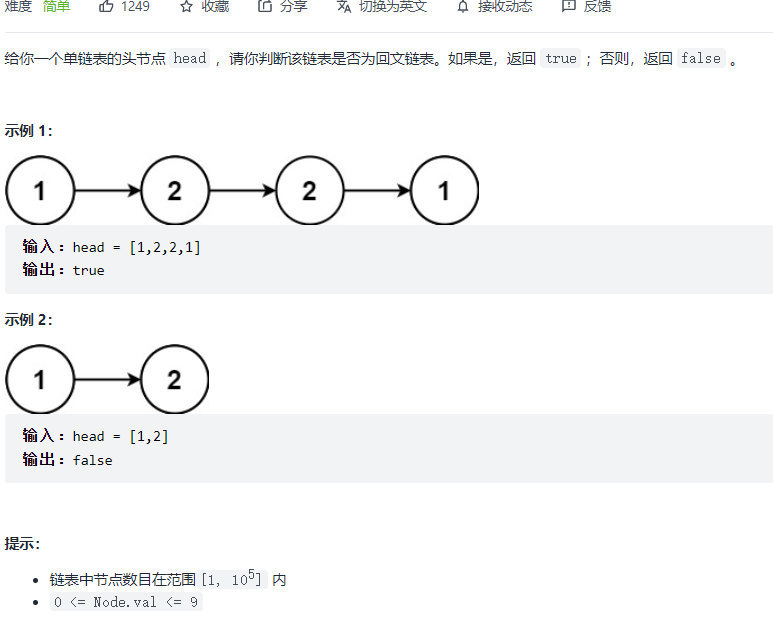

#### [20. 有效的括号](https://leetcode-cn.com/problems/valid-parentheses/)


```python
class Solution:
    def isValid(self, s: str) -> bool:
        dic = {
            ')': '(',
            ']': '[', 
            '}': '{'
        }
        stack = []
        for c in s:
            if c in dic:
                if stack and dic[c] == stack[-1]:
                    stack.pop()
                else:
                    return False
            else:
                stack.append(c)
        return len(stack) == 0
```

#### [21. 合并两个有序链表](https://leetcode-cn.com/problems/merge-two-sorted-lists/)


```python
class Solution:
    def mergeTwoLists(self, list1: Optional[ListNode], list2: Optional[ListNode]) -> Optional[ListNode]:
        dummy = ListNode()
        p = dummy
        while list1 and list2:
            if list1.val < list2.val:
                p.next = list1
                list1 = list1.next
            else:
                p.next = list2
                list2 = list2.next
            p = p.next
        if list1:
            p.next = list1
        if list2:
            p.next = list2
        return dummy.next
```

#### [53. 最大子数组和](https://leetcode-cn.com/problems/maximum-subarray/)


```python
class Solution:
    def maxSubArray(self, nums: List[int]) -> int:
        res = nums[0]
        dp = [0] * len(nums)
        dp[0] = nums[0]
        for i in range(1, len(nums)):
            dp[i] = max(dp[i-1] + nums[i], nums[i])
            res = max(res, dp[i])
        return res
```

#### [70. 爬楼梯](https://leetcode-cn.com/problems/climbing-stairs/)


```python
class Solution:
    def climbStairs(self, n: int) -> int:
        if n == 1: return 1
        dp = [0] * (n + 1)
        dp[1] = 1
        dp[2] = 2
        for i in range(3, n + 1):
            dp[i] = dp[i-1] + dp[i-2]
        return dp[-1]
```

#### [94. 二叉树的中序遍历](https://leetcode-cn.com/problems/binary-tree-inorder-traversal/)


```python
# class TreeNode:
#     def __init__(self, val=0, left=None, right=None):
#         self.val = val
#         self.left = left
#         self.right = right
class Solution:
    def inorderTraversal(self, root: Optional[TreeNode]) -> List[int]:
        self.res = []
        def helper(root):
            if not root:
                return None
            helper(root.left)
            self.res.append(root.val)
            helper(root.right)
        helper(root)
        return self.res
```

```python
class Solution:
    def inorderTraversal(self, root: Optional[TreeNode]) -> List[int]:
        if not root: return []
        res = []
        stack = [root]
        while stack:
            node = stack.pop()
            if node:
                if node.right: stack.append(node.right)
                stack.append(node)
                stack.append(None)
                if node.left: stack.append(node.left)
            else:
                node = stack.pop()
                res.append(node.val)
        return res
```

#### [101. 对称二叉树](https://leetcode-cn.com/problems/symmetric-tree/)


```python
class Solution:
    def isSymmetric(self, root: TreeNode) -> bool:
        def helper(p, q):
            if not p and not q: return True
            if not p and q: return False
            if p and not q: return False
            if p.val != q.val: return False
            return helper(p.left, q.right) and helper(p.right, q.left)
        
        if not root: return True
        return helper(root.left, root.right)
```

#### [104. 二叉树的最大深度](https://leetcode-cn.com/problems/maximum-depth-of-binary-tree/)


```python
class Solution:
    def maxDepth(self, root: TreeNode) -> int:
        def helper(root):
            if not root: return 0
            left = helper(root.left)
            right = helper(root.right)
            return max(left, right) + 1
        return helper(root)
```

#### [121. 买卖股票的最佳时机](https://leetcode-cn.com/problems/best-time-to-buy-and-sell-stock/)


```python
class Solution:
    def maxProfit(self, prices: List[int]) -> int:
        dp = [[0] * 2 for _ in range(len(prices))]
        dp[0][0] = -prices[0]
        for i in range(1, len(prices)):
            dp[i][0] = max(dp[i-1][0], -prices[i])
            dp[i][1] = max(dp[i-1][1], dp[i-1][0] + prices[i])
        return dp[-1][-1]
```

#### [136. 只出现一次的数字](https://leetcode-cn.com/problems/single-number/)


```python
class Solution:
    def singleNumber(self, nums: List[int]) -> int:
        res = 0
        for i in nums:
            res ^= i
        return res
```

#### [141. 环形链表](https://leetcode-cn.com/problems/linked-list-cycle/)


```python
class Solution:
    def hasCycle(self, head: Optional[ListNode]) -> bool:
        fast, slow = head, head
        while fast and fast.next:
            fast = fast.next.next
            slow = slow.next
            if fast == slow: return True
        return False
```

#### [155. 最小栈](https://leetcode-cn.com/problems/min-stack/)


```python
class MinStack:
    def __init__(self):
        self.a = []
        self.b = []

    def push(self, val: int) -> None:
        self.a.append(val)
        if not self.b or self.b[-1] >= val:
            self.b.append(val)

    def pop(self) -> None:
        val = self.a.pop()
        if self.b[-1] == val:
            self.b.pop()

    def top(self) -> int:
        return self.a[-1]

    def getMin(self) -> int:
        return self.b[-1]
```

#### [160. 相交链表](https://leetcode-cn.com/problems/intersection-of-two-linked-lists/)


```python
class Solution:
    def getIntersectionNode(self, headA: ListNode, headB: ListNode) -> ListNode:
        a, b = headA, headB
        while a != b:
            a = a.next if a else headB
            b = b.next if b else headA
        return a
```

#### [169. 多数元素](https://leetcode-cn.com/problems/majority-element/)


```python
class Solution:
    def majorityElement(self, nums: List[int]) -> int:
        cnt = 1
        candidate = nums[0]
        for i in range(1, len(nums)):
            if nums[i] == candidate:
                cnt += 1
            else:
                cnt -= 1
                if cnt == 0:
                    cnt = 1
                    candidate = nums[i]
        return candidate
```

#### [206. 反转链表](https://leetcode-cn.com/problems/reverse-linked-list/)


```python
class Solution:
    def reverseList(self, head: ListNode) -> ListNode:
        pre, cur = None, head
        while cur is not None:
            nxt = cur.next
            cur.next = pre
            pre = cur
            cur = nxt
        return pre
```

```python
class Solution:
    def reverseList(self, head: ListNode) -> ListNode:
        def helper(head):
            if not head: return None
            if not head.next: return head
            node = helper(head.next)
            head.next.next = head
            head.next = None
            return node
        return helper(head)
```

#### [226. 翻转二叉树](https://leetcode-cn.com/problems/invert-binary-tree/)


```python
class Solution:
    def invertTree(self, root: TreeNode) -> TreeNode:
        def helper(root):
            if not root: return None
            left = helper(root.left)
            right = helper(root.right)
            root.left, root.right = right, left
            return root
        return helper(root)
```

#### [234. 回文链表](https://leetcode-cn.com/problems/palindrome-linked-list/)



```python
class Solution:
    def isPalindrome(self, head: ListNode) -> bool:
        def reverse(head):
            pre, cur = None, head
            while cur:
                nxt = cur.next
                cur.next = pre
                pre = cur
                cur = nxt
            return pre
        
        dummy = ListNode()
        dummy.next = head
        fast, slow = dummy, dummy
        while fast and fast.next:
            fast = fast.next.next
            slow = slow.next
        left_tail = slow
        right_head = slow.next
        slow.next = None

        l2 = reverse(right_head)
        l1 = head
        while l1 and l2:
            if l1.val == l2.val:
                l1 = l1.next
                l2 = l2.next
            else:
                return False
        return True
```

#### [283. 移动零](https://leetcode-cn.com/problems/move-zeroes/)


```python
class Solution:
    def moveZeroes(self, nums: List[int]) -> None:
        """
        Do not return anything, modify nums in-place instead.
        """
        cur = 0
        for i in range(len(nums)):
            if nums[i] != 0:
                nums[cur] = nums[i]
                cur += 1
        for i in range(cur, len(nums)):
            nums[i] = 0
```

#### [338. 比特位计数](https://leetcode-cn.com/problems/counting-bits/)


```python
class Solution:
    def countBits(self, n: int) -> List[int]:
        def bit(i):
            cnt = 0
            while i > 0:
                cnt += i & 1
                i >>= 1
            return cnt
        ans = []
        for i in range(n + 1):
            ans.append(bit(i))
        return ans
```

#### [448. 找到所有数组中消失的数字:star::star::star:](https://leetcode-cn.com/problems/find-all-numbers-disappeared-in-an-array/)


```python
class Solution:
    def findDisappearedNumbers(self, nums: List[int]) -> List[int]:
        n = len(nums)
        for num in nums:
            x = (num - 1) % n
            nums[x] += n
        return [i + 1 for i, num in enumerate(nums) if num <= n]
```

#### [461. 汉明距离](https://leetcode-cn.com/problems/hamming-distance/)


```python
class Solution:
    def hammingDistance(self, x: int, y: int) -> int:
        z = x ^ y
        cnt = 0
        while z > 0:
            cnt += z & 1
            z >>= 1
        return cnt
```

#### [543. 二叉树的直径](https://leetcode-cn.com/problems/diameter-of-binary-tree/)


```python
class Solution:
    def diameterOfBinaryTree(self, root: TreeNode) -> int:
        self.d = 0
        def helper(root):
            if not root: return 0
            left = helper(root.left)
            right = helper(root.right)
            self.d = max(self.d, left + right + 1)
            return max(left, right) + 1
        helper(root)
        return self.d - 1 # 边的数目 = 点的数目 -1
```

#### [617. 合并二叉树](https://leetcode-cn.com/problems/merge-two-binary-trees/)


```python
class Solution:
    def mergeTrees(self, root1: TreeNode, root2: TreeNode) -> TreeNode:
        def helper(p, q):
            if not p and not q: return None
            if not p and q: return q
            if p and not q: return p
            node = TreeNode(p.val + q.val)
            node.left = helper(p.left, q.left)
            node.right = helper(p.right, q.right)
            return node
        return helper(root1, root2)
```

#### [2. 两数相加](https://leetcode-cn.com/problems/add-two-numbers/)


```python
# Definition for singly-linked list.
# class ListNode:
#     def __init__(self, val=0, next=None):
#         self.val = val
#         self.next = next
class Solution:
    def addTwoNumbers(self, l1: ListNode, l2: ListNode) -> ListNode:
        def list2int(head):
            res = 0
            i = 1
            while head:
                res += head.val * i
                i *= 10
                head = head.next
            return res
        
        def int2list(n):
            if n == 0: return ListNode(0)
            dummy = ListNode()
            p = dummy
            while n:
                v = n % 10
                n //= 10
                node = ListNode(v)
                p.next = node
                p = p.next
            return dummy.next

        a = list2int(l1)
        b = list2int(l2)
        res = a + b
        return int2list(res)
```

#### [3. 无重复字符的最长子串](https://leetcode-cn.com/problems/longest-substring-without-repeating-characters/)


```python
class Solution:
    def lengthOfLongestSubstring(self, s: str) -> int:
        res = 0
        left = 0
        window = {}
        for right in range(len(s)):
            if s[right] not in window:
                window[s[right]] = 1
            else:
                window[s[right]] += 1
                while window[s[right]] > 1:
                    window[s[left]] -= 1
                    if window[s[left]] == 0:
                        window.pop(s[left])
                    left += 1
            res = max(res, right - left + 1)
        return res
```

####

#### [4. 寻找两个正序数组的中位数:star::star::star::star:](https://leetcode-cn.com/problems/median-of-two-sorted-arrays/)


[从一般到特殊的方法，代码精简，边界清晰。 - 寻找两个正序数组的中位数 - 力扣（LeetCode） (leetcode-cn.com)](https://leetcode-cn.com/problems/median-of-two-sorted-arrays/solution/cong-yi-ban-dao-te-shu-de-fang-fa-dai-ma-jing-jian/)

```python
class Solution:
    def findMedianSortedArrays(self, nums1: List[int], nums2: List[int]) -> float:
        # 本质是找第k小的数，k从1开始
        k1 = (len(nums1) + len(nums2) + 1) // 2
        k2 = (len(nums1) + len(nums2) + 2) // 2
        # 如果和是偶数，k1指向中间左侧的数，k2指向中间右侧的数
        # 如果和是奇数，k1 k2都指向中间
        def helper(nums1, nums2, k):
            # k是两个数组合并后的第k小的数
            # t是一刀切，找到两个数组分别的第k//2小的位置
            if len(nums1) < len(nums2):
                nums1, nums2 = nums2, nums1
            if len(nums2) == 0:
                return nums1[k-1]
            if k == 1:
                return min(nums1[0], nums2[0])
            t = min(len(nums2), k // 2)
            if nums1[t-1] >= nums2[t-1]:
                return helper(nums1, nums2[t:], k-t)
            else:
                return helper(nums1[t:], nums2, k-t)
        if k1 == k2:
            return helper(nums1, nums2, k1)
        else:
            return (helper(nums1, nums2, k1) + helper(nums1, nums2, k2)) / 2
```

#### [5. 最长回文子串](https://leetcode-cn.com/problems/longest-palindromic-substring/)


```python
class Solution:
    def longestPalindrome(self, s: str) -> str:
        if len(s) == 1: return s
        begin = 0
        max_len = 1
        dp = [[False] * len(s) for _ in range(len(s))]
        for i in range(len(s)):
            dp[i][i] = True
        for i in range(len(s) - 1, -1, -1):
            for j in range(i + 1, len(s)):
                if s[i] == s[j]:
                    if j - i == 1:
                        dp[i][j] = True
                    else:
                        dp[i][j] = dp[i+1][j-1]
                else:
                    dp[i][j] = False
                if dp[i][j] == True and (j - i + 1 > max_len):
                    max_len = j - i + 1
                    begin = i
        return s[begin: begin + max_len]
```

#### [11. 盛最多水的容器:star::star::star:](https://leetcode-cn.com/problems/container-with-most-water/)


```python
class Solution:
    def maxArea(self, height: List[int]) -> int:
        res = 0
        left, right = 0, len(height) - 1
        while left < right:
            res = max(res, min(height[left], height[right]) * (right - left))
            if height[left] < height[right]:
                left += 1
            else:
                right -= 1
        return res

```

#### [15. 三数之和](https://leetcode-cn.com/problems/3sum/)


```python
class Solution:
    def threeSum(self, nums: List[int]) -> List[List[int]]:
        if len(nums) < 3: return []
        res = []
        nums.sort()

        # [-1, -1, 0, 1, 1]
        for i in range(len(nums)):
            if i > 0 and nums[i] == nums[i-1]: continue
            if nums[i] > 0: break

            j, k = i + 1, len(nums) - 1
            
            while j < k:
                
                s = nums[i] + nums[j] + nums[k]
                if s == 0:
                    res.append([nums[i], nums[j], nums[k]])
                    while j < k and nums[j] == nums[j + 1]: j += 1
                    while j < k and nums[k] == nums[k - 1]: k -= 1
                    j += 1
                    k -= 1
                elif s < 0:
                    j += 1
                else:
                    k -= 1
        return res
```

#### [17. 电话号码的字母组合](https://leetcode-cn.com/problems/letter-combinations-of-a-phone-number/)


```python
class Solution:
    def letterCombinations(self, digits: str) -> List[str]:
        dic = {
            '2': ['a', 'b', 'c'],
            '3': ['d', 'e', 'f'],
            '4': ['g', 'h', 'i'],
            '5': ['j', 'k', 'l'],
            '6': ['m', 'n', 'o'],
            '7': ['p', 'q', 'r', 's'],
            '8': ['t', 'u', 'v'],
            '9': ['w', 'x', 'y', 'z']
        }
        if len(digits) == 0: return []
        res = []
        path = []
        def dfs(path, cur_idx):
            if len(path) == len(digits):
                res.append(''.join(path))
                return
            for a in dic[digits[cur_idx]]:
                dfs(path + [a], cur_idx + 1)
        dfs(path, 0)
        return res
```

#### [19. 删除链表的倒数第 N 个结点](https://leetcode-cn.com/problems/remove-nth-node-from-end-of-list/)


```python
class Solution:
    def removeNthFromEnd(self, head: ListNode, n: int) -> ListNode:
        dummy = ListNode()
        dummy.next = head
        fast, slow = dummy, dummy
        for _ in range(n):
            fast = fast.next
        while fast.next:
            fast = fast.next
            slow = slow.next
        slow.next = slow.next.next
        return dummy.next
```

#### [22. 括号生成](https://leetcode-cn.com/problems/generate-parentheses/)


```python
class Solution:
    def generateParenthesis(self, n: int) -> List[str]:
        res = []
        path = []
        left, right = n, n
        def backtrack(path, left, right):
            if left == right and left == 0:
                res.append(''.join(path))
                return
            
            if left > 0:
                backtrack(path + ['('], left - 1, right)
            if right > left:        
                backtrack(path + [')'], left, right - 1)
        backtrack(path, left, right)
        return res
```

#### [31. 下一个排列:star::star::star::star:](https://leetcode-cn.com/problems/next-permutation/)

[下一个排列 - 下一个排列 - 力扣（LeetCode） (leetcode-cn.com)](https://leetcode-cn.com/problems/next-permutation/solution/xia-yi-ge-pai-lie-by-powcai/)


```python
class Solution:
    def nextPermutation(self, nums: List[int]) -> None:
        """
        Do not return anything, modify nums in-place instead.
        """
        def reverse(nums, i, j):
            while i < j:
                nums[i], nums[j] = nums[j], nums[i]
                i += 1
                j -= 1

        n = len(nums)
        first_idx = -1
        for i in range(n - 2, -1, -1):
            if nums[i] < nums[i + 1]:  # 如果要求上一个排列，这里改成>
                first_idx = i
                break
        if first_idx == -1:
            reverse(nums, 0, n - 1)
            return
        second_idx = -1
        for i in range(n-1, -1, -1):
            if nums[i] > nums[first_idx]:   # 如果要求上一个排列，这里改成<
                second_idx = i
                break
        nums[first_idx], nums[second_idx] = nums[second_idx], nums[first_idx]
        reverse(nums, first_idx + 1, n -1)
```


#### [33. 搜索旋转排序数组](https://leetcode-cn.com/problems/search-in-rotated-sorted-array/)


```python
class Solution:
    def search(self, nums: List[int], target: int) -> int:
        # 将数组一分为二，其中一定有一个是有序的，另一个可能是有序，也能是部分有序。此时有序部分用二分法查找。无序部分再一分为二，其中一个一定有序，另一个可能有序，可能无序。就这样循环.
        left, right = 0, len(nums) - 1
        while left <= right: 
            mid = left + (right - left) // 2
            if nums[mid] == target: return mid
            if nums[mid] < nums[-1]:
                if nums[mid] < target <= nums[-1]:
                    left = mid + 1
                else:
                    right = mid - 1
            else:
                if nums[left] <= target < nums[mid]:
                    right = mid - 1
                else:
                    left = mid + 1
                    
        return -1 
```

#### [34. 在排序数组中查找元素的第一个和最后一个位置:star:](https://leetcode-cn.com/problems/find-first-and-last-position-of-element-in-sorted-array/)


```python
class Solution:
    def searchRange(self, nums: List[int], target: int) -> List[int]:
        """
        口诀
        求左边界：向下取整，等号归右，左加一
        求右边界：向上取整，等号归左，右减一
        总是右侧为所求
        """
        if not nums: return [-1, -1]
        left, right = 0, len(nums) - 1  # 右边界
        while left < right:
            mid = left + (right - left) // 2  # 向下取整
            if nums[mid] == target:
                right = mid  # 等号归右
            elif nums[mid] < target:
                left = mid + 1  # 左加一
            else:
                right = mid
        if nums[right] != target: return [-1, -1]
        begin = right  # 右侧为所求
        left, right = 0, len(nums) - 1  # 右边界
        while left < right:
            mid = left + (right - left + 1) // 2  # 向上取整
            if nums[mid] == target:
                left = mid
            elif nums[mid] < target:
                left = mid
            else:
                right = mid - 1
        end = right  # 右侧为所求
        return [begin, end]
```

#### [39. 组合总和](https://leetcode-cn.com/problems/combination-sum/)


```python
class Solution:
    def combinationSum(self, candidates: List[int], target: int) -> List[List[int]]:
        res = []
        path = []

        def backtrack(path, cur, target):
            if target == 0:
                res.append(path[:])
                return
            if target < 0:
                return
            for i in range(cur, len(candidates)):
                backtrack(path + [candidates[i]], i, target - candidates[i])
        backtrack(path, 0, target)
        return res
```

#### [46. 全排列](https://leetcode-cn.com/problems/permutations/)


```python
class Solution:
    def permute(self, nums: List[int]) -> List[List[int]]:
        res = []
        path = []
        visited = [0] * (len(nums))
        def dfs(path):
            if len(path) == len(nums):
                res.append(path[:])
                return
            for i in range(len(nums)):
                if visited[i] == 0:
                    visited[i] = 1
                    dfs(path + [nums[i]])
                    visited[i] = 0
        dfs(path)
        return res
```

#### [48. 旋转图像:star:](https://leetcode-cn.com/problems/rotate-image/)


```python
class Solution:
    def rotate(self, matrix: List[List[int]]) -> None:
        """
        Do not return anything, modify matrix in-place instead.
        """
        n = len(matrix)
        # 先沿对角线翻折
        for i in range(n):
            for j in range(i):
                matrix[i][j], matrix[j][i] = matrix[j][i], matrix[i][j]
        
        # 沿垂直中线翻折
        for i in range(n):
            j, k = 0, n - 1
            while j < k:
                matrix[i][j], matrix[i][k] = matrix[i][k], matrix[i][j]
                j += 1
                k -= 1
```

#### [49. 字母异位词分组:star:](https://leetcode-cn.com/problems/group-anagrams/)


```python
class Solution:
    def groupAnagrams(self, strs: List[str]) -> List[List[str]]:
        dic = {}
        for s in strs:
            chars = [0] * 26
            for c in s:
                chars[ord(c) - ord('a')] += 1
            k = tuple(chars)
            if k not in dic:
                dic[k] = [s]
            else:
                dic[k].append(s)
        return list(dic.values())
```

#### [55. 跳跃游戏:star:](https://leetcode-cn.com/problems/jump-game/)


```python
# 贪心法。  dfs会超时
class Solution:
    def canJump(self, nums) :
        max_i = 0       #初始化当前能到达最远的位置
        for i, jump in enumerate(nums):   #i为当前位置，jump是当前位置的跳数
            if max_i>=i and i+jump>max_i:  #如果当前位置能到达，并且当前位置+跳数>最远位置  
                max_i = i+jump  #更新最远能到达位置
        return max_i>=i
```

#### [56. 合并区间](https://leetcode-cn.com/problems/merge-intervals/)


```python
# [[1,3],[2,6],[8,10],[15,18]]
# [[1,4],[2,3]]
class Solution:
    def merge(self, intervals: List[List[int]]) -> List[List[int]]:
        intervals.sort(key=lambda x: x[0])
        res = [intervals[0]]
        for i in range(1, len(intervals)):
            if intervals[i][0] <= res[-1][1]:
                pre = res.pop()
                res.append([pre[0], max(pre[1], intervals[i][1])])
            else:
                res.append(intervals[i])
        return res
```

#### [62. 不同路径](https://leetcode-cn.com/problems/unique-paths/)


```python
class Solution:
    def uniquePaths(self, m: int, n: int) -> int:
        dp = [[0] * n for _ in range(m)]
        for j in range(n):
            dp[0][j] = 1
        for i in range(m):
            dp[i][0] = 1
        for i in range(1, m):
            for j in range(1, n):
                dp[i][j] = dp[i-1][j] + dp[i][j-1]
        return dp[-1][-1]
```

#### [64. 最小路径和](https://leetcode-cn.com/problems/minimum-path-sum/)


```python
class Solution:
    def minPathSum(self, grid: List[List[int]]) -> int:
        m, n = len(grid), len(grid[0])
        dp = [[0] * (n) for _ in range(m)]
        s = 0
        for j in range(n):
            s += grid[0][j]
            dp[0][j] = s
        s = 0
        for i in range(m):
            s += grid[i][0]
            dp[i][0] = s
        for i in range(1, m):
            for j in range(1, n):
                dp[i][j] = min(dp[i-1][j], dp[i][j-1]) + grid[i][j]
        return dp[-1][-1]
```

#### [75. 颜色分类](https://leetcode-cn.com/problems/sort-colors/)


```python
class Solution:
    def sortColors(self, nums: List[int]) -> None:
        """
        Do not return anything, modify nums in-place instead.
        """
        cnt = [0] * 3
        for c in nums:
            cnt[c] += 1
        c, n = 0, cnt[0]
        for i in range(len(nums)):
            while n == 0:
                c += 1
                n = cnt[c]
            nums[i] = c
            n -= 1
```

#### [78. 子集](https://leetcode-cn.com/problems/subsets/)


```python
class Solution:
    def subsets(self, nums: List[int]) -> List[List[int]]:
        res = []
        path = []

        def dfs(path, cur):
            res.append(path[:])
            for i in range(cur, len(nums)):
                dfs(path + [nums[i]], i + 1)
        dfs(path, 0)
        return res
```

#### [79. 单词搜索:star:](https://leetcode-cn.com/problems/word-search/)


```python
class Solution:
    def exist(self, board: List[List[str]], word: str) -> bool:
        m, n = len(board), len(board[0])
        visited = [[False] * n for _ in range(m)]
        path = ""
        def dfs(i, j, path, idx):
            if path == word:
                return True
            visited[i][j] = True
            for x, y in ((i, j+1), (i, j-1), (i-1, j), (i+1, j)):
                if x < 0 or x >= m or y < 0 or y >= n:
                    continue
                if visited[x][y]:
                    continue
                if board[x][y] == word[idx + 1]:
                    if dfs(x, y, path + board[x][y], idx+1):
                        return True
            visited[i][j] = False
            return False
        for i in range(m):
            for j in range(n):
                if board[i][j] == word[0]:
                    if dfs(i, j, path + board[i][j], 0):
                        return True
        return False
```

#### [96. 不同的二叉搜索树:star:](https://leetcode-cn.com/problems/unique-binary-search-trees/)


```python
class Solution:
    def numTrees(self, n: int) -> int:
        dp = [0] * (n + 1)
        dp[0] = 1
        dp[1] = 1
        for i in range(2, n + 1):
            for j in range(i):
                dp[i] += dp[j] * dp[i - j - 1]
        return dp[n]
```

#### [98. 验证二叉搜索树](https://leetcode-cn.com/problems/validate-binary-search-tree/)


```python
class Solution:
    def isValidBST(self, root: TreeNode) -> bool:
        self.cur_max = -float('inf')
        def helper(root):
            if not root:
                return True
            if not helper(root.left):
                return False
            if self.cur_max < root.val:
                self.cur_max = root.val
            else:
                return False
            if not helper(root.right):
                return False
            return True
        return helper(root)
```

#### [102. 二叉树的层序遍历](https://leetcode-cn.com/problems/binary-tree-level-order-traversal/)


```python
class Solution:
    def levelOrder(self, root: TreeNode) -> List[List[int]]:
        if not root: return []
        q = [root]
        res = []
        while q:
            tmp = []
            for _ in range(len(q)):
                node = q.pop(0)
                tmp.append(node.val)
                if node.left:
                    q.append(node.left)
                if node.right:
                    q.append(node.right)
            res.append(tmp)
        return res
```

#### [105. 从前序与中序遍历序列构造二叉树](https://leetcode-cn.com/problems/construct-binary-tree-from-preorder-and-inorder-traversal/)


```python
class Solution:
    def buildTree(self, preorder: List[int], inorder: List[int]) -> TreeNode:
        if not preorder:
            return None
        root_val = preorder[0]
        root = TreeNode(root_val)
        idx = inorder.index(root_val)
        left_inorder = inorder[:idx]
        right_inorder = inorder[idx+1:]
        left_preorder = preorder[1: 1 + len(left_inorder)]
        right_preorder = preorder[1 + len(left_inorder): ]
        root.left = self.buildTree(left_preorder, left_inorder)
        root.right = self.buildTree(right_preorder, right_inorder)
        return root
```

#### [114. 二叉树展开为链表:star::star::star:](https://leetcode-cn.com/problems/flatten-binary-tree-to-linked-list/)

