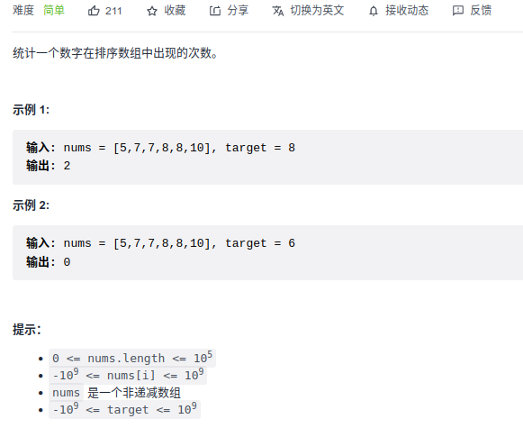

#### [74. 搜索二维矩阵](https://leetcode-cn.com/problems/search-a-2d-matrix/)

```python
class Solution:
    def searchMatrix(self, matrix: List[List[int]], target: int) -> bool:
        m, n = len(matrix), len(matrix[0])
        low, high = 0, m * n -1
        while low <= high:
            mid = low + (high - low) // 2
            x = mid % n
            y = mid // n
            num = matrix[y][x]
            if num == target:
                return True
            elif num < target:
                low = mid + 1
            else:
                high = mid - 1
        return False
```

#### [33. 搜索旋转排序数组](https://leetcode-cn.com/problems/search-in-rotated-sorted-array/)


```python
class Solution:
    def search(self, nums: List[int], target: int) -> int:
        left, right = 0, len(nums)-1
        while left <= right:
            mid = left + (right - left) // 2
            if nums[mid] == target:
                return mid
            
			# 要注意=的界限
            if nums[mid] >= nums[0]:
                if nums[0] <= target < nums[mid]:
                    right = mid - 1
                else:
                    left = mid + 1
            
            else:
                if nums[mid] < target <= nums[-1]:
                    left = mid + 1
                else:
                    right = mid -1
        return -1
```

#### [81. 搜索旋转排序数组 II](https://leetcode-cn.com/problems/search-in-rotated-sorted-array-ii/)


对于数组中有重复元素的情况，二分查找时可能会有 a[l]=a[mid]=a[r]，此时无法判断区间[l,mid] 和区间 [mid+1,r] 哪个是有序的。

例如 nums=[3,1,2,3,3,3,3] target=2，首次二分时无法判断区间 [0,3] 和区间 [4,6] 哪个是有序的。

对于这种情况，我们只能将当前二分区间的左边界加一，右边界减一，然后在新区间上继续二分查找。

```python
class Solution:
    def search(self, nums: List[int], target: int) -> bool:
        left, right = 0, len(nums) - 1
        while left <= right:
            mid = left + (right - left) // 2
            if nums[mid] == target:
                return True
            # 
            if nums[left] == nums[mid] and nums[mid] == nums[right]:
                left += 1
                right -= 1
                
            elif nums[mid] >= nums[left]:
                if nums[left] <= target < nums[mid]:
                    right = mid - 1
                else:
                    left = mid + 1
            else:
                if nums[mid] < target <= nums[right]:
                    left = mid + 1
                else:
                    right = mid - 1
        return False
```

#### [153. 寻找旋转排序数组中的最小值:star::star::star:](https://leetcode-cn.com/problems/find-minimum-in-rotated-sorted-array/)


[二分查找：为什么左右不对称？只比较mid与right的原因（C++, Java, Python3）](https://leetcode-cn.com/problems/find-minimum-in-rotated-sorted-array/solution/er-fen-cha-zhao-wei-shi-yao-zuo-you-bu-dui-cheng-z/)

```python
class Solution:
    def findMin(self, nums: List[int]) -> int:
        left, right = 0, len(nums) - 1
        res = len(nums)

        while left < right:
            mid = left + (right - left) // 2
            if nums[mid] < nums[right]:
                right = mid
            else:
                left = mid + 1
        return nums[left]
```

#### [154. 寻找旋转排序数组中的最小值 II:star::star::star::star:](https://leetcode-cn.com/problems/find-minimum-in-rotated-sorted-array-ii/)


```python
class Solution:
    def findMin(self, nums: List[int]) -> int:
        left, right = 0, len(nums)-1
        while left < right:
            mid = left + (right - left) // 2
            if nums[mid] < nums[right]:
                right = mid
            elif nums[mid] > nums[right]:
                left = mid + 1
            else:
                right -= 1
        return nums[left]
```

#### [162. 寻找峰值](https://leetcode-cn.com/problems/find-peak-element/)


```python
class Solution:
    def findPeakElement(self, nums: List[int]) -> int:
        left, right = 0, len(nums)-1
        while left < right:
            mid = left + (right - left) // 2
            if mid == 0:
                if nums[mid] > nums[mid + 1]:
                    return mid
                else:
                    left = mid + 1
            elif mid == len(nums) - 1:
                if nums[mid] > nums[mid - 1]:
                    return mid
                else:
                    right = mid
            else:
                if nums[mid-1] < nums[mid] and nums[mid] > nums[mid+1]:
                    return mid
                elif nums[mid] <= nums[mid-1]:
                    right = mid
                else:
                    left = mid + 1
        return left
```

#### [220. 存在重复元素 III:star::star::star:](https://leetcode-cn.com/problems/contains-duplicate-iii/)


```python

from sortedcontainers import SortedList

class Solution:
    def containsNearbyAlmostDuplicate(self, nums: List[int], k: int, t: int) -> bool:
        if len(nums) <= 1: return False

        window = SortedList()
        for i in range(len(nums)):
            window.add(nums[i])

            if len(window) > k + 1:
                window.remove(nums[i-k-1])
            
            idx = bisect.bisect_left(window, nums[i])
            if idx > 0 and abs(window[idx-1] - window[idx]) <= t: return True
            if idx < len(window)-1 and abs(window[idx+1] - window[idx]) <= t: return True
        
        return False

```

#### [274. H 指数:star::star::star:](https://leetcode-cn.com/problems/h-index/)


```python
class Solution:
    def hIndex(self, citations: List[int]) -> int:
        # 将论文的数量作为解空间进行二分
        # H指数指的是论文的篇数， 【1 3 5 7 10 13】， 引用大于等于4的论文数有4篇，因此h是4
        left, right = 0, len(citations)
        while left < right:
            mid = (left + right + 1) // 2

            cnt = 0
            for i in citations:
                if i >= mid: cnt += 1

            if mid <= cnt:
                left = mid
            else:
                right = mid - 1

        return left
```

#### [278. 第一个错误的版本](https://leetcode-cn.com/problems/first-bad-version/)


```python
# The isBadVersion API is already defined for you.
# @param version, an integer
# @return an integer
# def isBadVersion(version):

class Solution:
    def firstBadVersion(self, n):
        """
        :type n: int
        :rtype: int
        """
        # [1 2 3 4 5]
        start = 1
        end = n
        while start < end:
            mid = start + (end - start) // 2
            if isBadVersion(mid):
                end = mid
            else:
                start = mid + 1
        return start
```

#### [611. 有效三角形的个数:star::star::star:](https://leetcode-cn.com/problems/valid-triangle-number/)


```python
class Solution:
    def triangleNumber(self, nums: List[int]) -> int:
        nums.sort()
        res = 0
        # 枚举最大数下标，双指针找剩下两个较小的下标
        for i in range(len(nums)-1, 1, -1):
            left, right = 0, i - 1
            while left < right:
                if nums[left] + nums[right] > nums[i]:
                    res += right - left
                    right -= 1
                else:
                    left += 1

        return res
```

#### [852. 山脉数组的峰顶索引](https://leetcode-cn.com/problems/peak-index-in-a-mountain-array/)


```python
class Solution:
    def peakIndexInMountainArray(self, arr: List[int]) -> int:
        left, right = 0, len(arr)-1
        while left < right:
            mid = left + (right - left) // 2
            if arr[mid] > arr[mid-1] and arr[mid] > arr[mid + 1]:
                return mid
            elif arr[mid] < arr[mid+1]:
                left = mid + 1
            else:
                right = mid
        return left
```

#### [1011. 在 D 天内送达包裹的能力:star::star:](https://leetcode-cn.com/problems/capacity-to-ship-packages-within-d-days/)


```python
class Solution:
    def shipWithinDays(self, weights: List[int], days: int) -> int:
        left = max(weights)
        right = sum(weights)
        while left < right:
            cur = left + (right - left) // 2
            day = self.check(weights, cur)

            if day <= days:
                right = cur
            else:
                left = cur + 1
        return left

    def check(self, weights, cur):
        day = 0
        sum = 0
        for w in weights:
            if sum + w <= cur:
                sum += w
            else:
                sum = w
                day += 1
        return day+1
```

#### [1208. 尽可能使字符串相等](https://leetcode-cn.com/problems/get-equal-substrings-within-budget/)


```python
class Solution:
    def equalSubstring(self, s: str, t: str, maxCost: int) -> int:
        costs = [abs(ord(s[i]) - ord(t[i])) for i in range(len(s))]
        
        n = len(s)
        left, right = 0, 0
        window = 0
        res = 0
        while right < n:
            window += costs[right]

            while window > maxCost:
                window -= costs[left]
                left += 1

            res = max(res, right - left + 1)
            right += 1
        return res
```

#### [1337. 矩阵中战斗力最弱的 K 行](https://leetcode-cn.com/problems/the-k-weakest-rows-in-a-matrix/)


```python
class Solution:
    def kWeakestRows(self, mat: List[List[int]], k: int) -> List[int]:
        idx = []
        for i in range(len(mat)):
            if mat[i][-1] == 0:
                pos = self.find(mat[i], 0)
            else:
                pos = len(mat[i])        
            idx.append((pos, i))

        idx.sort(key=lambda x: x[0])
        return [idx[i][1] for i in range(k)]
        
    def find(self, nums, target):
        left, right = 0, len(nums)-1
        while left < right:
            mid = left + (right - left) // 2
            if nums[mid] == 0:
                right = mid
            else:
                left = mid + 1
        return left
```

#### [1818. 绝对差值和:star::star::star::star:](https://leetcode-cn.com/problems/minimum-absolute-sum-difference/)


```python
class Solution:
    def minAbsoluteSumDiff(self, nums1: List[int], nums2: List[int]) -> int:
        sort = sorted(nums1)
        res = float('inf')

        n = len(nums1)
        diff = sum([abs(nums1[i] - nums2[i]) for i in range(n)])
        if diff == 0:
            return 0

        for i in range(n):
            # 找到nums2[i]应该在sort中的所处的位置
            idx = bisect.bisect_left(sort, nums2[i])
			# 判断idx-1位置的数更接近 还是idx位置的数更接近nums2[i]
            if idx > 0:
                res = min(res, diff - abs(nums1[i]-nums2[i]) + abs(nums2[i] - sort[idx-1]))
            
            if idx < n:
                res = min(res, diff - abs(nums1[i]-nums2[i]) + abs(nums2[i] -sort[idx]))
        return res % (10 ** 9 + 7)
```

#### [1894. 找到需要补充粉笔的学生编号](https://leetcode-cn.com/problems/find-the-student-that-will-replace-the-chalk/)


```python
class Solution:
    def chalkReplacer(self, chalk: List[int], k: int) -> int:
        s = sum(chalk)
        m = k % s
        if m < chalk[0]: return 0
        
        pre_sum = [0]
        for i in range(len(chalk)):
            pre_sum.append(pre_sum[-1] + chalk[i])
        
        # [0 3 7 8 10]  5
        left, right = 1, len(pre_sum)-1
        while left < right:
            mid = left + (right - left) // 2
            if pre_sum[mid] == m:
                return mid
            
            elif pre_sum[mid] > m:
                right = mid
            else:
                left = mid + 1

        return left - 1

```

#### [剑指 Offer 53 - I. 在排序数组中查找数字 I](https://leetcode-cn.com/problems/zai-pai-xu-shu-zu-zhong-cha-zhao-shu-zi-lcof/)



```python
class Solution:
    def search(self, nums: List[int], target: int) -> int:
        if len(nums) == 0: return 0
        
        left, right = 0, len(nums)-1
        while left < right:
            mid = left + (right - left) // 2
            if nums[mid] >= target:
                right = mid
            else:
                left = mid + 1
        
        if nums[left] == target:
            begin = left
        else:
            return 0

        left, right = 0, len(nums) -1
        while left < right:
            mid = left + (right - left + 1) // 2
            if nums[mid] <= target:
                left = mid
            else:
                right = mid - 1
        end = right
        return end - begin + 1
```

