#### [102. 二叉树的层序遍历](https://leetcode-cn.com/problems/binary-tree-level-order-traversal/)

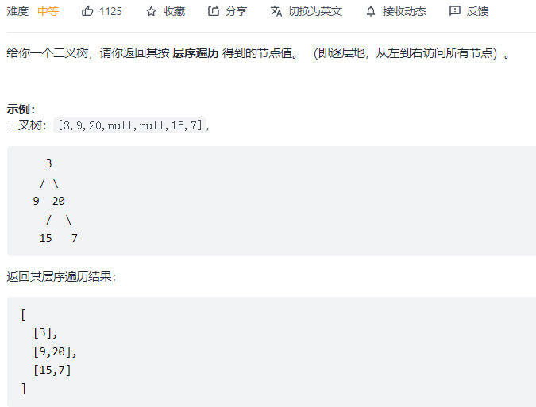

```python
class Solution:
    def levelOrder(self, root: TreeNode) -> List[List[int]]:
        if not root: return []
        res = []
        q = [root]
        while q:
            tmp = []
            for _ in range(len(q)):
                node = q.pop(0)
                if node:
                    tmp.append(node.val)
                    if node.left:
                        q.append(node.left)
                    if node.right:
                        q.append(node.right)
            res.append(tmp)
        return res
```

#### [103. 二叉树的锯齿形层序遍历](https://leetcode-cn.com/problems/binary-tree-zigzag-level-order-traversal/)

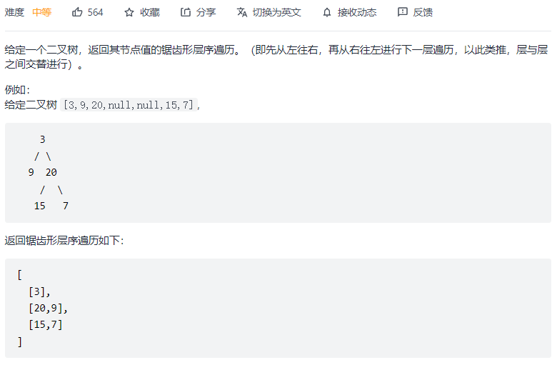

```python
import queue
class Solution:
    def zigzagLevelOrder(self, root: TreeNode) -> List[List[int]]:
        if not root: return []
        q = queue.deque()
        q.append(root)
        res = []
        step = 0
        while q:
            tmp = []
            for _ in range(len(q)):
                node = q.popleft()
                if node:
                    tmp.append(node.val)
                    if node.left:
                        q.append(node.left)
                    if node.right:
                        q.append(node.right)
            if step % 2 == 0:
                res.append(tmp)
            else:
                res.append(tmp[::-1])
            step += 1
        return res
```

#### [199. 二叉树的右视图](https://leetcode-cn.com/problems/binary-tree-right-side-view/)

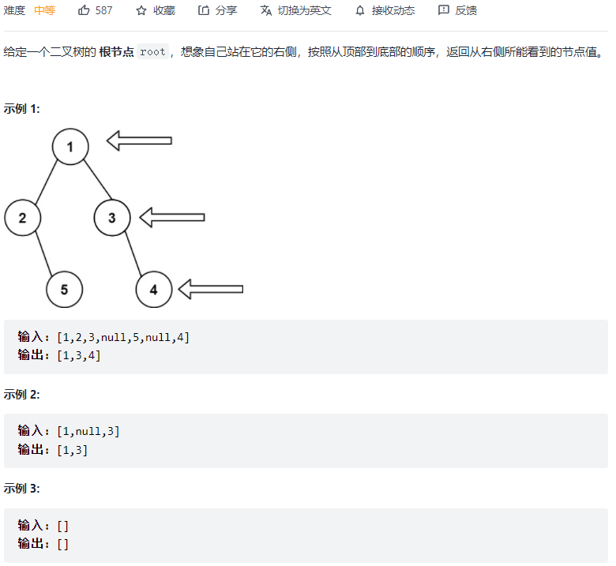

```python
import queue
class Solution:
    def rightSideView(self, root: TreeNode) -> List[int]:
        if not root: return []
        q = queue.deque()
        q.append(root)
        res = []
        while q:
            size = len(q)
            for _ in range(size):
                node = q.popleft()
                if node.left:
                    q.append(node.left)
                if node.right:
                    q.append(node.right)
            res.append(node.val)
        return res
```


#### [94. 二叉树的中序遍历](https://leetcode-cn.com/problems/binary-tree-inorder-traversal/)

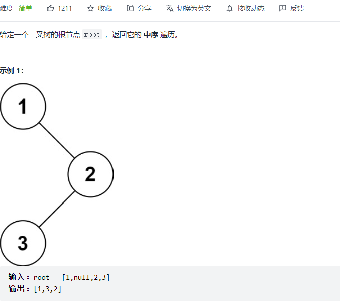

```python
class Solution:
    def inorderTraversal(self, root: Optional[TreeNode]) -> List[int]:
        res = []
        def helper(root):
            if not root:
                return
            helper(root.left)
            res.append(root.val)
            helper(root.right)
        
        helper(root)
        return res
```

```python
class Solution:
    def inorderTraversal(self, root: Optional[TreeNode]) -> List[int]:
        stack = []
        if root: stack.append(root)
        res = []
        while stack:
            node = stack.pop()
            if node:
                if node.right:
                    stack.append(node.right)
                stack.append(node)
                stack.append(None)
                if node.left:
                    stack.append(node.left)
            else:
                node = stack.pop()
                res.append(node.val)
        return res
```

#### [124. 二叉树中的最大路径和:star::star::star::star:](https://leetcode-cn.com/problems/binary-tree-maximum-path-sum/)

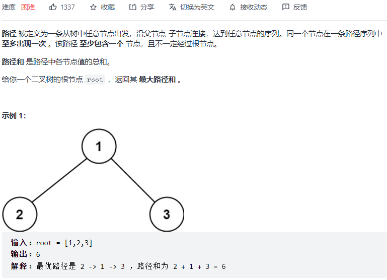

```python
class Solution:
    def maxPathSum(self, root: Optional[TreeNode]) -> int:
        self.res = -float('inf')
        def helper(root):
            if not root: return 0
            
            left = max(helper(root.left), 0)
            right = max(helper(root.right), 0)
            
            # 更新答案,此时认为当前root为根节点时，左右子树 为最大路径和
            self.res = max(self.res, left + right + root.val)

            # 而将当前节点作为路径中一个节点时，返回的结果中只能包含一个子树，要么左要么右
            return root.val + max(left, right)
        helper(root)
        return self.res
```


#### [226. 翻转二叉树](https://leetcode-cn.com/problems/invert-binary-tree/)


```python
# Definition for a binary tree node.
# class TreeNode:
#     def __init__(self, val=0, left=None, right=None):
#         self.val = val
#         self.left = left
#         self.right = right
class Solution:
    def invertTree(self, root: TreeNode) -> TreeNode:
        if root is None:
            return None
        
        root.left, root.right = root.right, root.left
        self.invertTree(root.left)
        self.invertTree(root.right)
        return root
        
class Solution:
    def invertTree(self, root: TreeNode) -> TreeNode:
        if root is None: return root
        stack = [root]
        while stack:
            node = stack.pop()
            if node:
                stack.append(node)
                stack.append(None)

                if node.left:
                    stack.append(node.left)
                if node.right:
                    stack.append(node.right)
            else:
                node = stack.pop()  # 遇到None，再弹出下一个，为当前子树的根节点
                node.left, node.right = node.right, node.left
        return root
```

#### [101. 对称二叉树](https://leetcode-cn.com/problems/symmetric-tree/)


```python
# Definition for a binary tree node.
# class TreeNode:
#     def __init__(self, val=0, left=None, right=None):
#         self.val = val
#         self.left = left
#         self.right = right
class Solution:
    def isSymmetric(self, root: TreeNode) -> bool:
        def compare(left, right):
            if left is None and right is None: return True
            elif left is None and right: return False
            elif left and right is None: return False
            elif left.val != right.val: return False

            return compare(left.left, right.right) and compare(left.right, right.left)
        
        if root is None: return True
        return compare(root.left, root.right)
```

#### [104. 二叉树的最大深度](https://leetcode-cn.com/problems/maximum-depth-of-binary-tree/)


```python
# Definition for a binary tree node.
# class TreeNode:
#     def __init__(self, val=0, left=None, right=None):
#         self.val = val
#         self.left = left
#         self.right = right
class Solution:
    def maxDepth(self, root: TreeNode) -> int:
        def helper(root):
            if root is None: return 0
            
            left_depth = helper(root.left)
            right_depth = helper(root.right)
            return max(left_depth, right_depth) + 1

        return helper(root)
```

#### [111. 二叉树的最小深度](https://leetcode-cn.com/problems/minimum-depth-of-binary-tree/)


```python
# 递归
class Solution:
    def minDepth(self, root: TreeNode) -> int:
        def helper(root):
            if not root:
                return 0
            if not root.left and not root.right:
                return 1
            if root.left and root.right:
                left = helper(root.left)
                right = helper(root.right)
                return min(left, right) + 1
            if root.left:
                return helper(root.left) + 1
            if root.right:
                return helper(root.right) + 1
        return helper(root)

# BFS
class Solution:
    def minDepth(self, root: TreeNode) -> int:
        # BFS
        if root is None: return 0
        queue = [root]
        depth = 1

        while queue:
            # 向四周扩散            
            for _ in range(len(queue)):
                node = queue.pop(0)

                # 判断是否到达终点
                if not node.left and not node.right:
                    return depth
                
                # 将node周围节点加入队列
                if node.left:
                    queue.append(node.left)
                if node.right:
                    queue.append(node.right)
            # 扩散完一次，说明深入了一层，depth应加1
            depth += 1
        return depth
```

#### [222. 完全二叉树的节点个数](https://leetcode-cn.com/problems/count-complete-tree-nodes/)


```python
# Definition for a binary tree node.
# class TreeNode:
#     def __init__(self, val=0, left=None, right=None):
#         self.val = val
#         self.left = left
#         self.right = right
class Solution:
    def countNodes(self, root: TreeNode) -> int:
        def helper(root):
            if root is None:
                return 0
            left = helper(root.left)
            right = helper(root.right)
            return left + right + 1
        
        return helper(root)
    
# BFS
class Solution:
    def countNodes(self, root: TreeNode) -> int:
        queue = [root]
        res = 0
        while queue:
            for _ in range(len(queue)):
                node = queue.pop(0)
                if node:
                    res += 1
                    if node.left:
                        queue.append(node.left)
                    if node.right:
                        queue.append(node.right)
        return res
```

#### [110. 平衡二叉树](https://leetcode-cn.com/problems/balanced-binary-tree/)

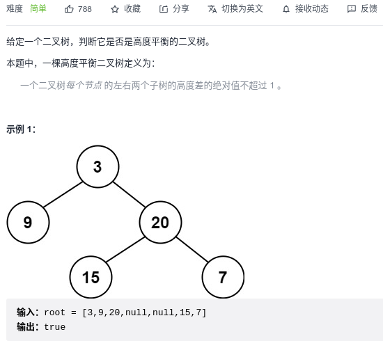

```python
# Definition for a binary tree node.
# class TreeNode:
#     def __init__(self, val=0, left=None, right=None):
#         self.val = val
#         self.left = left
#         self.right = right
class Solution:
    def isBalanced(self, root: TreeNode) -> bool:
        def heler(root):
            if root is None: return True, 0

            l_flag, left = heler(root.left)
            r_flag, right = heler(root.right)

            flag = l_flag and r_flag and abs(left - right) <= 1
            return flag, max(left, right) + 1
            
        return heler(root)[0]
```

#### [129. 求根节点到叶节点数字之和](https://leetcode-cn.com/problems/sum-root-to-leaf-numbers/)

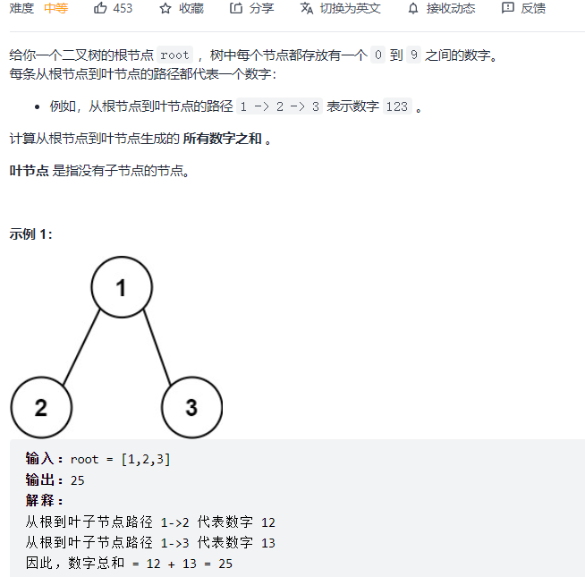

```
class Solution:
    def sumNumbers(self, root: TreeNode) -> int:
        self.res = 0
        path = []

        def list2int(lst):
            res = 0
            for n in lst:
                res = 10 * res + n
            return res

        def backtrack(root, path):
            if not root:
                return
            if not root.left and not root.right:
                path.append(root.val)
                self.res += list2int(path)
                path.pop()
                return
            path.append(root.val)
            backtrack(root.left, path)
            backtrack(root.right, path)
            path.pop()
        backtrack(root, path)
        return self.res
```

#### [257. 二叉树的所有路径](https://leetcode-cn.com/problems/binary-tree-paths/)

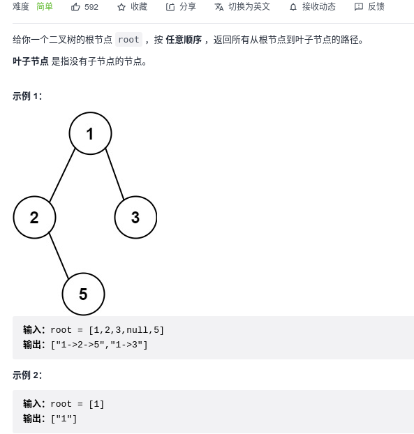

```python
# Definition for a binary tree node.
# class TreeNode:
#     def __init__(self, val=0, left=None, right=None):
#         self.val = val
#         self.left = left
#         self.right = right
class Solution:
    def binaryTreePaths(self, root: TreeNode) -> List[str]:
        res = []
        path = [str(root.val)]

        def backtrack(path, root):
            if root.left is None and root.right is None:
                res.append("->".join(path))
                return res
            
            if root.left:
                backtrack(path + [str(root.left.val)], root.left)
            
            if root.right:
                backtrack(path + [str(root.right.val)], root.right)
            
        backtrack(path, root)
        return res
```

#### [958. 二叉树的完全性检验](https://leetcode-cn.com/problems/check-completeness-of-a-binary-tree/)

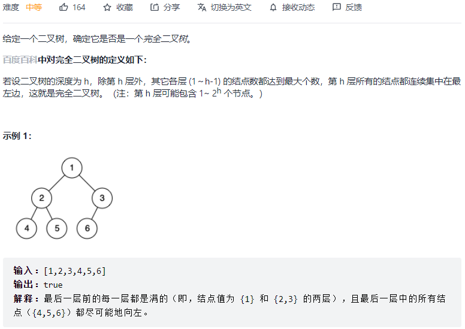

```python
class Solution:
    def isCompleteTree(self, root: TreeNode) -> bool:
        if not root: return True
        q = [root]
        flag = False
        while q:
            node = q.pop(0)
            if not node:
                flag = True
            else:
                if flag: return False
            
                q.append(node.left)
                q.append(node.right)
        return True
```

#### [剑指 Offer 54. 二叉搜索树的第k大节点](https://leetcode-cn.com/problems/er-cha-sou-suo-shu-de-di-kda-jie-dian-lcof/)

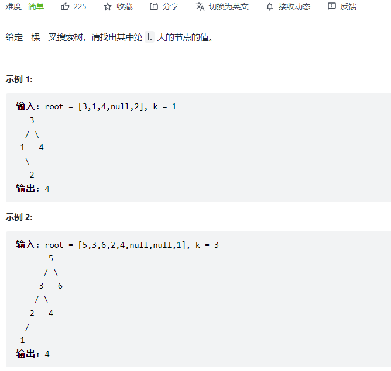

```python
class Solution:
    def kthLargest(self, root: TreeNode, k: int) -> int:
        self.res = -float('inf')
        self.k = k

        def helper(root):
            if not root: return
            
            helper(root.right)
            if self.k == 0:
                return
            self.k -= 1
            if self.k == 0:
                self.res = root.val
            
            helper(root.left)
        helper(root)
        return self.res
```

#### [662. 二叉树最大宽度](https://leetcode-cn.com/problems/maximum-width-of-binary-tree/)

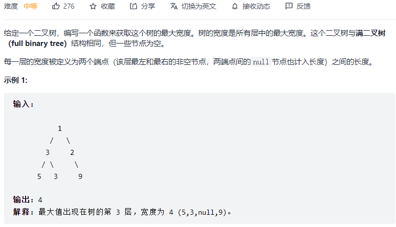

```python
class Solution:
    def widthOfBinaryTree(self, root: TreeNode) -> int:
        ans = 0
        # 初始化序列，其中一个存节点，一个存储索引位置
        q =[[root,0]]
        while q:
            #初始化该层最左边和右边不为空的节点索引
            length = len(q)
            left = float('inf')
            right = 0
            #开始进行层级遍历
            for i in range(length):
                node = q.pop(0)
                #如果节点不为空节点，更新下一个层级的节点，并更新最左侧索引和最右侧索引
                if node[0] != None:
                    q.append([node[0].left,node[1]*2])
                    q.append([node[0].right,node[1]*2+1])
                    left = min([left,node[1]])
                    right = max([right,node[1]])
            #判断该层级是否有效
            if left<=right:
                ans = max([ans,right-left+1])
        return int(ans)
```

#### [230. 二叉搜索树中第K小的元素](https://leetcode-cn.com/problems/kth-smallest-element-in-a-bst/)

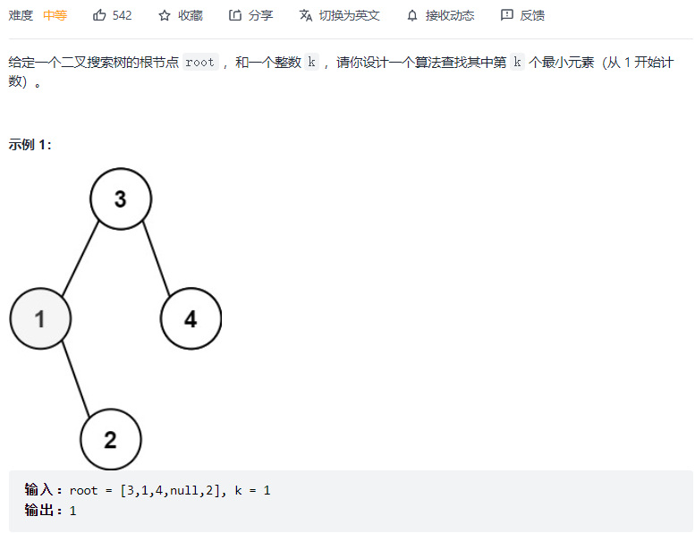

```python
class Solution:
    def kthSmallest(self, root: Optional[TreeNode], k: int) -> int:
        self.k = k
        self.res = 0
        def helper(root):
            if not root:
                return
            
            helper(root.left)

            if self.k == 0:
                return
            self.k -= 1
            if self.k == 0:
                self.res = root.val
            helper(root.right)
        helper(root)
        return self.res
```

#### [100. 相同的树](https://leetcode-cn.com/problems/same-tree/)

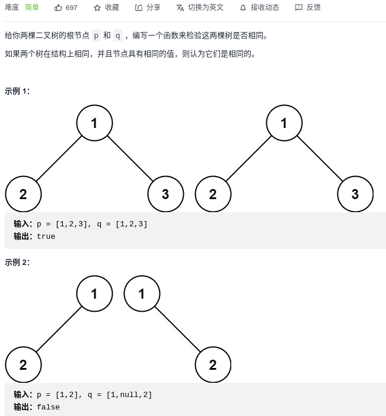

```python
class Solution:
    def isSameTree(self, p: TreeNode, q: TreeNode) -> bool:
        def helper(p, q):
            if p is None and q is None:
                return True
            elif p is None:
                return False
            elif q is None:
                return False
            elif p.val != q.val:
                return False

            left = helper(p.left, q.left)
            right = helper(p.right, q.right)
            return left and right
        
        return helper(p, q)
```

#### [404. 左叶子之和:star::star::star:](https://leetcode-cn.com/problems/sum-of-left-leaves/)

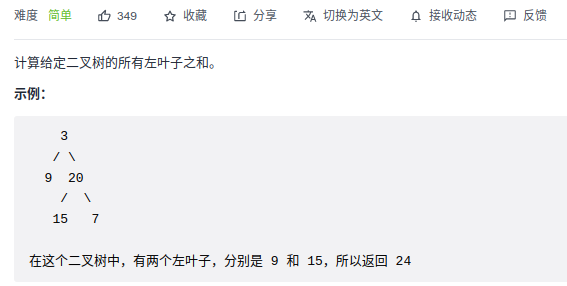

```python
class Solution:
    def sumOfLeftLeaves(self, root: TreeNode) -> int:
        def helper(root):
            if not root: return 0

            left_sum = helper(root.left)
            right_sum = helper(root.right)

            cur = 0
            if root.left and not root.left.left and not root.left.right:
                cur = root.left.val
            return left_sum + right_sum + cur
        
        return helper(root)
```

```python
class Solution:
    def sumOfLeftLeaves(self, root: TreeNode) -> int:
        if not root: return 0
        stack = [root]
        res = 0
        while stack:
            node = stack.pop()
            if node.left and not node.left.left and not node.left.right:
                res += node.left.val
            
            if node.right:
                stack.append(node.right)
            if node.left:
                stack.append(node.left)
        return res
```

```python
class Solution:
    def sumOfLeftLeaves(self, root: TreeNode) -> int:
        if not root: return 0
        queue = [root]
        res = 0
        while queue:
            for _ in range(len(queue)):
                node = queue.pop(0)
                if node.left:
                    queue.append(node.left)
                    if not node.left.left and not node.left.right:
                        res += node.left.val
                if node.right:
                    queue.append(node.right)
        return res
```

#### [513. 找树左下角的值](https://leetcode-cn.com/problems/find-bottom-left-tree-value/)

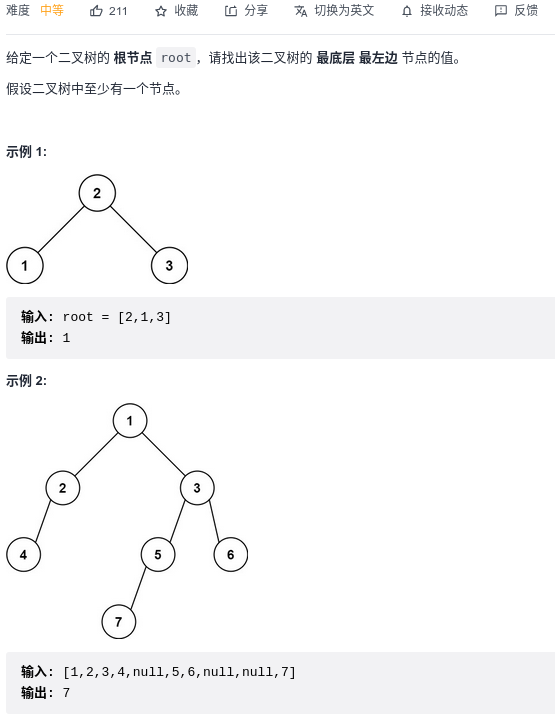

```python
class Solution:
    def findBottomLeftValue(self, root: TreeNode) -> int:
        queue = [root]
        res = None
        while queue:
            for i in range(len(queue)):
                node = queue.pop(0)
                if i == 0:
                    res = node.val
                if node.left:
                    queue.append(node.left)
                if node.right:
                    queue.append(node.right)
        return res
```

#### [112. 路径总和:star::star::star:](https://leetcode-cn.com/problems/path-sum/)

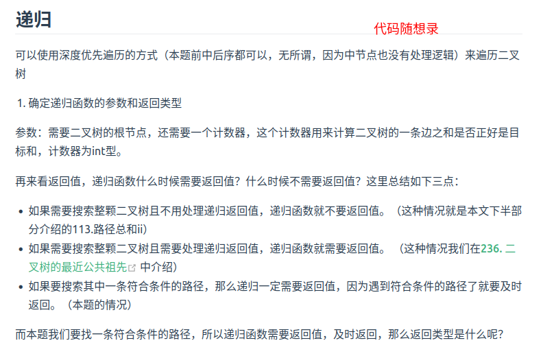

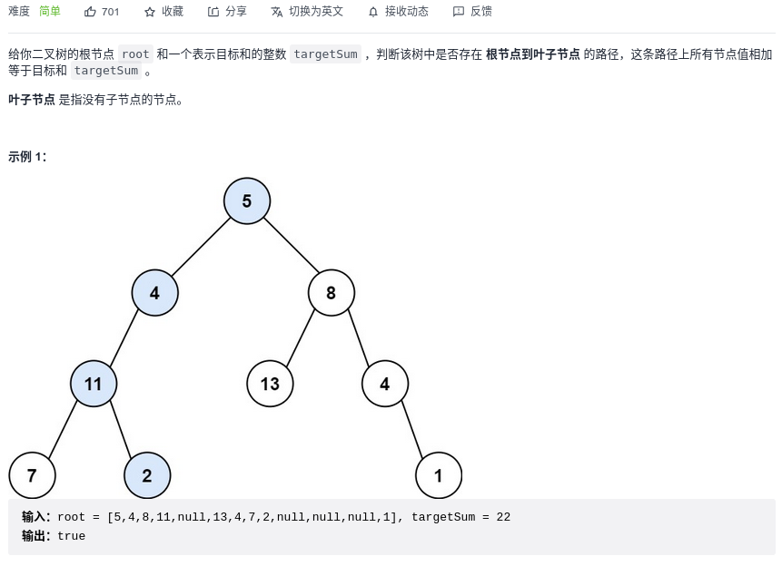

```python
class Solution:
    def hasPathSum(self, root: Optional[TreeNode], targetSum: int) -> bool:

        def helper(root, target):
            if not root.left and not root.right and target == 0:
                return True

            # 叶子节点，target不是0
            if not root.left and not root.right:
                return False
            
            # 选择左
            if root.left:
                if helper(root.left, target - root.left.val):
                    return True
            # 选择右
            if root.right:
                if helper(root.right, target - root.right.val):
                    return True
            return False

        if root is None: return False
        return helper(root, targetSum-root.val)
```

#### [113. 路径总和 II](https://leetcode-cn.com/problems/path-sum-ii/)

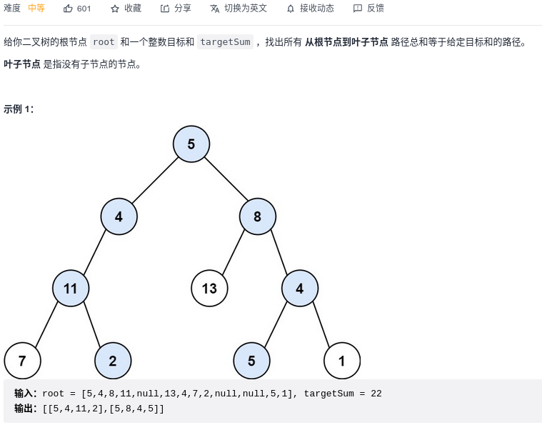

```python
from copy import deepcopy
class Solution:
    def pathSum(self, root: TreeNode, target: int) -> List[List[int]]:
        res = []
        path = []

        def backtrack(root, path, target):
            if not root:
                return
            if not root.left and not root.right and root.val == target:
                # 满足结束条件，在叶子节点停止，直接将叶子节点添加到结果中，无需在后面主逻辑中在选择节点继续回溯了
                res.append(deepcopy(path+[root.val]))
                return
            path.append(root.val)
            backtrack(root.left, path, target - root.val)
            backtrack(root.right, path, target - root.val)
            path.pop()
        backtrack(root, path, target)
        return res
```

#### [106. 从中序与后序遍历序列构造二叉树](https://leetcode-cn.com/problems/construct-binary-tree-from-inorder-and-postorder-traversal/)

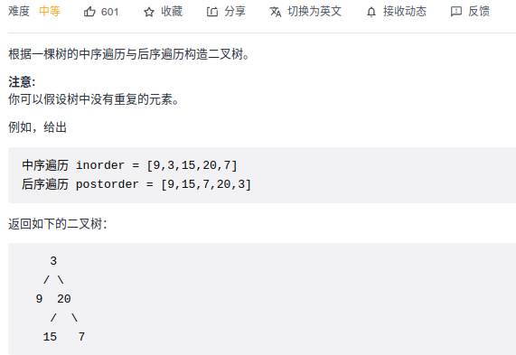

```python
class Solution:
    def buildTree(self, inorder: List[int], postorder: List[int]) -> TreeNode:
        if not postorder: return None

        root_val = postorder[-1]
        root = TreeNode(root_val)

        index = inorder.index(root_val)
        left_inorder = inorder[: index]
        right_inorder = inorder[index+1: ]

        left_postorder = postorder[: len(left_inorder)]
        right_postorder = postorder[len(left_inorder): len(left_inorder) + len(right_inorder)]

        root.left = self.buildTree(left_inorder, left_postorder)
        root.right = self.buildTree(right_inorder, right_postorder)
        return root
```

#### [105. 从前序与中序遍历序列构造二叉树](https://leetcode-cn.com/problems/construct-binary-tree-from-preorder-and-inorder-traversal/)

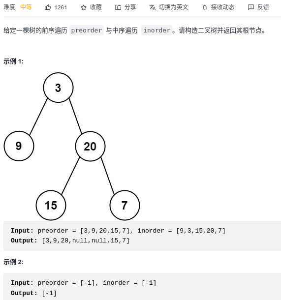

```python
class Solution:
    def buildTree(self, preorder: List[int], inorder: List[int]) -> TreeNode:
        if not preorder: return None
        root_val = preorder[0]
        root = TreeNode(root_val)

        index = inorder.index(root_val)
        left_inorder = inorder[: index]
        right_inorder = inorder[index+1: ]

        left_preorder = preorder[1: 1+len(left_inorder)]
        right_preorder = preorder[1+len(left_inorder): ]

        root.left = self.buildTree(left_preorder, left_inorder)
        root.right = self.buildTree(right_preorder, right_inorder)

        return root
```

#### [108. 将有序数组转换为二叉搜索树](https://leetcode-cn.com/problems/convert-sorted-array-to-binary-search-tree/)

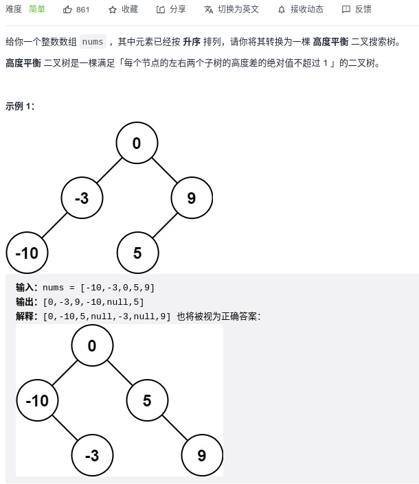

```python
class Solution:
    def sortedArrayToBST(self, nums: List[int]) -> TreeNode:
        def helper(nums):
            if not nums:
                return None
            mid = len(nums) // 2
            root_val = nums[mid]
            root = TreeNode(root_val)

            left = helper(nums[: mid])
            right = helper(nums[mid+1: ])
            root.left = left
            root.right = right
            return root
        
        return helper(nums)
```

#### [654. 最大二叉树](https://leetcode-cn.com/problems/maximum-binary-tree/)

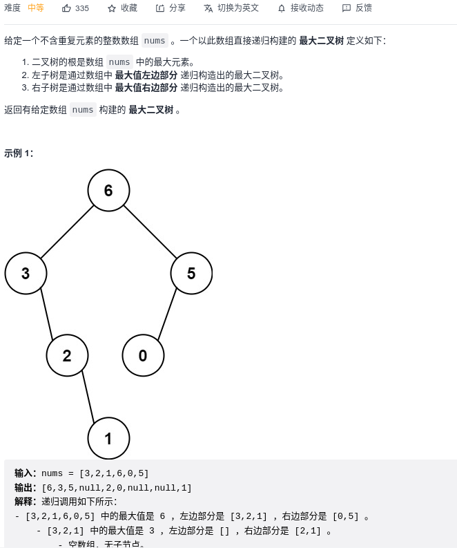

```python
class Solution:
    def constructMaximumBinaryTree(self, nums: List[int]) -> TreeNode:
        def helper(nums):
            if not nums:
                return None

            root_val = max(nums)
            idx = nums.index(root_val)  # 无重复元素
            root = TreeNode(root_val)

            left = helper(nums[: idx])
            right = helper(nums[idx+1: ])
            root.left = left
            root.right = right
            return root
        
        return helper(nums)
```

#### [617. 合并二叉树](https://leetcode-cn.com/problems/merge-two-binary-trees/)

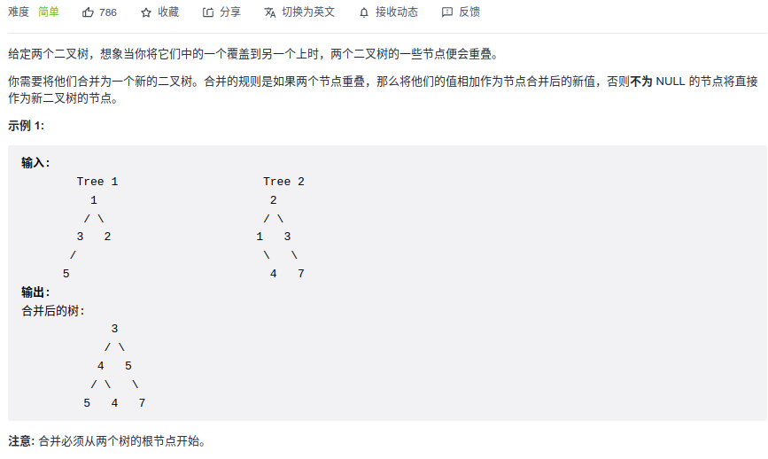

```python
class Solution:
    def mergeTrees(self, root1: TreeNode, root2: TreeNode) -> TreeNode:
        def helper(p, q):
            if not p and not q:
                return None
            elif p and not q:
                return p
            elif q and not p:
                return q
            
            val = p.val + q.val
            node = TreeNode(val)
            node.left = helper(p.left, q.left)
            node.right = helper(p.right, q.right)
            return node

        return helper(root1, root2)
```

#### [700. 二叉搜索树中的搜索](https://leetcode-cn.com/problems/search-in-a-binary-search-tree/)

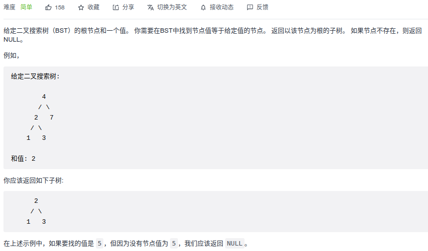

```python
class Solution:
    def searchBST(self, root: TreeNode, val: int) -> TreeNode:
        def helper(root, val):
            if not root:
                return None

            elif root.val == val:
                return root
        
            elif root.val < val:
                return helper(root.right, val)

            elif root.val > val:
                return helper(root.left, val)
        return helper(root, val)
```

#### [98. 验证二叉搜索树:star::star::star:](https://leetcode-cn.com/problems/validate-binary-search-tree/)

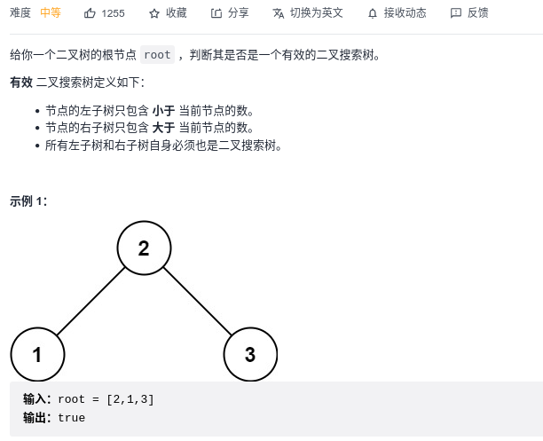

```python
class Solution:
    def isValidBST(self, root: TreeNode) -> bool:
        cur_max = -float('inf')

        def helper(root):
            nonlocal cur_max
            if not root:
                return True
            left_flag = helper(root.left)
            if cur_max < root.val:
                cur_max = root.val
            else:
                return False
            right_flag = helper(root.right)
            return left_flag and right_flag
        return helper(root)
```

```python
class Solution:
    def isValidBST(self, root: TreeNode) -> bool:
        # 中序遍历
        stack = [root]
        pre = None
        while stack:
            node = stack.pop()
            if node:
                if node.right:
                    stack.append(node.right)

                stack.append(node)
                stack.append(None)
                if node.left:
                    stack.append(node.left)
            else:
                node = stack.pop()
                if pre is None:
                    pre = node
                elif pre and pre.val < node.val:
                    pre = node
                else:
                    return False
        return True
```

#### [530. 二叉搜索树的最小绝对差](https://leetcode-cn.com/problems/minimum-absolute-difference-in-bst/)

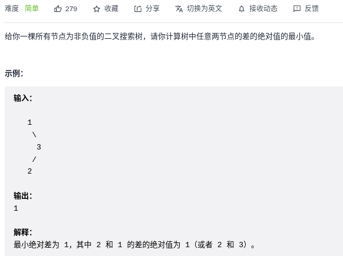

```python
# 递归 中序遍历，记录每次的最小值
class Solution:
    def getMinimumDifference(self, root: TreeNode) -> int:
        pre = None
        res = float('inf')
        def helper(root):
            nonlocal pre
            nonlocal res
            if not root:
                return
            
            helper(root.left)
            if pre:
                res = min(abs(pre.val - root.val), res)
            pre = root
            helper(root.right)

        helper(root)
        return res
```

```python
# 迭代
class Solution:
    def getMinimumDifference(self, root: TreeNode) -> int:

        pre = None
        res = float('inf')
        stack = [root]
        while stack:
            node = stack.pop()
            if node:
                if node.right:
                    stack.append(node.right)
                stack.append(node)
                stack.append(None)
                if node.left:
                    stack.append(node.left)
            
            else:
                node = stack.pop()
                if pre:
                    res = min(abs(pre.val - node.val), res)
                pre = node
        return res
```

#### [501. 二叉搜索树中的众数:star::star::star:](https://leetcode-cn.com/problems/find-mode-in-binary-search-tree/)

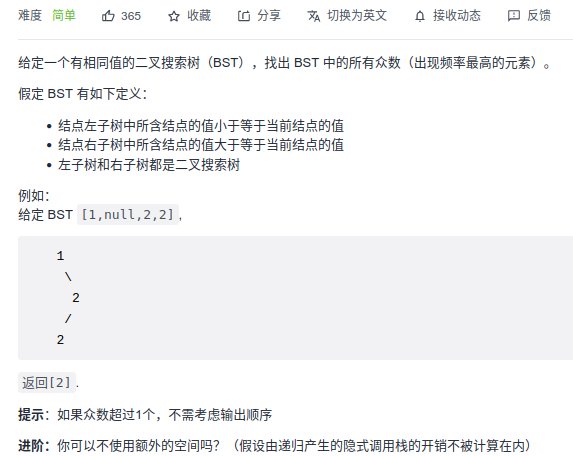

```python
# 递归 O(1)
class Solution:
    def findMode(self, root: TreeNode) -> List[int]:
        self.res = []
        self.pre = None
        self.count = 0
        self.max_count = 0
        def helper(root):
            if not root:
                return
            helper(root.left)

            if not self.pre:
                self.count = 1
            elif self.pre.val == root.val:
                self.count += 1
            else:
                self.count = 1
            self.pre = root

            if self.count == self.max_count:
                self.res.append(root.val)
            elif self.count > self.max_count:
                self.max_count = self.count
                self.res.clear()
                self.res.append(root.val)

            helper(root.right)
        
        helper(root)
        return self.res
```

```python
class Solution:
    def findMode(self, root: TreeNode) -> List[int]:
        res = []
        pre = None
        stack = [root]
        count = 0
        max_count = 0
        while stack:
            node = stack.pop()
            if node:
                if node.right:
                    stack.append(node.right)
                
                stack.append(node)
                stack.append(None)
                if node.left:
                    stack.append(node.left)

            else:
                node = stack.pop()
                if not pre:
                    count = 1
                elif pre.val == node.val:
                    count += 1
                else:
                    count = 1
                
                pre = node
                if count == max_count:
                    res.append(node.val)
                elif count > max_count:
                    res = [node.val]
                    max_count = count
        return res
```

#### [236. 二叉树的最近公共祖先:star::star::star:](https://leetcode-cn.com/problems/lowest-common-ancestor-of-a-binary-tree/)

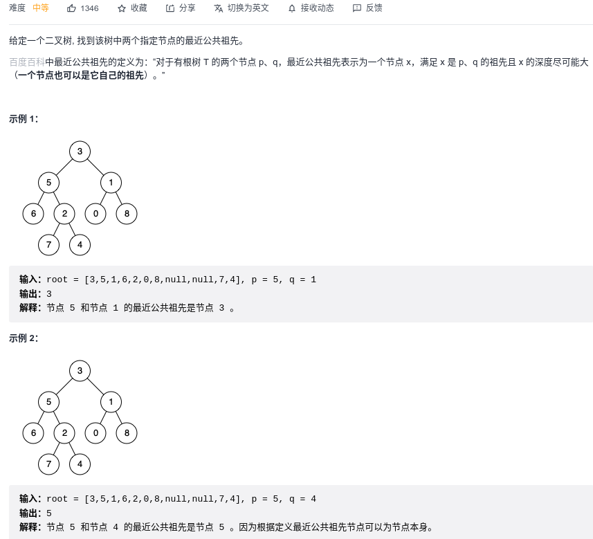

```python
class Solution:
    def lowestCommonAncestor(self, root: 'TreeNode', p: 'TreeNode', q: 'TreeNode') -> 'TreeNode':
        # 自底向上的遍历，一步一步找到公共祖先
        # 回溯法是自底向上的遍历方式
        # 二叉树的后序遍历是回溯法的方式
        def helper(root, p, q):
            if not root:
                return None
            
            if root == p or root == q:
                return root
            
            left = helper(root.left, p, q)
            right = helper(root.right, p, q)
			# 如果左右节点都不为空，说明两个节点分别在两个子树中.左子树存在一个节点，右子树也存在节点，那么公共祖先就是root
            if left and right:
                return root
            # 两个节点都在左
            if left:
                return left
            # 两个节点都在右
            if right:
                return right
            
            else:
                return None
        return helper(root, p, q)
```

#### [235. 二叉搜索树的最近公共祖先:star::star:](https://leetcode-cn.com/problems/lowest-common-ancestor-of-a-binary-search-tree/)

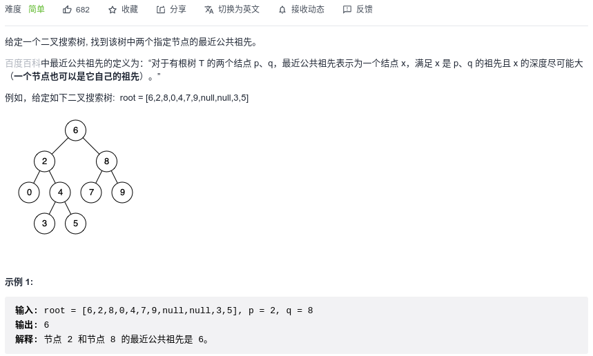

```python
class Solution:
    def lowestCommonAncestor(self, root: 'TreeNode', p: 'TreeNode', q: 'TreeNode') -> 'TreeNode':
        def helper(root, p, q):
            if not root:
                return None
            if root.val > p.val and root.val > q.val:
                left = helper(root.left, p, q)
                if left:
                    return left
            if root.val < p.val and root.val < q.val:
                right = helper(root.right, p, q)
                if right:
                    return right
            return root
        return helper(root, p, q)
```

```python
class Solution:
    def lowestCommonAncestor(self, root: 'TreeNode', p: 'TreeNode', q: 'TreeNode') -> 'TreeNode':
        while root:
            if root.val > p.val and root.val > q.val:
                root = root.left
            elif root.val < p.val and root.val < q.val:
                root = root.right
            else:
                return root
        return None
```

#### [701. 二叉搜索树中的插入操作:star:](https://leetcode-cn.com/problems/insert-into-a-binary-search-tree/)


```python
class Solution:
    def insertIntoBST(self, root: TreeNode, val: int) -> TreeNode:
        def helper(root, val):
            if not root:
                node = TreeNode(val)
                return node
            
            if root.val > val:
                root.left = helper(root.left, val)

            if root.val < val:
                root.right = helper(root.right, val)
            return root
        return helper(root, val)
```

```python
class Solution:
    def insertIntoBST(self, root: TreeNode, val: int) -> TreeNode:
        if not root:
            return TreeNode(val)
        pre = None
        dummy = root
        while root:
            pre = root
            if root.val > val:
                root = root.left
            elif root.val < val:
                root = root.right
        if pre.val > val:
            pre.left = TreeNode(val)
        else:
            pre.right = TreeNode(val)
        return dummy
```

#### [450. 删除二叉搜索树中的节点:star::star::star::star:](https://leetcode-cn.com/problems/delete-node-in-a-bst/)

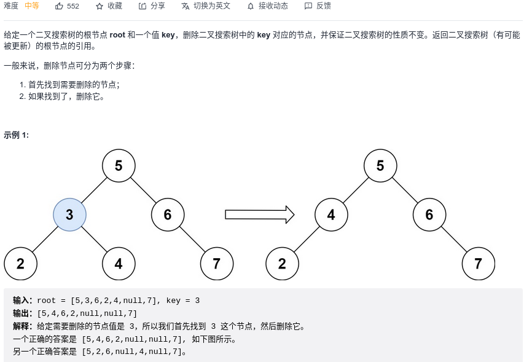

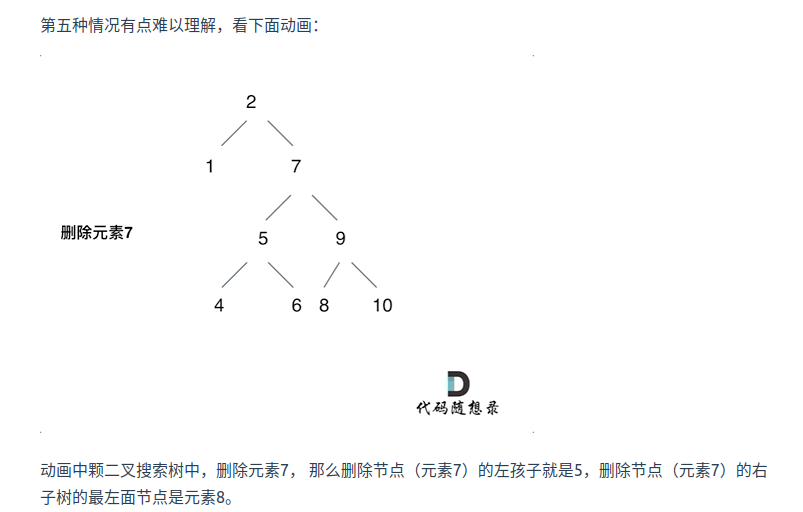

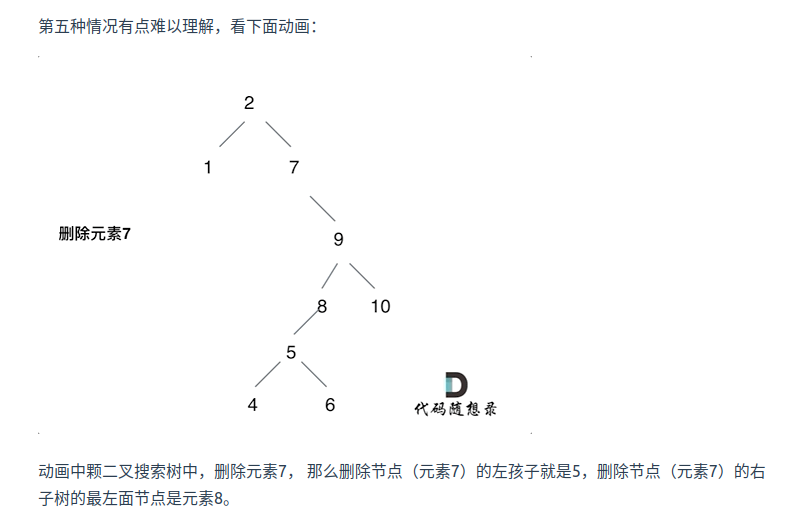

```python
class Solution:
    def deleteNode(self, root: Optional[TreeNode], key: int) -> Optional[TreeNode]:
        # 如果没找到节点，到空节点就返回
        if not root: return None
        if root.val == key:
            # 如果是叶子节点
            if not root.left and not root.right:
                del root
                return None
            # 左为空，用右子树占位
            elif not root.left and root.right:
                tmp = root
                root = root.right
                del tmp
                return root
            elif root.left and not root.right:
                tmp = root
                root = root.left
                del tmp
                return root
            # 左右子树都不为空，将左子树接右子树的最左边的叶子节点上
            else:
                v = root.right
                while v.left:
                    v = v.left
                v.left = root.left
                tmp = root
                root = root.right
                del tmp
                return root
        if root.val > key: root.left = self.deleteNode(root.left, key)
        if root.val < key: root.right = self.deleteNode(root.right, key)
        return root
```

#### [669. 修剪二叉搜索树:star::star::star::star:](https://leetcode-cn.com/problems/trim-a-binary-search-tree/)


```python
class Solution:
    def trimBST(self, root: TreeNode, low: int, high: int) -> TreeNode:
        if not root:
            return None

        if root.val < low:
            right = self.trimBST(root.right, low, high)
            return right
        if root.val > high:
            left = self.trimBST(root.left, low, high)
            return left
        
        root.left = self.trimBST(root.left, low, high)
        root.right = self.trimBST(root.right, low, high)
        return root
```

```java
 public TreeNode trimBST(TreeNode root, int low, int high) {
        if (root == null) {
            return null;
        }
        if (root.val < low) {
            //因为是二叉搜索树,节点.left < 节点 < 节点.right
            //节点数字比low小,就把左节点全部裁掉.
            root = root.right;
            //裁掉之后,继续看右节点的剪裁情况.剪裁后重新赋值给root.
            root = trimBST(root, low, high);
        } else if (root.val > high) {
            //如果数字比high大,就把右节点全部裁掉.
            root = root.left;
            //裁掉之后,继续看左节点的剪裁情况
            root = trimBST(root, low, high);
        } else {
            //如果数字在区间内,就去裁剪左右子节点.
            root.left = trimBST(root.left, low, high);
            root.right = trimBST(root.right, low, high);
        }
        return root;
    }
```

#### [108. 将有序数组转换为二叉搜索树](https://leetcode-cn.com/problems/convert-sorted-array-to-binary-search-tree/)

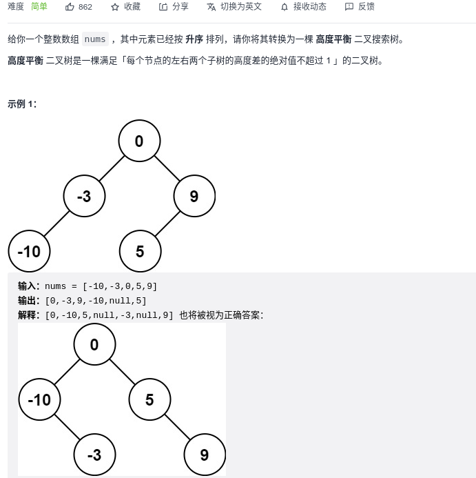

```python
class Solution:
    def sortedArrayToBST(self, nums: List[int]) -> TreeNode:
        def helper(nums):
            if not nums:
                return None
            
            mid = len(nums) // 2
            root = TreeNode(nums[mid])
            root.left = helper(nums[: mid])
            root.right = helper(nums[mid+1: ])
            return root
        return helper(nums)
```

#### [538. 把二叉搜索树转换为累加树:star:](https://leetcode-cn.com/problems/convert-bst-to-greater-tree/)

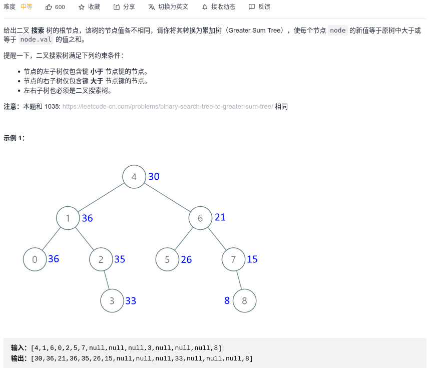

```python
class Solution:
    def convertBST(self, root: Optional[TreeNode]) -> Optional[TreeNode]:
        # 反中序遍历
        self.prev = 0
        def helper(root):
            if not root:
                return
            
            helper(root.right)

            root.val += self.prev
            self.prev = root.val
            
            helper(root.left)
        helper(root)
        return root
```

```python
class Solution:
    def convertBST(self, root: Optional[TreeNode]) -> Optional[TreeNode]:
        if not root:
            return None
        stack = [root]
        prev = 0
        while stack:
            node = stack.pop()
            if node:
                if node.left:
                    stack.append(node.left)

                stack.append(node)
                stack.append(None)
                if node.right:
                    stack.append(node.right)
            else:
                node = stack.pop()
                node.val += prev
                prev = node.val
        return root
```

