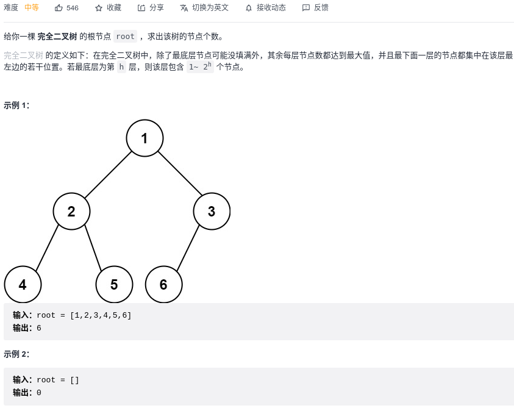

#### [226. 翻转二叉树](https://leetcode-cn.com/problems/invert-binary-tree/)


```python
# Definition for a binary tree node.
# class TreeNode:
#     def __init__(self, val=0, left=None, right=None):
#         self.val = val
#         self.left = left
#         self.right = right
class Solution:
    def invertTree(self, root: TreeNode) -> TreeNode:
        if root is None:
            return None
        
        root.left, root.right = root.right, root.left
        self.invertTree(root.left)
        self.invertTree(root.right)
        return root
        
class Solution:
    def invertTree(self, root: TreeNode) -> TreeNode:
        if root is None: return root
        stack = [root]
        while stack:
            node = stack.pop()
            if node:
                stack.append(node)
                stack.append(None)

                if node.left:
                    stack.append(node.left)
                if node.right:
                    stack.append(node.right)
            else:
                node = stack.pop()  # 遇到None，再弹出下一个，为当前子树的根节点
                node.left, node.right = node.right, node.left
        return root
```

#### [101. 对称二叉树](https://leetcode-cn.com/problems/symmetric-tree/)


```python
# Definition for a binary tree node.
# class TreeNode:
#     def __init__(self, val=0, left=None, right=None):
#         self.val = val
#         self.left = left
#         self.right = right
class Solution:
    def isSymmetric(self, root: TreeNode) -> bool:
        def compare(left, right):
            if left is None and right is None: return True
            elif left is None and right: return False
            elif left and right is None: return False
            elif left.val != right.val: return False

            return compare(left.left, right.right) and compare(left.right, right.left)
        
        if root is None: return True
        return compare(root.left, root.right)
```

#### [104. 二叉树的最大深度](https://leetcode-cn.com/problems/maximum-depth-of-binary-tree/)


```python
# Definition for a binary tree node.
# class TreeNode:
#     def __init__(self, val=0, left=None, right=None):
#         self.val = val
#         self.left = left
#         self.right = right
class Solution:
    def maxDepth(self, root: TreeNode) -> int:
        def helper(root):
            if root is None: return 0
            
            left_depth = helper(root.left)
            right_depth = helper(root.right)
            return max(left_depth, right_depth) + 1

        return helper(root)
```

#### [111. 二叉树的最小深度](https://leetcode-cn.com/problems/minimum-depth-of-binary-tree/)


```python
# Definition for a binary tree node.
# class TreeNode:
#     def __init__(self, val=0, left=None, right=None):
#         self.val = val
#         self.left = left
#         self.right = right
# 递归
class Solution:
    def minDepth(self, root: TreeNode) -> int:
        if root is None: return 0
        if root.left is None and root.right is None: return 1

        min_depth = float('inf')
        if root.left:
            min_depth = min(min_depth, self.minDepth(root.left))
        
        if root.right:
            min_depth = min(min_depth, self.minDepth(root.right))
        
        return min_depth + 1

# BFS
class Solution:
    def minDepth(self, root: TreeNode) -> int:
        # BFS
        if root is None: return 0
        queue = [root]
        depth = 1

        while queue:
            # 向四周扩散            
            for _ in range(len(queue)):
                node = queue.pop(0)

                # 判断是否到达终点
                if not node.left and not node.right:
                    return depth
                
                # 将node周围节点加入队列
                if node.left:
                    queue.append(node.left)
                if node.right:
                    queue.append(node.right)
            # 扩散完一次，说明深入了一层，depth应加1
            depth += 1
        return depth
```

#### [222. 完全二叉树的节点个数](https://leetcode-cn.com/problems/count-complete-tree-nodes/)



```python
# Definition for a binary tree node.
# class TreeNode:
#     def __init__(self, val=0, left=None, right=None):
#         self.val = val
#         self.left = left
#         self.right = right
class Solution:
    def countNodes(self, root: TreeNode) -> int:
        def helper(root):
            if root is None:
                return 0
            left = helper(root.left)
            right = helper(root.right)
            return left + right + 1
        
        return helper(root)
    
# BFS
class Solution:
    def countNodes(self, root: TreeNode) -> int:
        queue = [root]
        res = 0
        while queue:
            for _ in range(len(queue)):
                node = queue.pop(0)
                if node:
                    res += 1
                    if node.left:
                        queue.append(node.left)
                    if node.right:
                        queue.append(node.right)
        return res
```


