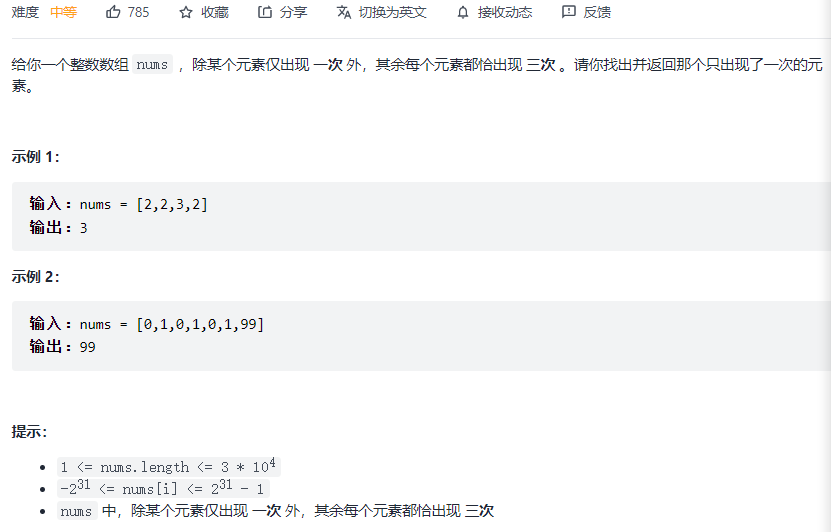

#### [136. 只出现一次的数字](https://leetcode-cn.com/problems/single-number/)


```python
class Solution:
    def singleNumber(self, nums: List[int]) -> int:
        res = 0
        for n in nums:
            res = res ^ n
        return res
```

#### [137. 只出现一次的数字 II](https://leetcode-cn.com/problems/single-number-ii/)



```python
class Solution:
    def singleNumber(self, nums: List[int]) -> int:
        res = 0
        for i in range(32):
            bit = 1 << i  # 要判断第几位数字
            cnt = 0   # 有多少个数的第bit位上是1
            for num in nums:
                if bit & num != 0:
                    cnt += 1
            if cnt % 3 != 0:  # 如果不是3的倍数，说明res第bit位为1
                res |= bit
        return res - 2 ** 32 if res > 2 ** 31 - 1 else res
```

