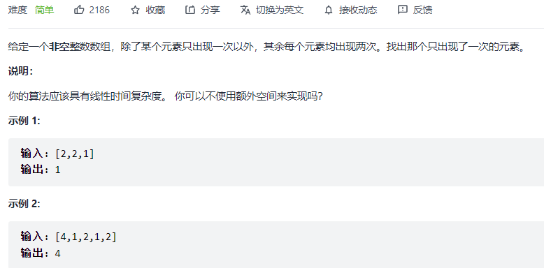

#### [136. 只出现一次的数字](https://leetcode-cn.com/problems/single-number/)



```python
class Solution:
    def singleNumber(self, nums: List[int]) -> int:
        res = 0
        for n in nums:
            res = res ^ n
        return res
```

#### [137. 只出现一次的数字 II](https://leetcode-cn.com/problems/single-number-ii/)


```python
class Solution:
    def singleNumber(self, nums: List[int]) -> int:
        res = 0
        for i in range(32):
            bit = 1 << i  # 要判断第几位数字
            cnt = 0   # 有多少个数的第bit位上是1
            for num in nums:
                if bit & num != 0:
                    cnt += 1
            if cnt % 3 != 0:  # 如果不是3的倍数，说明res第bit位为1
                res |= bit
        return res - 2 ** 32 if res > 2 ** 31 - 1 else res
```

#### [260. 只出现一次的数字 III](https://leetcode-cn.com/problems/single-number-iii/)


```
class Solution:
    def singleNumber(self, nums: List[int]) -> List[int]:
        ret = 0  # 两个不同数字的异或结果
        for n in nums:
            ret ^= n
        # 对nums分组，通过ret和h找到第一个出现不同的位
        h = 1
        while (ret & h) == 0:
            h <<= 1
        # 分组 求不同
        a, b = 0, 0
        for n in nums:
            if n & h == 0:
                a ^= n
            else:
                b ^= n
        return [a, b]
```

#### [190. 颠倒二进制位](https://leetcode-cn.com/problems/reverse-bits/)


```python
class Solution:
    def reverseBits(self, n: int) -> int:
        res = 0
        for i in range(32):
            res = (res << 1) | (n & 1)
            n >>= 1
        return res
```

#### [191. 位1的个数](https://leetcode-cn.com/problems/number-of-1-bits/)


```python
class Solution:
    def hammingWeight(self, n: int) -> int:
        res = 0
        for i in range(32):
            res += (n >> i) & 1
        return res
```

#### [338. 比特位计数](https://leetcode-cn.com/problems/counting-bits/)


```python
class Solution:
    def countBits(self, n: int) -> List[int]:
        def bit(n):
            res = 0
            for i in range(32):
                res += (n >> i) & 1
            return res
        res = []
        for i in range(0, n + 1):
            res.append(bit(i))
        return res
```

