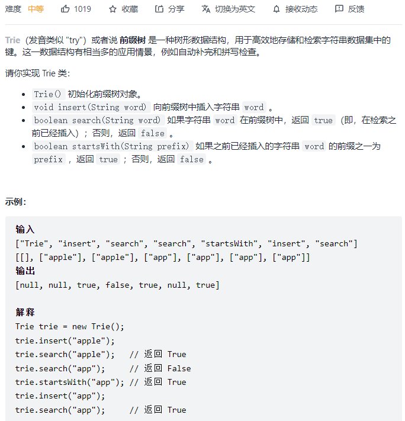
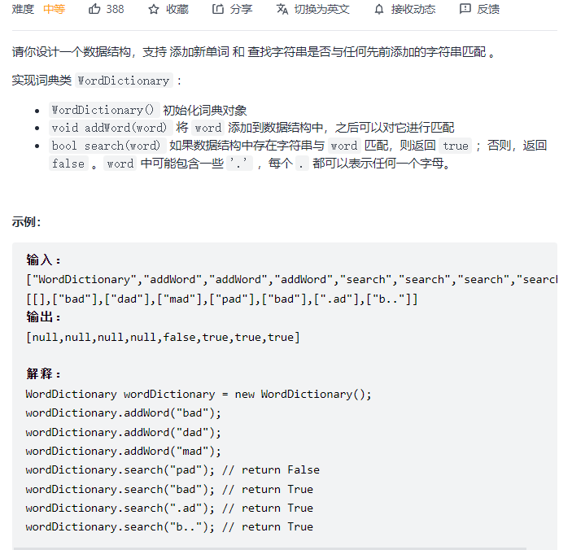
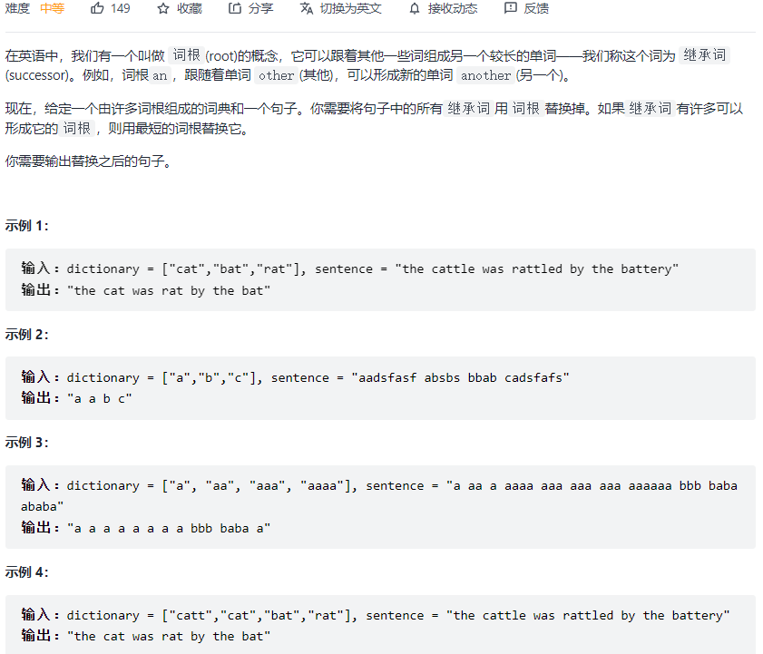

#### [208. 实现 Trie (前缀树)](https://leetcode-cn.com/problems/implement-trie-prefix-tree/)



```python
class TrieNode:
    def __init__(self):
        self.count = 0
        self.pre_count = 0
        self.children = {}

class Trie:

    def __init__(self):
        self.root = TrieNode()

    def insert(self, word: str) -> None:
        node = self.root
        for c in word:
            if c not in node.children:
                node.children[c] = TrieNode()
            node = node.children[c]
            node.pre_count += 1
        node.count += 1

    def search(self, word: str) -> bool:
        node = self.root
        for c in word:
            if c not in node.children: return False
            node = node.children[c]
        return node.count > 0

    def startsWith(self, prefix: str) -> bool:
        node = self.root
        for c in prefix:
            if c not in node.children: return False
            node = node.children[c]
        return node.pre_count > 0


# Your Trie object will be instantiated and called as such:
# obj = Trie()
# obj.insert(word)
# param_2 = obj.search(word)
# param_3 = obj.startsWith(prefix)
```

#### [211. 添加与搜索单词 - 数据结构设计](https://leetcode-cn.com/problems/design-add-and-search-words-data-structure/)



```python
class TrieNode:
    def __init__(self):
        self.count = 0
        self.children = collections.defaultdict(TrieNode)

class WordDictionary:

    def __init__(self):
        self.root = TrieNode()

    def addWord(self, word: str) -> None:
        node = self.root
        for c in word:
            node = node.children[c]
        node.count += 1

    def search(self, word: str) -> bool:
        def helper(root, word, index):
            if not root: return False
            if index == len(word): return root.count > 0
            if word[index] != '.':
                return root and helper(root.children[word[index]], word, index + 1)
            else:
                for child in root.children.values():
                    if helper(child, word, index + 1):
                        return True
            return False
        node = self.root
        return helper(node, word, 0)

# Your WordDictionary object will be instantiated and called as such:
# obj = WordDictionary()
# obj.addWord(word)
# param_2 = obj.search(word)
```

#### [648. 单词替换](https://leetcode-cn.com/problems/replace-words/)



```python
class Node:
    def __init__(self):
        self.isword = False
        self.children = {}

class Trie:
    def __init__(self):
        self.root = Node()
    
    def insert(self, word: str):
        node = self.root
        for c in word:
            if c not in node.children:
                node.children[c] = Node()
            node = node.children[c]
        node.isword = True

    def search(self, word):
        node = self.root
        path = ""
        for c in word:
            if c not in node.children: 
                return False
            node = node.children[c]
            path = path + c
            if node.isword: 
                return path
        return False

class Solution:
    def replaceWords(self, dictionary: List[str], sentence: str) -> str:
        trie = Trie()
        for word in dictionary:
            trie.insert(word)
        res = []
        for word in sentence.split():
            s = trie.search(word)
            if s == False:
                res.append(word)
            else:
                res.append(s)
        return ' '.join(res)
```

