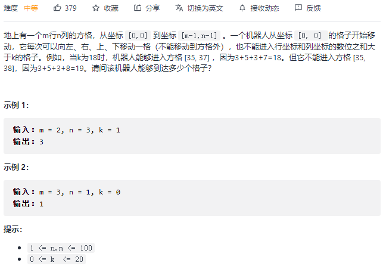

#### [剑指 Offer 09. 用两个栈实现队列](https://leetcode-cn.com/problems/yong-liang-ge-zhan-shi-xian-dui-lie-lcof/)


```python
class CQueue:

    def __init__(self):
        self.a = []
        self.b = []

    def appendTail(self, value: int) -> None:
        self.a.append(value)

    def deleteHead(self) -> int:
        if len(self.a) == 0: return -1
        while self.a:
            self.b.append(self.a.pop())
        res = self.b.pop()
        while self.b:
            self.a.append(self.b.pop())
        return res
# Your CQueue object will be instantiated and called as such:
# obj = CQueue()
# obj.appendTail(value)
# param_2 = obj.deleteHead()
```

#### [剑指 Offer 30. 包含min函数的栈](https://leetcode-cn.com/problems/bao-han-minhan-shu-de-zhan-lcof/)


```python
class MinStack:

    def __init__(self):
        """
        initialize your data structure here.
        """
        self.a = []
        self.b = []

    def push(self, x: int) -> None:
        self.a.append(x)
        if not self.b or self.b[-1] >= x:
            self.b.append(x)

    def pop(self) -> None:
        if self.a.pop() == self.b[-1]:
            self.b.pop()

    def top(self) -> int:
        return self.a[-1]

    def min(self) -> int:
        return self.b[-1]
```

#### [剑指 Offer 10- I. 斐波那契数列](https://leetcode-cn.com/problems/fei-bo-na-qi-shu-lie-lcof/)


```python
class Solution:
    def fib(self, n: int) -> int:
        dp = {0: 0, 1: 1}
        def helper(n):
            if n <= 1: return n
            if n in dp: return dp[n]

            a = helper(n-1) % 1000000007
            b = helper(n-2) % 1000000007
            res = (a + b)  %  1000000007
            dp[n-1] = a
            dp[n-2] = b
            dp[n] = res
            return res

        return helper(n)
```

```python
class Solution:
    def fib(self, n: int) -> int:
        if n <= 1: return n
        a, b = 0, 1
        for _ in range(n-1):
            a, b = b, a + b
        return b % 1000000007
```

#### [剑指 Offer 03. 数组中重复的数字](https://leetcode-cn.com/problems/shu-zu-zhong-zhong-fu-de-shu-zi-lcof/)


```python
class Solution:
    def findRepeatNumber(self, nums: List[int]) -> int:
        dic = set()
        for i in nums:
            if i not in dic:
                dic.add(i)
            else:
                return i
```

```python
class Solution:
    def findRepeatNumber(self, nums: List[int]) -> int:
        nums.sort()
        for i in range(1, len(nums)):
            if nums[i] == nums[i-1]:
                return nums[i]
```

#### [剑指 Offer 06. 从尾到头打印链表](https://leetcode-cn.com/problems/cong-wei-dao-tou-da-yin-lian-biao-lcof/)


```python
class Solution:
    def reversePrint(self, head: ListNode) -> List[int]:
        res = []
        p = head
        while p:
            res.append(p.val)
            p = p.next
        return res[::-1]
```

```python
# 递归
class Solution:
    def reversePrint(self, head: ListNode) -> List[int]:
        if not head:
            return []
        
        res = self.reversePrint(head.next)
        res.append(head.val)
        return res
```

#### [剑指 Offer 24. 反转链表](https://leetcode-cn.com/problems/fan-zhuan-lian-biao-lcof/)


```python
class Solution:
    def reverseList(self, head: ListNode) -> ListNode:
        prev = None
        cur = head
        while head:
            cur = head
            head = head.next
            cur.next = prev
            prev = cur
        return prev
```

```python
# 递归
class Solution:
    def reverseList(self, head: ListNode) -> ListNode:
        if not head:
            return None
        if not head.next:
            return head

        right = self.reverseList(head.next)
        head.next.next = head
        head.next = None
        return right
```

#### [剑指 Offer 35. 复杂链表的复制](https://leetcode-cn.com/problems/fu-za-lian-biao-de-fu-zhi-lcof/)


```python
"""
# Definition for a Node.
class Node:
    def __init__(self, x: int, next: 'Node' = None, random: 'Node' = None):
        self.val = int(x)
        self.next = next
        self.random = random
"""
# 二叉树递归
class Solution:
    def copyRandomList(self, head: 'Node') -> 'Node':
        def dfs(head):
            if not head: return None
            if head in visited:
                return visited[head]
			# 当前节点
            cur = Node(head.val)
            visited[head] = cur
            # next
            cur.next = dfs(head.next)
            # randoom
            cur.random = dfs(head.random)
            return cur
        visited = {}
        return dfs(head)
```

```python
class Solution:
    def copyRandomList(self, head: 'Node') -> 'Node':
        if not head: return None
        q = [head]

        copy = Node(head.val)
        visited = {head: copy}
        while q:
            cur = q.pop(0)
            if cur.next and cur.next not in visited:
                visited[cur.next] = Node(cur.next.val)
                q.append(cur.next)
            if cur.random and cur.random not in visited:
                visited[cur.random] = Node(cur.random.val)
                q.append(cur.random)
            visited[cur].next = visited.get(cur.next)
            visited[cur].random = visited.get(cur.random)
        return copy
```

#### [剑指 Offer 04. 二维数组中的查找](https://leetcode-cn.com/problems/er-wei-shu-zu-zhong-de-cha-zhao-lcof/)


```python
class Solution:
    def findNumberIn2DArray(self, matrix: List[List[int]], target: int) -> bool:
        if not matrix: return False
        r, c = len(matrix), len(matrix[0])

        i, j = r-1, 0
        while i >= 0 and j < c:
            if matrix[i][j] == target:
                 return True
            elif matrix[i][j] < target:
                j += 1
            else:
                i -= 1
        return False
```

#### [剑指 Offer 10- II. 青蛙跳台阶问题](https://leetcode-cn.com/problems/qing-wa-tiao-tai-jie-wen-ti-lcof/)


```python
class Solution:
    def numWays(self, n: int) -> int:
        dic = {}
        def helper(n):
            if n == 0 or n == 1: return 1
            elif n == 2:
                return n
            if n in dic:
                return dic[n]
            
            res = (helper(n-1) % 1000000007 + helper(n-2) % 1000000007) % 1000000007
            dic[n] = res 
            return res
        return helper(n)
```

#### [剑指 Offer 11. 旋转数组的最小数字](https://leetcode-cn.com/problems/xuan-zhuan-shu-zu-de-zui-xiao-shu-zi-lcof/)


```python
class Solution:
    def minArray(self, numbers: List[int]) -> int:
        if numbers[0] < numbers[-1]:
            return numbers[0]
        left, right = 0, len(numbers)-1
        while left < right:
            mid = left + (right - left) // 2
            
            # 一定要和right位进行比较，不能与left位比较，left~mid之间的情况较多，并不是二段的。
            if numbers[mid] > numbers[right]:
                left = mid + 1
            elif numbers[mid] < numbers[right]:
                right = mid
            else:
                right -= 1

        return numbers[left]
```

#### [剑指 Offer 12. 矩阵中的路径](https://leetcode-cn.com/problems/ju-zhen-zhong-de-lu-jing-lcof/)


```python
class Solution:
    def exist(self, board: List[List[str]], word: str) -> bool:
        m, n = len(board), len(board[0])
        
        self.res = False

        def dfs(i, j, start):
            if len(visited) == len(word):
                self.res = True
                return
            
            for x, y in [(i-1, j), (i + 1, j), (i, j-1), (i, j+1)]:
                if x < 0 or x >= m or y < 0 or y >= n:
                    continue
                if (x, y) not in visited and board[x][y] == word[start]:
                    visited.add((x, y))
                    dfs(x, y, start + 1)
                    if self.res: 
                        return True
                    visited.remove((x, y))
        
        for i in range(m):
            for j in range(n):
                if board[i][j] == word[0]:
                    visited = {(i, j)}
                    dfs(i, j, 1)
                    if self.res: 
                        return True
           
        return False 
```

```python
class Solution:
    def exist(self, board: List[List[str]], word: str) -> bool:
        #矩阵中的路径暴力法，找到路径起始，然后枚举，DFS
        #首先找出来第一个元素，之后从第一个元素起始，进行DFS
        #如何保证不会被重复访问,将已经访问过的节点变为#，保证以后再回到该节点时不会被访问！
        #怎么回退！！
        def DFS(a,b,k):
            if a < 0 or a > n-1 or b < 0 or b > m-1:
                return False
            if board[a][b] != word[k]:
                return False   
            if k == len(word)-1:
                return True
            
            board[a][b] = '#'
            res = DFS(a , b+1 , k+1) or DFS(a , b-1 , k+1) or DFS(a+1 , b , k+1) or DFS(a-1 , b , k+1)
            board[a][b] = word[k]#回退
            return res

        n = len(board)
        m = len(board[0])
        for i in range(n):
            for j in range(m):
                if board[i][j] == word[0]:
                    if DFS(i,j,0):
                        return True
        return False         
```

#### [剑指 Offer 05. 替换空格](https://leetcode-cn.com/problems/ti-huan-kong-ge-lcof/)


```python
class Solution:
    def replaceSpace(self, s: str) -> str:
        res = ""
        for i in s:
            if i != ' ':
                res += i
            else:
                res += '%20'
        return res
```

#### [剑指 Offer 58 - II. 左旋转字符串](https://leetcode-cn.com/problems/zuo-xuan-zhuan-zi-fu-chuan-lcof/)


#### [剑指 Offer 13. 机器人的运动范围](https://leetcode-cn.com/problems/ji-qi-ren-de-yun-dong-fan-wei-lcof/)



```python
class Solution:
    def movingCount(self, m: int, n: int, k: int) -> int:
        def position_sum(i):
            res = 0
            s = i
            while s > 0:
                res += s % 10
                s = s // 10
            return res
        
        self.res = 0
        
        def dfs(i, j):
            if i < 0 or i >= m or j < 0 or j >= n:
                return
            if position_sum(i) + position_sum(j) > k:
                return
            if (i, j) in visited:
                return
			# 访问过的就不用再回头看了，所以不用回溯撤销选择
            visited.add((i, j))
            self.res += 1
            for x, y in [(i-1, j), (i+1, j), (i, j-1), (i, j+1)]:
                dfs(x, y)

        
        visited = set()
        dfs(0, 0)
        return self.res
```

```python
class Solution:
    def movingCount(self, m: int, n: int, k: int) -> int:
        def position_sum(i):
            res = 0
            s = i
            while s > 0:
                res += s % 10
                s = s // 10
            return res
        
        res = 0
        q = [(0, 0)]
        visited = set()
        # 不要求扩散数，所以while循环中不需要for。弹出节点后，先判断节点有效性，有效则访问
        while q:
            i, j = q.pop(0)
            if i < 0 or i >= m or j < 0 or j >= n:
                continue
            if (i, j) in visited:
                continue
            if position_sum(i) + position_sum(j) > k:
                continue
            
            visited.add((i, j))
            res += 1
            for x, y in [(i, j-1), (i, j+1), (i-1, j), (i+1, j)]:
                q.append((x, y))
                
        return res
```

#### [剑指 Offer 07. 重建二叉树](https://leetcode-cn.com/problems/zhong-jian-er-cha-shu-lcof/)


```python
class Solution:
    def buildTree(self, preorder: List[int], inorder: List[int]) -> TreeNode:
        if not preorder:
            return None
        
        head_val = preorder[0]
        head = TreeNode(head_val)
        
        index = inorder.index(head_val)
        head.left = self.buildTree(preorder[1: index+1], inorder[:index])
        head.right = self.buildTree(preorder[index+1:], inorder[index+1:])
        return head
```

#### [剑指 Offer 53 - I. 在排序数组中查找数字 I](https://leetcode-cn.com/problems/zai-pai-xu-shu-zu-zhong-cha-zhao-shu-zi-lcof/)


```python
class Solution:
    def search(self, nums: List[int], target: int) -> int:
        if len(nums) == 0: return 0
        left, right = 0, len(nums) -1
        while left < right:
            mid = left + (right - left) // 2
            if nums[mid] == target:
                right = mid
            elif nums[mid] < target:
                left = mid + 1
            else:
                right = mid
        begin = None

        if nums[left] == target:
            begin = left
        else:
            return 0
        
        left, right = 0, len(nums) - 1
        while left < right:
            mid = left + (right - left + 1) // 2
            if nums[mid] == target:
                left = mid
            elif nums[mid] < target:
                left = mid
            else:
                right = mid - 1
        end = left
        return end - begin + 1
```

```python
class Solution:
    def search(self, nums: List[int], target: int) -> int:
        n = len(nums)
        if n == 0: return 0

        left, right = 0, n - 1
        while left + 1 < right:
            mid = left + (right - left) //2
            if nums[mid] == target:
                right = mid
            elif nums[mid] < target:
                left = mid + 1
            else:
                right = mid
        if nums[left] == target:
            begin = left
        elif nums[right] == target:
            begin = right
        else:
            return 0
        
        left, right = 0, n - 1
        while left + 1 < right:
            mid = left + (right - left) //2
            if nums[mid] == target:
                left = mid
            elif nums[mid] < target:
                left = mid
            else:
                right = mid -1

        if nums[right] == target:
            end = right
        else:
            end = left
        
        return end - begin + 1
```

#### [剑指 Offer 53 - II. 0～n-1中缺失的数字](https://leetcode-cn.com/problems/que-shi-de-shu-zi-lcof/)


```python
# 二分法
class Solution:
    def missingNumber(self, nums: List[int]) -> int:
        left, right = 0, len(nums) - 1
        while left <= right:
            mid = left + (right - left) // 2
            if nums[mid] == mid:
                left = mid + 1
            elif nums[mid] > mid:
                right = mid - 1
        return left
```

```python
class Solution:
    def missingNumber(self, nums: List[int]) -> int:
        n = len(nums) + 1
        s = (0 + n) * (n - 1) // 2
        return s - sum(nums)
```

#### [剑指 Offer 14- I. 剪绳子](https://leetcode-cn.com/problems/jian-sheng-zi-lcof/)


```python
class Solution:
    def cuttingRope(self, n: int) -> int:
        dp = [0] * (n + 1)
        
        # dp[0] = dp[1] = 0
        dp[2] = 1

        # 从3开始，一直求到dp[n]
        for i in range(3, n + 1):
            # 每次剪j长度的绳子
            for j in range(2, i):
                # 减去第一段长度为j的绳子后，可以继续剪(dp[i-j]) 也可以不剪 (i-j)
                dp[i] = max(dp[i], j * dp[i-j], j * (i - j))
        return dp[-1]
```

#### [剑指 Offer 14- II. 剪绳子 II](https://leetcode-cn.com/problems/jian-sheng-zi-ii-lcof/)


```python
# 由于n太大了，用动态规划速度太慢，所以贪心算法效率高。剪绳子I也可以用贪心
class Solution:
    def cuttingRope(self, n: int) -> int:
        if n < 4:
            return n - 1
        res = 1
        while n > 4:
            res = res * 3 % 1000000007
            n -= 3
        return res * n % 1000000007
```

#### [剑指 Offer 25. 合并两个排序的链表](https://leetcode-cn.com/problems/he-bing-liang-ge-pai-xu-de-lian-biao-lcof/)


```python
# 递归
class Solution:
    def mergeTwoLists(self, l1: ListNode, l2: ListNode) -> ListNode:
        def helper(l1, l2):
            if not l1 and not l2:
                return None
            if not l1:
                return l2
            if not l2:
                return l1
            
            dummy = ListNode(-1)
            if l1.val < l2.val:
                dummy.next = l1
                dummy.next.next = helper(l1.next, l2)
            else:
                dummy.next = l2
                dummy.next.next = helper(l1, l2.next)
            return dummy.next

        return helper(l1, l2)
```

```python
# 迭代
class Solution:
    def mergeTwoLists(self, l1: ListNode, l2: ListNode) -> ListNode:
        dummy = ListNode(-1)
        p = dummy
        while l1 and l2:
            if l1.val < l2.val:
                p.next = l1
                l1 = l1.next
            else:
                p.next = l2
                l2 = l2.next
            p = p.next
        if l1:
            p.next = l1
        if l2:
            p.next = l2
        return dummy.next
```

#### [剑指 Offer 50. 第一个只出现一次的字符](https://leetcode-cn.com/problems/di-yi-ge-zhi-chu-xian-yi-ci-de-zi-fu-lcof/)


```python
class Solution:
    def firstUniqChar(self, s: str) -> str:
        position = {}
        for i, c in enumerate(s):
            if c in position:
                position[c] = -1
            else:
                position[c] = i
        
        first = len(s)
        for pos in position.values():
            if pos != -1 and pos < first:
                first = pos

        return ' ' if first == len(s) else s[first]
```

#### [剑指 Offer 26. 树的子结构:star::star::star:](https://leetcode-cn.com/problems/shu-de-zi-jie-gou-lcof/)


```python
class Solution:
    def isSubStructure(self, A: TreeNode, B: TreeNode) -> bool:
		# 先序遍历A的节点
        # 判断树A中是否包含子树B
        def check(a, b):
            # b越过了叶子节点，说明叶子节点匹配成功，返回True
            if not b:
                return True
            # a越过叶子节点，说明叶子节点没有匹配成功，返回False
            if not a:
                return False
            return a.val == b.val and check(a.left, b.left) and check(a.right, b.right)

        if not A or not B:
            return False
        return check(A, B) or self.isSubStructure(A.left, B) or self.isSubStructure(A.right, B)
```

#### [剑指 Offer 27. 二叉树的镜像](https://leetcode-cn.com/problems/er-cha-shu-de-jing-xiang-lcof/)


```python
class Solution:
    def mirrorTree(self, root: TreeNode) -> TreeNode:
        if not root:
            return None

        left = self.mirrorTree(root.left)
        right = self.mirrorTree(root.right)
        root.left = right
        root.right = left
        return root
```

#### [剑指 Offer 32 - I. 从上到下打印二叉树](https://leetcode-cn.com/problems/cong-shang-dao-xia-da-yin-er-cha-shu-lcof/)


```python
class Solution:
    def levelOrder(self, root: TreeNode) -> List[int]:
        if not root: return []
        q = [root]
        res = []
        while q:
            node = q.pop(0)
            res.append(node.val)

            if node.left:
                q.append(node.left)
            if node.right:
                q.append(node.right)
        return res
```

#### [剑指 Offer 32 - II. 从上到下打印二叉树 II](https://leetcode-cn.com/problems/cong-shang-dao-xia-da-yin-er-cha-shu-ii-lcof/)


```python
class Solution:
    def levelOrder(self, root: TreeNode) -> List[List[int]]:
        if not root: return []
        q = [root]
        res = []
        while q:
            tmp = []
            for _ in range(len(q)):
                node = q.pop(0)
                tmp.append(node.val)

                if node.left:
                    q.append(node.left)
                if node.right:
                    q.append(node.right)
            res.append(tmp)
        return res
```

#### [剑指 Offer 32 - III. 从上到下打印二叉树 III](https://leetcode-cn.com/problems/cong-shang-dao-xia-da-yin-er-cha-shu-iii-lcof/)


```python
class Solution:
    def levelOrder(self, root: TreeNode) -> List[List[int]]:
        if not root: return []
        q = [root]
        res = []

        while q:
            tmp = []
  
            for _ in range(len(q)):
                node = q.pop(0)
                tmp.append(node.val)
             
                if node.left:
                    q.append(node.left)
                if node.right:
                    q.append(node.right)

            if len(res) % 2 == 0:
                res.append(tmp)
            else:
                res.append(tmp[::-1])
        return res
```

#### [剑指 Offer 21. 调整数组顺序使奇数位于偶数前面](https://leetcode-cn.com/problems/diao-zheng-shu-zu-shun-xu-shi-qi-shu-wei-yu-ou-shu-qian-mian-lcof/)


```python
class Solution:
    def exchange(self, nums: List[int]) -> List[int]:
        left, right = 0, len(nums)-1
        while left < right:
            while left < right and nums[left] % 2 == 1:
                left += 1
            while left < right and nums[right] % 2 == 0:
                right -= 1
            nums[left], nums[right] = nums[right], nums[left]
        return nums
```

#### [剑指 Offer 15. 二进制中1的个数](https://leetcode-cn.com/problems/er-jin-zhi-zhong-1de-ge-shu-lcof/)


```python
class Solution:
    def hammingWeight(self, n: int) -> int:
        if n == 0: return 0
        
        res = 0
        while n > 0:
            if n % 2 == 1:
                res += 1
            n = n // 2
        return res if res > 0 else 1
```

#### [剑指 Offer 29. 顺时针打印矩阵:star::star:](https://leetcode-cn.com/problems/shun-shi-zhen-da-yin-ju-zhen-lcof/)


```python
# https://leetcode-cn.com/problems/shun-shi-zhen-da-yin-ju-zhen-lcof/solution/shan-chu-di-yi-xing-ni-shi-zhen-xuan-zhuan-python5/
class Solution:
    def spiralOrder(self, matrix: List[List[int]]) -> List[int]:
        res = []
        while matrix:
            res += matrix.pop(0)
            # 二维数组转置list(zip(*matrix))
            matrix = list(zip(*matrix))[::-1]
        return res
```

#### [剑指 Offer 22. 链表中倒数第k个节点](https://leetcode-cn.com/problems/lian-biao-zhong-dao-shu-di-kge-jie-dian-lcof/)


```python
class Solution:
    def getKthFromEnd(self, head: ListNode, k: int) -> ListNode:
        dummy = ListNode(-1)
        dummy.next = head
        slow, fast = dummy, dummy
        for _ in range(k):
            fast = fast.next
        
        while fast:
            fast = fast.next
            slow = slow.next
        return slow
```

#### [剑指 Offer 17. 打印从1到最大的n位数](https://leetcode-cn.com/problems/da-yin-cong-1dao-zui-da-de-nwei-shu-lcof/)


```python
class Solution:
    def printNumbers(self, n: int) -> List[int]:
        max_val = 10 ** n
        return [i for i in range(1, max_val)]
```

```python
class Solution:
    def printNumbers(self, n: int) -> List[int]:
        res=[]
        temp=['0']*n
        def helper(index):
            if index==n:
                res.append(int(''.join(temp)))
                return
            for i in range(10):
                temp[index]=chr(ord("0")+i)
                helper(index+1)
        helper(0)
        return res[1:]
```

#### [剑指 Offer 63. 股票的最大利润](https://leetcode-cn.com/problems/gu-piao-de-zui-da-li-run-lcof/)


```python
class Solution:
    def maxProfit(self, prices: List[int]) -> int:
        n = len(prices)
        if n <= 1: return 0
        dp = [[0] * 2 for _ in range(n)]
        dp[0][0] = -prices[0]
		# 第0列为持有，第一列为卖出
        # 持有要花钱买，所以收益为负
        for i in range(1, n):
            dp[i][0] = max(dp[i-1][0], -prices[i])
            dp[i][1] = max(dp[i-1][1], dp[i-1][0] + prices[i])
        return dp[-1][1]
```

```python
class Solution:
    def maxProfit(self, prices: List[int]) -> int:
        inf = int(1e9)
        minprice = inf
        maxprofit = 0
        # 记录历史最低点，每天都考虑如果是在历史最低点买入的，今天卖出赚多少钱
        for price in prices:
            maxprofit = max(price - minprice, maxprofit)
            minprice = min(price, minprice)
        return maxprofit
```

#### [剑指 Offer 16. 数值的整数次方](https://leetcode-cn.com/problems/shu-zhi-de-zheng-shu-ci-fang-lcof/)


```python
class Solution:
    def myPow(self, x: float, n: int) -> float:
        def helper(x, n):
            if n == 0:
                return 1
            if n == 1:
                return x
            
            tmp = helper(x, n // 2)
            if n % 2 == 0:
                return tmp * tmp
            else:
                return tmp * tmp * x
        
        pos = (n > 0)
        res = helper(x, abs(n))
        return res if pos else 1 / res
```

#### [10. 正则表达式匹配:star::star::star::star:](https://leetcode-cn.com/problems/regular-expression-matching/)


```python
# https://leetcode-cn.com/problems/regular-expression-matching/solution/hen-rong-yi-li-jie-de-zheng-ze-biao-da-s-cpgp/
class Solution:
    def isMatch(self, s: str, p: str):
        if not p: return not s
        if not s and len(p) == 1: return False

        m = len(s) + 1
        n = len(p) + 1

        dp = [[False for _ in range(n)] for _ in range(m)]

        dp[0][0] = True

        # 确定dp数组的第一行，如果遇到了*,只要判断其对应的前面两个元素的dp值
        # 注意：我们无需判断p里面的第一个值是否为"*"，如果为"*",那肯定匹配不到为Fasle,原数组正好是Fasle，所以直接从2开始判断即可
        for j in range(2, n):
            if p[j-1] == '*':
                dp[0][j] = dp[0][j - 2]

        for r in range(1, m):
            i = r - 1  # 对应s中的元素
            for c in range(1, n):
                j = c - 1  # 对应p中的元素
                if s[i] == p[j] or p[j] == '.':
                    dp[r][c] = dp[r - 1][c - 1]
                elif p[j] == '*':
                    if p[j - 1] == s[i] or p[j - 1] == '.':
                        dp[r][c] = dp[r - 1][c] or dp[r][c - 2]
                    else:
                        dp[r][c] = dp[r][c - 2]
                else:
                    dp[r][c] = False

        return dp[m - 1][n - 1]
```

#### [剑指 Offer 42. 连续子数组的最大和](https://leetcode-cn.com/problems/lian-xu-zi-shu-zu-de-zui-da-he-lcof/)


```python
# 两个状态，选当前的数 和 不选当前的数
class Solution:
    def maxSubArray(self, nums: List[int]) -> int:
        n = len(nums)
        dp = [[0] * 2 for _ in range(n)]
        # 初始化需要考虑，如果数组只有一个数组的时候，选不选第一个数最大和都是这个。
        dp[0][0] = dp[0][1] = nums[0]

        for i in range(1, n):
            dp[i][0] = max(dp[i-1][0] + nums[i], nums[i])
            dp[i][1] = max(dp[i-1][1], dp[i-1][0])
        
        return max(dp[-1])
```

```python
# 状态压缩
class Solution:
    def maxSubArray(self, nums: List[int]) -> int:
        n = len(nums)
        dp = [0] * n
        dp[0] = nums[0]
        res = nums[0]
        for i in range(1, n):
            dp[i] = max(dp[i-1] + nums[i], nums[i])
            res = max(res, dp[i])
            
        return res
```

#### [剑指 Offer 47. 礼物的最大价值](https://leetcode-cn.com/problems/li-wu-de-zui-da-jie-zhi-lcof/)


```python
# 二维空间
class Solution:
    def maxValue(self, grid: List[List[int]]) -> int:
        m, n = len(grid), len(grid[0])
        dp = [[0] * n for _ in range(m)]
        dp[0][0] = grid[0][0]
        for i in range(1, n):
            dp[0][i] = dp[0][i-1] + grid[0][i]
        for j in range(1, m):
            dp[j][0] = dp[j-1][0] + grid[j][0]
        
        for i in range(1, m):
            for j in range(1, n):
                dp[i][j] = max(dp[i-1][j], dp[i][j-1]) + grid[i][j]
        return dp[-1][-1]
```

```python
# 一维空间
class Solution:
    def maxValue(self, grid: List[List[int]]) -> int:
        m, n = len(grid), len(grid[0])
        dp = [0] * n
        dp[0] = grid[0][0]
        for i in range(1, n):
            dp[i] = dp[i-1] + grid[0][i]
        for i in range(1, m):
            for j in range(n):
                if j == 0:
                    dp[j] += grid[i][j]
                else:
                    dp[j] = max(dp[j-1], dp[j]) + grid[i][j]
        return dp[-1]
```

#### [剑指 Offer 46. 把数字翻译成字符串:star:](https://leetcode-cn.com/problems/ba-shu-zi-fan-yi-cheng-zi-fu-chuan-lcof/)


```python
class Solution:
    def translateNum(self, num: int) -> int:
        s = str(num)
        n = len(s)
        if n < 2:
            return 1
        dp = [0] * n
        dp[0] = 1
        dp[1] = 2 if int(s[0] + s[1]) < 26 else 1
        for i in range(2, n):
            dp[i] = dp[i-1] + dp[i-2] if (int(s[i-1] + s[i]) < 26 and s[i-1] != '0') else dp[i-1]
        return dp[-1]
```

#### [剑指 Offer 48. 最长不含重复字符的子字符串:star::star:](https://leetcode-cn.com/problems/zui-chang-bu-han-zhong-fu-zi-fu-de-zi-zi-fu-chuan-lcof/)


```python
class Solution:
    def lengthOfLongestSubstring(self, s: str) -> int:
        left, right = 0, 0
        res = 0
        window = {}

        while right < len(s):
            if s[right] not in window:
                window[s[right]] = 1
            else:
                window[s[right]] += 1

            while window[s[right]] > 1:
                window[s[left]] -= 1
                left += 1
            res = max(res, right - left + 1)
            right += 1
        return res
```

```python
# 动态规划
class Solution:
    def lengthOfLongestSubstring(self, s: str) -> int:
        n = len(s)
        if n == 0: return 0
        dic = {}
        
        #dp[j] 代表以字符 s[j]为结尾的 “最长不重复子字符串” 的长度。
        dp = [0] * n
        dp[0] = 1
        dic[s[0]] = 0
        res = 1
        
        for i in range(1, n):
            # 如果不在字典中
            # 如果在字典中，但是上一次出现的位置到现在的位置的距离 超出了要比较的位置，不影响结果
            if s[i] not in dic or (i - dic[s[i]]) > dp[i-1]:
                dp[i] = dp[i-1] + 1
            
            else:
                dp[i] = i - dic[s[i]]
            # 更新位置
            dic[s[i]] = i
            res = max(res, dp[i]) 
        return res
```

