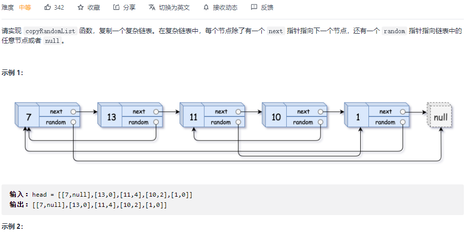

#### [剑指 Offer 09. 用两个栈实现队列](https://leetcode-cn.com/problems/yong-liang-ge-zhan-shi-xian-dui-lie-lcof/)


```python
class CQueue:

    def __init__(self):
        self.a = []
        self.b = []

    def appendTail(self, value: int) -> None:
        self.a.append(value)

    def deleteHead(self) -> int:
        if len(self.a) == 0: return -1
        while self.a:
            self.b.append(self.a.pop())
        res = self.b.pop()
        while self.b:
            self.a.append(self.b.pop())
        return res
# Your CQueue object will be instantiated and called as such:
# obj = CQueue()
# obj.appendTail(value)
# param_2 = obj.deleteHead()
```

#### [剑指 Offer 30. 包含min函数的栈](https://leetcode-cn.com/problems/bao-han-minhan-shu-de-zhan-lcof/)


```python
class MinStack:

    def __init__(self):
        """
        initialize your data structure here.
        """
        self.a = []
        self.b = []

    def push(self, x: int) -> None:
        self.a.append(x)
        if not self.b or self.b[-1] >= x:
            self.b.append(x)

    def pop(self) -> None:
        if self.a.pop() == self.b[-1]:
            self.b.pop()

    def top(self) -> int:
        return self.a[-1]

    def min(self) -> int:
        return self.b[-1]
```

#### [剑指 Offer 10- I. 斐波那契数列](https://leetcode-cn.com/problems/fei-bo-na-qi-shu-lie-lcof/)


```python
class Solution:
    def fib(self, n: int) -> int:
        dp = {0: 0, 1: 1}
        def helper(n):
            if n <= 1: return n
            if n in dp: return dp[n]

            a = helper(n-1) % 1000000007
            b = helper(n-2) % 1000000007
            res = (a + b)  %  1000000007
            dp[n-1] = a
            dp[n-2] = b
            dp[n] = res
            return res

        return helper(n)
```

```python
class Solution:
    def fib(self, n: int) -> int:
        if n <= 1: return n
        a, b = 0, 1
        for _ in range(n-1):
            a, b = b, a + b
        return b % 1000000007
```

#### [剑指 Offer 03. 数组中重复的数字](https://leetcode-cn.com/problems/shu-zu-zhong-zhong-fu-de-shu-zi-lcof/)


```python
class Solution:
    def findRepeatNumber(self, nums: List[int]) -> int:
        dic = set()
        for i in nums:
            if i not in dic:
                dic.add(i)
            else:
                return i
```

```python
class Solution:
    def findRepeatNumber(self, nums: List[int]) -> int:
        nums.sort()
        for i in range(1, len(nums)):
            if nums[i] == nums[i-1]:
                return nums[i]
```

#### [剑指 Offer 06. 从尾到头打印链表](https://leetcode-cn.com/problems/cong-wei-dao-tou-da-yin-lian-biao-lcof/)


```python
class Solution:
    def reversePrint(self, head: ListNode) -> List[int]:
        res = []
        p = head
        while p:
            res.append(p.val)
            p = p.next
        return res[::-1]
```

```python
# 递归
class Solution:
    def reversePrint(self, head: ListNode) -> List[int]:
        if not head:
            return []
        
        res = self.reversePrint(head.next)
        res.append(head.val)
        return res
```

#### [剑指 Offer 24. 反转链表](https://leetcode-cn.com/problems/fan-zhuan-lian-biao-lcof/)


```python
class Solution:
    def reverseList(self, head: ListNode) -> ListNode:
        prev = None
        cur = head
        while head:
            cur = head
            head = head.next
            cur.next = prev
            prev = cur
        return prev
```

```python
# 递归
class Solution:
    def reverseList(self, head: ListNode) -> ListNode:
        if not head:
            return None
        if not head.next:
            return head

        right = self.reverseList(head.next)
        head.next.next = head
        head.next = None
        return right
```

#### [剑指 Offer 35. 复杂链表的复制](https://leetcode-cn.com/problems/fu-za-lian-biao-de-fu-zhi-lcof/)



```python
"""
# Definition for a Node.
class Node:
    def __init__(self, x: int, next: 'Node' = None, random: 'Node' = None):
        self.val = int(x)
        self.next = next
        self.random = random
"""
# 二叉树递归
class Solution:
    def copyRandomList(self, head: 'Node') -> 'Node':
        def dfs(head):
            if not head: return None
            if head in visited:
                return visited[head]
			# 当前节点
            cur = Node(head.val)
            visited[head] = cur
            # next
            cur.next = dfs(head.next)
            # randoom
            cur.random = dfs(head.random)
            return cur
        visited = {}
        return dfs(head)
```

```python
class Solution:
    def copyRandomList(self, head: 'Node') -> 'Node':
        if not head: return None
        q = [head]

        copy = Node(head.val)
        visited = {head: copy}
        while q:
            cur = q.pop(0)
            if cur.next and cur.next not in visited:
                visited[cur.next] = Node(cur.next.val)
                q.append(cur.next)
            if cur.random and cur.random not in visited:
                visited[cur.random] = Node(cur.random.val)
                q.append(cur.random)
            visited[cur].next = visited.get(cur.next)
            visited[cur].random = visited.get(cur.random)
        return copy
```

#### [剑指 Offer 04. 二维数组中的查找](https://leetcode-cn.com/problems/er-wei-shu-zu-zhong-de-cha-zhao-lcof/)


```python
class Solution:
    def findNumberIn2DArray(self, matrix: List[List[int]], target: int) -> bool:
        if not matrix: return False
        r, c = len(matrix), len(matrix[0])

        i, j = r-1, 0
        while i >= 0 and j < c:
            if matrix[i][j] == target:
                 return True
            elif matrix[i][j] < target:
                j += 1
            else:
                i -= 1
        return False
```

#### [剑指 Offer 10- II. 青蛙跳台阶问题](https://leetcode-cn.com/problems/qing-wa-tiao-tai-jie-wen-ti-lcof/)


```python
class Solution:
    def numWays(self, n: int) -> int:
        dic = {}
        def helper(n):
            if n == 0 or n == 1: return 1
            elif n == 2:
                return n
            if n in dic:
                return dic[n]
            
            res = (helper(n-1) % 1000000007 + helper(n-2) % 1000000007) % 1000000007
            dic[n] = res 
            return res
        return helper(n)
```

#### [剑指 Offer 11. 旋转数组的最小数字](https://leetcode-cn.com/problems/xuan-zhuan-shu-zu-de-zui-xiao-shu-zi-lcof/)


```python
class Solution:
    def minArray(self, numbers: List[int]) -> int:
        if numbers[0] < numbers[-1]:
            return numbers[0]
        left, right = 0, len(numbers)-1
        while left < right:
            mid = left + (right - left) // 2
            
            # 一定要和right位进行比较，不能与left位比较，left~mid之间的情况较多，并不是二段的。
            if numbers[mid] > numbers[right]:
                left = mid + 1
            elif numbers[mid] < numbers[right]:
                right = mid
            else:
                right -= 1

        return numbers[left]
```

#### [剑指 Offer 12. 矩阵中的路径](https://leetcode-cn.com/problems/ju-zhen-zhong-de-lu-jing-lcof/)


```python
class Solution:
    def exist(self, board: List[List[str]], word: str) -> bool:
        m, n = len(board), len(board[0])
        
        self.res = False

        def dfs(i, j, start):
            if len(visited) == len(word):
                self.res = True
                return
            
            for x, y in [(i-1, j), (i + 1, j), (i, j-1), (i, j+1)]:
                if x < 0 or x >= m or y < 0 or y >= n:
                    continue
                if (x, y) not in visited and board[x][y] == word[start]:
                    visited.add((x, y))
                    dfs(x, y, start + 1)
                    if self.res: 
                        return True
                    visited.remove((x, y))
        
        for i in range(m):
            for j in range(n):
                if board[i][j] == word[0]:
                    visited = {(i, j)}
                    dfs(i, j, 1)
                    if self.res: 
                        return True
           
        return False 
```

```python
class Solution:
    def exist(self, board: List[List[str]], word: str) -> bool:
        #矩阵中的路径暴力法，找到路径起始，然后枚举，DFS
        #首先找出来第一个元素，之后从第一个元素起始，进行DFS
        #如何保证不会被重复访问,将已经访问过的节点变为#，保证以后再回到该节点时不会被访问！
        #怎么回退！！
        def DFS(a,b,k):
            if a < 0 or a > n-1 or b < 0 or b > m-1:
                return False
            if board[a][b] != word[k]:
                return False   
            if k == len(word)-1:
                return True
            
            board[a][b] = '#'
            res = DFS(a , b+1 , k+1) or DFS(a , b-1 , k+1) or DFS(a+1 , b , k+1) or DFS(a-1 , b , k+1)
            board[a][b] = word[k]#回退
            return res

        n = len(board)
        m = len(board[0])
        for i in range(n):
            for j in range(m):
                if board[i][j] == word[0]:
                    if DFS(i,j,0):
                        return True
        return False         
```

