#### [509. 斐波那契数](https://leetcode-cn.com/problems/fibonacci-number/)


```python
class Solution:
    def fib(self, n: int) -> int:
        if n <= 1:
            return n
        a, b = 0, 1
        for i in range(2, n + 1):
            a, b = b, a + b
        return b
```

#### [70. 爬楼梯](https://leetcode-cn.com/problems/climbing-stairs/)


```python
class Solution:
    def climbStairs(self, n: int) -> int:
        if n <= 2:
            return n
        dp = [0] * (n + 1)
        dp[1] = 1
        dp[2] = 2
        for i in range(3, n + 1):
            dp[i] = dp[i-1] + dp[i-2]
        return dp[-1]
```

#### [62. 不同路径](https://leetcode-cn.com/problems/unique-paths/)

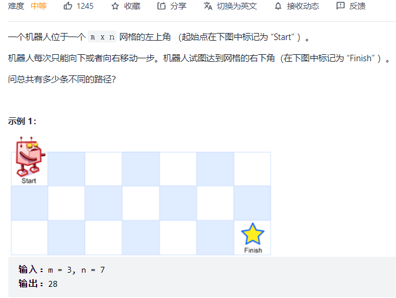

```python
class Solution:
    def uniquePaths(self, m: int, n: int) -> int:
        dp = [[0] * n for _ in range(m)]
        for i in range(n):
            dp[0][i] = 1
        for i in range(m):
            dp[i][0] = 1
        for i in range(1, m):
            for j in range(1, n):
                dp[i][j] = dp[i-1][j] + dp[i][j-1]
        return dp[-1][-1]
```

#### [63. 不同路径 II](https://leetcode-cn.com/problems/unique-paths-ii/)

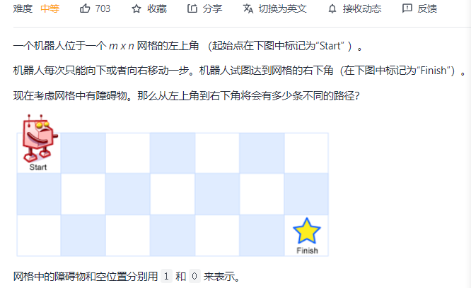

```python
class Solution:
    def uniquePathsWithObstacles(self, obstacleGrid: List[List[int]]) -> int:
        m, n = len(obstacleGrid), len(obstacleGrid[0])
        dp = [[0] * n for _ in range(m)]
        for i in range(n):
            if obstacleGrid[0][i] == 1: break
            dp[0][i] = 1
        for i in range(m):
            if obstacleGrid[i][0] == 1: break
            dp[i][0] = 1
        for i in range(1, m):
            for j in range(1, n):
                if obstacleGrid[i][j] == 1:
                    continue
                dp[i][j] = dp[i-1][j] + dp[i][j-1]
        return dp[-1][-1]
```

#### [343. 整数拆分](https://leetcode-cn.com/problems/integer-break/)

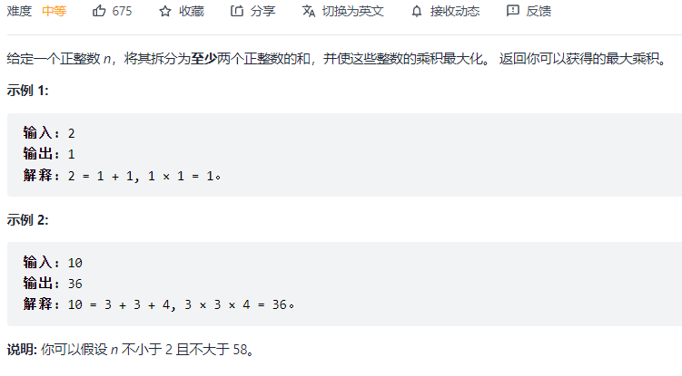

```python
class Solution:
    def integerBreak(self, n: int) -> int:
        dp = [0] * (n + 1)
        dp[1] = 1
        dp[2] = 1
        for i in range(3, n + 1):
            for j in range(1, i):
                dp[i] = max(dp[i], j * (i-j), j * dp[i-j])
        return dp[-1]
```

#### [96. 不同的二叉搜索树:star::star:](https://leetcode-cn.com/problems/unique-binary-search-trees/)

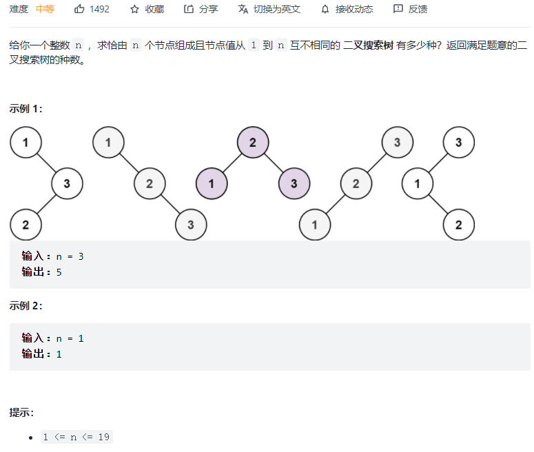

```python
class Solution:
    def numTrees(self, n: int) -> int:
        dp = [0] * (n + 1)
        dp[0] = 1
        dp[1] = 1
        for i in range(2, n + 1):
            for j in range(i):
                dp[i] += dp[j] * dp[i - j - 1]
        return dp[-1]
```

#### [416. 分割等和子集](https://leetcode-cn.com/problems/partition-equal-subset-sum/)

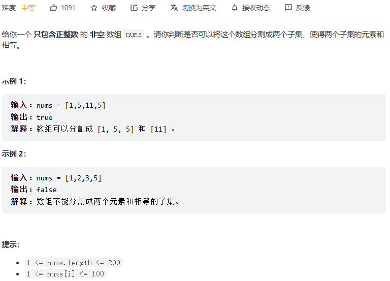

```python
class Solution:
    def canPartition(self, nums: List[int]) -> bool:
        s = sum(nums)
        if s % 2 == 1: return False
        s = s // 2
        dp = [0] * (s+1)  # [0, 1, 2, ...11]

        for i in range(len(nums)):
            for j in range(s, -1, -1):  # [10, 9, ...0]
                if j < nums[i]: continue

                dp[j] = max(dp[j], dp[j - nums[i]] + nums[i])
        return dp[-1] == s
```

#### [1049. 最后一块石头的重量 II](https://leetcode-cn.com/problems/last-stone-weight-ii/)

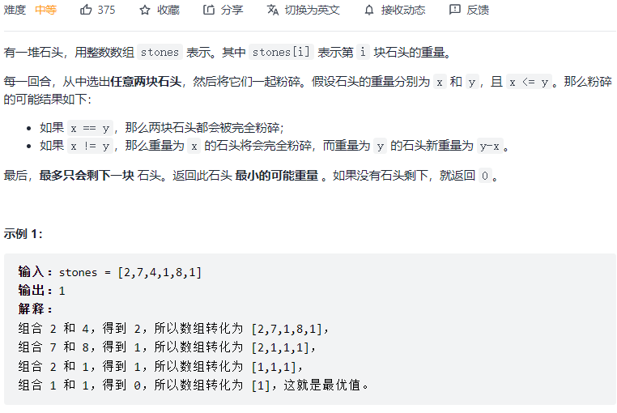

```python
class Solution:
    def lastStoneWeightII(self, stones: List[int]) -> int:
        s = sum(stones)
        target = s // 2
        dp = [0] * (target + 1)
        for i in range(len(stones)):
            for j in range(target, stones[i] - 1, -1):
                dp[j] = max(dp[j], dp[j - stones[i]] + stones[i])
        return (s - dp[target]) - dp[target]
```

#### [494. 目标和:star::star::star:](https://leetcode-cn.com/problems/target-sum/)

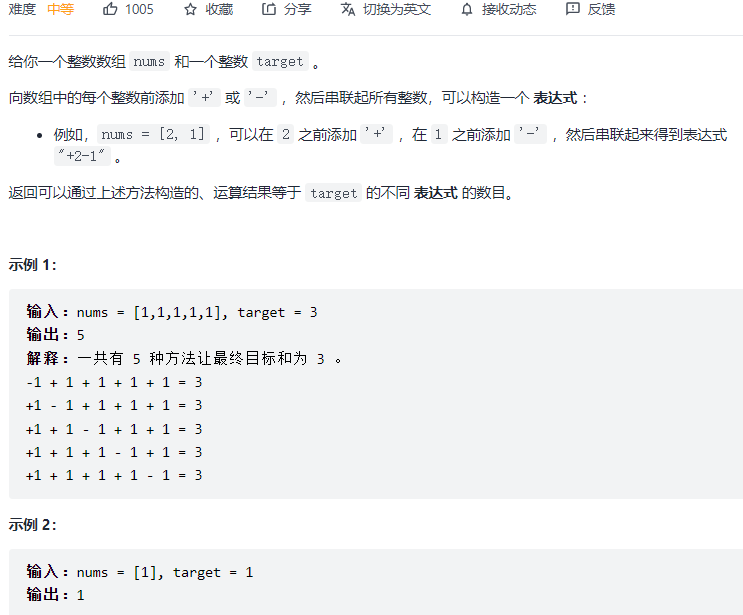

```python
class Solution:
    def findTargetSumWays(self, nums: List[int], target: int) -> int:
        sumValue = sum(nums)
        if target > sumValue or (sumValue + target) % 2 == 1: return 0
        bagSize = abs((sumValue + target) // 2)
        dp = [0] * (bagSize + 1)
        dp[0] = 1
        for i in range(len(nums)):
            for j in range(bagSize, nums[i] - 1, -1):
                dp[j] += dp[j - nums[i]]
        return dp[bagSize]
```

#### [474. 一和零:star::star:](https://leetcode-cn.com/problems/ones-and-zeroes/)

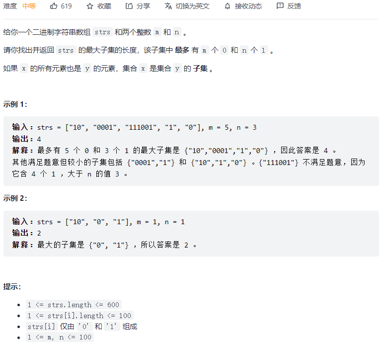

```python
class Solution:
    def findMaxForm(self, strs: List[str], m: int, n: int) -> int:
        dp = [[0] * (n + 1) for _ in range(m + 1)]

        for str in strs:
            one_cnt = 0
            zero_cnt = 0
            for c in str:
                if c == '1': one_cnt += 1
                else: zero_cnt += 1
            for i in range(m, zero_cnt - 1, -1):
                for j in range(n, one_cnt - 1, -1):
                    dp[i][j] = max(dp[i][j], dp[i - zero_cnt][j - one_cnt] + 1)
        return dp[m][n]
```

#### [518. 零钱兑换 II](https://leetcode-cn.com/problems/coin-change-2/)

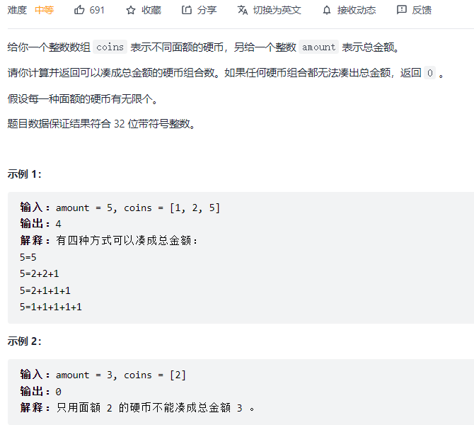

```python
class Solution:
    def change(self, amount: int, coins: List[int]) -> int:
        dp = [0] * (amount + 1)
        dp[0] = 1
        for i in range(len(coins)):
            for j in range(coins[i], amount + 1):
                dp[j] += dp[j - coins[i]]
        return dp[-1]
```

#### [377. 组合总和 Ⅳ](https://leetcode-cn.com/problems/combination-sum-iv/)

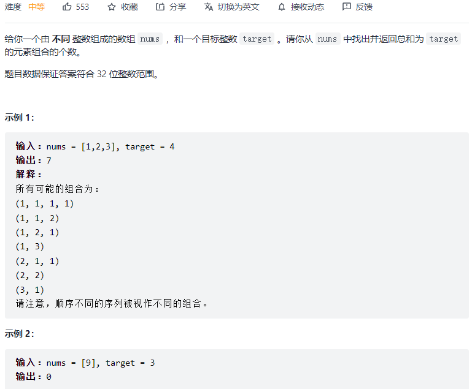

```python
class Solution:
    def combinationSum4(self, nums: List[int], target: int) -> int:
        dp = [0] * (target + 1)
        dp[0] = 1
        for i in range(1, target + 1):
            for j in range(len(nums)):
                if i < nums[j]: continue
                dp[i] += dp[i - nums[j]]
        return dp[-1]
```

#### [322. 零钱兑换](https://leetcode-cn.com/problems/coin-change/)

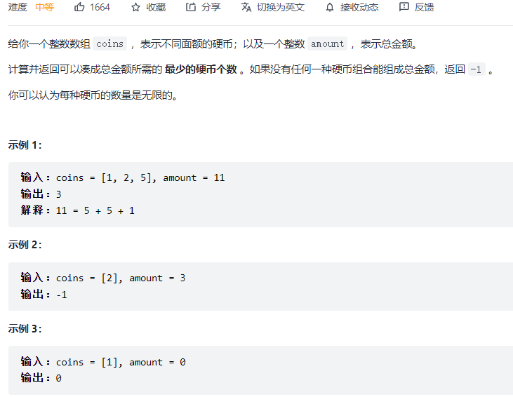

```python
class Solution:
    def coinChange(self, coins: List[int], amount: int) -> int:
        dp = [amount + 1] * (amount + 1)
        dp[0] = 0
        for i in range(1, amount + 1):
            for j in range(len(coins)):
                if i < coins[j]: continue
                dp[i] = min(dp[i], dp[i - coins[j]] + 1)
        if dp[amount] == amount + 1:
            return -1
        else:
            return dp[amount]
```

#### [279. 完全平方数](https://leetcode-cn.com/problems/perfect-squares/)

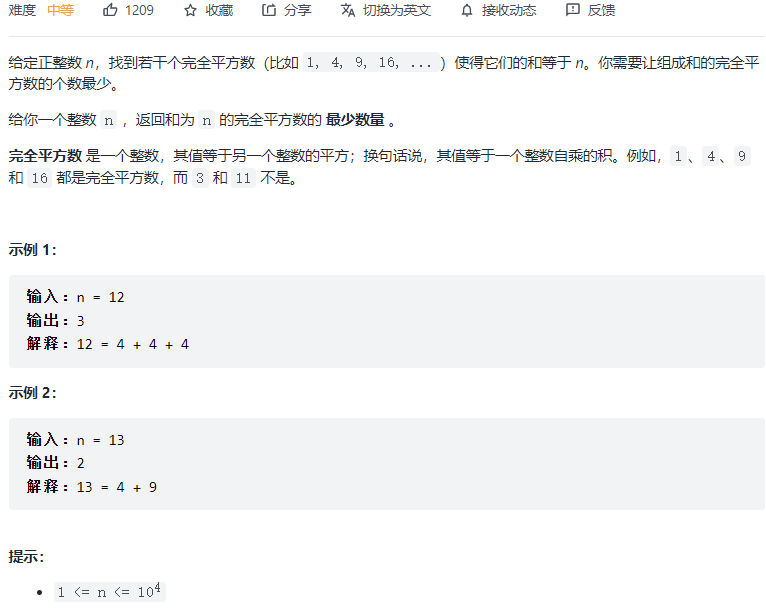

```python
class Solution:
    def numSquares(self, n: int) -> int:
        dp = [n] * (n + 1)
        dp[0] = 0
        for i in range(1, n + 1):
            if i * i > n: break
            for j in range(n + 1):
                if j < i * i: continue
                dp[j] = min(dp[j], dp[j - i * i] + 1)
        return dp[n]
```

#### [139. 单词拆分](https://leetcode-cn.com/problems/word-break/)

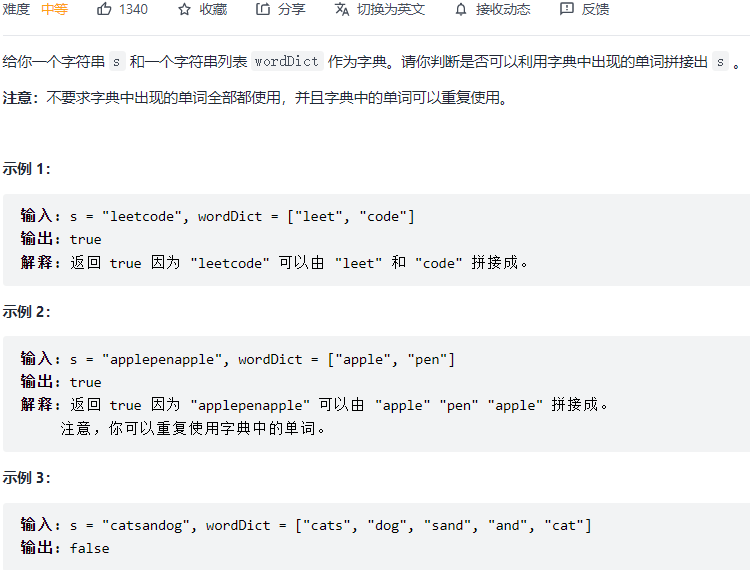

```python
class Solution:
    def wordBreak(self, s: str, wordDict: List[str]) -> bool:
        n = len(s)
        dp = [False] * (n + 1)
        dp[0] = True
        for i in range(1, n + 1):
            for j in range(len(wordDict)):
                if i < len(wordDict[j]): continue
                dp[i] = dp[i] or  ( dp[i - len(wordDict[j])] and wordDict[j] == s[i-len(wordDict[j]): i])
        return dp[n]
```

#### [198. 打家劫舍](https://leetcode-cn.com/problems/house-robber/)

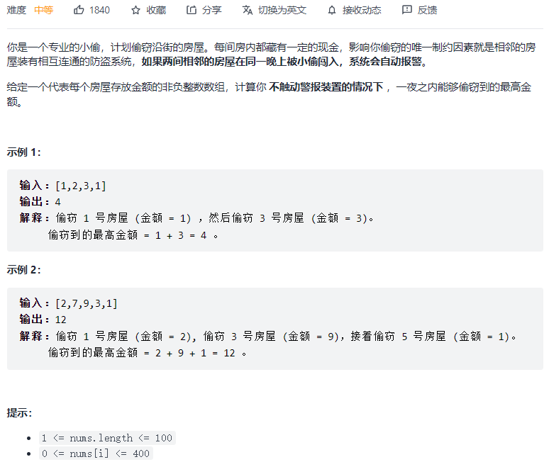

```python
class Solution:
    def rob(self, nums: List[int]) -> int:
        if len(nums) == 1: return nums[0]
        if len(nums) <= 2: return max(nums)
        dp = [0] * len(nums)
        dp[0] = nums[0]
        dp[1] = max(nums[0], nums[1])
        for i in range(2, len(nums)):
            dp[i] = max(dp[i - 2] + nums[i], dp[i - 1])
        return dp[-1]
```

#### [213. 打家劫舍 II](https://leetcode-cn.com/problems/house-robber-ii/)

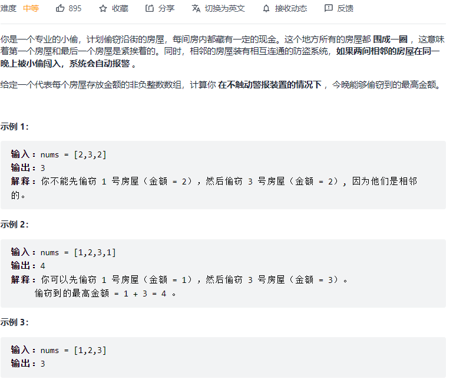

```python
class Solution:
    def rob(self, nums: List[int]) -> int:
        def helper(nums, start, end):
            if start == end: return nums[start]
            if start + 1 == end: return max(nums[start], nums[end])
            dp = [0] * (end - start + 1)
            for i in range(len(dp)):
                dp[i] = max(dp[i - 2] + nums[i + start], dp[i - 1])
            return dp[-1]
        
        if len(nums) == 1: return nums[0]
        if len(nums) <= 2: return max(nums[0], nums[1])
        return max(helper(nums, 0, len(nums) -2), helper(nums, 1, len(nums)-1))
```

#### [337. 打家劫舍 III](https://leetcode-cn.com/problems/house-robber-iii/)

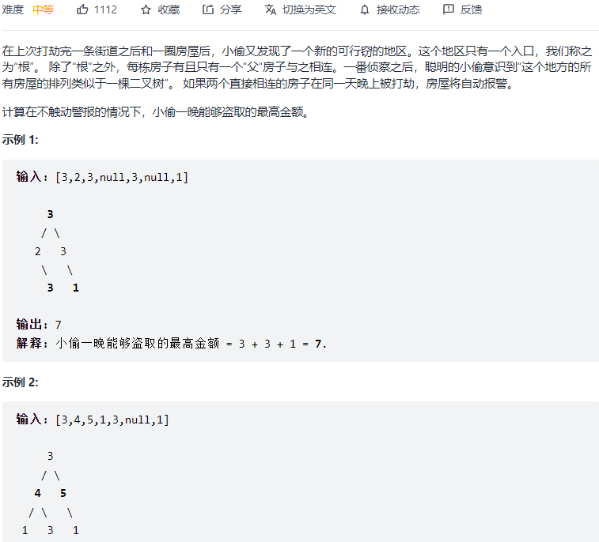

```python
class Solution:
    def rob(self, root: TreeNode) -> int:
        def helper(root):
            if not root: return 0, 0
            left = helper(root.left)
            right = helper(root.right)

            # 偷root, 则left和right不能偷
            rob_val = root.val + left[1] + right[1]

            # 不偷root
            notrob_val = max(left[0], left[1]) + max(right[0], right[1])
            return rob_val, notrob_val
        return max(helper(root))
```

#### [121. 买卖股票的最佳时机](https://leetcode-cn.com/problems/best-time-to-buy-and-sell-stock/)

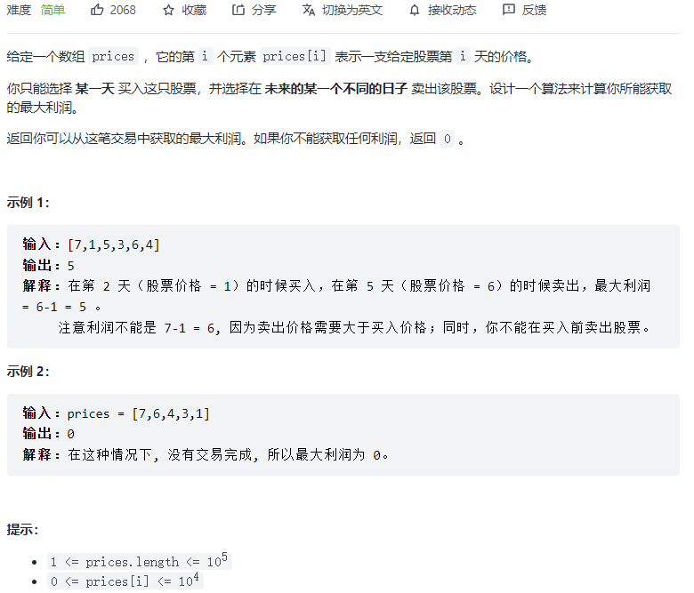

```python
class Solution:
    def maxProfit(self, prices: List[int]) -> int:
        dp = [[0] * 2 for _ in range(len(prices))]
        # 第1天持有
        dp[0][0] = -prices[0]
        for i in range(1, len(prices)):
            dp[i][0] = max(dp[i-1][0], -prices[i])
            dp[i][1] = max(dp[i-1][1], dp[i-1][0] + prices[i])
        return dp[-1][1]
```

#### [122. 买卖股票的最佳时机 II](https://leetcode-cn.com/problems/best-time-to-buy-and-sell-stock-ii/)

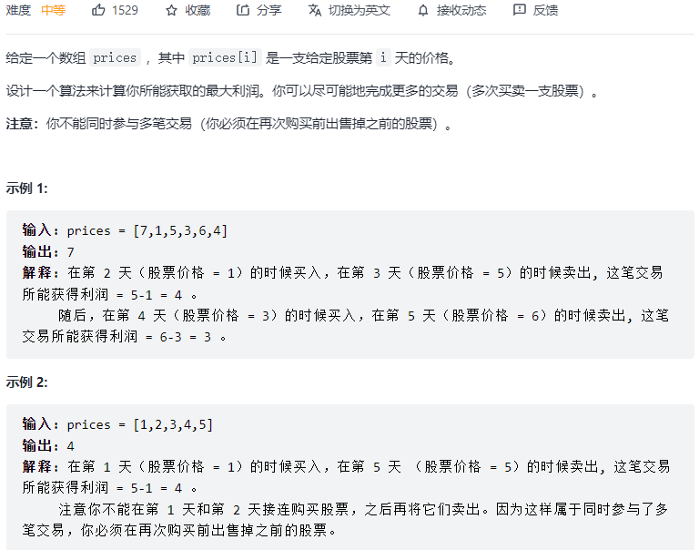

```python
class Solution:
    def maxProfit(self, prices: List[int]) -> int:
        dp = [[0] * 2 for _ in range(len(prices))]
        dp[0][0] = -prices[0]
        for i in range(1, len(prices)):
            dp[i][0] = max(dp[i-1][0], dp[i-1][1] - prices[i])
            dp[i][1] = max(dp[i-1][1], dp[i-1][0] + prices[i])
        return dp[-1][1]
```

#### [123. 买卖股票的最佳时机 III](https://leetcode-cn.com/problems/best-time-to-buy-and-sell-stock-iii/)

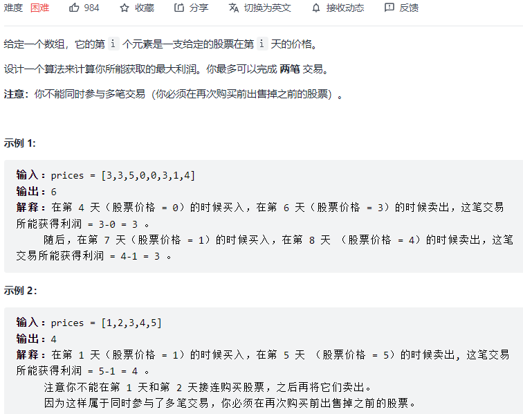

```python
class Solution:
    def maxProfit(self, prices: List[int]) -> int:
        # 至多2次交易，可以一次都不交易，可以一次，可以两次，所以是五种状态
        dp = [[0] * 5 for _ in range(len(prices))]
        dp[0][1] = -prices[0]
        dp[0][3] = -prices[0]
        for i in range(1, len(prices)):
            dp[i][0] = dp[i-1][0]
            dp[i][1] = max(dp[i-1][1], dp[i-1][0] - prices[i])
            dp[i][2] = max(dp[i-1][2], dp[i-1][1] + prices[i])
            dp[i][3] = max(dp[i-1][3], dp[i-1][2] - prices[i])
            dp[i][4] = max(dp[i-1][4], dp[i-1][3] + prices[i])
        return dp[-1][-1]
```

#### [188. 买卖股票的最佳时机 IV](https://leetcode-cn.com/problems/best-time-to-buy-and-sell-stock-iv/)

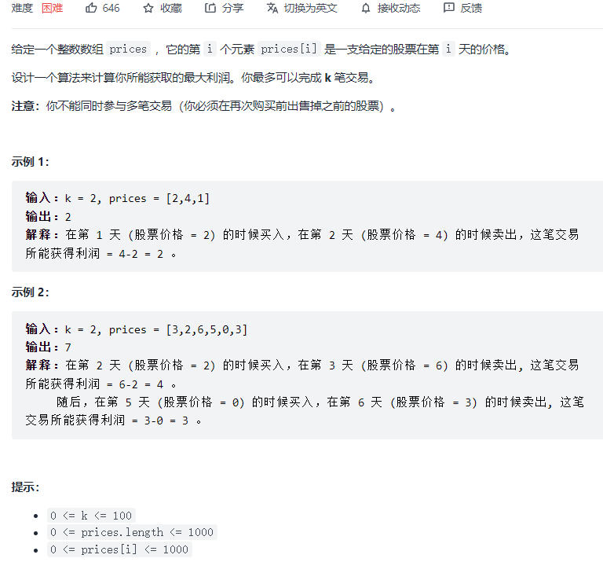

```python
class Solution:
    def maxProfit(self, k: int, prices: List[int]) -> int:
        if len(prices) <= 1: return 0
        
        dp = [[0] * (2 * k + 1) for _ in range(len(prices))]
        for j in range(1, 2 * k + 1, 2):
            dp[0][j] = -prices[0]
        for i in range(1, len(prices)):
            for j in range(1, 2 * k + 1):
                if j % 2 == 1:
                    dp[i][j] = max(dp[i-1][j], dp[i][j-1] - prices[i])
                else:
                    dp[i][j] = max(dp[i-1][j], dp[i][j-1] + prices[i])
        return dp[-1][-1]
```

#### [309. 最佳买卖股票时机含冷冻期:star::star::star::star:](https://leetcode-cn.com/problems/best-time-to-buy-and-sell-stock-with-cooldown/)

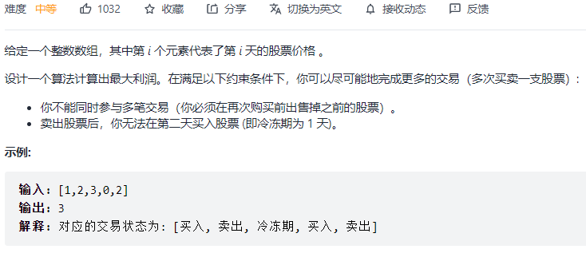

```python
class Solution:
    def maxProfit(self, prices: List[int]) -> int:
        dp = [[0] * 4 for _ in range(len(prices))]
        dp[0][0] = -prices[0]
        # 持有 卖出 冷冻期 冷冻期后保持不持有，冷冻期后一天买入 冷冻期后保持不持有今天买入 
        for i in range(1, len(prices)):
            # 持有状态：
            # 1）保持前一天的持有状态 2）前一天是冷冻期 3）冷冻期后 保持前一天的不持有，今天买入
            dp[i][0] = max(dp[i-1][0], dp[i-1][3] - prices[i], dp[i-1][1] - prices[i])

            # 冷冻期后 不持有的状态
            # 1)前一天就是不持有，2）前一天是冷冻期
            dp[i][1] = max(dp[i-1][1], dp[i-1][3])

            # 今天卖出的
            dp[i][2] = dp[i-1][0] + prices[i]

            # 今天是冷冻期
            dp[i][3] = dp[i-1][2]
        return max(dp[-1][1], dp[-1][2], dp[-1][3])
```

#### [714. 买卖股票的最佳时机含手续费](https://leetcode-cn.com/problems/best-time-to-buy-and-sell-stock-with-transaction-fee/)

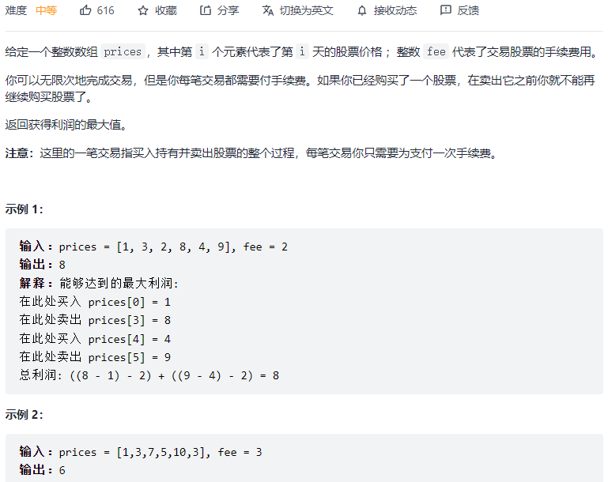

```python
class Solution:
    def maxProfit(self, prices: List[int], fee: int) -> int:
        dp = [[0] * 2 for _ in range(len(prices))]
        dp[0][0] = -prices[0]
        for i in range(1, len(prices)):
            dp[i][0] = max(dp[i-1][0], dp[i-1][1] - prices[i])
            dp[i][1] = max(dp[i-1][1], dp[i-1][0] + prices[i] - fee)
        return dp[-1][1]
```

#### [300. 最长递增子序列](https://leetcode-cn.com/problems/longest-increasing-subsequence/)

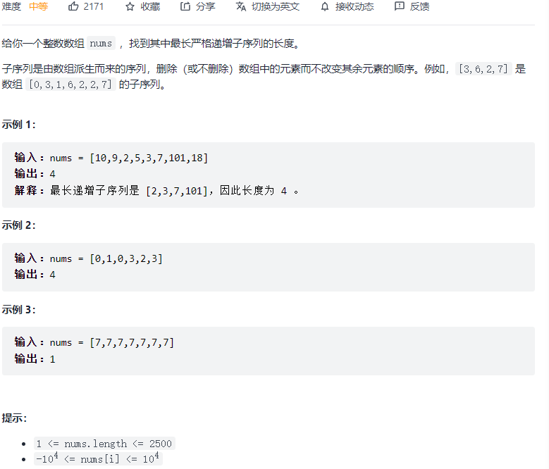

```python
class Solution:
    def lengthOfLIS(self, nums: List[int]) -> int:
        dp = [1] * (len(nums))
        res = 1
        for i in range(1, len(nums)):
            for j in range(i):
                if nums[i] > nums[j]:
                    dp[i] = max(dp[i], dp[j] + 1)
            res = max(res, dp[i])
        return res
```

#### [674. 最长连续递增序列](https://leetcode-cn.com/problems/longest-continuous-increasing-subsequence/)

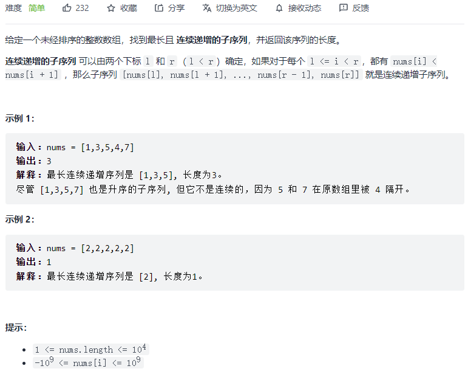

```python
class Solution:
    def findLengthOfLCIS(self, nums: List[int]) -> int:
        dp = [1] * (len(nums))
        res = 1
        for i in range(1, len(nums)):
            if nums[i] > nums[i-1]:
                dp[i] = dp[i-1] + 1
            res = max(res, dp[i])
        return res
```

