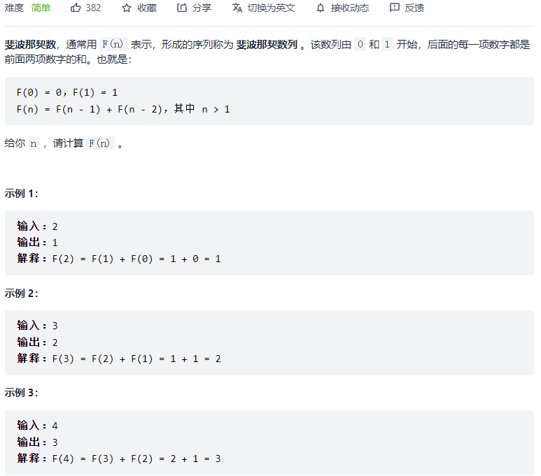
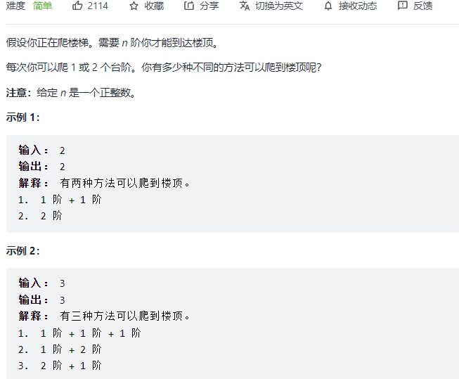

#### [509. 斐波那契数](https://leetcode-cn.com/problems/fibonacci-number/)



```python
class Solution:
    def fib(self, n: int) -> int:
        if n <= 1:
            return n
        a, b = 0, 1
        for i in range(2, n + 1):
            a, b = b, a + b
        return b
```

#### [70. 爬楼梯](https://leetcode-cn.com/problems/climbing-stairs/)



```python
class Solution:
    def climbStairs(self, n: int) -> int:
        if n <= 2:
            return n
        dp = [0] * (n + 1)
        dp[1] = 1
        dp[2] = 2
        for i in range(3, n + 1):
            dp[i] = dp[i-1] + dp[i-2]
        return dp[-1]
```

