#### [3. 无重复字符的最长子串:star::star::star:](https://leetcode-cn.com/problems/longest-substring-without-repeating-characters/)

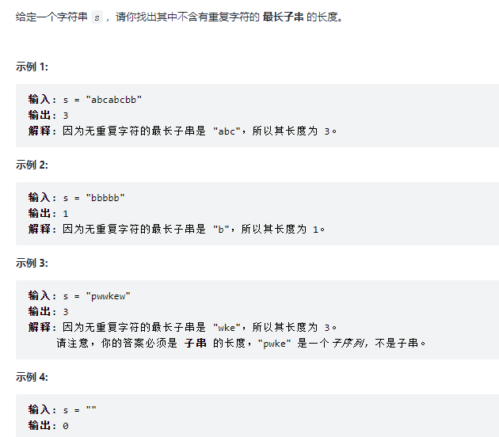

```python
class Solution:
    def lengthOfLongestSubstring(self, s: str) -> int:
        left, right = 0, 0
        window = {}
        res = 0

        # 滑动窗口 左闭右闭
        while right < len(s):
            # 处理右
            if s[right] not in window:
                window[s[right]] = 1
            else:
                window[s[right]] += 1

            # 满足条件 处理左
            while window[s[right]] > 1:                
                window[s[left]] -= 1
                left += 1
            right += 1
            
            # 更新答案
            res = max(res, right - left)
        return res
```

#### [11. 盛最多水的容器:star:](https://leetcode-cn.com/problems/container-with-most-water/)

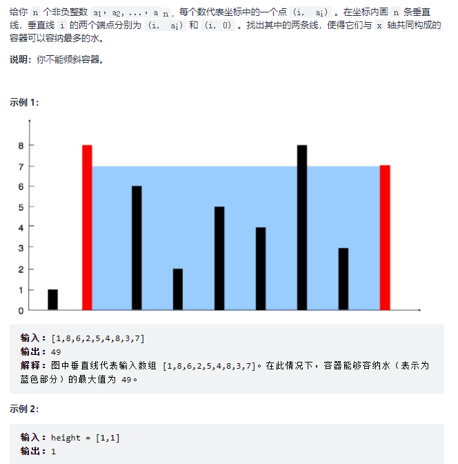

```python
class Solution:
    def maxArea(self, height: List[int]) -> int:
        res = 0
        left, right = 0, len(height)-1
        while left < right:
            res = max(res, min(height[left], height[right]) * (right - left))
            if height[left] < height[right]:
                left += 1
            else:
                right -= 1
        return res
```

#### [15. 三数之和](https://leetcode-cn.com/problems/3sum/)

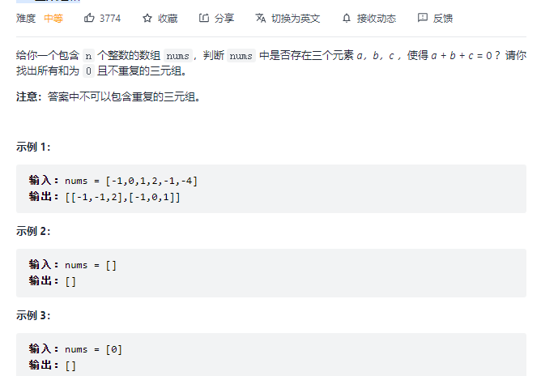

```python
class Solution:
    def threeSum(self, nums: List[int]) -> List[List[int]]:
        if len(nums) < 3: return []

        n = len(nums)
        nums.sort()
        res = []
        for i in range(0, n-2):
            if i > 0 and nums[i] == nums[i-1]: continue
            target = - nums[i]

            k = n - 1
            for j in range(i+ 1, n-1):
                if j > i + 1 and nums[j] == nums[j-1]: continue
                
                target = - nums[i]
                while j < k and nums[j] + nums[k] > target: k -= 1

                if j == k: break

                if nums[j] + nums[k] == target:
                    res.append([nums[i], nums[j], nums[k]])

        return res
```

#### [16. 最接近的三数之和](https://leetcode-cn.com/problems/3sum-closest/)

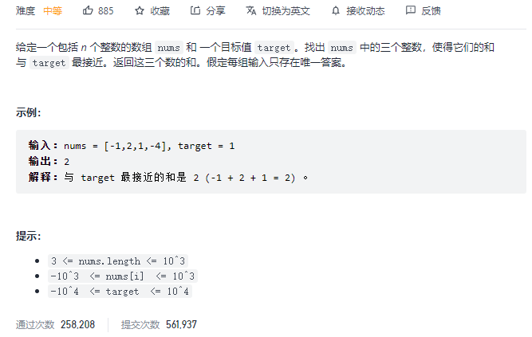

```python
class Solution:
    def threeSumClosest(self, nums: List[int], target: int) -> int:
        diff = float('inf')
        res = 0
        nums.sort()

        n = len(nums)
        for i in range(n):
            if i > 0 and nums[i] == nums[i-1]: continue

            left, right = i + 1, n-1
            while left < right:
                s = nums[i] + nums[left] + nums[right]
                if abs(target - s) < diff:
                    diff = abs(target - s)
                    res = s

                if s < target:
                    left += 1
                elif s > target:
                    right -= 1
                else:
                    while left < right and nums[left] == nums[left + 1]: left += 1
                    while left < right and nums[right] == nums[right - 1]: right -= 1
                    left += 1
                    right -= 1
        return res
```

#### [18. 四数之和](https://leetcode-cn.com/problems/4sum/)

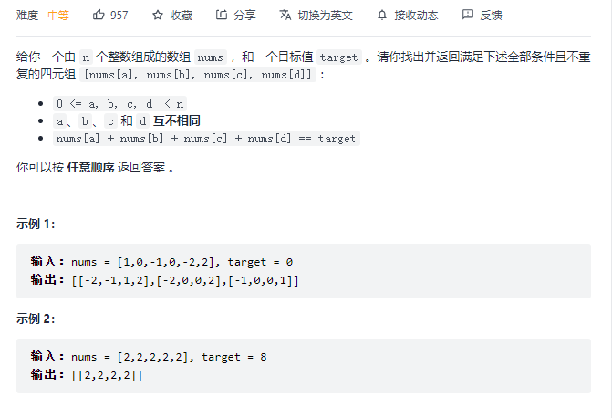

```python
class Solution:
    def fourSum(self, nums: List[int], target: int) -> List[List[int]]:
        nums.sort()
        n = len(nums)
        res = []
        for i in range(n):
            if i > 0 and nums[i] == nums[i-1]: continue

            for j in range(i+1, n):
                if j > i + 1 and nums[j] == nums[j-1]: continue

                left, right = j + 1, n-1
                while left < right:
                    s = nums[i] + nums[j] + nums[left] + nums[right]
                    if s == target:
                        res.append([nums[i], nums[j], nums[left], nums[right]])
                        while left < right and nums[left] == nums[left + 1]: left += 1
                        while left < right and nums[right] == nums[right -1]: right -= 1
                        left += 1
                        right -= 1
                    elif s < target:
                        left += 1
                    else:
                        right -= 1
        return res
```

#### [19. 删除链表的倒数第 N 个结点](https://leetcode-cn.com/problems/remove-nth-node-from-end-of-list/)

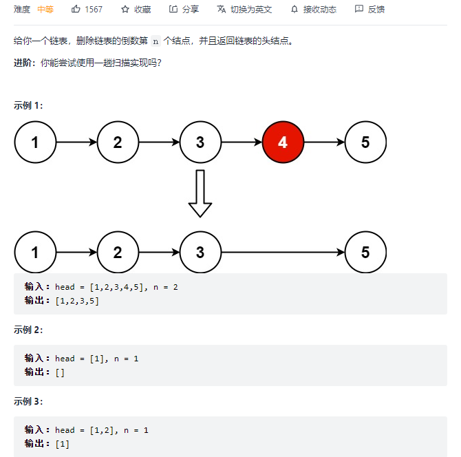

```python
# Definition for singly-linked list.
# class ListNode:
#     def __init__(self, val=0, next=None):
#         self.val = val
#         self.next = next
class Solution:
    def removeNthFromEnd(self, head: ListNode, n: int) -> ListNode:
        dummy = ListNode(-1)
        dummy.next = head
        fast, slow = dummy, dummy
        for _ in range(n):
            fast = fast.next
        
        while fast.next is not None:
            fast = fast.next
            slow = slow.next
        
        slow.next = slow.next.next
        return dummy.next
```

#### [26. 删除有序数组中的重复项](https://leetcode-cn.com/problems/remove-duplicates-from-sorted-array/)

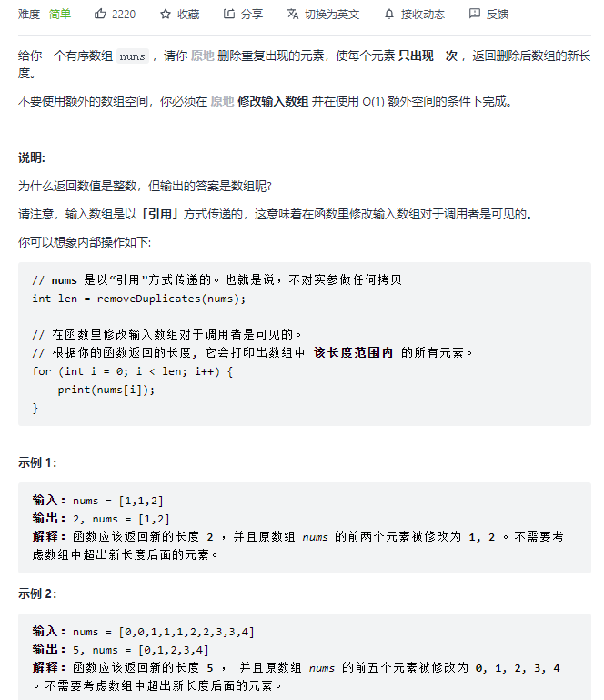

```python
class Solution:
    def removeDuplicates(self, nums: List[int]) -> int:
        cur = 0
        for i in range(1, len(nums)):
            if nums[i] != nums[cur]:
                cur += 1
                nums[cur] = nums[i]
        
        return cur + 1
```

#### [27. 移除元素](https://leetcode-cn.com/problems/remove-element/)

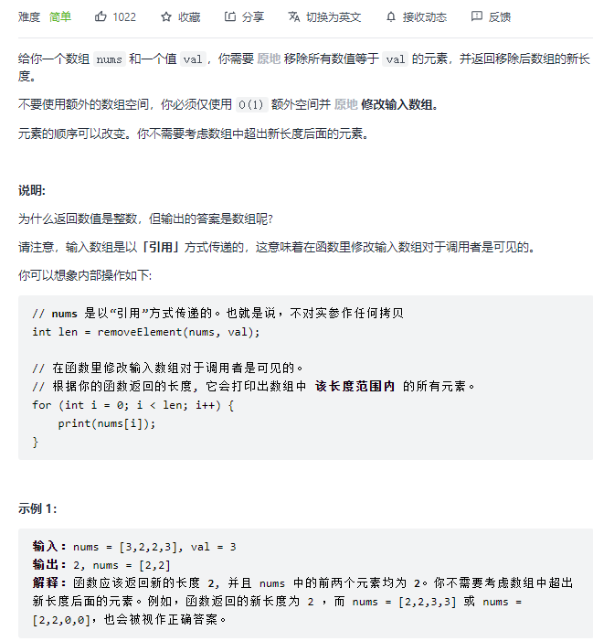

```python
class Solution:
    def removeElement(self, nums: List[int], val: int) -> int:

        cur = 0
        for i in range(len(nums)):
            if nums[i] != val:
                nums[i], nums[cur] = nums[cur], nums[i]
                cur += 1
        
        return cur
```

#### [45. 跳跃游戏 II:star::star::star:](https://leetcode-cn.com/problems/jump-game-ii/)

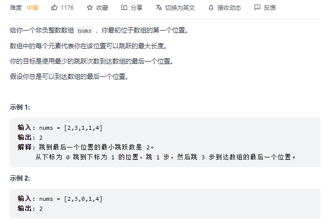

```python
class Solution:
    def jump(self, nums: List[int]) -> int:
        dp = [len(nums)] * (len(nums))
        dp[0] = 0

        for i in range(len(nums)):
            steps = nums[i]
            for j in range(1, steps + 1):
                if i + j >= len(nums): break
                dp[i+j] = min(dp[i+j], dp[i] + 1)
        return dp[-1]
```

#### [88. 合并两个有序数组](https://leetcode-cn.com/problems/merge-sorted-array/)

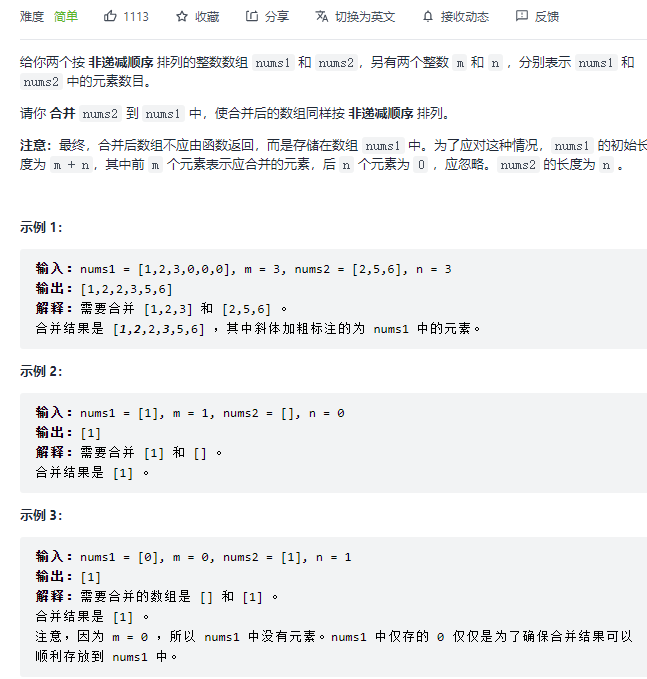

```python
class Solution:
    def merge(self, nums1: List[int], m: int, nums2: List[int], n: int) -> None:
        """
        Do not return anything, modify nums1 in-place instead.
        """
        cur = len(nums1)-1
        m -= 1
        n -= 1
        while m >= 0 and n >= 0:
            if nums2[n] > nums1[m]:
                nums1[cur] = nums2[n]
                n -= 1
            else:
                nums1[cur] = nums1[m]
                m -= 1
            cur -= 1

        while m >= 0:
            nums1[cur] = nums1[m]
            cur -= 1
            m -= 1
        while n >= 0:
            nums1[cur] = nums2[n]
            cur -= 1
            n -= 1
         
```

#### [345. 反转字符串中的元音字母](https://leetcode-cn.com/problems/reverse-vowels-of-a-string/)

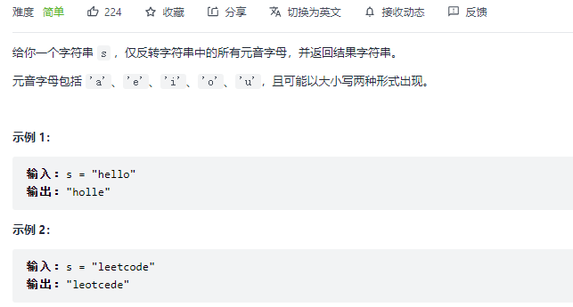

```python
class Solution:
    def reverseVowels(self, s: str) -> str:
        alpha = set(['a','e','i','o','u','A','E','I','O','U'])
        res = list(s)

        left, right = 0, len(s)-1
        while left < right:
            while left < right and res[left] not in alpha:
                left += 1
            while left < right and res[right] not in alpha:
                right -= 1
            res[left], res[right] = res[right], res[left]
            left += 1
            right -= 1
        
        return ''.join(res)
```

#### [395. 至少有 K 个重复字符的最长子串:star::star::star::star:](https://leetcode-cn.com/problems/longest-substring-with-at-least-k-repeating-characters/)

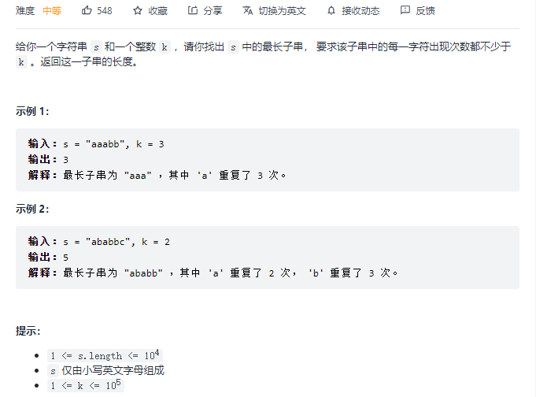

```python
class Solution:
    def longestSubstring(self, s: str, k: int) -> int:
        res = 0
        
        # 当窗口大小为t 满足条件时，t+1大小的窗口不一定满足条件，不具有二段性
        # 因为新加进来的字符如果出现在窗口中，可以满足条件
        # 如果新加进来的字符不在窗口中，就不能满足条件（当k>1时）
        # 此时没法用双指针或者滑动窗口直接做

        # 可以额外添加限制条件，因为s仅由26个英文字母组成
        # 所以限制窗口内恰好由cur_kind种字母组成，就具有二段性
        for cur_kind in range(1, 27):
            left, right = 0, 0
            cnt = [0] * 26
            # total表示窗口内的字符种类数，sum_kind表示窗口内满足出现次数不少于k的字符种类数
            total, sum_kind = 0, 0
            while right < len(s):
                idx = ord(s[right]) - ord('a')
                cnt[idx] += 1
                if cnt[idx] == 1: # 第一次出现
                    total += 1
                if cnt[idx] == k:
                    sum_kind += 1
                
                # 不满足二段性条件时
                while total > cur_kind:
                    left_idx = ord(s[left]) - ord('a')
                    if cnt[left_idx] == 1: total -= 1
                    if cnt[left_idx] == k: sum_kind -= 1
                    cnt[left_idx] -= 1
                    left += 1
                
                # 更新结果
                if total == sum_kind: res = max(res, right - left + 1)
                right += 1

        return res
```

#### [413. 等差数列划分:star::star:](https://leetcode-cn.com/problems/arithmetic-slices/)


```python
class Solution:
    def numberOfArithmeticSlices(self, nums: List[int]) -> int:
        """
        [1 2 3]         len=3   res=1
        [1 2 3 4]       len=4   res=3
        [1 2 3 4 5]     len=5   res=6
        [1 2 3 4 5 6]   len=6   res=10   
        """
        if len(nums) < 3: return 0
        d = nums[1] - nums[0]
        t = 0
        res = 0
        for i in range(2, len(nums)):
            if nums[i] - nums[i-1] == d:
                t += 1
            else:
                d = nums[i] - nums[i-1]
                t = 0
            res += t
        return res
```

#### [424. 替换后的最长重复字符:star::star:](https://leetcode-cn.com/problems/longest-repeating-character-replacement/)

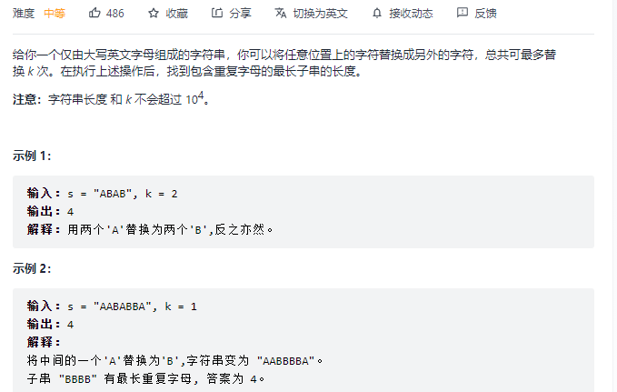

```python
class Solution:
    def characterReplacement(self, s: str, k: int) -> int:
        # 窗口[left, right] 修改次数k
        # 如果窗口是[A,A,B,A], 可以修改一次，
        # 只需记录窗口内，出现最多次的字母的个数，A出现次数最多是3，
        # 窗口大小此时为4， 3 + 1 >= 4 ，认为此窗口内都可以修改，更新结果
        
        left, right = 0, 0
        window = {}
        res = 0

        while right < len(s):
            if s[right] in window:
                window[s[right]] += 1
            else:
                window[s[right]] = 1
            
            while not self.check(window, k, left, right):
                window[s[left]] -= 1
                left += 1
            
            res = max(res, right - left + 1)
            right += 1
        return res
    
    def check(self, window, k, left, right):
        return max(window.values()) + k >= right - left + 1
```

#### [443. 压缩字符串:star::star:](https://leetcode-cn.com/problems/string-compression/)

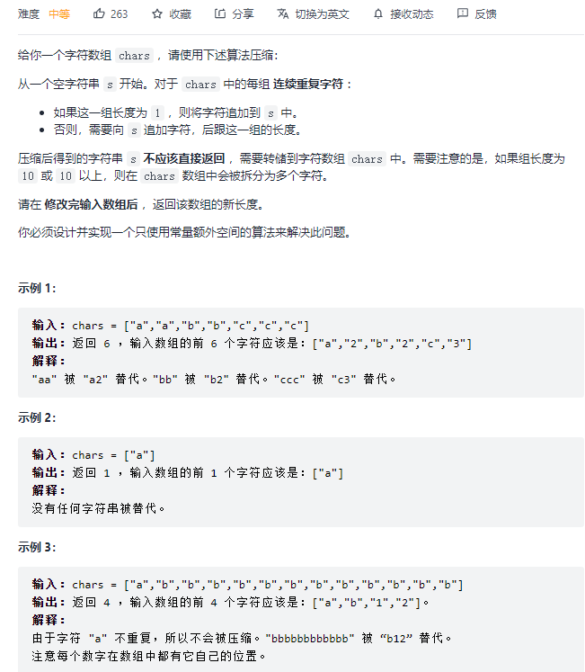

```python
class Solution:
    def compress(self, chars: List[str]) -> int:
        left, right = 0, 0
        res = 0
        while right < len(chars):
            while right < len(chars) and chars[left] == chars[right]: 
                right += 1

            chars[res] = chars[left]
            res += 1
            cnt = right - left

            if cnt == 1: pass
            elif cnt < 10: 
                chars[res] = str(cnt)
                res += 1
            else:
                pos = res + len(str(cnt)) - 1
                m = cnt
                while pos >= res:
                    chars[pos] = str(m % 10)
                    m = m // 10
                    pos -= 1
                
                res += len(str(cnt))

            left = right
        return res
```

#### [485. 最大连续 1 的个数](https://leetcode-cn.com/problems/max-consecutive-ones/)

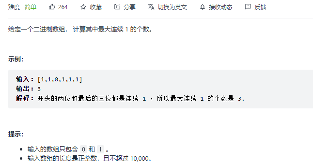

```python
class Solution:
    def findMaxConsecutiveOnes(self, nums: List[int]) -> int:
        res = 0
        left, right = 0, 0
        while right < len(nums):
            while right < len(nums) and nums[right] == 1: right += 1

            res = max(res, right - left)
            right += 1
            left = right    
        return res
```

#### [524. 通过删除字母匹配到字典里最长单词:star::star::star:](https://leetcode-cn.com/problems/longest-word-in-dictionary-through-deleting/)

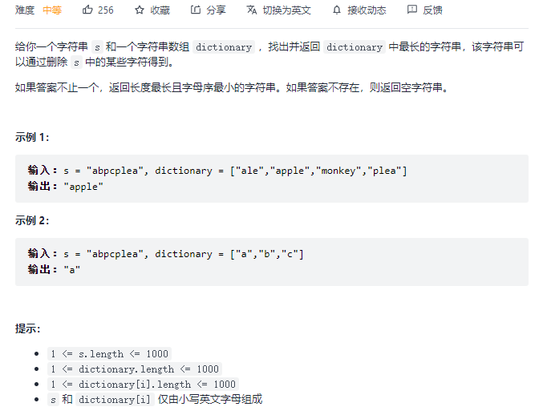

```python
class Solution:
    def findLongestWord(self, s: str, dictionary: List[str]) -> str:
        dictionary.sort(key=lambda x: [-len(x), x])
        for w in dictionary:
            p, q = 0, 0
            while p < len(s):
                if s[p] == w[q]:
                    q += 1

                if q == len(w):
                    return w
                p += 1
        return ""
```

#### [581. 最短无序连续子数组:star::star::star:](https://leetcode-cn.com/problems/shortest-unsorted-continuous-subarray/)

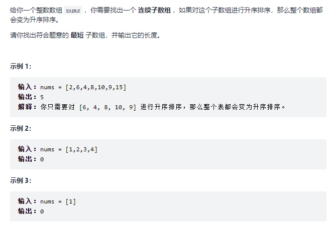

```python
class Solution:
    def findUnsortedSubarray(self, nums: List[int]) -> int:
        # 要求的子数组的最小值 应大于子数组左侧的最大值
        # 要求的子数组的最大值 应小于子数组右侧的最小值
        # 两次遍历
        
        # 从左到右 找右边界
        """m=max
          m r m  m r m
        2 6 4 8 10 9 15
        """
        max_idx, left, right = 0, 0, 0
        for i in range(1, len(nums)):
            if nums[i] >= nums[max_idx]:
                max_idx = i
            else:
                right = i
        """m=min
        m l m m l  m 
        2 6 4 8 10 9 15
        """
        min_idx = right
        for i in range(right-1, -1, -1):
            if nums[i] <= nums[min_idx]:
                min_idx = i
            else:
                left = i
        return right - left + 1 if right != left else 0
```

#### [633. 平方数之和](https://leetcode-cn.com/problems/sum-of-square-numbers/)

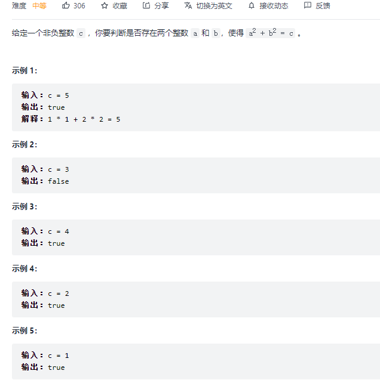

```python
class Solution:
    def judgeSquareSum(self, c: int) -> bool:
        i = 0
        j = int(c**0.5)
        while i <= j:
            s = i ** 2 + j ** 2
            if s == c: return True
            if s < c: i += 1
            else: j -= 1
        return False
```

#### [611. 有效三角形的个数:star::star::star:](https://leetcode-cn.com/problems/valid-triangle-number/)

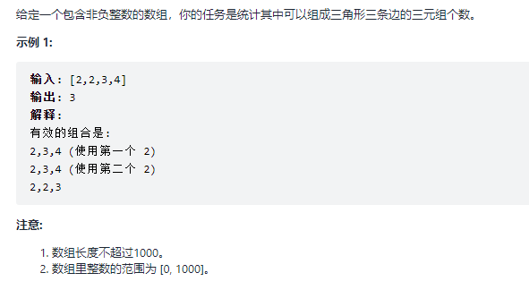

```python
class Solution:
    def triangleNumber(self, nums: List[int]) -> int:
        # 代码与三数之和相似
        res = 0
        # 排序后 可以方便控制最小的两条边 和最大的边
        nums.sort()
        # 固定最大值
        for i in range(len(nums)-1, 1, -1):
            left, right = 0, i - 1
            while left < right:
                # left和right可以满足，那么固定right，此窗口内的所有值作为left均可以满足条件
                if nums[left] + nums[right] > nums[i]:
                    res += right - left
                    right -= 1
                else:
                    left += 1
        return res
```

#### [832. 翻转图像](https://leetcode-cn.com/problems/flipping-an-image/)

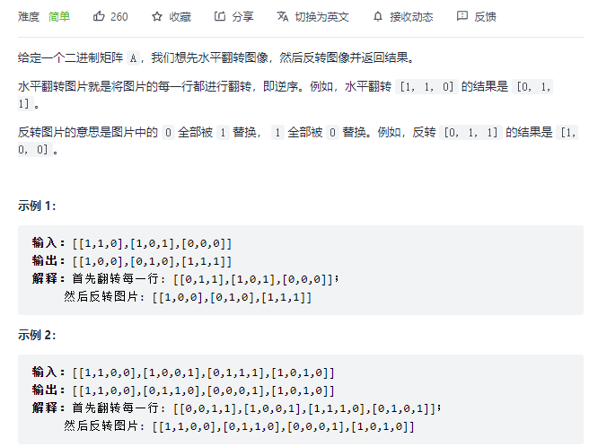

```python
class Solution:
    def flipAndInvertImage(self, image: List[List[int]]) -> List[List[int]]:
        for i in range(len(image)):
            left, right = 0, len(image[0])-1
            while left <= right:
                image[i][left], image[i][right] = 1 - image[i][right], 1 - image[i][left]
                left += 1
                right -= 1
        return image

```

#### [881. 救生艇](https://leetcode-cn.com/problems/boats-to-save-people/)

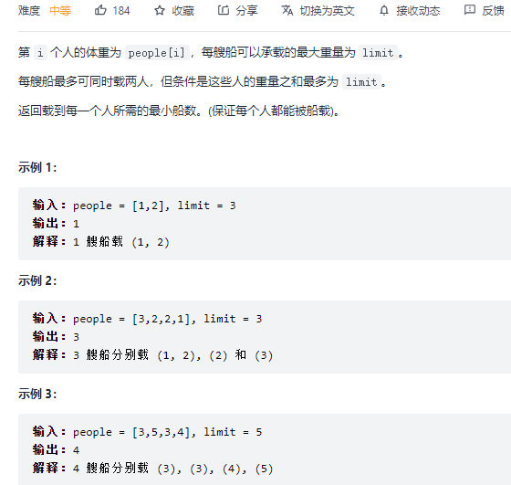

```python
class Solution:
    def numRescueBoats(self, people: List[int], limit: int) -> int:
        people.sort()
        res = 0
        left, right = 0, len(people) - 1
        while left <= right:
            if people[left] + people[right] > limit:
                right -= 1
            else:
                left += 1
                right -= 1
            res += 1
        return res
```

#### [930. 和相同的二元子数组:star::star::star:](https://leetcode-cn.com/problems/binary-subarrays-with-sum/)


```python
class Solution:
    def numSubarraysWithSum(self, nums: List[int], goal: int) -> int:
        # 前缀和+哈希表
        # 前缀和的每一项代表[0, r]的和，我们还需要确定left的位置，才能算出[left, right]的加和
        # 反过来，知道[0,r]的和，知道goal，那么[0,r]-goal的和，可以算出[0, left-1]的和，
        # 此时我们只需用哈希表记录left出现的次数即可
        pre_sum = [0] + list(accumulate(nums))
        dic = defaultdict(int, {0: 1})
        res = 0

        for i in range(len(nums)):
            r = pre_sum[i+1]
            res += dic[r - goal]
            dic[r] += 1
        return res
```

#### [992. K 个不同整数的子数组:star::star::star::star::star:](https://leetcode-cn.com/problems/subarrays-with-k-different-integers/)

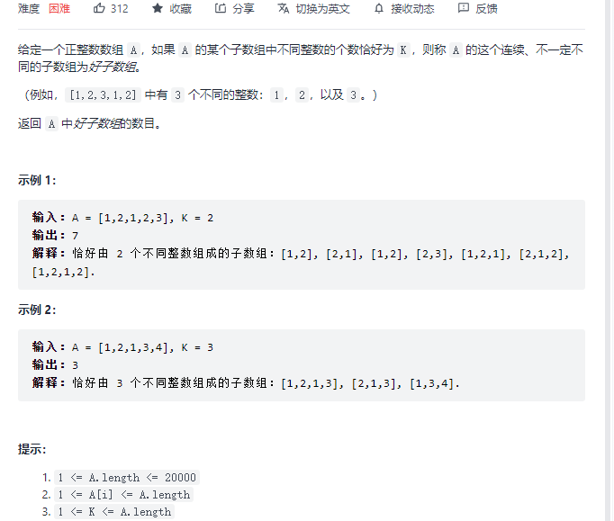

```python
class Solution:
    def subarraysWithKDistinct(self, nums: List[int], k: int) -> int:
        # 1. 将 k个不同整数的子数组 的问题转换为 最多k个不同整数的子数组-最多k-1个不同整数的子数组 ；
        # 2. 求最多n个不同整数的子数组时，每次增加合法区间的 left-right个，
        #  该过程正如我们在纸上手算的过程，总过程类似等差数列： 1+2+……+n ，即每次新增的区间点，
        #  除了增加自己以外，还要和前面的区间点组成子数组，所以为 n-1+1 ，即每次加n。
        return self.mostK(nums, k) - self.mostK(nums, k-1)
    
    def mostK(self, nums, k):
        left, right = 0, 0
        cnt = 0  # 出现的字符的种类数
        dic = {}
        res = 0
        while right < len(nums):
            if nums[right] not in dic:
                dic[nums[right]] = 1
            else:
                dic[nums[right]] += 1
            # 如果是第一次出现
            if dic[nums[right]] == 1:
                cnt += 1

            while cnt > k:
                dic[nums[left]] -= 1
                if dic[nums[left]] == 0:
                    cnt -= 1
                left += 1
            res += right - left
            right += 1
        return res
```

#### [1004. 最大连续1的个数 III](https://leetcode-cn.com/problems/max-consecutive-ones-iii/)

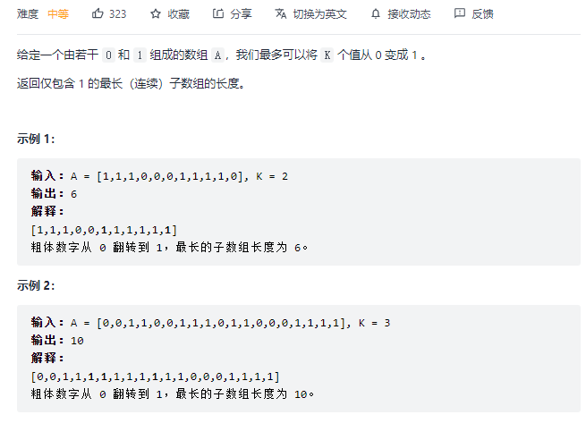

```python
class Solution:
    def longestOnes(self, nums: List[int], k: int) -> int:
        # 和424题类似
        # 窗口[0,1,1,1,0], k=2, 窗口大小此时为5，
        # 1的个数有3个，3+2>=5，此时可以将窗口全都改为1
        # 更新结果
        left, right = 0, 0
        cnt = 0
        res = 0
        while right < len(nums):
            if nums[right] == 1:
                cnt += 1
            
            while not (cnt + k >= right - left + 1):
                if nums[left] == 1:
                    cnt -= 1
                left += 1
            
            res = max(res, right - left + 1)
            right += 1
        return res
    
 class Solution:
    def longestOnes(self, nums: List[int], k: int) -> int:
        left, right = 0, 0
        window = 0
        res = 0
        while right < len(nums):
            window += nums[right]

            if right - left + 1 <= window + k:
                res = max(res, right - left + 1)
            else:
                window -= nums[left]
                left += 1

            right += 1
        return res
```

#### [1052. 爱生气的书店老板:star::star:](https://leetcode-cn.com/problems/grumpy-bookstore-owner/)


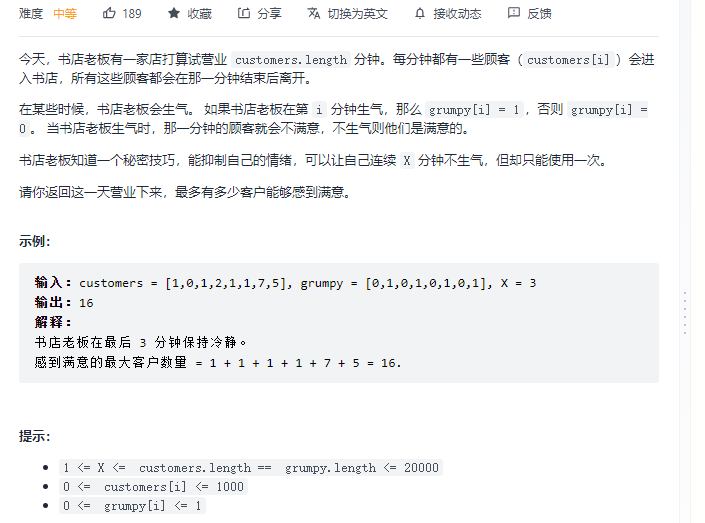

```python
class Solution:
    def maxSatisfied(self, customers: List[int], grumpy: List[int], minutes: int) -> int:
        # 没有抑制的情况下，前缀和
        before_x = [0] * (len(customers) + 1)
        for i in range(1, len(customers) + 1):
            before_x[i] = before_x[i-1] + customers[i-1] * (1 - grumpy[i-1])
        
        left, right = 0, 0
        window_sum = 0
        res = 0
        while right < len(customers):
            window_sum += customers[right]

            if right - left + 1 == minutes:
                # 更新结果
                left_res = before_x[left]
                right_res = before_x[-1] - before_x[right + 1]
                res = max(res, window_sum + left_res + right_res)
                
                # 处理左
                window_sum -= customers[left]
                left += 1
            right += 1
        return res
```

#### [1221. 分割平衡字符串](https://leetcode-cn.com/problems/split-a-string-in-balanced-strings/)

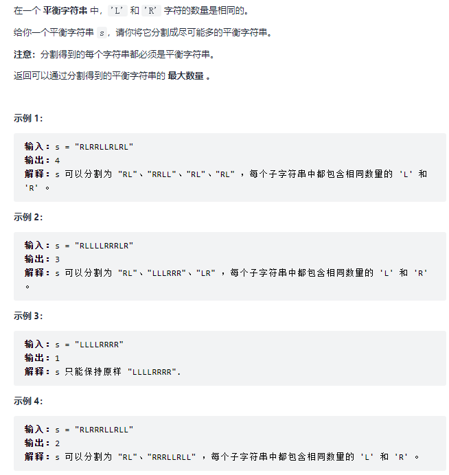

```python
class Solution:
    def balancedStringSplit(self, s: str) -> int:
        right = 0
        l_cnt, r_cnt = 0, 0
        res = 0

        while right < len(s):
            if s[right] == 'L':
                l_cnt += 1
            else:
                r_cnt += 1
            
            if l_cnt == r_cnt:
                res += 1
                l_cnt = 0
                r_cnt = 0

            right += 1
        return res
```

#### [1764. 通过连接另一个数组的子数组得到一个数组](https://leetcode-cn.com/problems/form-array-by-concatenating-subarrays-of-another-array/)

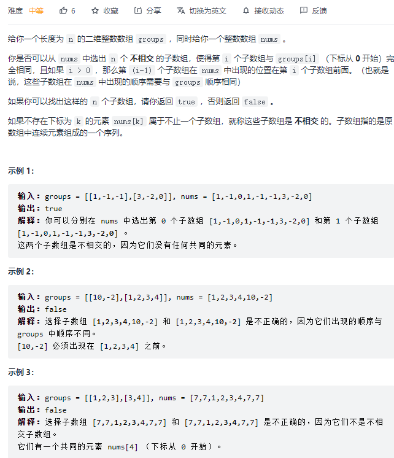

```python
class Solution:
    def canChoose(self, groups: List[List[int]], nums: List[int]) -> bool:

        i = 0
        group = groups.pop()

        while i < len(nums):
            # 找到第一个num[i]==group[0]的位置
            while i < len(nums) and nums[i] != group[0]:
                i += 1
            
            # 判断切片和group是否相等
            if nums[i: i + len(group)] == group:
                # 相等，则判断下一个切片位置
                i += len(group)
                if not groups:
                    return True
                group = groups.pop(0)
            else:
                i += 1
        return False
```

#### [1438. 绝对差不超过限制的最长连续子数组](https://leetcode-cn.com/problems/longest-continuous-subarray-with-absolute-diff-less-than-or-equal-to-limit/)

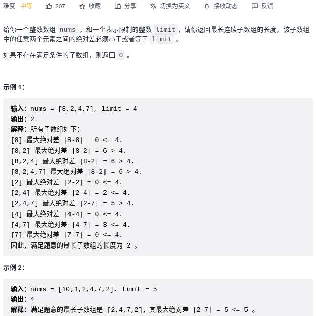

```python
from sortedcontainers import SortedList
class Solution:
    def longestSubarray(self, nums: List[int], limit: int) -> int:
        left, right = 0, 0
        window = SortedList()
        res = 0

        while right < len(nums):
            window.add(nums[right])

            while len(window) > 0 and abs(window[0] - window[-1]) > limit:
                window.remove(nums[left])
                left += 1
            
            res = max(res, right - left + 1)
            right += 1
        return res
```

