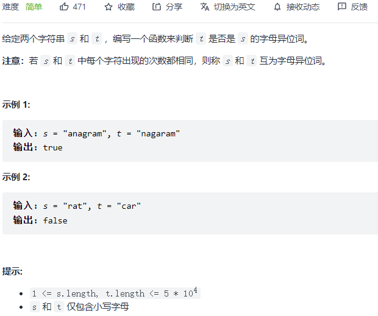
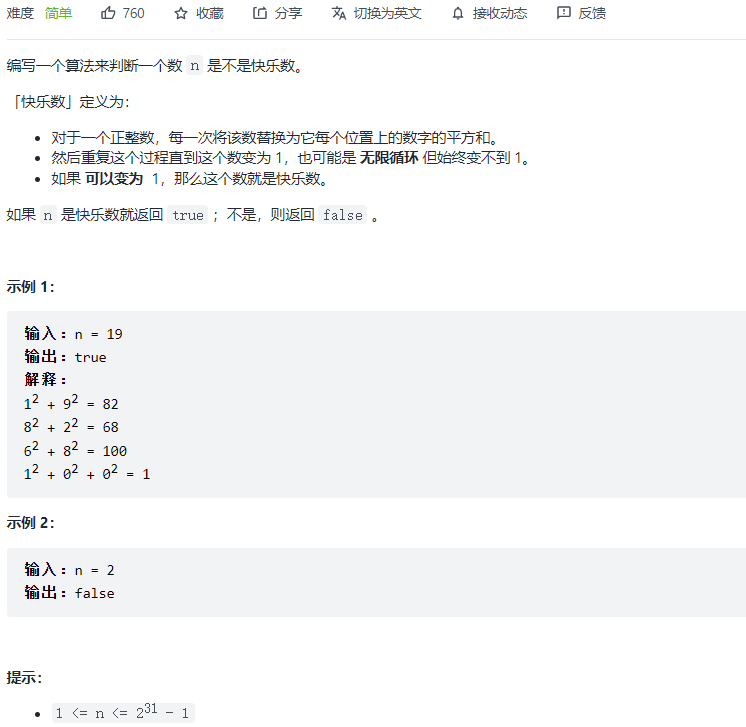
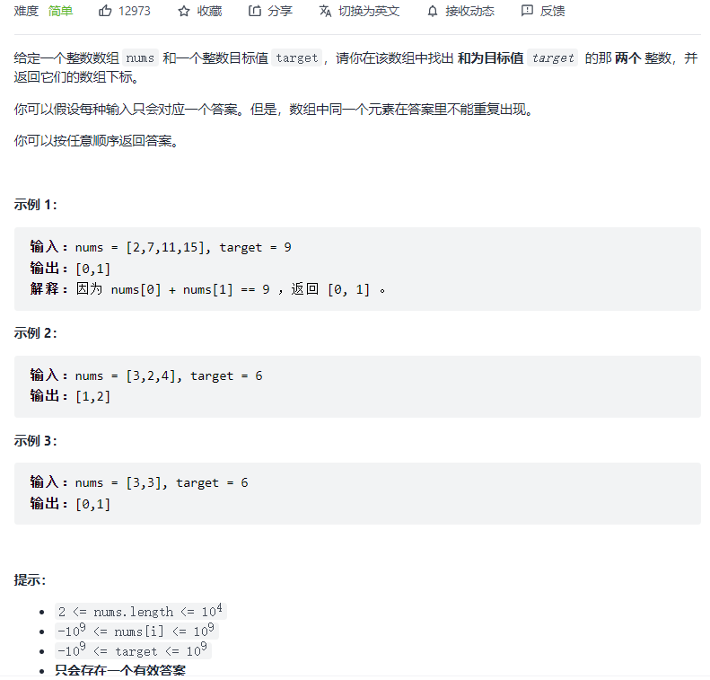
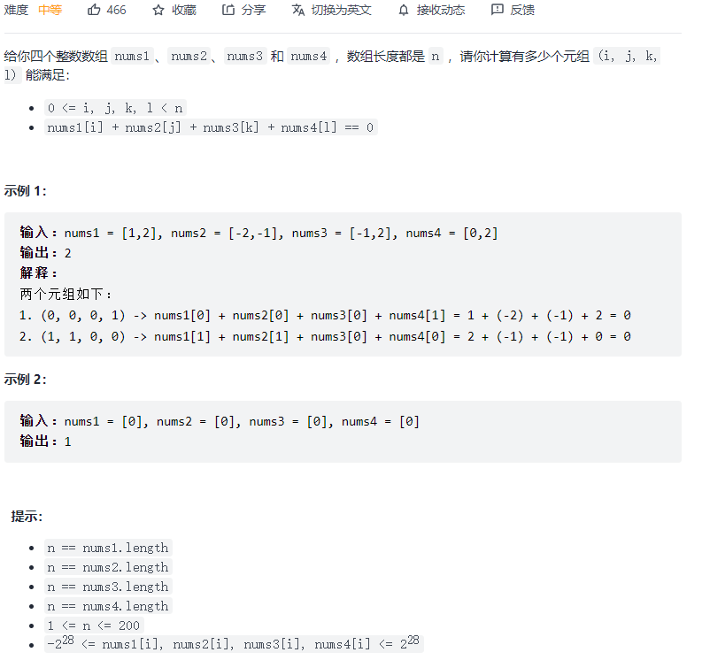
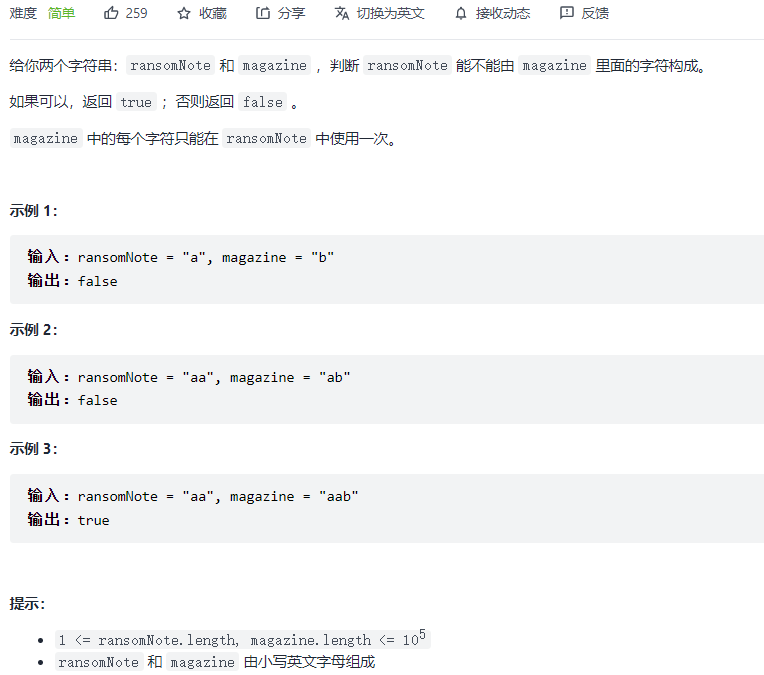
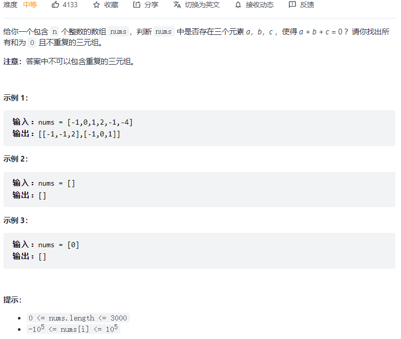

#### [242. 有效的字母异位词](https://leetcode-cn.com/problems/valid-anagram/)[](https://leetcode-cn.com/problems/valid-anagram/)



```python
class Solution:
    def isAnagram(self, s: str, t: str) -> bool:
        dic = {}
        for i in range(len(s)):
            if s[i] not in dic:
                dic[s[i]] = 1
            else:
                dic[s[i]] += 1
        for i in range(len(t)):
            if t[i] not in dic: return False

            dic[t[i]] -= 1
            if dic[t[i]] < 0:
                return False
        for k, v in dic.items():
            if v != 0: return False
        return True
```

#### [202. 快乐数](https://leetcode-cn.com/problems/happy-number/)



```python
class Solution:
    def isHappy(self, n: int) -> bool:
        def helper(num):
            s = 0
            while num > 0:
                m = num % 10
                s += m * m
                num = num // 10
            return s
        
        dic = set()
        while True:
            if n != 1:
                if n not in dic:
                    dic.add(n)
                else:
                    return False
            else:
                return True
            n = helper(n)
```

#### [1. 两数之和](https://leetcode-cn.com/problems/two-sum/)



```python
class Solution:
    def twoSum(self, nums: List[int], target: int) -> List[int]:
        dic = {}
        for i in range(len(nums)):
            if nums[i] in dic:
                return [dic[nums[i]], i]
            else:
                dic[target - nums[i]] = i
```

#### [454. 四数相加 II](https://leetcode-cn.com/problems/4sum-ii/)



```python
class Solution:
    def fourSumCount(self, nums1: List[int], nums2: List[int], nums3: List[int], nums4: List[int]) -> int:
        res = 0
        dic = {}
        n = len(nums1)
        for i in range(n):
            for j in range(n):
                s = nums1[i] + nums2[j]
                if s in dic:
                    dic[s] += 1
                else:
                    dic[s] = 1
        for k in range(n):
            for l in range(n):
                s = - nums3[k] - nums4[l]
                if s in dic:
                    res += dic[s]
        return res
```

#### [383. 赎金信](https://leetcode-cn.com/problems/ransom-note/)



```python
class Solution:
    def canConstruct(self, ransomNote: str, magazine: str) -> bool:
        dic = {}
        for i in range(len(magazine)):
            if magazine[i] in dic:
                dic[magazine[i]] += 1
            else:
                dic[magazine[i]] = 1
        for c in ransomNote:
            if c not in dic: return False
            else:
                dic[c] -= 1
                if dic[c] < 0: return False
        return True
```

#### [15. 三数之和](https://leetcode-cn.com/problems/3sum/)



```python
class Solution:
    def threeSum(self, nums: List[int]) -> List[List[int]]:
        res = []
        nums.sort()
        n = len(nums)
        for i in range(n):
            if nums[i] > 0: break
            left, right = i + 1, n - 1
            if i >= 1 and nums[i] == nums[i-1]:
                continue
            while left < right:
                s = nums[i] + nums[left] + nums[right]
                if s < 0: left += 1
                elif s > 0: right -= 1
                else:
                    res.append([nums[i], nums[left], nums[right]])
                    while left < right and nums[left] == nums[left + 1]: left += 1
                    while left < right and nums[right] == nums[right - 1]: right -= 1
                    left += 1
                    right -= 1
        return res
```

