#### [77. 组合](https://leetcode-cn.com/problems/combinations/)

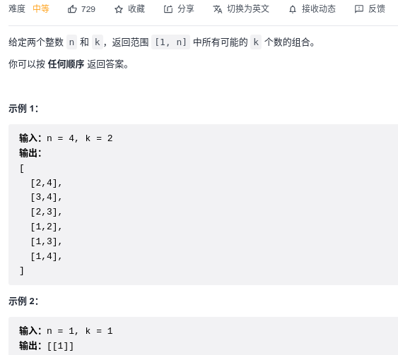

```python
class Solution:
    def combine(self, n: int, k: int) -> List[List[int]]:
        path = []
        res = []
        self.backtrack(path, res, 1, k, n)
        return res

    def backtrack(self, path, res, start, k, n):
        if k == 0:
            res.append(path[:])
            return

        for i in range(start, n + 1):
            self.backtrack(path + [i], res, i + 1, k - 1, n)
```

#### [216. 组合总和 III](https://leetcode-cn.com/problems/combination-sum-iii/)

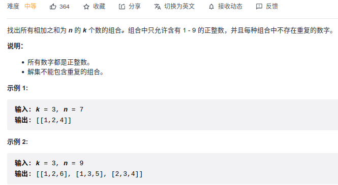

```python
class Solution:
    def combinationSum3(self, k: int, n: int) -> List[List[int]]:
        res = []
        path = []

        def backtrack(path, k, target, start):
            if target == 0 and k == 0:
                res.append(path[:])
                return 
            
            if target < 0 or k < 0:
                return
            
            for i in range(start, 10):
                backtrack(path + [i], k - 1, target - i, i + 1)
        
        backtrack(path, k, n, 1)
        return res
```

#### [17. 电话号码的字母组合](https://leetcode-cn.com/problems/letter-combinations-of-a-phone-number/)

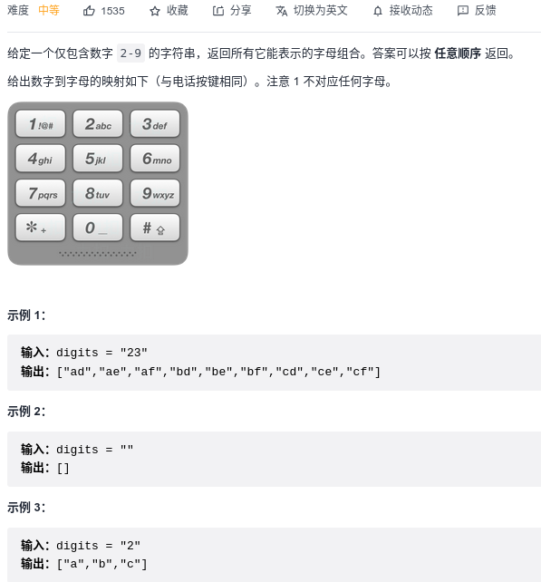

```python
class Solution:
    def letterCombinations(self, digits: str) -> List[str]:
        dic = {
            '0': (),
            '1': (),
            '2': ('a', 'b', 'c'),
            '3': ('d', 'e', 'f'),
            '4': ('g', 'h', 'i'),
            '5': ('j', 'k', 'l'),
            '6': ('m', 'n', 'o'),
            '7': ('p', 'q', 'r', 's'),
            '8': ('t', 'u', 'v'),
            '9': ('w', 'x', 'y', 'z')
        }

        res = []
        path = ""
        
        def backtrack(path, idx_num):
            if len(path) == len(digits):
                if path != "":
                    res.append(path)
                return

            alphas = dic[digits[idx_num]]
            for i in range(len(alphas)):
                backtrack(path + alphas[i], idx_num + 1)
        
        backtrack(path, 0)
        return res
```

#### [39. 组合总和](https://leetcode-cn.com/problems/combination-sum/)

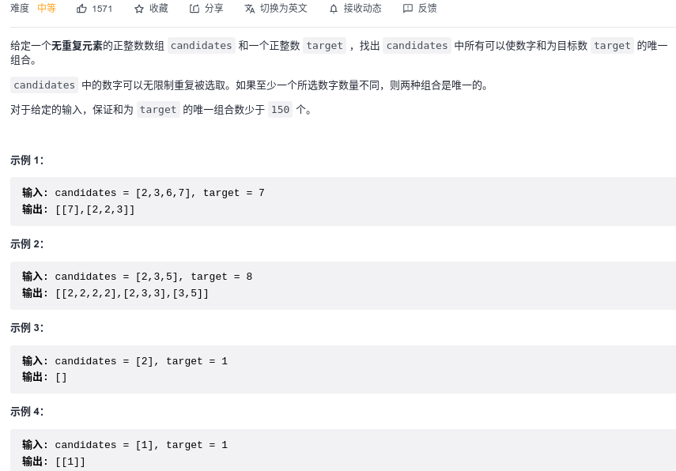

```python
class Solution:
    def combinationSum(self, candidates: List[int], target: int) -> List[List[int]]:
        path = []
        res = []

        def backtrack(path, target, start):
            if target == 0:
                res.append(path[:])
                return
            elif target < 0:
                return
            
            for i in range(start, len(candidates)):
                backtrack(path + [candidates[i]], target - candidates[i], i)
        
        backtrack(path, target, 0)
        return res
```

#### [40. 组合总和 II](https://leetcode-cn.com/problems/combination-sum-ii/)

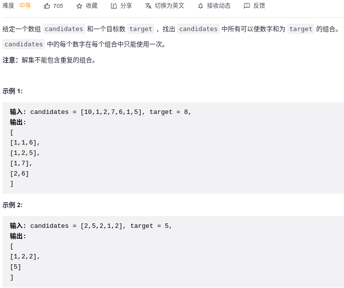

```python
class Solution:
    def combinationSum2(self, candidates: List[int], target: int) -> List[List[int]]:
        candidates.sort()
        res = []
        path = []
        visited = [0] * len(candidates)
        def backtrack(path, start, target):
            if target < 0: return
            if target == 0:
                res.append(path[:])
                return
            if start >= len(candidates):
                return
            for i in range(start, len(candidates)):
                if i > start and candidates[i] == candidates[i-1] and visited[i] == 0:
                    continue
                visited[i] = 1
                backtrack(path + [candidates[i]], i+1, target - candidates[i])
                visited[i] = 0
        backtrack(path, 0, target)
        return res
```

#### [131. 分割回文串:star::star::star:](https://leetcode-cn.com/problems/palindrome-partitioning/)

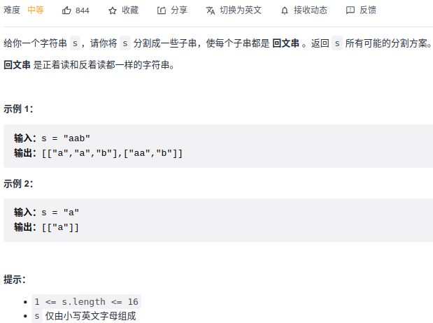

```python
class Solution:
    def partition(self, s: str) -> List[List[str]]:
        res = []
        path = []

        def backtrack(path, start):
            if start >= len(s):
                res.append(path[:])
                return
            
            for i in range(start, len(s)):
                p = s[start: i + 1]
                if self.check(p):
                    backtrack(path + [p], i + 1)
        
        backtrack(path, 0)
        return res

    def check(self, s):
        i, j = 0, len(s)-1
        while i < j:
            if s[i] != s[j]:
                return False
            
            i += 1
            j -= 1
        return True
```

<<<<<<< HEAD

#### [93. 复原 IP 地址:star::star::star::star:](https://leetcode-cn.com/problems/restore-ip-addresses/)

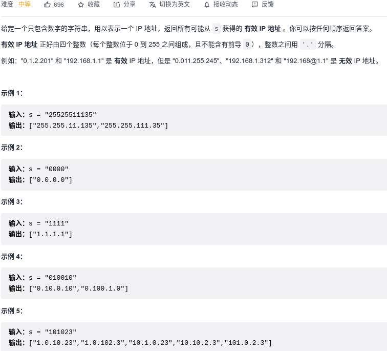

```python
class Solution:
    def restoreIpAddresses(self, s: str) -> List[str]:
        res = []
        path = []
        k = 4
        def backtrack(path, start, k):
            if len(path) == 4 and start == len(s):
                res.append(".".join(path))
                return
            
            if len(s) - start > 3 * k:
                return
            for i in range(1, 4):
                if start + i > len(s):
                    break
                substr = s[start: start + i]
                if len(substr) > 1 and substr[0] == '0':
                    break
                if int(substr) > 255:
                    break
                
                backtrack(path + [substr], start + i, k - 1)
        backtrack(path, 0, k)
        return res
```

#### [22. 括号生成](https://leetcode-cn.com/problems/generate-parentheses/)

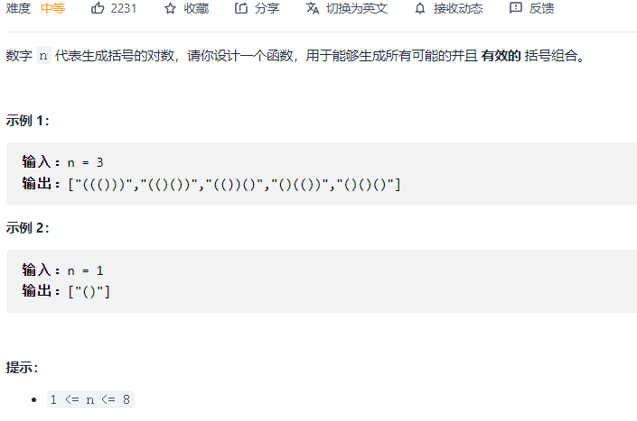

```python
class Solution:
    def generateParenthesis(self, n: int) -> List[str]:
        res = []
        path = ""
        left = right = n
        def backtrack(path, left, right):
            if left == right and left == 0:
                res.append(path)
                return
            
            if right >= left:
                if left > 0:
                    backtrack(path + "(", left - 1, right)
                if right > 0:
                    backtrack(path + ")", left, right - 1)
        backtrack(path, left, right)
        return res
```

#### [78. 子集](https://leetcode-cn.com/problems/subsets/)

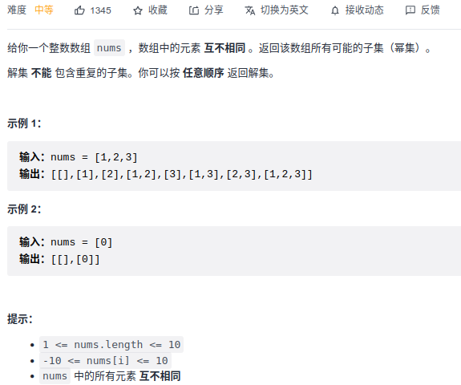

```python
class Solution:
    def subsets(self, nums: List[int]) -> List[List[int]]:
        res = []
        path = []
        def backtrack(path, cur):
            res.append(path[:])

            for i in range(cur, len(nums)):
                backtrack(path+[nums[i]], i+1)
        backtrack(path, 0)
        return res
```

#### [90. 子集 II:star::star:](https://leetcode-cn.com/problems/subsets-ii/)

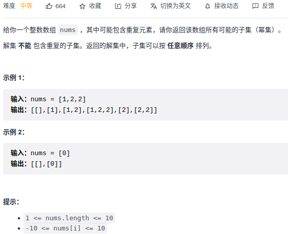

```python
class Solution:
    def subsetsWithDup(self, nums: List[int]) -> List[List[int]]:
        nums.sort()
        res = []
        path = []
        def backtrack(path, cur):
            res.append(path[:])

            for i in range(cur, len(nums)):
                if i > cur and nums[i] == nums[i-1]:
                    continue
                backtrack(path + [nums[i]], i + 1)
        backtrack(path, 0)
        return res
```

```python
class Solution:
    def subsetsWithDup(self, nums: List[int]) -> List[List[int]]:
        nums.sort()
        res = []
        path = []
        visited = [0] * len(nums)
        def backtrack(path, cur):
            res.append(path[:])

            for i in range(cur, len(nums)):
                if i > cur and nums[i] == nums[i-1] and visited[i-1] == 0: # 同一树层去重
                    continue
                visited[i] = 1
                backtrack(path + [nums[i]], i + 1)
                visited[i] = 0
        backtrack(path, 0)
        return res
```


#### [491. 递增子序列](https://leetcode-cn.com/problems/increasing-subsequences/)

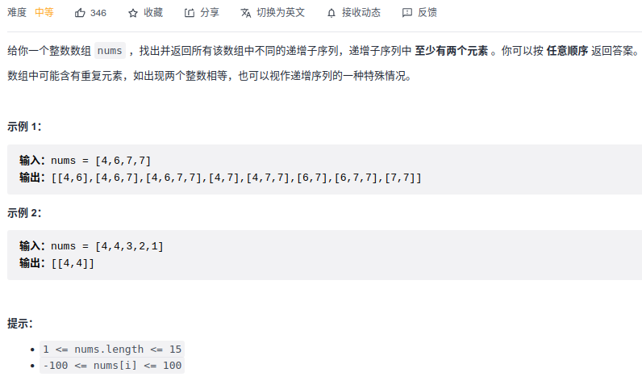

```python
class Solution:
    def findSubsequences(self, nums: List[int]) -> List[List[int]]:
        path = []
        res = []

        def backtrack(path, start):
            if len(path) > 1:
                res.append(path[:])
            if start >= len(nums):
                return
            
            repeat = []  # 去重
            for i in range(start, len(nums)):
                if nums[i] in repeat:
                    continue
                
                if len(path) == 0:
                    repeat.append(nums[i])
                    backtrack(path + [nums[i]], i + 1)
                
                elif nums[i] >= path[-1]:
                    repeat.append(nums[i])
                    backtrack(path + [nums[i]], i + 1)
        backtrack(path, 0)
        return res
```

#### [46. 全排列](https://leetcode-cn.com/problems/permutations/)

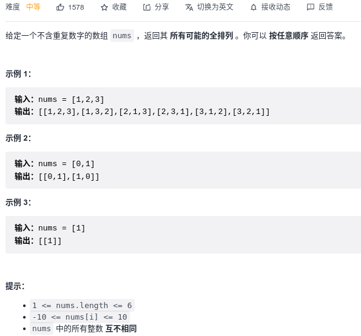

```python
class Solution:
    def permute(self, nums: List[int]) -> List[List[int]]:
        res = []
        path = []
        used = [0] * len(nums)
        def backtrack(path):
            if len(path) == len(nums):
                res.append(path[:])
                return

            for i in range(len(nums)):
                if used[i] == 1: continue
                used[i] = 1
                path.append(nums[i])
                backtrack(path)
                path.pop()
                used[i] = 0

        backtrack(path)
        return res
```

#### [47. 全排列 II](https://leetcode-cn.com/problems/permutations-ii/)

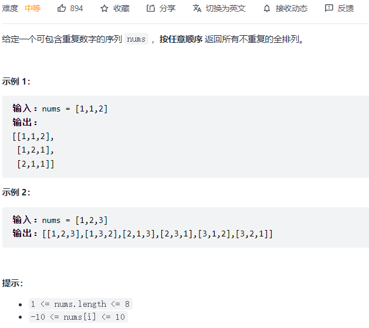

```python
class Solution:
    def permuteUnique(self, nums: List[int]) -> List[List[int]]:
        nums.sort()
        res = []
        path = []
        visited = [0] * len(nums)
        def backtrack(path):
            if len(path) == len(nums):
                res.append(path[:])
                return
            for i in range(len(nums)):
                if visited[i] == 1: continue
                if i > 0 and nums[i] == nums[i-1] and visited[i-1] == 0:
                    continue
                visited[i] = 1
                path.append(nums[i])
                backtrack(path)
                path.pop()
                visited[i] = 0
        backtrack(path)
        return res
```

#### [51. N 皇后:star::star::star::star:](https://leetcode-cn.com/problems/n-queens/)

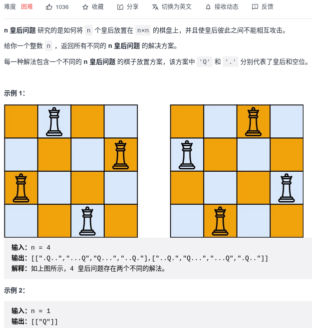

```python
class Solution:
    def solveNQueens(self, n: int) -> List[List[str]]:
        res = []
        path = [['.'] * n for _ in range(n)]

        def check(i, j, path):
            for r in range(i + 1):
                for c in range(n):
                    if r == i and c == j: continue
                    if path[r][j] == 'Q': return False
                    if path[i][c] == 'Q': return False
                    
                    if abs(r - i) == abs(c - j) and path[r][c] == 'Q': return False
            return True
        
        def backtrack(path, start_i, k):
            if k == 0:
                res.append(["".join(s) for s in path])
                return
            
            # 选择棋盘的当前行的 第j个列
            for j in range(n):
                if check(start_i, j, path):
                    path[start_i][j] = 'Q'
                    backtrack(path, start_i + 1,  k - 1)
                    path[start_i][j] = '.'

        backtrack(path, 0, n)
        return res            
```

#### [剑指 Offer 38. 字符串的排列](https://leetcode-cn.com/problems/zi-fu-chuan-de-pai-lie-lcof/)

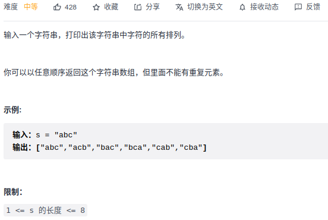


```python
class Solution:
    def permutation(self, s: str) -> List[str]:
        path = []
        res = []
        visited = [0] * len(s)
        s = sorted(list(s))

        def backtrack(path):
            if len(path) == len(s):
                res.append("".join(path))
                return
            
            for i in range(len(s)):
                if visited[i] != 0:
                    continue
                if i > 0 and s[i] == s[i-1] and visited[i-1] == 0:  # 去重，visited[i-1] == 1也可以， == 1是树枝上去重，==0是同树层去重，==0效率更高
                    continue
                visited[i] = 1
                backtrack(path + [s[i]])
                visited[i] = 0
        
        backtrack(path)
        return res
```

