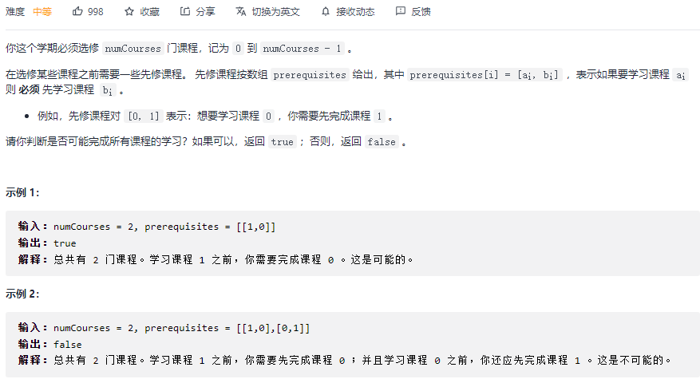
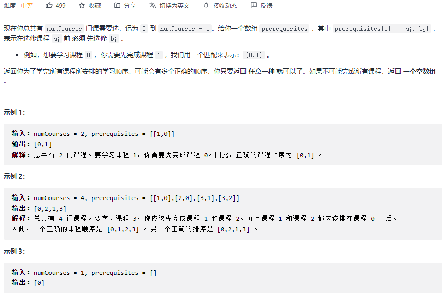
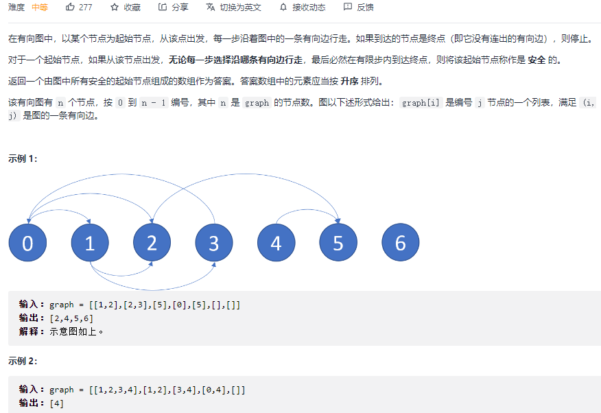
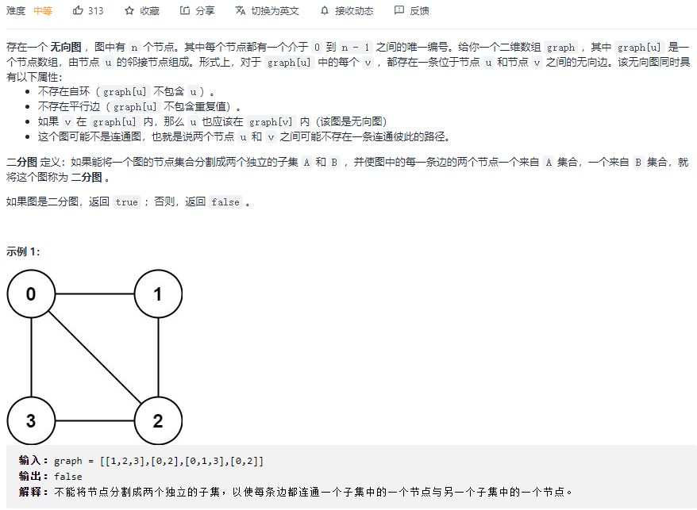
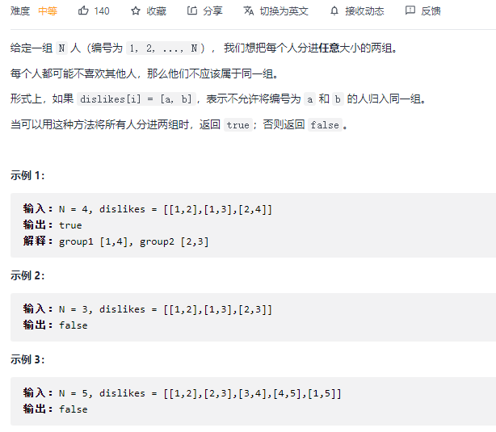
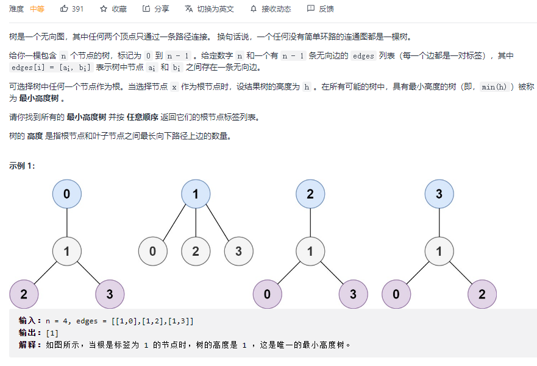
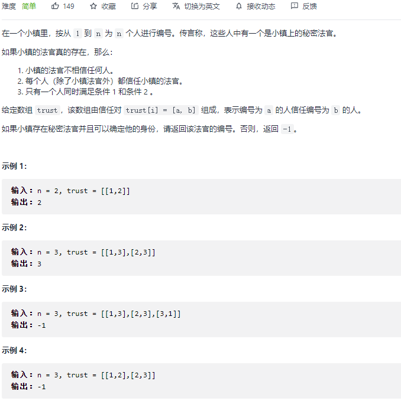
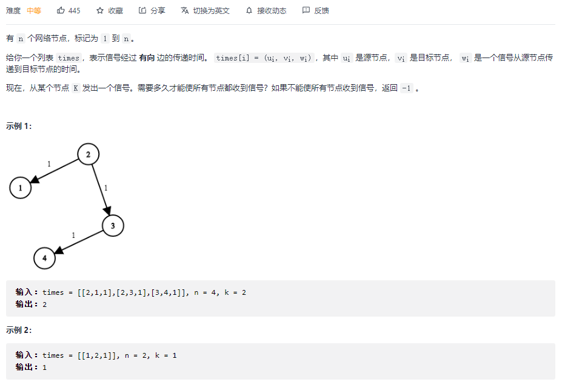
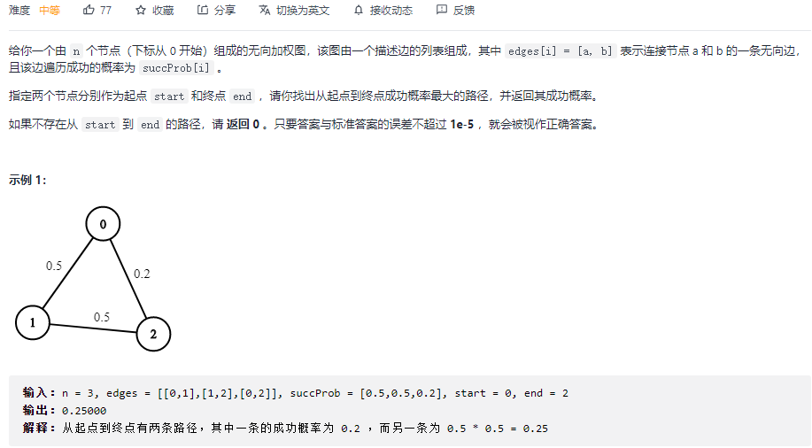
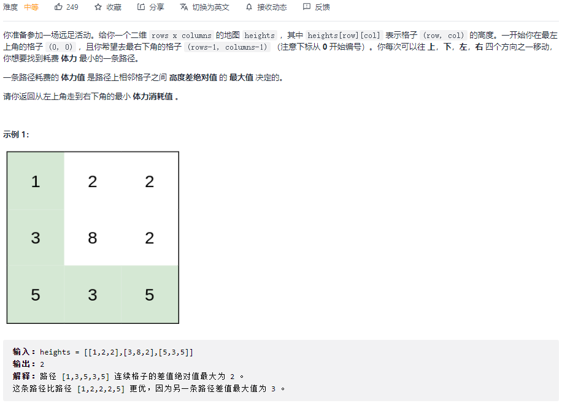

#### [207. 课程表:star::star::star:](https://leetcode-cn.com/problems/course-schedule/)



```python
class Solution:
    def canFinish(self, numCourses: int, prerequisites: List[List[int]]) -> bool:
        graph = [[] for _ in range(numCourses)]
        for p in prerequisites:
            graph[p[1]].append(p[0])
        # visited: 0未探索  1探索中 2已完成
        visited = [0] * numCourses
        self.has_circle = False

        def backtrack(cur):
            if visited[cur] == 1:
                self.has_circle = True
                return
			# 将当前节点状态 置为探索中
            visited[cur] = 1
            for i in graph[cur]:
                if visited[i] == 0:
                    backtrack(i)
                    if self.has_circle:
                        return
                elif visited[i] == 1:
                    self.has_circle = True
                    return
            # 整个支路都走完，将当前节点状态改为已完成
            visited[cur] = 2

        
        for i in range(numCourses):
            if visited[i] == 0 and not self.has_circle:
                backtrack(i)
                if self.has_circle:
                    return False
        return True
```

```python
# 广度优先 推荐
class Solution:
    def canFinish(self, numCourses: int, prerequisites: List[List[int]]) -> bool:
        # 广度优先
        # 统计每个节点的入度，我们只能从入度为0的节点开始
        # 访问了入度为0的节点后，将其连接的节点的入度-1
        # 直到最终全都访问完
        In = [0] * numCourses
        graph = [[] for _ in range(numCourses)]
        for p in prerequisites:
            graph[p[1]].append(p[0])
            In[p[0]] += 1
        q = []
        for i in range(numCourses):
            if In[i] == 0:
                q.append(i)
        
        while q:
            v = q.pop(0)
            for child in graph[v]:
                In[child] -= 1
                if In[child] == 0:
                    q.append(child)
        return all(not In[i] for i in range(numCourses))
```

#### [210. 课程表 II](https://leetcode-cn.com/problems/course-schedule-ii/)



```python
class Solution:
    def findOrder(self, numCourses: int, prerequisites: List[List[int]]) -> List[int]:
        In = [0] * numCourses
        graph = [[] for _ in range(numCourses)]
        for p in prerequisites:
            graph[p[1]].append(p[0])
            In[p[0]] += 1
        q = []
        for i in range(numCourses):
            if In[i] == 0:
                q.append(i)
        
        ans = []
        while q:
            v = q.pop(0)
            ans.append(v)
            for child in graph[v]:
                In[child] -= 1
                if In[child] == 0:
                    q.append(child)

        # 长度一致 说明没有环，都添加到ans中了
        if len(ans) == numCourses:
            return ans
        else:
            return []
```

#### [802. 找到最终的安全状态:star::star::star:](https://leetcode-cn.com/problems/find-eventual-safe-states/)



```python
class Solution:
    def eventualSafeNodes(self, graph: List[List[int]]) -> List[int]:
        # 正常的拓扑排序是找到所有入度为0的节点，然后去做BFS
        # 此题，是出度为0的节点是安全点，所有可以到达安全点的节点也是安全点
        # 因此要反向拓扑排序，因此要建立反图
        edge = [[] for _ in range(len(graph))]
        out = [0] * len(graph)
        for i, nodes in enumerate(graph):
            for node in nodes:
                edge[node].append(i)
                out[i] += 1

        q = []
        for i in range(len(graph)):
            if out[i] == 0:
                q.append(i)
        while q:
            node = q.pop(0)
            for v in edge[node]:
                out[v] -= 1
                if out[v] == 0:
                    q.append(v)
        return [i for i in range(len(out)) if out[i] == 0]
```

#### [785. 判断二分图](https://leetcode-cn.com/problems/is-graph-bipartite/)



```python
class Solution:
    def isBipartite(self, graph: List[List[int]]) -> bool:
        n = len(graph)
        uncolored, red, green = 0, 1, 2
        color = [uncolored] * n
        # 遍历所有节点，因为可能存在不连通的情况
        for i in range(n):
            if color[i] == uncolored:
                color[i] = red
                q = [i]
                while q:
                    node = q.pop(0)
                    # 邻接节点的正确的颜色
                    color_neighbor = green if color[node] == red else red
                    for v in graph[node]:
                        if color[v] == uncolored:
                            color[v] = color_neighbor
                            q.append(v)
                        # 如果邻接节点颜色不正确，说明无法二分
                        elif color[v] != color_neighbor:
                            return False
        return True
```

#### [886. 可能的二分法](https://leetcode-cn.com/problems/possible-bipartition/)



和785基本一致

```python
class Solution:
    def possibleBipartition(self, n: int, dislikes: List[List[int]]) -> bool:
        graph = [[] for _ in range(n+1)]

        # 相邻接的节点不应该分在一组，分在一组的不应该相邻接
        for p, q in dislikes:
            graph[p].append(q)
            graph[q].append(p)
        
        ungroup, group1, group2 = 0, 1, 2
        groups = [ungroup] * (n+1)
        for i in range(1, n+1):
            # 如果节点i没有被分组
            if groups[i] == ungroup:
                # 先设置一个分组
                groups[i] = group1
                q = [i]
                while q:
                    node = q.pop(0)
                    neighbor_group = group2 if groups[node] == group1 else group1
                    for neighbor in graph[node]:
                        if groups[neighbor] == ungroup:
                            groups[neighbor] = neighbor_group
                            q.append(neighbor)
                        elif groups[neighbor] != neighbor_group:
                            return False
        return True
```

#### [310. 最小高度树:star::star::star:](https://leetcode-cn.com/problems/minimum-height-trees/)



```python
class Solution:
    def findMinHeightTrees(self, n: int, edges: List[List[int]]) -> List[int]:
        if n == 1: return [0]
        graph = [[] for _ in range(n)]
        outdegree = [0] * n

        for p, q in edges:
            graph[p].append(q)
            graph[q].append(p)
            outdegree[p] += 1
            outdegree[q] += 1

        q = []
        # 将无向图的度为1的节点加入队列
        for i in range(n):
            if outdegree[i] == 1:
                q.append(i)

        # 拓扑排序
        res = []
        # 队列中是degree为1的节点
        while q:
            res = []
            size = len(q)
            # for循环遍历完，相当于初始的degree为1的节点全都扫过一遍，可以理解为[0 2 3]节点全都被删掉
            # 第二次遍历队列，q中只剩下了[1]
            for _ in range(size):
                node = q.pop(0)
                res.append(node)
                for j in graph[node]:
                    outdegree[j] -= 1
                    if outdegree[j] == 1:
                        q.append(j)
        return res
```

#### [997. 找到小镇的法官](https://leetcode-cn.com/problems/find-the-town-judge/)



```python
class Solution:
    def findJudge(self, n: int, trust: List[List[int]]) -> int:
        # 条件1：节点的出度为0
        # 条件2：节点的入度为n-1
        # 条件3：只有一个这样的节点
        graph = [[] for _ in range(n+1)]
        
        in_degree = [0] * (n+1)
        for a, b in trust:
            graph[a].append(b)
            in_degree[b] += 1
        
        
        candidate = []
        for i in range(1, n+1):
            if len(graph[i]) == 0 and in_degree[i] == n - 1:
                candidate.append(i)
        if len(candidate) != 1:
            return -1
        else:
            return candidate[0]
```

#### [1162. 地图分析](https://leetcode-cn.com/problems/as-far-from-land-as-possible/)


```python
class Solution:
    def maxDistance(self, grid: List[List[int]]) -> int:
        # 要求找离海洋单元格到离他最近的陆地单元格距离最大的
        # 反过来，我们将陆地单元格入队，每次扩展一步找到最近的海洋，
        # 当我们把所有的都扩展到了，最后扩展的次数就是最大距离
        step = -1
        n = len(grid)
        q = []
        for i in range(n):
            for j in range(n):
                if grid[i][j] == 1:
                    q.append((i, j))
        # 如果网格只有陆地或者海洋，返回
        if len(q) == 0 or len(q) == n * n:
            return step
        
        while q:
            for _ in range(len(q)):
                x, y = q.pop(0)
                for xi, yj in [(x + 1, y), (x - 1, y), (x, y + 1), (x, y - 1)]:
                    if 0 <= xi < n and 0 <= yj < n and grid[xi][yj] == 0:
                        q.append((xi, yj))
                        grid[xi][yj] = -1
            step += 1
        
        return step
```

#### [743. 网络延迟时间:star::star::star:](https://leetcode-cn.com/problems/network-delay-time/)



```python
class Solution:
    def networkDelayTime(self, times: List[List[int]], n: int, k: int) -> int:
        graph = [[float('inf')] * n for _ in range(n)]
        for s, t, w in times:
            graph[s-1][t-1] = w
        
        # 起点到每个节点的最小距离，起点到起点距离为0
        dist = [float('inf')] * n
        dist[k-1] = 0

        # 优先队列, （起点到该点的最小距离，该点）
        q = [(0, k-1)]

        while q:
            d_cur, cur = heapq.heappop(q)
            for nxt, d_nxt in enumerate(graph[cur]):
                if dist[nxt] > d_cur + d_nxt:
                    dist[nxt] = d_cur + d_nxt
                    heapq.heappush(q, (dist[nxt], nxt))
        max_dist = max(dist)

        # 如果有孤立点，返回-1
        return max_dist if max_dist != float('inf') else -1
```

#### [1514. 概率最大的路径](https://leetcode-cn.com/problems/path-with-maximum-probability/)



```python
class Solution:
    def maxProbability(self, n: int, edges: List[List[int]], succProb: List[float], start: int, end: int) -> float:
        graph = [[] for _ in range(n)]
        for i, (x, y) in enumerate(edges):
            graph[x].append((succProb[i], y))
            graph[y].append((succProb[i], x))
        
        # 起点到每个点的最大概率，起点到起点的概率为1
        probs = [0.0] * n
        probs[start] = 1.0

        # 队列，（概率，当前点）
        q = [(-1.0, start)]

        while q:
            prob_cur, cur = heapq.heappop(q)
            prob_cur = -prob_cur
            # if prob_cur < probs[cur]: continue

            for nxt_prob, nxt in graph[cur]:
                if probs[nxt] < prob_cur * nxt_prob:
                    probs[nxt] = prob_cur * nxt_prob
                    heapq.heappush(q, (-probs[nxt], nxt))
        return probs[end]
```

```python
class Solution:
    def maxProbability(self, n: int, edges: List[List[int]], succProb: List[float], start: int, end: int) -> float:
        graph = [[] for _ in range(n)]
        for i, (x, y) in enumerate(edges):
            graph[x].append((succProb[i], y))
            graph[y].append((succProb[i], x))
        
        # 起点到每个点的最大概率，起点到起点的概率为1
        probs = [0.0] * n
        probs[start] = 1.0

        # 队列，（概率，当前点）
        q = [(-1.0, start)]

        while q:
            prob_cur, cur = heapq.heappop(q)
            prob_cur = -prob_cur
			# 【既然指定了起点和终点，那当遇到终点时 直接返回， 前提是优先队列才行】
            if cur == end:
                return probs[end]
            
            # 这句话加不加都行，加了更快，也比较好理解，当前节点的概率比数组中维护的更小，那下面的完全没必要遍历，遍历了也不会执行if的语句
            if prob_cur < probs[cur]: 
                continue

            for nxt_prob, nxt in graph[cur]:
                if probs[nxt] < prob_cur * nxt_prob:
                    probs[nxt] = prob_cur * nxt_prob
                    heapq.heappush(q, (-probs[nxt], nxt))
        return 0  # 【返回0】
```

#### [1631. 最小体力消耗路径](https://leetcode-cn.com/problems/path-with-minimum-effort/)



```python
class Solution:
    def minimumEffortPath(self, heights: List[List[int]]) -> int:
        # 计算起点到每一个点的最小体力消耗
        # 转换为最短路径问题
        r, c = len((heights)), len(heights[0])
        energies = [[float('inf')] * c for _ in range(r)]
        energies[0][0] = 0

        visited = set()
        q = [(0, 0, 0)]
        
        while q:
            energy, x, y = heapq.heappop(q)
            if (x,y) in visited:
                continue
            # 到终点位置 直接退出 返回结果
            if x == r-1 and y == c-1:
                break
            
            visited.add((x, y))
   
            for xi, yi in [(x, y-1), (x, y+1), (x-1, y), (x+1, y)]:
                if 0 <= xi < r and 0 <= yi < c:
                	# 计算x,y到xi,yi位置消耗的能量
                    need_energy = abs(heights[x][y] - heights[xi][yi])
                    # 计算起点到xi，yi位置消耗的能量
                    need_energy = max(need_energy, energy)
                    # 更新结果
                    if need_energy <= energies[xi][yi]:
                        energies[xi][yi] = need_energy
                        heapq.heappush(q, (need_energy, xi, yi))
        return energies[r-1][c-1]
```

