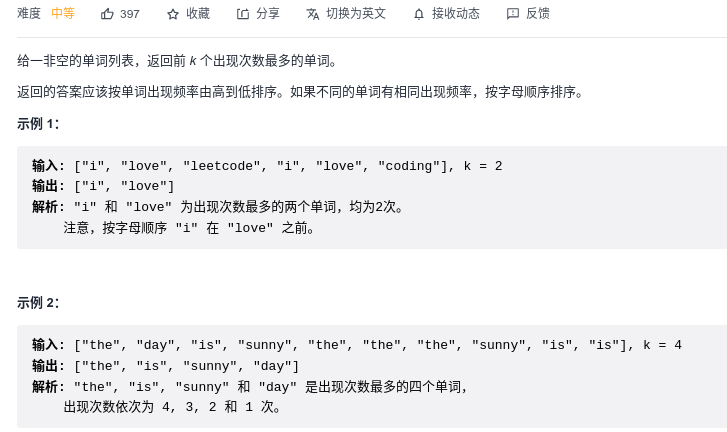

#### [215. 数组中的第K个最大元素](https://leetcode-cn.com/problems/kth-largest-element-in-an-array/)


```python
class Solution:
    def findKthLargest(self, nums: List[int], k: int) -> int:
        heap = []
        # nums [1 2 3 4]
        # python 构建的是小根堆
        # 我们要维护大根堆，需要把元素变成负的
        for x in nums:
            heapq.heappush(heap, -x)
        
        # 此时heap是[-4 -3 -2 -1]
        # 需要弹出不需要的元素，保证根堆的头节点是第k个
        # 如果k是2，我们需要返回的是3
        for _ in range(k-1):
            heapq.heappop(heap)
        # 此时heap是[-3 -2 -1]
        return -heap[0]
```

```python
# 对解集空间做二分，因为定义了每个元素的范围是-1e4 <= nums[i] <= 1e4
class Solution:
    def findKthLargest(self, nums: List[int], k: int) -> int:
        left, right = int(-1e4), int(1e4) + 1
        while left < right:
            mid = left + (right - left) // 2
            cnt = self.greaterTargetCount(nums, mid)
            if cnt >= k:
                left = mid + 1
            else:
                right = mid
        return left - 1
        
    def greaterTargetCount(self, nums, target):
        cnt = 0
        for x in nums:
            if x >= target:
                cnt += 1
        return cnt
```

```python
# 快排思想
class Solution:
    def findKthLargest(self, nums: List[int], k: int) -> int:
        def randomized_partition(nums, left, right):
            index = random.randint(left, right)
            pivot = nums[index]
            nums[index], nums[left] = nums[left], nums[index]
            while left < right:
                while left < right and nums[right] >= pivot:
                    right -= 1
                nums[left] = nums[right]
                while left < right and nums[left] <= pivot:
                    left += 1
                nums[right] = nums[left]
            nums[left] = pivot
            return left
        
        def topk_split(nums, left, right, k):
            # 小到大排序
            if left >= right:
                return
            # nums index左边是前k个小的数，index右边是n-k个大的数
            index = randomized_partition(nums, left, right)
            topk_split(nums, index + 1, right, k)
            topk_split(nums, left, index - 1, k)

        # 题目要第k大的数，我们转换为第len(nums)-k小的数
        topk_split(nums, 0, len(nums)-1, len(nums)-k)
        return nums[len(nums) - k]
```

#### [面试题 17.14. 最小K个数](https://leetcode-cn.com/problems/smallest-k-lcci/)


```python
import heapq

class Solution:
    def smallestK(self, arr: List[int], k: int) -> List[int]:
        heapq.heapify(arr)
        return [heapq.heappop(arr) for _ in range(k)]
```

#### [692. 前K个高频单词](https://leetcode-cn.com/problems/top-k-frequent-words/)



```python
class Solution:
    def topKFrequent(self, words: List[str], k: int) -> List[str]:
        dic = {}
        for s in words:
            if s in dic:
                dic[s] += 1
            else:
                dic[s] = 1
        heap = []
        for key, value in dic.items():
            heapq.heappush(heap, (-value, key))
        
        res = []
        for _ in range(k):
            res.append(heapq.heappop(heap)[1])
        return res
```

#### [451. 根据字符出现频率排序](https://leetcode-cn.com/problems/sort-characters-by-frequency/)


```python
class Solution:
    def frequencySort(self, s: str) -> str:
        dic = {}
        for c in s:
            if c in dic:
                dic[c] += 1
            else:
                dic[c] = 1
        heap = []
        for k, v in dic.items():
            heapq.heappush(heap, (-v, k))
        
        res = ""
        while heap:
            cnt, char = heapq.heappop(heap)
            res += (-cnt) * char
        return res
```

#### [347. 前 K 个高频元素](https://leetcode-cn.com/problems/top-k-frequent-elements/)


```python
class Solution:
    def topKFrequent(self, nums: List[int], k: int) -> List[int]:
        dic = {}
        for i in nums:
            if i not in dic:
                dic[i] = 1
            else:
                dic[i] += 1
        
        heap = []
        for key, value in dic.items():
            heapq.heappush(heap, (-value, key))
        
        res = []
        for _ in range(k):
            res.append(heapq.heappop(heap)[1])
        return res
```

#### [264. 丑数 II:star::star::star:](https://leetcode-cn.com/problems/ugly-number-ii/)


```python
class Solution:
    def nthUglyNumber(self, n: int) -> int:
        heap = [1]
        seen = {1}
        factor = [2, 3, 5]

        for i in range(1, n+1):
            item = heapq.heappop(heap)
            if i == n:
                return item
            else:
                for f in factor:
                    new_item = f * item
                    if new_item not in seen:
                        seen.add(new_item)
                        heapq.heappush(heap, new_item)
```

#### [703. 数据流中的第 K 大元素:star::star:](https://leetcode-cn.com/problems/kth-largest-element-in-a-stream/)


```python
class KthLargest:
	# 维护k个元素的小顶堆，堆顶元素就是第k大的元素
    def __init__(self, k: int, nums: List[int]):
        self.heap = nums
        heapq.heapify(self.heap)
        self.k = k

    def add(self, val: int) -> int:
        heapq.heappush(self.heap, val)
        while len(self.heap) > self.k:
            heapq.heappop(self.heap)
        return self.heap[0]
```

#### [295. 数据流的中位数:star::star::star:](https://leetcode-cn.com/problems/find-median-from-data-stream/)


```python
# 推荐看看官方的题解，两个堆实现，这里的只是python的trick
from sortedcontainers import SortedList
class MedianFinder:

    def __init__(self):
        self.nums = SortedList()
        
    def addNum(self, num: int) -> None:
        self.nums.add(num)

    def findMedian(self) -> float:
        cnt = len(self.nums)
        if cnt % 2 == 0:
            return (self.nums[cnt // 2] + self.nums[cnt // 2 -1]) / 2
        else:
            return self.nums[cnt//2]
```

