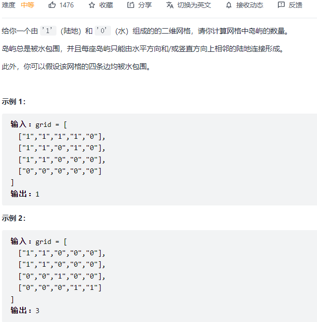
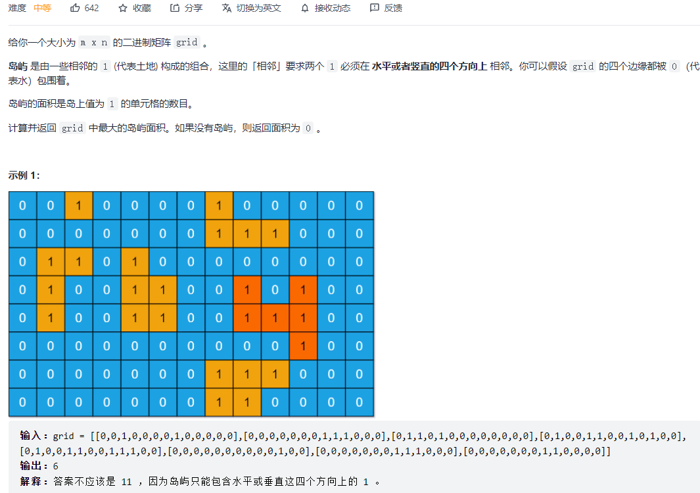
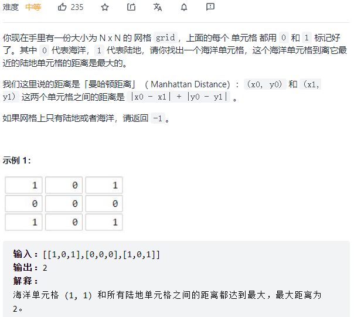

#### [200. 岛屿数量](https://leetcode-cn.com/problems/number-of-islands/)



```python
class Solution:
    def numIslands(self, grid: List[List[str]]) -> int:
        self.res = 0
        m, n = len(grid), len(grid[0])

        def dfs(i, j):
            if grid[i][j] != '1': return
            grid[i][j] = '#'
            for x, y in [(i, j-1), (i, j+1), (i-1, j), (i+1, j)]:
                if x < 0 or x >= m or y < 0 or y >= n:
                    continue
                dfs(x, y)

        for i in range(m):
            for j in range(n):
                if grid[i][j] == '1':
                    dfs(i, j)
                    self.res += 1
        return self.res
```

#### [695. 岛屿的最大面积](https://leetcode-cn.com/problems/max-area-of-island/)



```python
class Solution:
    def maxAreaOfIsland(self, grid: List[List[int]]) -> int:
        m, n = len(grid), len(grid[0])
        self.res = 0
        self.area = 0

        def dfs(i, j):
            if grid[i][j] != 1: return
            grid[i][j] = 2
            self.area += 1
            for x, y in ((i, j-1), (i,j+1),(i-1,j), (i+1, j)):
                if x < 0 or x >= m or y < 0 or y >= n:
                    continue
                dfs(x, y)
        for i in range(m):
            for j in range(n):
                if grid[i][j] == 1:
                    dfs(i, j)
                    self.res = max(self.res, self.area)
                    self.area = 0
        return self.res
```

#### [1162. 地图分析](https://leetcode-cn.com/problems/as-far-from-land-as-possible/)



```python
class Solution:
    def maxDistance(self, grid: List[List[int]]) -> int:
        n = len(grid)
        step = 0
        q = [(i, j) for i in range(n) for j in range(n) if grid[i][j] == 1]
        if len(q) == 0 or len(q) == n * n: return -1
        while q:
            for _ in range(len(q)):
                i, j = q.pop(0)
                # （1）
                for x, y in ((i, j-1), (i, j+1), (i-1, j), (i+1, j)):
                    if x < 0 or x >= n or y < 0 or y >= n: continue
                    if grid[x][y] == 0:
                        q.append((x, y))
                        grid[x][y] = 2   # 访问的步骤 要写在这里，如果写在1位置，则会有重复添加队列的情况，导致结果出错
            step += 1
        return step - 1
```

