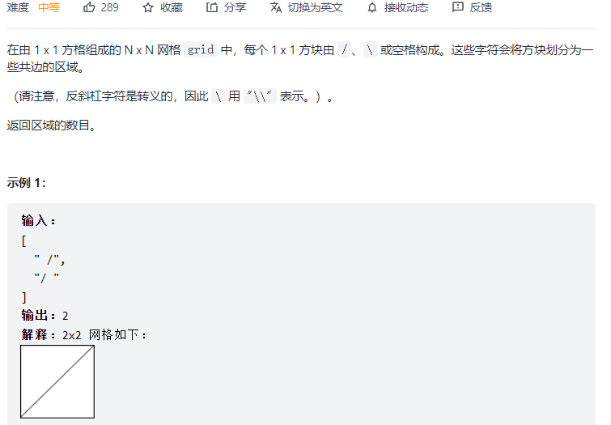

#### [200. 岛屿数量](https://leetcode-cn.com/problems/number-of-islands/)


```python
class Solution:
    def numIslands(self, grid: List[List[str]]) -> int:
        self.res = 0
        m, n = len(grid), len(grid[0])

        def dfs(i, j):
            if grid[i][j] != '1': return
            grid[i][j] = '#'
            for x, y in [(i, j-1), (i, j+1), (i-1, j), (i+1, j)]:
                if x < 0 or x >= m or y < 0 or y >= n:
                    continue
                dfs(x, y)

        for i in range(m):
            for j in range(n):
                if grid[i][j] == '1':
                    dfs(i, j)
                    self.res += 1
        return self.res
```

#### [695. 岛屿的最大面积](https://leetcode-cn.com/problems/max-area-of-island/)


```python
class Solution:
    def maxAreaOfIsland(self, grid: List[List[int]]) -> int:
        m, n = len(grid), len(grid[0])
        self.res = 0
        self.area = 0

        def dfs(i, j):
            if grid[i][j] != 1: return
            grid[i][j] = 2
            self.area += 1
            for x, y in ((i, j-1), (i,j+1),(i-1,j), (i+1, j)):
                if x < 0 or x >= m or y < 0 or y >= n:
                    continue
                dfs(x, y)
        for i in range(m):
            for j in range(n):
                if grid[i][j] == 1:
                    dfs(i, j)
                    self.res = max(self.res, self.area)
                    self.area = 0
        return self.res
```

#### [1162. 地图分析](https://leetcode-cn.com/problems/as-far-from-land-as-possible/)


```python
class Solution:
    def maxDistance(self, grid: List[List[int]]) -> int:
        n = len(grid)
        step = 0
        q = [(i, j) for i in range(n) for j in range(n) if grid[i][j] == 1]
        if len(q) == 0 or len(q) == n * n: return -1
        while q:
            for _ in range(len(q)):
                i, j = q.pop(0)
                # （1）
                for x, y in ((i, j-1), (i, j+1), (i-1, j), (i+1, j)):
                    if x < 0 or x >= n or y < 0 or y >= n: continue
                    if grid[x][y] == 0:
                        q.append((x, y))
                        grid[x][y] = 2   # 访问的步骤 要写在这里，如果写在1位置，则会有重复添加队列的情况，导致结果出错
            step += 1
        return step - 1
```

#### [463. 岛屿的周长](https://leetcode-cn.com/problems/island-perimeter/)


```python
class Solution:
    def islandPerimeter(self, grid: List[List[int]]) -> int:
        self.res = 0
        m, n = len(grid), len(grid[0])
        def dfs(i, j):
            if grid[i][j] != 1: return 
            grid[i][j] = -1
            self.res += 4
            for x, y in ((i, j-1), (i, j+1), (i-1, j), (i+1, j)):
                if x < 0 or x >= m or y < 0 or y >= n:
                    continue
                dfs(x, y)
            if i > 0 and grid[i-1][j] != 0:
                self.res -= 2
            if j > 0 and grid[i][j-1] != 0:
                self.res -= 2
        
        for i in range(m):
            for j in range(n):
                if grid[i][j] == 1:
                    dfs(i, j)
                    return self.res
```

```c++
class Solution {
public:
    int islandPerimeter(vector<vector<int>>& grid) {
        int sum = 0;    // 陆地数量
        int cover = 0;  // 相邻数量
        for (int i = 0; i < grid.size(); i++) {
            for (int j = 0; j < grid[0].size(); j++) {
                if (grid[i][j] == 1) {
                    sum++;
                    // 统计上边相邻陆地
                    if(i - 1 >= 0 && grid[i - 1][j] == 1) cover++;
                    // 统计左边相邻陆地
                    if(j - 1 >= 0 && grid[i][j - 1] == 1) cover++;
                    // 为什么没统计下边和右边？ 因为避免重复计算
                }
            }
        }
        return sum * 4 - cover * 2;
    }
};
```

#### [959. 由斜杠划分区域](https://leetcode-cn.com/problems/regions-cut-by-slashes/)

[【两种方法】并查集和 DFS(959. 由斜杠划分区域） - 由斜杠划分区域 - 力扣（LeetCode） (leetcode-cn.com)](https://leetcode-cn.com/problems/regions-cut-by-slashes/solution/liang-chong-fang-fa-bing-cha-ji-he-dfs95-uhof/)

为什么是3x3而不能是2x2：[【图解算法】三种详细解法！ - 由斜杠划分区域 - 力扣（LeetCode） (leetcode-cn.com)](https://leetcode-cn.com/problems/regions-cut-by-slashes/solution/tu-jie-suan-fa-san-chong-xiang-xi-jie-fa-by-godwei/)



```python
# 用1x1格子构造出3x3的网格，用1表示陆地 '/'或'\\',用0表示海洋，遇到海洋则dfs
class Solution:
    def regionsBySlashes(self, grid: List[str]) -> int:
        n = len(grid)
        grid_expand = [[0] * 3 * n for _ in range(3 * n)]
        for i in range(n):
            for j in range(n):
                if grid[i][j] == '/':
                    grid_expand[3 * i][3 * j + 2] = 1
                    grid_expand[3 * i + 1][3 * j + 1] = 1
                    grid_expand[3 * i + 2][3 * j] = 1
                elif grid[i][j] == '\\':
                    grid_expand[3 * i][3 * j] = 1
                    grid_expand[3 * i + 1][3 * j + 1] = 1
                    grid_expand[3 * i + 2][3 * j + 2] = 1
        
        def dfs(i, j):
            if grid_expand[i][j] != 0: return
            grid_expand[i][j] = 1
            for x, y in ((i, j-1), (i, j+1), (i-1, j), (i+1, j)):
                if x < 0 or x >= 3 * n or y < 0 or y >= 3 * n: continue
                dfs(x, y)
        
        res = 0
        for i in range(3 * n):
            for j in range(3 * n):
                if grid_expand[i][j] == 0:
                    dfs(i, j)
                    res += 1
        return res
```

