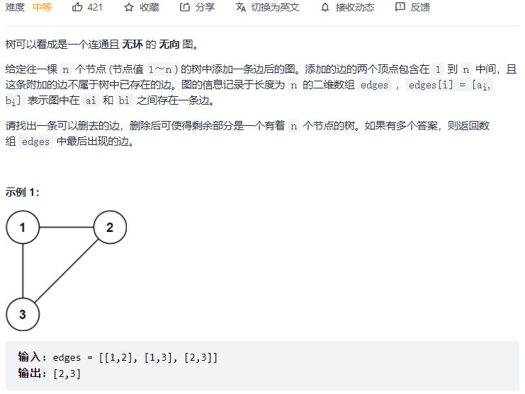
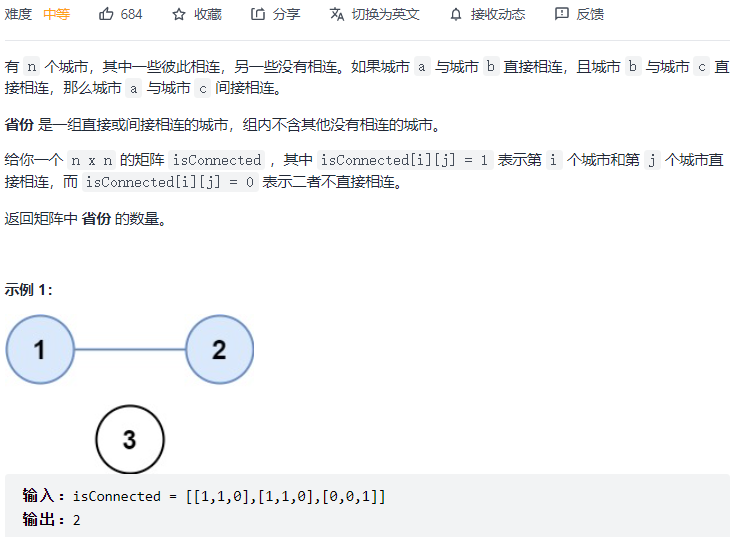
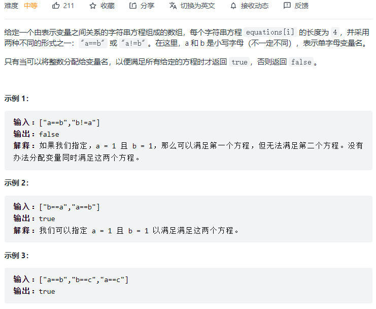

#### [684. 冗余连接](https://leetcode-cn.com/problems/redundant-connection/)



```python
class UF:
    def __init__(self, M):
        self.parent = {}
        self.cnt = 0
        for i in range(M):
            self.parent[i] = i
            self.cnt += 1
    def find(self, x):
        if x != self.parent[x]:
            self.parent[x] = self.find(self.parent[x])
            return self.parent[x]
        return x
    def connected(self, p, q):
        return self.find(p) == self.find(q)

    def union(self, p, q):
        if self.connected(p, q): return
        root_p = self.find(p)
        root_q = self.find(q)
        self.parent[root_p] = root_q
        self.cnt -= 1

class Solution:
    def findRedundantConnection(self, edges: List[List[int]]) -> List[int]:
        uf = UF(1001)
        for fr, to in edges:
            if uf.connected(fr, to): return [fr, to]
            uf.union(fr, to)
```

#### [547. 省份数量](https://leetcode-cn.com/problems/number-of-provinces/)



```python
class Solution:
    def findCircleNum(self, isConnected: List[List[int]]) -> int:
        self.cnt = 0
        self.parent = {}
        edge = []
        for i in range(len(isConnected)):
            for j in range(i + 1, len(isConnected)):
                if i == j: continue
                if isConnected[i][j] == 1: 
                    edge.append((i, j))
        for i in range(len(isConnected)):
            self.parent[i] = i
            self.cnt += 1
        for s, e in edge:
            self.union(s, e)
        return self.cnt

    def find(self, x):
        if x != self.parent[x]:
            self.parent[x] = self.find(self.parent[x])
            return self.parent[x]
        return x

    def connected(self, p, q):
        return self.find(p) == self.find(q)
    
    def union(self, p, q):
        if self.connected(p, q): return
        root_p = self.find(p)
        root_q = self.find(q)
        self.parent[root_p] = root_q
        self.cnt -= 1
```

#### [990. 等式方程的可满足性:star::star::star:](https://leetcode-cn.com/problems/satisfiability-of-equality-equations/)



```python
class Solution:
    def equationsPossible(self, equations: List[str]) -> bool:
        self.parent = {}
        for eq in equations:
            self.parent[eq[0]] = eq[0]
            self.parent[eq[3]] = eq[3]
        for eq in equations:
            if eq[1] == '=': self.union(eq[0], eq[3])
        for eq in equations:
            if eq[1] == '!' and self.connect(eq[0], eq[3]): return False
        return True

    def find(self, x):
        if x != self.parent[x]:
            self.parent[x] = self.find(self.parent[x])
            return self.parent[x]
        return x

    def connect(self, p, q):
        return self.find(p) == self.find(q)

    def union(self, p, q):
        if self.connect(p, q): return
        root_p = self.find(p)
        root_q = self.find(q)
        self.parent[root_p] = root_q
```

