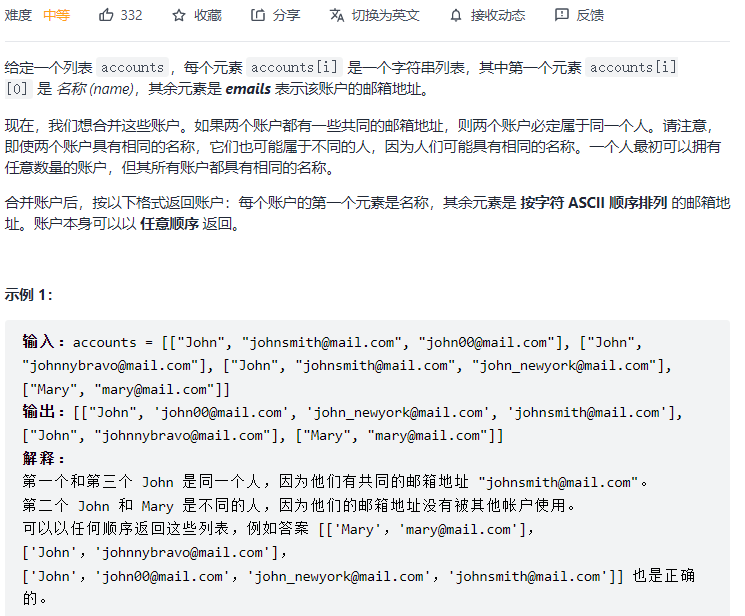
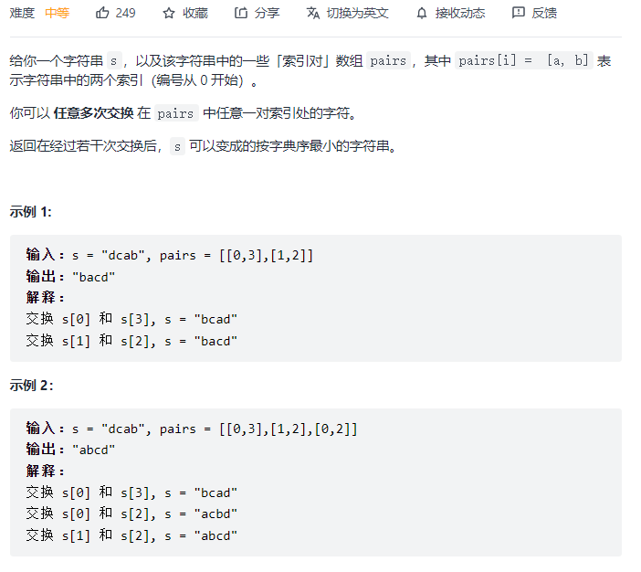

#### [684. 冗余连接](https://leetcode-cn.com/problems/redundant-connection/)


```python
class UF:
    def __init__(self, M):
        self.parent = {}
        self.cnt = 0
        for i in range(M):
            self.parent[i] = i
            self.cnt += 1
    def find(self, x):
        if x != self.parent[x]:
            self.parent[x] = self.find(self.parent[x])
            return self.parent[x]
        return x
    def connected(self, p, q):
        return self.find(p) == self.find(q)

    def union(self, p, q):
        if self.connected(p, q): return
        root_p = self.find(p)
        root_q = self.find(q)
        self.parent[root_p] = root_q
        self.cnt -= 1

class Solution:
    def findRedundantConnection(self, edges: List[List[int]]) -> List[int]:
        uf = UF(1001)
        for fr, to in edges:
            if uf.connected(fr, to): return [fr, to]
            uf.union(fr, to)
```

#### [547. 省份数量](https://leetcode-cn.com/problems/number-of-provinces/)


```python
class Solution:
    def findCircleNum(self, isConnected: List[List[int]]) -> int:
        self.cnt = 0
        self.parent = {}
        edge = []
        for i in range(len(isConnected)):
            for j in range(i + 1, len(isConnected)):
                if i == j: continue
                if isConnected[i][j] == 1: 
                    edge.append((i, j))
        for i in range(len(isConnected)):
            self.parent[i] = i
            self.cnt += 1
        for s, e in edge:
            self.union(s, e)
        return self.cnt

    def find(self, x):
        if x != self.parent[x]:
            self.parent[x] = self.find(self.parent[x])
            return self.parent[x]
        return x

    def connected(self, p, q):
        return self.find(p) == self.find(q)
    
    def union(self, p, q):
        if self.connected(p, q): return
        root_p = self.find(p)
        root_q = self.find(q)
        self.parent[root_p] = root_q
        self.cnt -= 1
```

#### [990. 等式方程的可满足性:star::star::star:](https://leetcode-cn.com/problems/satisfiability-of-equality-equations/)


```python
class Solution:
    def equationsPossible(self, equations: List[str]) -> bool:
        self.parent = {}
        for eq in equations:
            self.parent[eq[0]] = eq[0]
            self.parent[eq[3]] = eq[3]
        for eq in equations:
            if eq[1] == '=': self.union(eq[0], eq[3])
        for eq in equations:
            if eq[1] == '!' and self.connect(eq[0], eq[3]): return False
        return True

    def find(self, x):
        if x != self.parent[x]:
            self.parent[x] = self.find(self.parent[x])
            return self.parent[x]
        return x

    def connect(self, p, q):
        return self.find(p) == self.find(q)

    def union(self, p, q):
        if self.connect(p, q): return
        root_p = self.find(p)
        root_q = self.find(q)
        self.parent[root_p] = root_q
```

#### [721. 账户合并:star::star::star:](https://leetcode-cn.com/problems/accounts-merge/)



```python
class UF:
    def __init__(self):
        self.parent = {}

    def find(self, x):
        self.parent.setdefault(x, x)
        while x != self.parent[x]:
            x = self.parent[x]
        return x 
    def union(self, p, q):
        self.parent[self.find(p)] = self.find(q)


class Solution:
    def accountsMerge(self, accounts: List[List[str]]) -> List[List[str]]:
        uf = UF()
        email_to_name = {}
        # 记录email到name的映射
        # 对email做并查集的联通关系
        res = collections.defaultdict(list)
        for account in accounts:
            for i in range(1, len(account)):
                email_to_name[account[i]] = account[0]
                if i < len(account) - 1:uf.union(account[i], account[i + 1])
        for email in email_to_name:
            res[uf.find(email)].append(email)
        
        return [[email_to_name[value[0]]] + sorted(value) for value in res.values()]
```

#### [1202. 交换字符串中的元素](https://leetcode-cn.com/problems/smallest-string-with-swaps/)



```python
# 把所有可以交换的索引 构建联通集合，对每一个联通集合对应的字符集做排列
# s = "dcab", pairs = [[0,3],[1,2]]， [0,3]是一个联通集，把db排列为bd，ca排列为ac
# s = "dcab", pairs = [[0,3],[1,2],[0,2]]，[0,1,2,3]是一个联通集，把dcab排列为abcd
class Solution:
    def smallestStringWithSwaps(self, s: str, pairs: List[List[int]]) -> str:
        n=len(s)
        parent={i:i for i in range(n)}
        # 并查集
        def find(x):
            if x!=parent[x]:
                parent[x]=find(parent[x])
            return parent[x]
        # 查找根节点
        for l,r in pairs:
            a,b=find(l),find(r)
            if a!=b:
                parent[b]=a
        # 获取根节点对应的连通块集合
        dic=collections.defaultdict(list)
        for i in range(n):
            root=find(i)
            dic[root].append(i)
        # 对每个连通块中元素排序
        res=list(s)
        for k,v in dic.items():
            arr=[s[i] for i in v]
            arr.sort()
            for i in range(len(v)):
                res[v[i]]=arr[i]
        
        return "".join(res)
```

