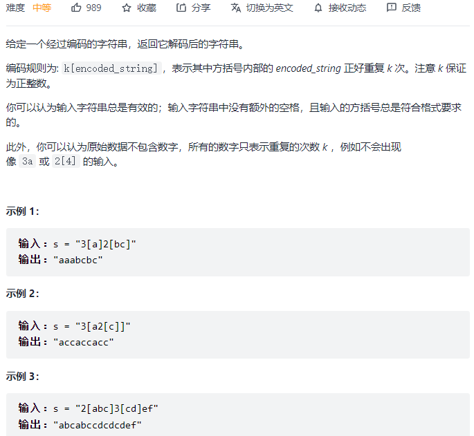

#### [394. 字符串解码](https://leetcode-cn.com/problems/decode-string/)



```python
class Solution:
    def decodeString(self, s: str) -> str:    
        stack = []
        for c in s:
            if c != ']':
                stack.append(c)
            else:
                # 记录[]内的字符串
                temp = ""
                while stack[-1] != '[':
                    temp = stack.pop() + temp
                stack.pop()
                
                num = []  # 记录[]外的数字，数字可能不止一位数字
                cnt = 0
                while stack and stack[-1].isdigit():
                    num.append(int(stack.pop()))
                for i in range(len(num)):
                    cnt += num[i] * (10 ** i)
                stack.append(temp * cnt)
                
        return''.join(stack)
```

#### [946. 验证栈序列](https://leetcode-cn.com/problems/validate-stack-sequences/)


```python
class Solution:
    def validateStackSequences(self, pushed: List[int], popped: List[int]) -> bool:
        stack = []
        index = 0
        for i in pushed:
            stack.append(i)
            while stack and stack[-1] == popped[index]:
                stack.pop()
                index += 1
        return index == len(pushed)
```

#### [739. 每日温度:star:](https://leetcode-cn.com/problems/daily-temperatures/)


```python
class Solution:
    def dailyTemperatures(self, temperatures: List[int]) -> List[int]:
        res = [0] * (len(temperatures))
        stack = [0]  # stack 存索引，递增栈，栈顶是最小的
        for i in range(1, len(temperatures)):
            if temperatures[i] <= temperatures[stack[-1]]:
                stack.append(i)
            else:
                while stack and temperatures[i] > temperatures[stack[-1]]:
                    idx = stack.pop()
                    res[idx] = i - idx
                stack.append(i)
        return res
```

#### [496. 下一个更大元素 I:star::star:](https://leetcode-cn.com/problems/next-greater-element-i/)


```python
class Solution:
    def nextGreaterElement(self, nums1: List[int], nums2: List[int]) -> List[int]:
        dic = {}
        for i in range(len(nums1)):
            dic[nums1[i]] = i
        res = [-1] * len(nums1)
        stack = [0]
        for i in range(1, len(nums2)):

            if nums2[i] < nums2[stack[-1]]:
                stack.append(i)
            else:
                while stack and nums2[i] > nums2[stack[-1]]:
                    idx = stack.pop()
                    if nums2[idx] in dic:
                        res[dic[nums2[idx]]] = nums2[i]
                stack.append(i)
        return res
```

#### [503. 下一个更大元素 II](https://leetcode-cn.com/problems/next-greater-element-ii/)


```python
class Solution:
    def nextGreaterElements(self, nums: List[int]) -> List[int]:
        n = len(nums)
        res = [-1] * n
        stack = []
        for i in range(2 * n):
            j = i % n
            while stack and nums[j] > nums[stack[-1]]:
                res[stack[-1]] = nums[j]
                stack.pop()
            stack.append(j)
        return res
```

#### [42. 接雨水](https://leetcode-cn.com/problems/trapping-rain-water/)


```python
class Solution:
    def trap(self, height: List[int]) -> int:
        res = 0
        # 单调栈，找到下一个更大的值，栈底到栈顶是递减的，栈里存height的索引位置
        stack = [0]
        for i in range(1, len(height)):
            if height[i] < height[stack[-1]]:
                stack.append(i)
            elif height[i] == height[stack[-1]]:
                stack.pop()
                stack.append(i)
            else:
                while stack and height[i] > height[stack[-1]]:
                    mid = stack.pop()
                    if stack:
                        left = stack[-1]
                        h = min(height[left], height[i]) - height[mid]
                        w = i - left - 1
                        res += h * w
                stack.append(i)
        return res
```

#### [84. 柱状图中最大的矩形](https://leetcode-cn.com/problems/largest-rectangle-in-histogram/)


```python
class Solution:
    def largestRectangleArea(self, heights: List[int]) -> int:
        res = 0
        heights.insert(0, 0)
        heights.append(0)  # 因为height的首末元素 也可能是主心骨 所以前后添加0
        stack = [0]
        for i in range(1, len(heights)):
            if heights[i] > heights[stack[-1]]:
                stack.append(i)
            elif heights[i] == heights[stack[-1]]:
                stack.pop()
                stack.append(i)
            else:
                while stack and heights[i] < heights[stack[-1]]:
                    mid = stack.pop()  # 5是主心骨，栈里的下一个值表示5左侧第一个更小的值为1，还要找到右侧下一个更小的值为2，res=10
                    if stack:
                        left = stack[-1]
                        w = i - left - 1
                        h = heights[mid]
                        res = max(res, w * h)
                    
                stack.append(i)
        return res
```

