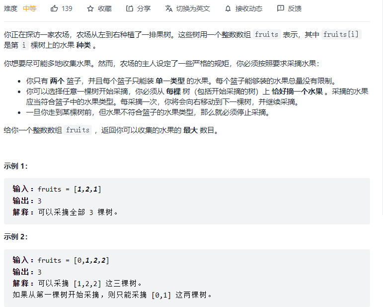
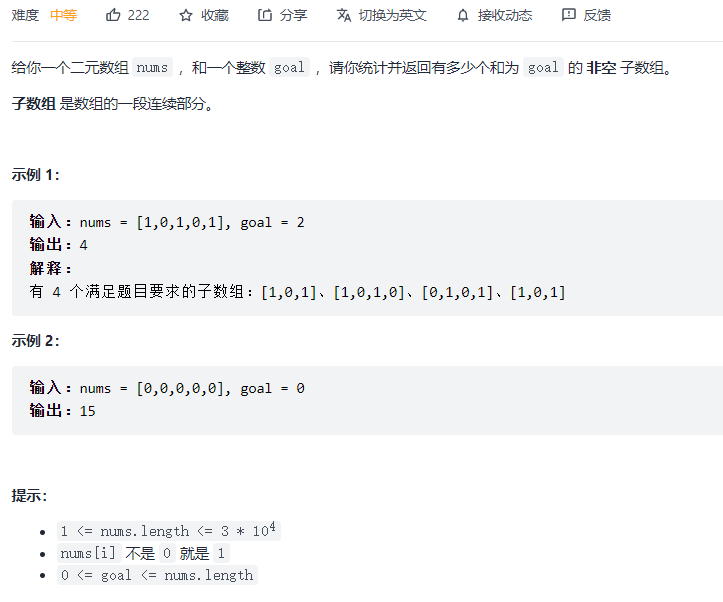
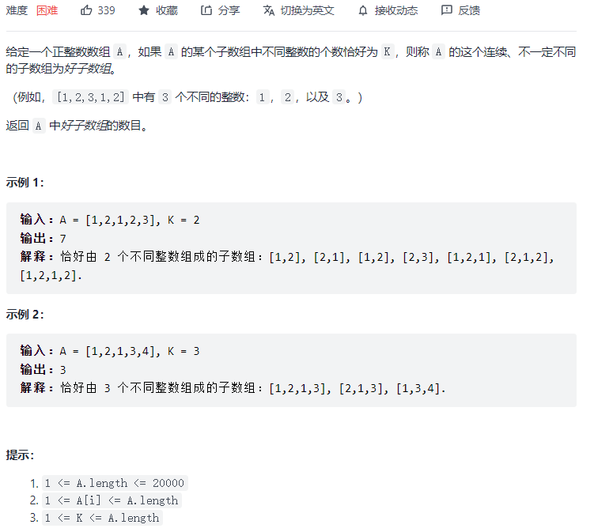
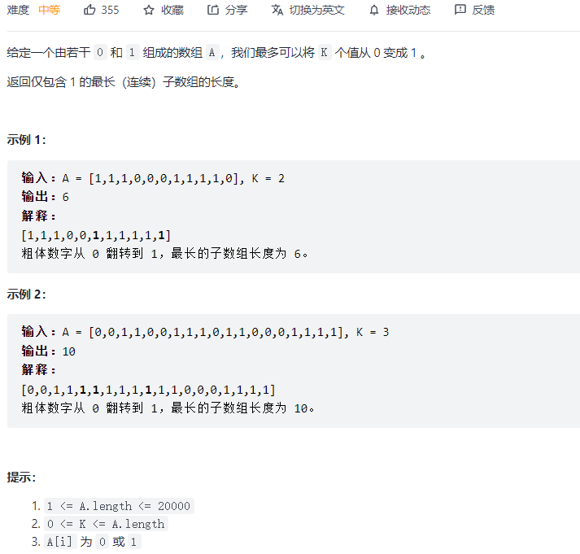
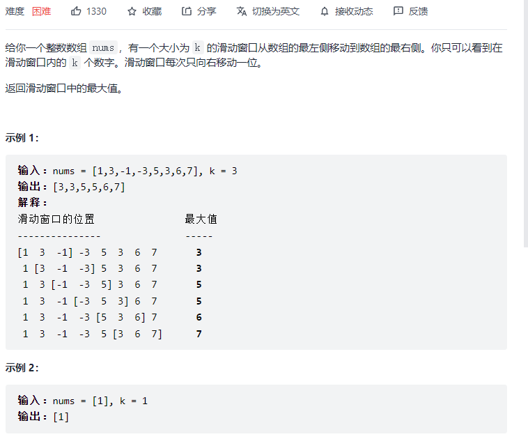
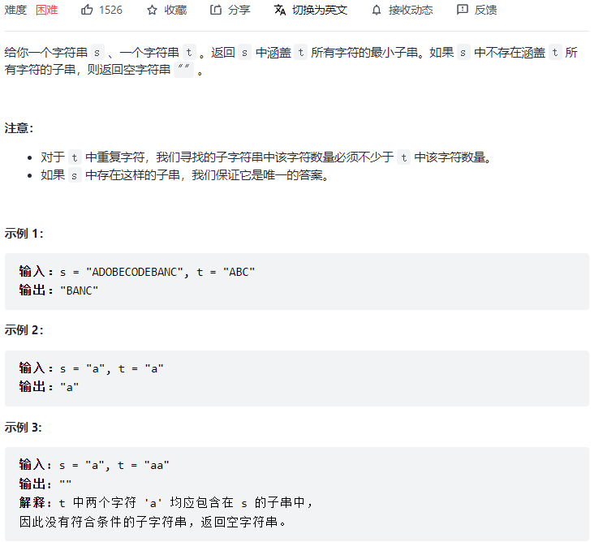

#### [209. 长度最小的子数组](https://leetcode-cn.com/problems/minimum-size-subarray-sum/)


```python
class Solution:
    def minSubArrayLen(self, target: int, nums: List[int]) -> int:
        res = len(nums) + 1
        left = 0
        s = 0
        for right in range(len(nums)):
            s += nums[right]
            while s >= target:
                res = min(res, right - left + 1)
                s -= nums[left]
                left += 1
        return res if res < len(nums) + 1 else 0
```

#### [3. 无重复字符的最长子串:star::star::star:](https://leetcode-cn.com/problems/longest-substring-without-repeating-characters/)


```python
class Solution:
    def lengthOfLongestSubstring(self, s: str) -> int:
        res = 0
        window = {}
        left = 0
        for right in range(len(s)):
            if s[right] not in window:
               window[s[right]] = 1
            else:
                window[s[right]] += 1
            
            while window[s[right]] > 1:
                window[s[left]] -= 1
                left += 1
            res = max(res, right - left + 1)
        return res
```

#### [438. 找到字符串中所有字母异位词:star::star::star:](https://leetcode-cn.com/problems/find-all-anagrams-in-a-string/)


```python
class Solution:
    def findAnagrams(self, s: str, p: str) -> List[int]:
        res = []
        left = 0
        needs = {}
        window = {}
        match = 0

        for i in range(len(p)):
            if p[i] not in needs: needs[p[i]] = 1
            else: needs[p[i]] += 1
        
        for right in range(len(s)):
            if s[right] in needs:
                if s[right] not in window: window[s[right]] = 1
                else: window[s[right]] += 1
                if window[s[right]] == needs[s[right]]: match += 1
            while match == len(needs):
                if len(p) == right - left + 1: # 如果窗口内有其他的 不属于p的字符，则不添加
                    res.append(left)
                if s[left] in needs:
                    window[s[left]] -= 1
                    if window[s[left]] < needs[s[left]]: match -= 1                
                left += 1
        return res
```

#### [904. 水果成篮](https://leetcode-cn.com/problems/fruit-into-baskets/)



```python
class Solution:
    def totalFruit(self, fruits: List[int]) -> int:
        res = 0
        window = {}
        left = 0
        for right in range(len(fruits)):
            if fruits[right] not in window: window[fruits[right]] = 1
            else: window[fruits[right]] += 1

            while len(window) > 2:
                window[fruits[left]] -= 1
                if window[fruits[left]] == 0:
                    window.pop(fruits[left])
                left += 1
            res = max(res, right - left + 1)
        return res
```

#### [930. 和相同的二元子数组:star:](https://leetcode-cn.com/problems/binary-subarrays-with-sum/)



```python
class Solution:
    def numSubarraysWithSum(self, A: List[int], S: int) -> int:
        def atMostK(A, S):
            if S < 0:
                return 0
            start = 0
            count = 0
            sum_ = 0
            for end in range(len(A)):
                sum_ += A[end]
                while sum_ > S:
                    sum_ -= A[start]
                    start += 1
                count += end - start + 1
            return count
        return atMostK(A, S) - atMostK(A, S - 1)
```

#### [992. K 个不同整数的子数组](https://leetcode-cn.com/problems/subarrays-with-k-different-integers/)



```python
class Solution:
    def subarraysWithKDistinct(self, nums: List[int], k: int) -> int:
        def helper(k):
            res = 0
            left = 0
            window = {}
            for right in range(len(nums)):
                if nums[right] not in window: window[nums[right]] = 1
                else: window[nums[right]] += 1

                while len(window) > k:
                    window[nums[left]] -= 1
                    if window[nums[left]] == 0: window.pop(nums[left])
                    left += 1
                res += (right - left + 1)
            return res
        return helper(k) - helper(k-1)
```

#### [1004. 最大连续1的个数 III](https://leetcode-cn.com/problems/max-consecutive-ones-iii/)



```python
class Solution:
    def longestOnes(self, nums: List[int], k: int) -> int:
        res = 0
        left = 0

        window_sum = 0
        for right in range(len(nums)):
            window_sum += nums[right]
            while (right - left + 1) > window_sum + k:
                window_sum -= nums[left]
                left += 1
            res = max(res, right - left + 1)
        return res
```

#### [239. 滑动窗口最大值:star::star::star:](https://leetcode-cn.com/problems/sliding-window-maximum/)



```python
class Solution:
    def maxSlidingWindow(self, nums: List[int], k: int) -> List[int]:
        q = deque()
        res = []
        for i, j in enumerate(nums):
            # 队列尾部 只保留最大的，把小于当前值的 剔除
            while q and nums[q[-1]] < j:
                q.pop()
            
            q.append(i)
            
            # 队列头元素 超出范围 则剔除
            if q and q[0] <= i - k:
                q.popleft()
            
            # 如果窗口大小 满足k，则添加
            if i >= k - 1:
                res.append(nums[q[0]])
        return res
```

#### [76. 最小覆盖子串:star::star::star:](https://leetcode-cn.com/problems/minimum-window-substring/)



```python
class Solution:
    def minWindow(self, s: str, t: str) -> str:
        if len(t) > len(s): return ""
        res = ""
        min_len = len(s) + 1
        left = 0
        window = {}
        match = 0
        need = {}
        for c in t:
            if c not in need: need[c] = 1
            else: need[c] += 1

        for right in range(len(s)):
            if s[right] in need:
                if s[right] not in window: window[s[right]] = 1
                else: window[s[right]] += 1

                if window[s[right]] == need[s[right]]: match += 1

                while match == len(need):
                    if min_len > right - left + 1:
                        min_len = right - left + 1
                        res = s[left: right + 1]
                    if s[left] in window:
                        window[s[left]] -= 1
                        if window[s[left]] < need[s[left]]: match -= 1
                        left += 1
                    while left < right and s[left] not in window:
                        left += 1
        return res
```

