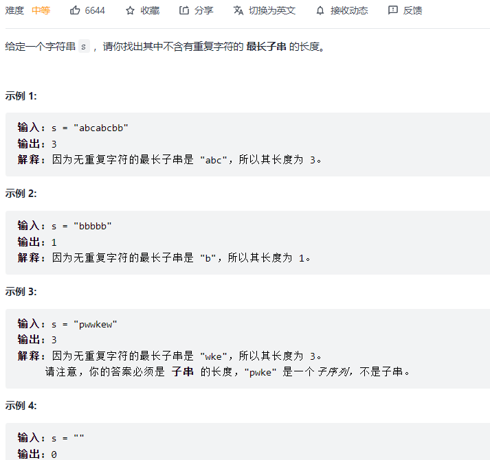

#### [209. 长度最小的子数组](https://leetcode-cn.com/problems/minimum-size-subarray-sum/)


```python
class Solution:
    def minSubArrayLen(self, target: int, nums: List[int]) -> int:
        res = len(nums) + 1
        left = 0
        s = 0
        for right in range(len(nums)):
            s += nums[right]
            while s >= target:
                res = min(res, right - left + 1)
                s -= nums[left]
                left += 1
        return res if res < len(nums) + 1 else 0
```

#### [3. 无重复字符的最长子串](https://leetcode-cn.com/problems/longest-substring-without-repeating-characters/)



```python
class Solution:
    def lengthOfLongestSubstring(self, s: str) -> int:
        res = 0
        window = {}
        left = 0
        for right in range(len(s)):
            if s[right] not in window:
               window[s[right]] = 1
            else:
                window[s[right]] += 1
            
            while window[s[right]] > 1:
                window[s[left]] -= 1
                left += 1
            res = max(res, right - left + 1)
        return res
```

#### [438. 找到字符串中所有字母异位词](https://leetcode-cn.com/problems/find-all-anagrams-in-a-string/)


```python
class Solution:
    def findAnagrams(self, s: str, p: str) -> List[int]:
        res = []
        left = 0
        needs = {}
        window = {}
        match = 0

        for i in range(len(p)):
            if p[i] not in needs: needs[p[i]] = 1
            else: needs[p[i]] += 1
        
        for right in range(len(s)):
            if s[right] in needs:
                if s[right] not in window: window[s[right]] = 1
                else: window[s[right]] += 1
                if window[s[right]] == needs[s[right]]: match += 1
            while match == len(needs):
                if len(p) == right - left + 1: # 如果窗口内有其他的 不属于p的字符，则不添加
                    res.append(left)
                if s[left] in needs:
                    window[s[left]] -= 1
                    if window[s[left]] < needs[s[left]]: match -= 1                
                left += 1
        return res
```

