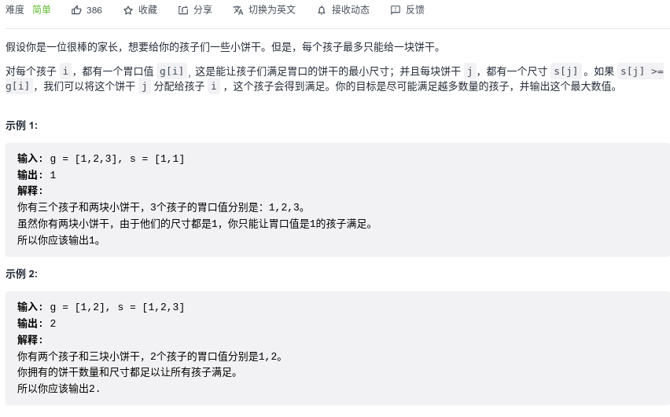

#### [455. 分发饼干](https://leetcode-cn.com/problems/assign-cookies/)



```python
class Solution:
    def findContentChildren(self, g: List[int], s: List[int]) -> int:
        g.sort()
        s.sort()

        res = 0
        g_idx = len(g) - 1
        s_idx = len(s) - 1
        while g_idx >= 0 and s_idx >= 0:
            if s[s_idx] >= g[g_idx]:
                res += 1
                g_idx -= 1
                s_idx -= 1
            else:
                g_idx -= 1
        return res
```

