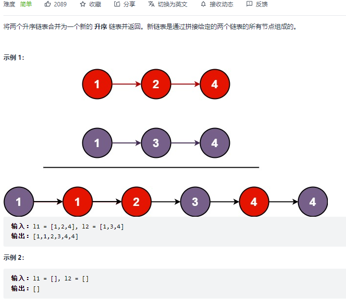

#### [206. 反转链表](https://leetcode-cn.com/problems/reverse-linked-list/)


```python
class Solution:
    def reverseList(self, head: ListNode) -> ListNode:
        cur, pre = head, None
        while cur:
            nxt = cur.next
            cur.next = pre
            pre = cur
            cur = nxt
        return pre
```

```python
# 前序递归
class Solution:
    def reverseList(self, head: ListNode) -> ListNode:
        def helper(head, pre):
            if not head:
                return pre
            nxt = head.next
            head.next = pre
            pre = helper(nxt, head)
            return pre
        return helper(head, None)
```

```python
# 后序递归
class Solution:
    def reverseList(self, head: ListNode) -> ListNode:
        def helper(head):
            if not head or not head.next: return head

            res = helper(head.next)
            head.next.next = head
            head.next = None
            return res
        return helper(head)
```

#### [25. K 个一组翻转链表](https://leetcode-cn.com/problems/reverse-nodes-in-k-group/)


```python
class Solution:
    def reverseKGroup(self, head: ListNode, k: int) -> ListNode:
        def reverse(head, tail):
            cur, pre = head, None
            while pre != tail:
                nxt = cur.next
                cur.next = pre
                pre = cur
                cur = nxt
            return tail, head
        
        dummy = ListNode(-1)
        dummy.next = head
        fast, slow = dummy, dummy
        while fast:
            for _ in range(k):
                fast = fast.next
                if not fast:
                    return dummy.next
            nxt = fast.next
            cur_head, cur_tail = reverse(slow.next, fast)
            cur_tail.next = nxt
            slow.next = cur_head
            fast = slow = cur_tail
        return dummy.next
```

#### [141. 环形链表](https://leetcode-cn.com/problems/linked-list-cycle/)


```python
class Solution:
    def hasCycle(self, head: ListNode) -> bool:
        fast, slow = head, head
        while fast and fast.next:
            fast = fast.next.next
            slow = slow.next
            if fast == slow:
                return True
        return False
```

#### [142. 环形链表 II](https://leetcode-cn.com/problems/linked-list-cycle-ii/)


```python
class Solution:
    def detectCycle(self, head: ListNode) -> ListNode:
        fast, slow = head, head
        while fast and fast.next:
            fast = fast.next.next
            slow = slow.next
            if fast == slow:
                p = fast
                q = head
                while p != q:
                    p = p.next
                    q = q.next
                return p
        return None
```


#### [21. 合并两个有序链表](https://leetcode-cn.com/problems/merge-two-sorted-lists/)



```python
class Solution:
    def mergeTwoLists(self, list1: Optional[ListNode], list2: Optional[ListNode]) -> Optional[ListNode]:
        dummy = ListNode(-1)
        p = dummy
        while list1 and list2:
            if list1.val < list2.val:
                p.next = list1
                list1 = list1.next
            else:
                p.next = list2
                list2 = list2.next
            p = p.next
        if list1:
            p.next = list1
        if list2:
            p.next = list2
        return dummy.next
```

#### [160. 相交链表](https://leetcode-cn.com/problems/intersection-of-two-linked-lists/)


```python
class Solution:
    def getIntersectionNode(self, headA: ListNode, headB: ListNode) -> ListNode:
        a, b = headA, headB
        while a != b:
            a = a.next if a else headB
            b = b.next if b else headA
        return a
```

#### [92. 反转链表 II](https://leetcode-cn.com/problems/reverse-linked-list-ii/)


```python
class Solution:
    def reverseBetween(self, head: ListNode, left: int, right: int) -> ListNode:
        def reverse(head, tail):
            cur, pre = head, None
            while pre != tail:
                nxt = cur.next
                cur.next = pre
                pre = cur
                cur = nxt
            return tail, head
        
        if left == right: return head
        dummy = ListNode(-1)
        dummy.next = head
        fast, slow = dummy, dummy
        for _ in range(right):
            fast = fast.next
        for _ in range(left-1):
            slow = slow.next
        nxt_head = fast.next
        cur_head, cur_tail = reverse(slow.next, fast)
        slow.next = cur_head
        cur_tail.next = nxt_head
        return dummy.next
```

#### [82. 删除排序链表中的重复元素 II:star::star::star:](https://leetcode-cn.com/problems/remove-duplicates-from-sorted-list-ii/)


```python
class Solution:
    def deleteDuplicates(self, head: ListNode) -> ListNode:
        if not head or not head.next:
            return head
        # [1,2,2,3]  1!=2, 但1要指向3
        if head.val != head.next.val:
            head.next = self.deleteDuplicates(head.next)
        else:
            nxt = head.next
            while nxt and nxt.val == head.val:
                nxt = nxt.next
            return self.deleteDuplicates(nxt)
        return head
```

#### [83. 删除排序链表中的重复元素](https://leetcode-cn.com/problems/remove-duplicates-from-sorted-list/)


```python
class Solution:
    def deleteDuplicates(self, head: ListNode) -> ListNode:
        if not head or not head.next: return head

        dummy = ListNode(-1)
        dummy.next = head
        p, q = dummy, head
        while q.next:
            if q.val == q.next.val:
                q.next = q.next.next
            else:
                p = p.next
                q = q.next
        return dummy.next   
```

```python
class Solution:
    def deleteDuplicates(self, head: ListNode) -> ListNode:
        if not head or not head.next: return head

        tmp = self.deleteDuplicates(head.next)
        while tmp and tmp.val == head.val:
            tmp = tmp.next
        head.next = tmp
        return head
```

#### [86. 分隔链表](https://leetcode-cn.com/problems/partition-list/)


```python
class Solution:
    def partition(self, head: ListNode, x: int) -> ListNode:
        small, large = ListNode(), ListNode()
        p, q = small, large
        while head:
            if head.val < x:
                p.next = head
                p = p.next
                head = head.next
            else:
                q.next = head
                q = q.next
                head = head.next
        p.next = large.next
        q.next = None
        return small.next
```

#### [138. 复制带随机指针的链表](https://leetcode-cn.com/problems/copy-list-with-random-pointer/)


```python
class Solution:
    def copyRandomList(self, head: 'Node') -> 'Node':
        s = dict()
        def helper(head):
            if not head: return None
            if head in s:
                return s[head]
            
            root = Node(head.val)
            s[head] = root
            root.next = helper(head.next)
            root.random = helper(head.random)
            return root
        return helper(head)  
```

#### [143. 重排链表:star::star::star:](https://leetcode-cn.com/problems/reorder-list/)


```python
# 找中点，右边链表反转，合并两链表
class Solution:
    def reorderList(self, head: ListNode) -> None:
        """
        Do not return anything, modify head in-place instead.
        """

        def reverse(head):
            pre, cur = None, head
            while cur:
                nxt = cur.next
                cur.next = pre
                pre = cur
                cur = nxt
            return pre

        def merge(l1, l2):
            if not l1 and not l2: return None
            if not l1: return l2
            if not l2: return l1
            nxt = merge(l1.next, l2.next)
            l1.next = l2
            l2.next = nxt
            return l1
            
        dummy = ListNode()
        dummy.next = head
        fast, slow = dummy, dummy
        while fast.next and fast.next.next:
            fast = fast.next.next
            slow = slow.next
        l2 = slow.next
        slow.next = None
        l1 = dummy.next
        l2 = reverse(l2)
        return merge(l1, l2)
```

#### [234. 回文链表](https://leetcode-cn.com/problems/palindrome-linked-list/)


```python
# 找中点，右半部分链表反转，两个链表对比
class Solution:
    def isPalindrome(self, head: ListNode) -> bool:
        def reverse(head):
            pre, cur = None, head
            while cur:
                nxt = cur.next
                cur.next = pre
                pre = cur
                cur = nxt
            return pre
        
        fast = slow = head
        while fast.next and fast.next.next:
            fast = fast.next.next
            slow = slow.next
        l2 = slow.next
        slow.next = None
        l1 = head
        l2 = reverse(l2)
        while l1 and l2:
            if l1.val != l2.val: return False
            else:
                l1 = l1.next
                l2 = l2.next
        return True
```

#### [148. 排序链表](https://leetcode-cn.com/problems/sort-list/)


```python
class Solution:
    def sortList(self, head: ListNode) -> ListNode:
        if not head or not head.next: return head # termination.
        # cut the LinkedList at the mid index.
        slow, fast = head, head
        while fast.next and fast.next.next:
            fast, slow = fast.next.next, slow.next
        mid, slow.next = slow.next, None # save and cut.
        # recursive for cutting.
        left, right = self.sortList(head), self.sortList(mid)
        # merge `left` and `right` linked list and return it.
        h = res = ListNode(0)
        while left and right:
            if left.val < right.val: h.next, left = left, left.next
            else: h.next, right = right, right.next
            h = h.next
        h.next = left if left else right
        return res.next
```

