#### [29. 两数相除](https://leetcode-cn.com/problems/divide-two-integers/)


```python
class Solution:
    def divide(self, dividend: int, divisor: int) -> int:
        pos = ((dividend >= 0) and (divisor > 0)) or ((dividend <= 0) and (divisor < 0))
        res = 0
        # 逐步递减，求商
        dividend = abs(dividend)
        divisor = abs(divisor)
        while dividend >= divisor:
            # tmp指数级翻倍
            i = 1
            tmp = divisor
            while dividend >= tmp:
                dividend -= tmp
                res += i
                i <<= 1
                tmp <<= 1

        if not pos:
            res = - res
        return res if -2**31 <= res <= 2**31-1 else 2**31-1
```

#### [91. 解码方法](https://leetcode-cn.com/problems/decode-ways/)


```python
# 超时
class Solution:
    def numDecodings(self, s: str) -> int:
        self.res = 0
        def backtrack(start, cur_len):
            if cur_len == len(s):
                self.res += 1
                return
            if s[start] == '0':
                return
            for i in range(1, 3):
                if int(s[start: start + i]) > 26:
                    break
                if start + i > len(s):
                    break
                backtrack(start + i, cur_len + i)
        backtrack(0, 0)
        return self.res
```

```python
class Solution:
    def numDecodings(self, s: str) -> int:
        n = len(s)
        dp = [0] * (n + 1)
        dp[0] = 1
        for i in range(1, n + 1):
            # 情况1，只选一个字符，需要保证这个字符不是0
            if s[i-1] !=  '0':
                dp[i] += dp[i-1]
            # 情况2，选两个字符
            if i > 1 and s[i-2] != '0' and int(s[i-2: i]) <= 26:
                dp[i] += dp[i-2]
        return dp[-1]
```

#### [138. 复制带随机指针的链表](https://leetcode-cn.com/problems/copy-list-with-random-pointer/)


```python
"""
# Definition for a Node.
class Node:
    def __init__(self, x: int, next: 'Node' = None, random: 'Node' = None):
        self.val = int(x)
        self.next = next
        self.random = random
"""

class Solution:
    def copyRandomList(self, head: 'Optional[Node]') -> 'Optional[Node]':
        nodes = {}

        def helper(head):
            if not head: return None
            if head in nodes:
                return nodes[head]
            node = Node(head.val)
            nodes[head] = node
            node.next = helper(head.next)
            node.random = helper(head.random)
            return node
        return helper(head)
```

#### [139. 单词拆分](https://leetcode-cn.com/problems/word-break/)


```python
class Solution:
    def wordBreak(self, s: str, wordDict: List[str]) -> bool:
        m = len(s)
        n = len(wordDict)
        dp = [False] * (m + 1)
        dp[0] = True
        for i in range(1, m + 1):
            for j in range(n):
                if len(wordDict[j]) > i:
                    continue
                dp[i] = dp[i] or (dp[i-len(wordDict[j])] and s[i-len(wordDict[j]): i] == wordDict[j])
        return dp[-1]
```

#### [202. 快乐数](https://leetcode-cn.com/problems/happy-number/)


```python
class Solution:
    def isHappy(self, n: int) -> bool:
        s = set()
        while True:
            res = 0
            while n > 0:
                res += (n % 10) ** 2
                n //= 10
            if res == 1:
                return True
            if res in s:
                return False
            else:
                n = res
                s.add(res)
```

#### [162. 寻找峰值](https://leetcode-cn.com/problems/find-peak-element/)


```python
class Solution:
    def findPeakElement(self, nums: List[int]) -> int:
        if len(nums) == 1:
            return 0
        left, right = 0, len(nums) - 1
        while left <= right:
            mid = left + (right - left) // 2
            if mid == 0:
                if nums[mid] > nums[mid + 1]:
                    return mid
                else:
                    left = mid + 1
            if mid == len(nums) - 1:
                if nums[mid] > nums[mid - 1]:
                    return mid
                else:
                    right = mid - 1
            else:
                if nums[mid - 1] < nums[mid] and nums[mid + 1] < nums[mid]:
                    return mid
                elif nums[mid - 1] > nums[mid]:
                    right = mid -1
                else:
                    left = mid + 1
        return left
```

#### [166. 分数到小数](https://leetcode-cn.com/problems/fraction-to-recurring-decimal/)


```python
class Solution:
    def fractionToDecimal(self, numerator: int, denominator: int) -> str:
        if numerator % denominator == 0:
            return str(numerator // denominator)
        s = []
        if (numerator < 0) != (denominator < 0):
            s.append('-')
        # 整数部分
        numerator = abs(numerator)
        denominator = abs(denominator) 
        integer = numerator // denominator
        s.append(str(integer))
        s.append('.')

        # 小数部分
        index_dic = {}
        reminder = numerator % denominator
        while reminder != 0 and reminder not in index_dic:
            index_dic[reminder] = len(s)
            reminder *= 10
            s.append(str(reminder // denominator))
            reminder %= denominator
        if reminder != 0:
            insert_idx = index_dic[reminder]
            s.insert(insert_idx, '(')
            s.append(')')
        return ''.join(s)
```

#### [227. 基本计算器 II](https://leetcode-cn.com/problems/basic-calculator-ii/)


```python
class Solution:
    def calculate(self, s: str) -> int:
        def calc(num_stack, op_stack):
            op, y, x = op_stack.pop(), num_stack.pop(), num_stack.pop() if num_stack else 0
            ans = 0
            if op == '+': ans = x + y
            elif op == '-': ans = x - y
            elif op == '*': ans = x * y
            elif op == '/': ans = x // y
            elif op == '%': ans = x % y
            elif op == '^': ans = math.pow(x, y)
            num_stack.append(int(ans))

        op_prio = {'+': 0, '-': 0, '*': 1, '/': 1, '%': 1, '^': 2}

        s = "(" + s.replace(' ', '').replace('(-', '(0-') + ')'
        n = len(s)
        op_stack, num_stack = [], []

        i = 0
        while i < n:
            c = s[i]
            i += 1
            if c.isdigit():
                num = int(c)
                while i < n and s[i].isdigit():
                    num = num * 10 + int(s[i])
                    i += 1
                num_stack.append(num)
            elif c == '(':
                op_stack.append(c)
            elif c == ')':
                while op_stack and op_stack[-1] != '(':
                    calc(num_stack, op_stack)
                op_stack.pop()
            else:
                while op_stack and op_stack[-1] != '(':
                    prev_op = op_stack[-1]
                    if op_prio[prev_op] < op_prio[c]:
                        break
                    calc(num_stack, op_stack)
                op_stack.append(c)
        return num_stack[0]
```

#### [239. 滑动窗口最大值](https://leetcode-cn.com/problems/sliding-window-maximum/)


```python
class Solution:
    def maxSlidingWindow(self, nums: List[int], k: int) -> List[int]:
        q = collections.deque()
        res = []

        for i, j in enumerate(nums):
            while q and j > nums[q[-1]]:
                q.pop()
            
            if q and q[0] <= i - k:
                q.popleft()
            
            q.append(i)

            if i - k + 1 >= 0:
                res.append(nums[q[0]])
        return res
```

```python
class Queue:
    def __init__(self):
        self.q = collections.deque()
    
    def pop(self, value):
        if self.q and self.q[0] == value:
            self.q.popleft()

    def push(self, value):
        while self.q and value > self.q[-1]:
            self.q.pop()
        self.q.append(value)

    def front(self):
        return self.q[0]

class Solution:
    def maxSlidingWindow(self, nums: List[int], k: int) -> List[int]:
        q = Queue()
        res = []
        for i in range(k):
            q.push(nums[i])
        res.append(q.front())
        for i in range(k, len(nums)):
            q.pop(nums[i-k])
            q.push(nums[i])
            res.append(q.front())
        return res
```


#### [287. 寻找重复数](https://leetcode-cn.com/problems/find-the-duplicate-number/)

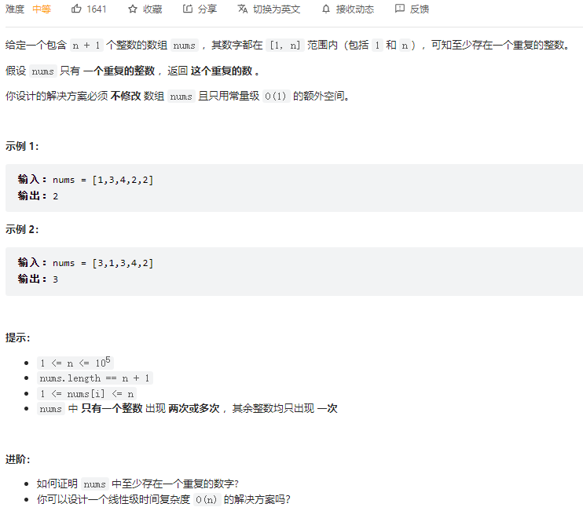

```python
class Solution:
    def findDuplicate(self, nums: List[int]) -> int:
        fast = slow = 0
        while True:
            fast = nums[nums[fast]]
            slow = nums[slow]
            if fast == slow:
                break
        fast = 0
        while True:
            fast = nums[fast]
            slow = nums[slow]
            if fast == slow:
                return slow
```

#### [350. 两个数组的交集 II](https://leetcode-cn.com/problems/intersection-of-two-arrays-ii/)

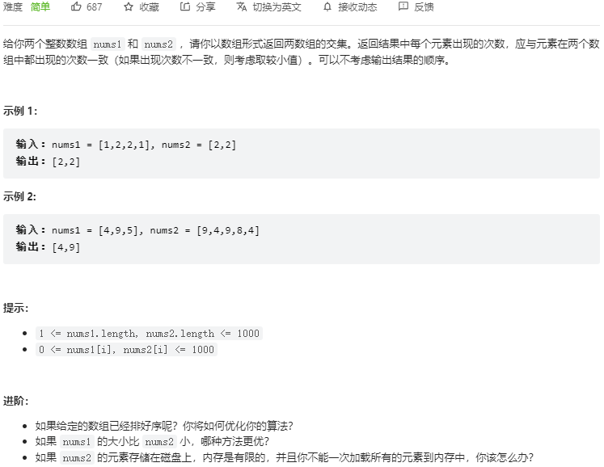

```python
class Solution:
    def intersect(self, nums1: List[int], nums2: List[int]) -> List[int]:
        nums1.sort()
        nums2.sort()
        left, right = 0, 0
        res = []
        while left < len(nums1) and right < len(nums2):
            if nums1[left] < nums2[right]:
                left += 1
            elif nums1[left] == nums2[right]:
                res.append(nums1[left])
                left += 1
                right += 1
            else:
                right += 1
        return res
```

```python
class Solution:
    def intersect(self, nums1: List[int], nums2: List[int]) -> List[int]:
        if len(nums1) > len(nums2):
            return self.intersect(nums2, nums1)
        res = []
        m = collections.Counter()
        for n in nums1:
            m[n] += 1
        for n in nums2:
            if n in m:
                res.append(n)
                m[n] -= 1
                if m[n] == 0:
                    m.pop(n)
        return res
```

#### [329. 矩阵中的最长递增路径](https://leetcode-cn.com/problems/longest-increasing-path-in-a-matrix/)

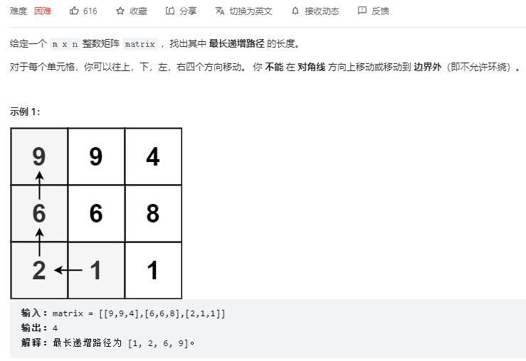

```python
class Solution:
    def longestIncreasingPath(self, matrix: List[List[int]]) -> int:
        m, n = len(matrix), len(matrix[0])
        res = 0
        def dfs(x, y):
            if mem[x][y] != 0:
                return mem[x][y]
            mem[x][y] += 1
            for i, j in ((x - 1, y), (x + 1, y), (x, y - 1), (x, y + 1)):
                if i < 0 or i >= m or j < 0 or j >= n:
                    continue
                if matrix[i][j] > matrix[x][y]:
                    mem[x][y] = max(mem[x][y], dfs(i, j) + 1)
            return mem[x][y]
        
        mem = [[0] * n for _ in range(m)]
        for i in range(m):
            for j in range(n):
                res = max(res, dfs(i, j))
        return res
```

#### [371. 两整数之和](https://leetcode-cn.com/problems/sum-of-two-integers/)

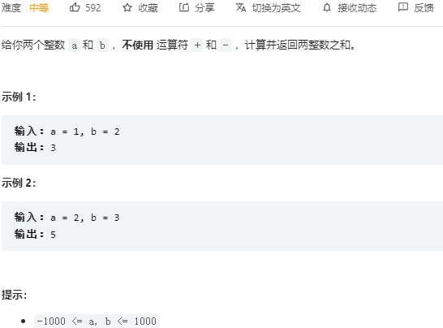

```python
class Solution:
    def getSum(self, a: int, b: int) -> int:
        a &= 0xFFFFFFFF
        b &= 0xFFFFFFFF
        while b:
            carry = (a & b)
            a ^= b
            b = (carry << 1) & 0xFFFFFFFF
        return a if a < 0x80000000 else ~(a^0xFFFFFFFF)
```

#### [380. O(1) 时间插入、删除和获取随机元素](https://leetcode-cn.com/problems/insert-delete-getrandom-o1/)

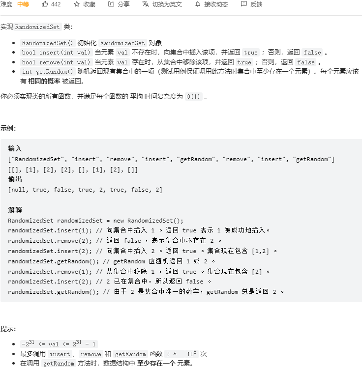

```python
from random import choice
class RandomizedSet:

    def __init__(self):
        self.dic = {}
        self.lst = []

    def insert(self, val: int) -> bool:
        if val in self.dic:
            return False
        self.dic[val] = len(self.lst)
        self.lst.append(val)
        return True

    def remove(self, val: int) -> bool:
        if val not in self.dic:
            return False
        idx = self.dic[val]
        last_val = self.lst[-1]
        self.lst[idx], self.lst[-1] = self.lst[-1], self.lst[idx]
        self.dic[last_val] = idx
        self.lst.pop()
        self.dic.pop(val)
        return True

    def getRandom(self) -> int:
        return choice(self.lst)
```

#### [378. 有序矩阵中第 K 小的元素](https://leetcode-cn.com/problems/kth-smallest-element-in-a-sorted-matrix/)

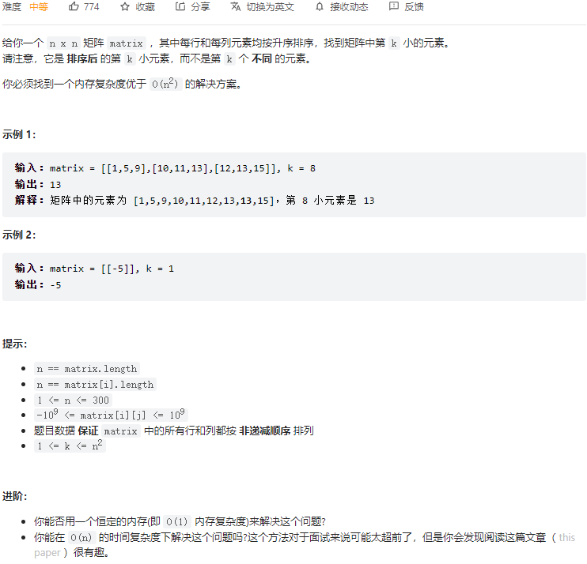

```python
class Solution:
    def kthSmallest(self, matrix: List[List[int]], k: int) -> int:
        n = len(matrix)
        def check(mid):
            i, j = n - 1, 0
            num = 0
            while i >= 0 and j < n:
                if matrix[i][j] <= mid:
                    num += i + 1  # 这一列 都小于等于mid
                    j += 1  # 指针指向下一列
                else:
                    i -= 1
            return num
        
        left, right = matrix[0][0], matrix[-1][-1]
        while left <= right:
            mid = left + (right - left) // 2
            cnt = check(mid)
            if cnt >= k:
                right = mid - 1
            else:
                left = mid + 1
        return left
```

#### [295. 数据流的中位数](https://leetcode-cn.com/problems/find-median-from-data-stream/)

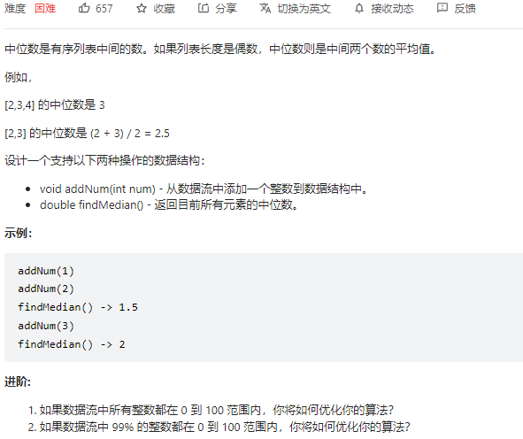

[图解 排序+二分查找+优先队列 - 数据流的中位数 - 力扣（LeetCode） (leetcode-cn.com)](https://leetcode-cn.com/problems/find-median-from-data-stream/solution/tu-jie-pai-xu-er-fen-cha-zhao-you-xian-dui-lie-by-/)

```python
class MedianFinder:

    def __init__(self):
        """
        initialize your data structure here.
        """
        # 初始化大顶堆和小顶堆
        self.max_heap = []
        self.min_heap = []

    def addNum(self, num: int) -> None:
        if len(self.max_heap) == len(self.min_heap):# 先加到大顶堆，再把大堆顶元素加到小顶堆
            heapq.heappush(self.min_heap, -heapq.heappushpop(self.max_heap, -num))
        else:  # 先加到小顶堆，再把小堆顶元素加到大顶堆
            heapq.heappush(self.max_heap, -heapq.heappushpop(self.min_heap, num))

    def findMedian(self) -> float:
        if len(self.min_heap) == len(self.max_heap):
            return (-self.max_heap[0] + self.min_heap[0]) / 2
        else:
            return self.min_heap[0]
```

#### [384. 打乱数组](https://leetcode-cn.com/problems/shuffle-an-array/)

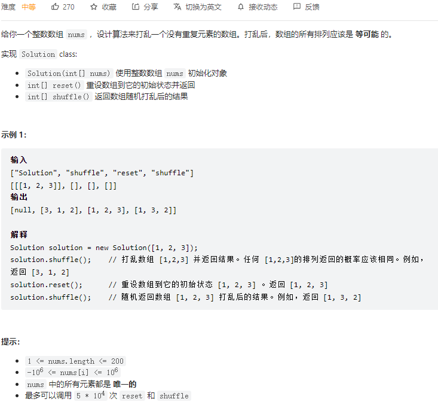

```python
class Solution:

    def __init__(self, nums: List[int]):
        self.nums = nums

    def reset(self) -> List[int]:
        return self.nums

    def shuffle(self) -> List[int]:
        tmp = self.nums[:]
        for i in range(len(self.nums)):
            idx = random.randint(i, len(tmp)-1)  # randint 左闭右闭的
            tmp[i], tmp[idx] = tmp[idx], tmp[i]
        return tmp
```

#### [395. 至少有 K 个重复字符的最长子串](https://leetcode-cn.com/problems/longest-substring-with-at-least-k-repeating-characters/)

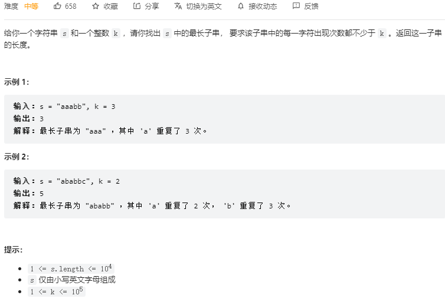

```python
class Solution:
    def longestSubstring(self, s: str, k: int) -> int:
        if len(s) < k:
            return 0
        for c in set(s):
            # c字符在s中出现的次数不超过k，说明带有c的字串都不满足题意，
            # 因此按照c对s进行拆分 得到多个没有c的字串
            if s.count(c) < k:
                return max(self.longestSubstring(t, k) for t in s.split(c))
        return len(s)
```

#### [28. 实现 strStr()](https://leetcode-cn.com/problems/implement-strstr/)

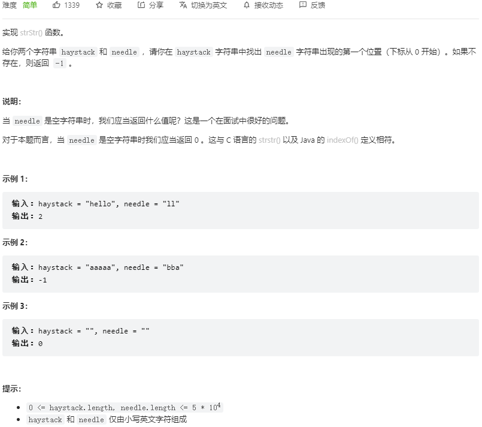

```python
# KMP算法
class Solution:
    def strStr(self, haystack: str, needle: str) -> int:
        if not needle:
            return 0
        m, n = len(haystack), len(needle)
        # 求前缀表  next数组
        nxt = [0] * n
        j = 0
        for i in range(1, n):
            while j > 0 and needle[j] != needle[i]:
                j = nxt[j-1]
            if needle[j] == needle[i]:
                j += 1
            nxt[i] = j
        
        # 匹配
        j = 0
        for i in range(m):
            while j > 0 and haystack[i] != needle[j]:
                j = nxt[j - 1]
            if haystack[i] == needle[j]:
                j += 1
            if j == n:
                return i - n + 1
        return -1
```

#### [297. 二叉树的序列化与反序列化](https://leetcode-cn.com/problems/serialize-and-deserialize-binary-tree/)

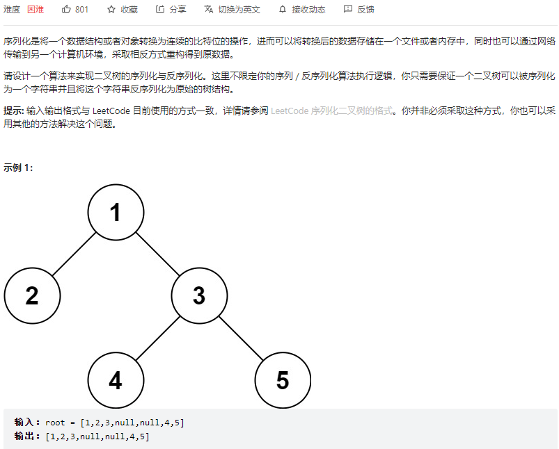

```python
class Codec:

    def serialize(self, root):
        """Encodes a tree to a single string.
        
        :type root: TreeNode
        :rtype: str
        """
        if not root:
            return 'None'
        return '{},{},{}'.format(root.val, self.serialize(root.left), self.serialize(root.right))

    def deserialize(self, data):
        """Decodes your encoded data to tree.
        
        :type data: str
        :rtype: TreeNode
        """
        def helper(datalist):
            root_val = datalist.pop(0)
            if root_val == 'None': return None
            root = TreeNode(root_val)
            root.left = helper(datalist)
            root.right = helper(datalist)
            return root
        datalist = data.split(',')
        return helper(datalist)
```

#### [36. 有效的数独](https://leetcode-cn.com/problems/valid-sudoku/)

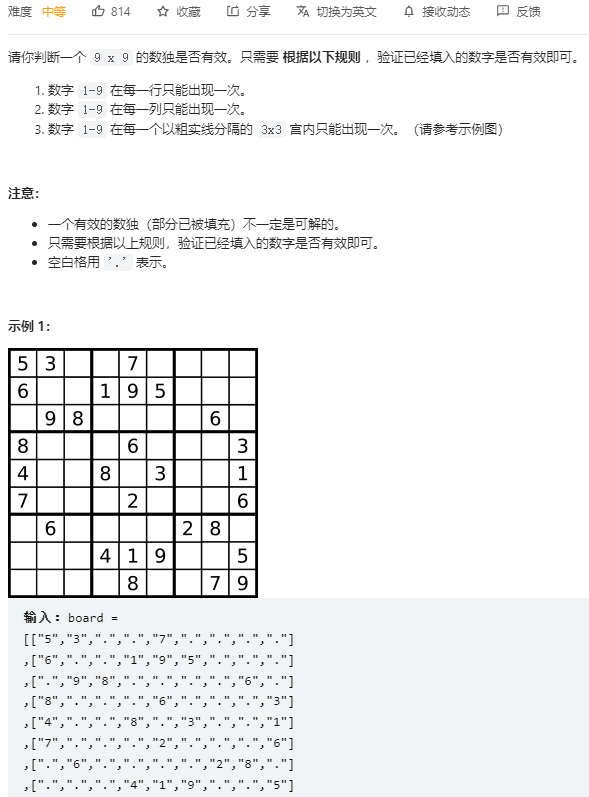

```python
from collections import defaultdict
class Solution:
    def isValidSudoku(self, board: List[List[str]]) -> bool:
        row, col, square = defaultdict(set), defaultdict(set), defaultdict(set)
        for i in range(9):
            for j in range(9):
                val = board[i][j]
                if val == '.':
                    continue
                point = i // 3 * 3 + j // 3
                if val in row[i] or val in col[j] or val in square[point]:
                    return False
                row[i].add(val)
                col[j].add(val)
                square[point].add(val)
        return True
```

#### [剑指 Offer 43. 1～n 整数中 1 出现的次数](https://leetcode-cn.com/problems/1nzheng-shu-zhong-1chu-xian-de-ci-shu-lcof/)

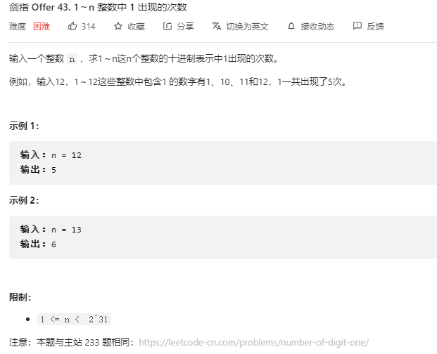

```python
class Solution:
    def countDigitOne(self, n: int) -> int:

        def helper(s):
            # 剩余位为0或空
            if not s:
                return 0
  
            # 长度，即最高位数
            n = len(str(s))     
            
            # 非0的个位数，直接返回1
            if n == 1:
                return 1    
    
            strs = str(s)
            s0 = int(strs[0])

            if s0 > 1:
                return 10 ** (n-1) + s0 * (n-1) * 10 ** (n-2) + helper(int(strs[1:]))
            else:
                return (int(strs[1:])+1) + s0 * (n-1) * 10 ** (n-2) + helper(int(strs[1:]))
            
        return helper(n)
```


#### [402. 移掉 K 位数字](https://leetcode-cn.com/problems/remove-k-digits/)

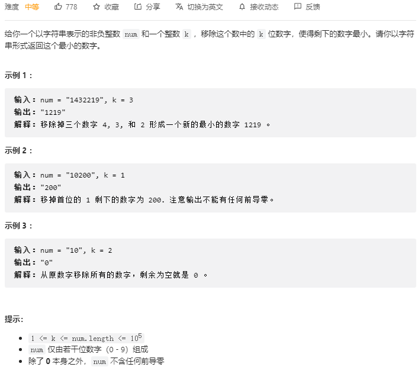

[一招吃遍力扣四道题，妈妈再也不用担心我被套路啦～ - 移掉 K 位数字 - 力扣（LeetCode） (leetcode-cn.com)](https://leetcode-cn.com/problems/remove-k-digits/solution/yi-zhao-chi-bian-li-kou-si-dao-ti-ma-ma-zai-ye-b-5/)

```python
class Solution:
    def removeKdigits(self, num: str, k: int) -> str:
        remain = len(num) - k
        stack = []
        for c in num:
            if not stack or c > stack[-1]:
                stack.append(c)
            else:
                while k > 0 and stack and stack[-1] > c:
                    stack.pop()
                    k -= 1
                stack.append(c)
        return ''.join(stack[: remain]).lstrip('0') or '0'
```

#### [316. 去除重复字母](https://leetcode-cn.com/problems/remove-duplicate-letters/)

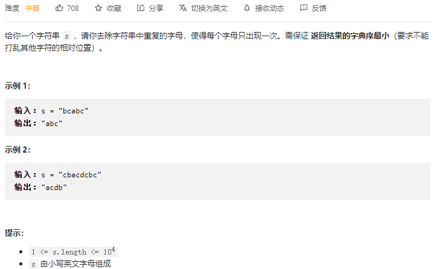

```python
class Solution:
    def removeDuplicateLetters(self, s: str) -> str:
        stack = []
        seen = set()
        remain = collections.Counter(s)
        for c in s:
            if c not in seen:
                while stack and c < stack[-1] and remain[stack[-1]] > 0:
                    p = stack.pop()
                    seen.remove(p)

                stack.append(c)
                seen.add(c)
            remain[c] -= 1
        return ''.join(stack)
```

#### [321. 拼接最大数](https://leetcode-cn.com/problems/create-maximum-number/)

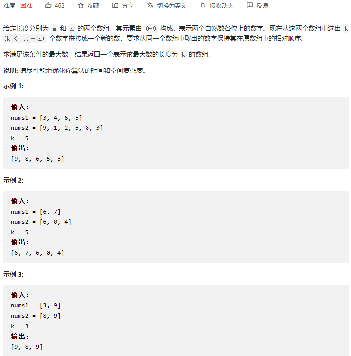

```python
class Solution:
    def maxNumber(self, nums1: List[int], nums2: List[int], k: int) -> List[int]:
        def pick_num(nums, k):
            drop = len(nums) - k
            stack = []
            for c in nums:
                while drop > 0 and stack and c > stack[-1]:
                    stack.pop()
                    drop -= 1
                stack.append(c)
            return stack[:k]
        
        def merge(a, b):
            res = []
            while a or b:
                bigger = a if a > b else b
                res.append(bigger[0])
                bigger.pop(0)
            return res
        
        return max(
            merge(pick_num(nums1, i), pick_num(nums2, k-i)) for i in range(k+1) if i <= len(nums1) and k - i <= len(nums2)
        )
```

#### [59. 螺旋矩阵 II](https://leetcode-cn.com/problems/spiral-matrix-ii/)

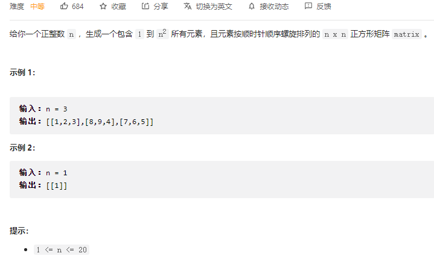

```python
class Solution:
    def generateMatrix(self, n: int) -> List[List[int]]:
        dirs = ((0, 1), (1, 0), (0, -1), (-1, 0))
        mat = [[0] * n for _ in range(n)]
        row, col, dir_idx = 0, 0, 0
        for i in range(n * n):
            mat[row][col] = i + 1
            dx, dy = dirs[dir_idx]
            r, c = row + dx, col + dy
            if r < 0 or r >= n or c < 0 or c >= n or mat[r][c] > 0:
                dir_idx = (dir_idx + 1) % 4
                dx, dy = dirs[dir_idx]
            row, col = row + dx, col + dy
        return mat
```

#### [450. 删除二叉搜索树中的节点](https://leetcode-cn.com/problems/delete-node-in-a-bst/)

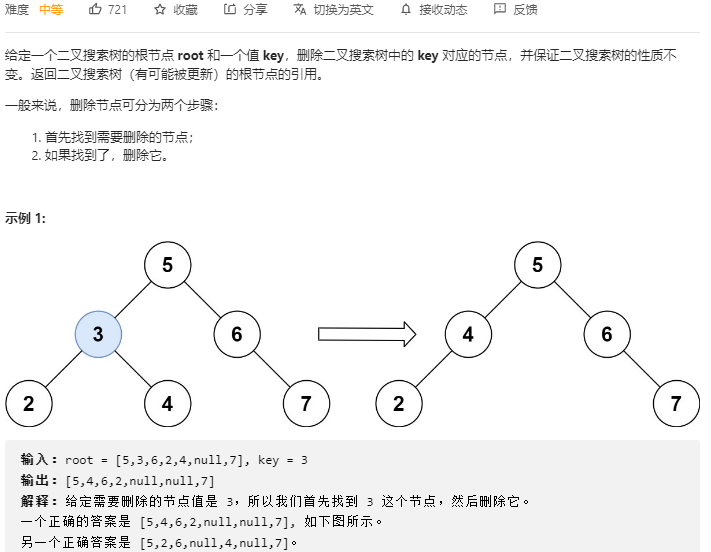

```python
class Solution:
    def deleteNode(self, root: Optional[TreeNode], key: int) -> Optional[TreeNode]:
        def helper(root, key):
            if not root:
                return None
            if root.val == key:
                if not root.left and not root.right:
                    del root
                    return None
                elif not root.left and root.right:
                    root = root.right
                    return root
                elif root.left and not root.right:
                    root = root.left
                    return root
                else:
                    t = root.right
                    while t.left:
                        t = t.left
                    t.left = root.left
                    root = root.right
                    return root
            elif root.val > key:
                root.left = helper(root.left, key)
            else:
                root.right = helper(root.right, key)
            return root
        return helper(root, key)
```

#### [189. 轮转数组](https://leetcode-cn.com/problems/rotate-array/)

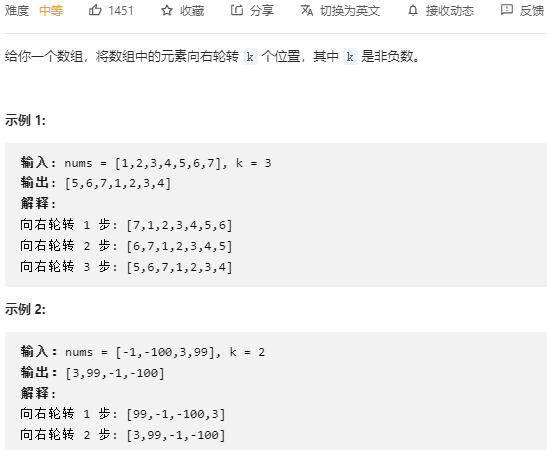

```python
class Solution:
    def rotate(self, nums: List[int], k: int) -> None:
        """
        Do not return anything, modify nums in-place instead.
        """
        def reverse(left, right):
            while left < right:
                nums[left], nums[right] = nums[right], nums[left]
                left += 1
                right -= 1
        n = len(nums)
        k = k % n
        reverse(0, n-1)
        reverse(0, k-1)
        reverse(k, n-1)
```

#### [25. K 个一组翻转链表](https://leetcode-cn.com/problems/reverse-nodes-in-k-group/)

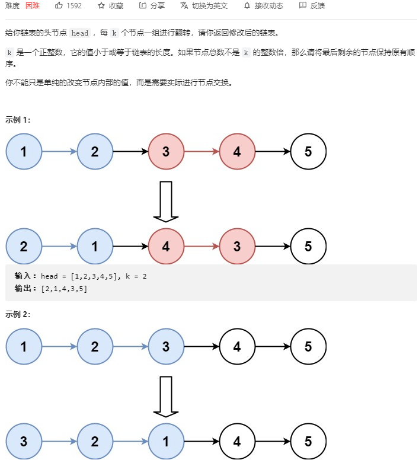

```python
class Solution:
    def reverseKGroup(self, head: Optional[ListNode], k: int) -> Optional[ListNode]:
        def reverse(head, tail):
            pre, cur = None, head
            while cur != tail:
                nxt = cur.next
                cur.next = pre
                pre = cur
                cur = nxt
            cur.next = pre
            return tail, head
        
        dummy = ListNode()
        dummy.next = head
        pre, tail = dummy, dummy
        for _ in range(k):
            tail = tail.next
            if not tail:
                return dummy.next
        nxt = tail.next
        head, tail = reverse(head, tail)
        pre.next = head
        tail.next = self.reverseKGroup(nxt, k)
        return dummy.next
```

```python
class Solution:
    def reverseKGroup(self, head: Optional[ListNode], k: int) -> Optional[ListNode]:
        def reverse(head, tail):
            pre, cur = None, head
            while cur != tail:
                nxt = cur.next
                cur.next = pre
                pre = cur
                cur = nxt
            cur.next = pre
            return tail, head

        dummy = ListNode()
        dummy.next = head
        pre = dummy
        while head:
            tail = pre
            for _ in range(k):
                tail = tail.next
                if not tail:
                    return dummy.next
            nxt = tail.next
            head, tail = reverse(head, tail)
            pre.next = head
            tail.next = nxt
            pre = tail
            head = nxt
            
        return dummy.next
```

#### [4. 寻找两个正序数组的中位数](https://leetcode-cn.com/problems/median-of-two-sorted-arrays/)

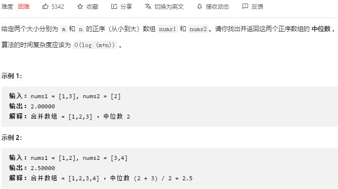

```python
class Solution:
    def findMedianSortedArrays(self, nums1: List[int], nums2: List[int]) -> float:
        k1 = (len(nums1) + len(nums2) + 1) // 2
        k2 = (len(nums1) + len(nums2) + 2) // 2

        def helper(nums1, nums2, k):
            if len(nums1) < len(nums2):
                return helper(nums2, nums1, k)
            if len(nums2) == 0:
                return nums1[k-1]
            if k == 1:
                return min(nums1[0], nums2[0])
            t = min(k // 2, len(nums2))
            if nums1[t - 1] > nums2[t - 1]:
                return helper(nums1, nums2[t: ], k - t)
            else:
                return helper(nums1[t: ], nums2, k - t)
        if (k1 + k2) % 2 == 0:
            return helper(nums1, nums2, k1)
        else:
            return (helper(nums1, nums2, k1) + helper(nums1, nums2, k2)) / 2
```

#### [41. 缺失的第一个正数](https://leetcode-cn.com/problems/first-missing-positive/)

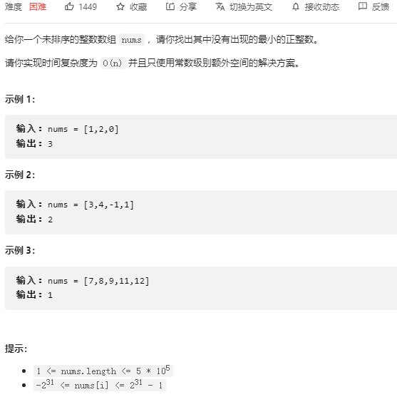

```python
class Solution:
    def firstMissingPositive(self, nums: List[int]) -> int:
        n = len(nums)
        for i in range(n):
            while 1 <= nums[i] <= n and nums[nums[i] - 1] != nums[i]:
                nums[nums[i] - 1], nums[i] = nums[i], nums[nums[i] - 1]

        for i in range(n):
            if i + 1 != nums[i]:
                return i + 1
        return n + 1
```

#### [442. 数组中重复的数据](https://leetcode-cn.com/problems/find-all-duplicates-in-an-array/)

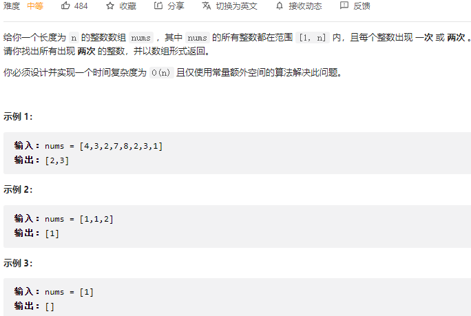

```python
class Solution:
    def findDuplicates(self, nums: List[int]) -> List[int]:
        def swap(i, j):
            tmp = nums[i]
            nums[i] = nums[j]
            nums[j] = tmp

        n = len(nums)
        for i in range(n):
            while 1 <= nums[i] <= n and nums[i] != nums[nums[i] - 1]:
                swap(i, nums[i] - 1)
        res = []
        for i in range(n):
            if nums[i] != i + 1:
                res.append(nums[i])
        res.sort()
        return res
```

#### [448. 找到所有数组中消失的数字](https://leetcode-cn.com/problems/find-all-numbers-disappeared-in-an-array/)

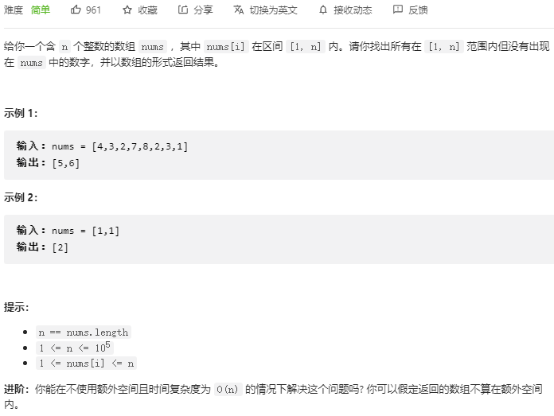

```python
class Solution:
    def findDisappearedNumbers(self, nums: List[int]) -> List[int]:
        def swap(i, j):
            tmp = nums[i]
            nums[i] = nums[j]
            nums[j] = tmp

        n = len(nums)
        for i in range(n):
            while nums[i] != nums[nums[i] - 1]:
                swap(i, nums[i] - 1)
        res = []
        for i in range(n):
            if nums[i] != i + 1:
                res.append(i+1)
        return res
```

#### [剑指 Offer 51. 数组中的逆序对](https://leetcode-cn.com/problems/shu-zu-zhong-de-ni-xu-dui-lcof/)

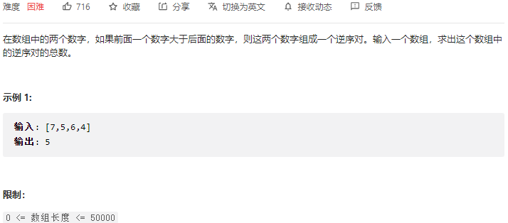

```python
class Solution:
    def reversePairs(self, nums: List[int]) -> int:
        self.res = 0
        def merge_sort(nums, left, right):
            if left >= right:
                return
            mid = left + (right - left) // 2
            merge_sort(nums, left, mid)
            merge_sort(nums, mid + 1, right)
            tmp = []

            i, j = left, mid + 1
            while i <= mid and j <= right:
                if nums[i] <= nums[j]:
                    tmp.append(nums[i])
                    i += 1
                else:
                    tmp.append(nums[j])
                    self.res += mid - i + 1
                    j += 1
            while i <= mid:
                tmp.append(nums[i])
                i += 1
            while j <= right:
                tmp.append(nums[j])
                j += 1
            nums[left: right + 1] = tmp
        
        merge_sort(nums, 0, len(nums) - 1)
        return self.res
```

#### [394. 字符串解码](https://leetcode-cn.com/problems/decode-string/)

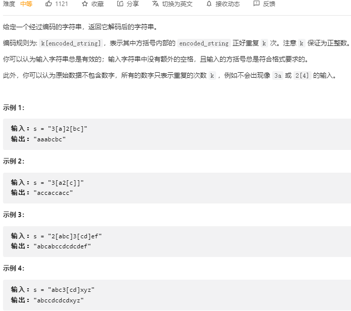

```python
class Solution:
    def decodeString(self, s: str) -> str:
        def dfs(i):
            res, num = "", 0
            while i < len(s):
                if '0' <= s[i] <= '9':
                    num = 10 * num + int(s[i])
                elif s[i] == '[':
                    i, tmp = dfs(i + 1)
                    res += num * tmp
                    num = 0
                elif s[i] == ']':
                    return i, res
                else:
                    res += s[i]
                i += 1
            return i, res
        return dfs(0)[1]
```

```python
class Solution:
    def decodeString(self, s: str) -> str:
        stack = []
        res = ''
        num = 0
        for c in s:
            if '0' <= c <= '9':
                num = 10 * num + int(c)
            elif c == '[':
                stack.append((num, res))
                res, num = '', 0
            elif c == ']':
                cur_num, last_res = stack.pop()
                res = last_res + cur_num * res
            else:
                res += c
        return res
```

