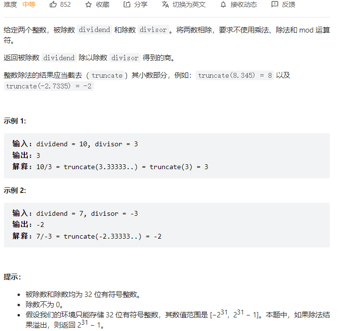

#### [29. 两数相除](https://leetcode-cn.com/problems/divide-two-integers/)



```python
class Solution:
    def divide(self, dividend: int, divisor: int) -> int:
        pos = ((dividend >= 0) and (divisor > 0)) or ((dividend <= 0) and (divisor < 0))
        res = 0
        # 逐步递减，求商
        dividend = abs(dividend)
        divisor = abs(divisor)
        while dividend >= divisor:
            # tmp指数级翻倍
            i = 1
            tmp = divisor
            while dividend >= tmp:
                dividend -= tmp
                res += i
                i <<= 1
                tmp <<= 1

        if not pos:
            res = - res
        return res if -2**31 <= res <= 2**31-1 else 2**31-1
```

#### [91. 解码方法](https://leetcode-cn.com/problems/decode-ways/)


```python
# 超时
class Solution:
    def numDecodings(self, s: str) -> int:
        self.res = 0
        def backtrack(start, cur_len):
            if cur_len == len(s):
                self.res += 1
                return
            if s[start] == '0':
                return
            for i in range(1, 3):
                if int(s[start: start + i]) > 26:
                    break
                if start + i > len(s):
                    break
                backtrack(start + i, cur_len + i)
        backtrack(0, 0)
        return self.res
```

```python
class Solution:
    def numDecodings(self, s: str) -> int:
        n = len(s)
        dp = [0] * (n + 1)
        dp[0] = 1
        for i in range(1, n + 1):
            # 情况1，只选一个字符，需要保证这个字符不是0
            if s[i-1] !=  '0':
                dp[i] += dp[i-1]
            # 情况2，选两个字符
            if i > 1 and s[i-2] != '0' and int(s[i-2: i]) <= 26:
                dp[i] += dp[i-2]
        return dp[-1]
```

#### [138. 复制带随机指针的链表](https://leetcode-cn.com/problems/copy-list-with-random-pointer/)


```python
"""
# Definition for a Node.
class Node:
    def __init__(self, x: int, next: 'Node' = None, random: 'Node' = None):
        self.val = int(x)
        self.next = next
        self.random = random
"""

class Solution:
    def copyRandomList(self, head: 'Optional[Node]') -> 'Optional[Node]':
        nodes = {}

        def helper(head):
            if not head: return None
            if head in nodes:
                return nodes[head]
            node = Node(head.val)
            nodes[head] = node
            node.next = helper(head.next)
            node.random = helper(head.random)
            return node
        return helper(head)
```

#### [139. 单词拆分](https://leetcode-cn.com/problems/word-break/)


```python
class Solution:
    def wordBreak(self, s: str, wordDict: List[str]) -> bool:
        m = len(s)
        n = len(wordDict)
        dp = [False] * (m + 1)
        dp[0] = True
        for i in range(1, m + 1):
            for j in range(n):
                if len(wordDict[j]) > i:
                    continue
                dp[i] = dp[i] or (dp[i-len(wordDict[j])] and s[i-len(wordDict[j]): i] == wordDict[j])
        return dp[-1]
```

#### [202. 快乐数](https://leetcode-cn.com/problems/happy-number/)


```python
class Solution:
    def isHappy(self, n: int) -> bool:
        s = set()
        while True:
            res = 0
            while n > 0:
                res += (n % 10) ** 2
                n //= 10
            if res == 1:
                return True
            if res in s:
                return False
            else:
                n = res
                s.add(res)
```

#### [162. 寻找峰值](https://leetcode-cn.com/problems/find-peak-element/)


```python
class Solution:
    def findPeakElement(self, nums: List[int]) -> int:
        if len(nums) == 1:
            return 0
        left, right = 0, len(nums) - 1
        while left <= right:
            mid = left + (right - left) // 2
            if mid == 0:
                if nums[mid] > nums[mid + 1]:
                    return mid
                else:
                    left = mid + 1
            if mid == len(nums) - 1:
                if nums[mid] > nums[mid - 1]:
                    return mid
                else:
                    right = mid - 1
            else:
                if nums[mid - 1] < nums[mid] and nums[mid + 1] < nums[mid]:
                    return mid
                elif nums[mid - 1] > nums[mid]:
                    right = mid -1
                else:
                    left = mid + 1
        return left
```

#### [166. 分数到小数](https://leetcode-cn.com/problems/fraction-to-recurring-decimal/)


```python
class Solution:
    def fractionToDecimal(self, numerator: int, denominator: int) -> str:
        if numerator % denominator == 0:
            return str(numerator // denominator)
        s = []
        if (numerator < 0) != (denominator < 0):
            s.append('-')
        # 整数部分
        numerator = abs(numerator)
        denominator = abs(denominator) 
        integer = numerator // denominator
        s.append(str(integer))
        s.append('.')

        # 小数部分
        index_dic = {}
        reminder = numerator % denominator
        while reminder != 0 and reminder not in index_dic:
            index_dic[reminder] = len(s)
            reminder *= 10
            s.append(str(reminder // denominator))
            reminder %= denominator
        if reminder != 0:
            insert_idx = index_dic[reminder]
            s.insert(insert_idx, '(')
            s.append(')')
        return ''.join(s)
```

#### [227. 基本计算器 II](https://leetcode-cn.com/problems/basic-calculator-ii/)


```python
class Solution:
    def calculate(self, s: str) -> int:
        def calc(num_stack, op_stack):
            op, y, x = op_stack.pop(), num_stack.pop(), num_stack.pop() if num_stack else 0
            ans = 0
            if op == '+': ans = x + y
            elif op == '-': ans = x - y
            elif op == '*': ans = x * y
            elif op == '/': ans = x // y
            elif op == '%': ans = x % y
            elif op == '^': ans = math.pow(x, y)
            num_stack.append(int(ans))

        op_prio = {'+': 0, '-': 0, '*': 1, '/': 1, '%': 1, '^': 2}

        s = "(" + s.replace(' ', '').replace('(-', '(0-') + ')'
        n = len(s)
        op_stack, num_stack = [], []

        i = 0
        while i < n:
            c = s[i]
            i += 1
            if c.isdigit():
                num = int(c)
                while i < n and s[i].isdigit():
                    num = num * 10 + int(s[i])
                    i += 1
                num_stack.append(num)
            elif c == '(':
                op_stack.append(c)
            elif c == ')':
                while op_stack and op_stack[-1] != '(':
                    calc(num_stack, op_stack)
                op_stack.pop()
            else:
                while op_stack and op_stack[-1] != '(':
                    prev_op = op_stack[-1]
                    if op_prio[prev_op] < op_prio[c]:
                        break
                    calc(num_stack, op_stack)
                op_stack.append(c)
        return num_stack[0]
```

#### [239. 滑动窗口最大值](https://leetcode-cn.com/problems/sliding-window-maximum/)


```python
class Solution:
    def maxSlidingWindow(self, nums: List[int], k: int) -> List[int]:
        q = collections.deque()
        res = []

        for i, j in enumerate(nums):
            while q and j > nums[q[-1]]:
                q.pop()
            
            if q and q[0] <= i - k:
                q.popleft()
            
            q.append(i)

            if i - k + 1 >= 0:
                res.append(nums[q[0]])
        return res
```

